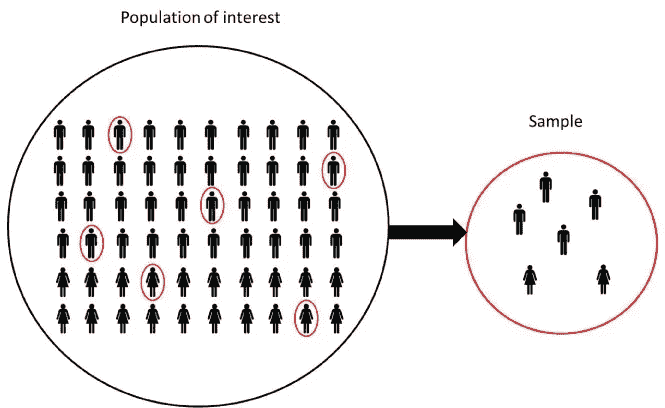
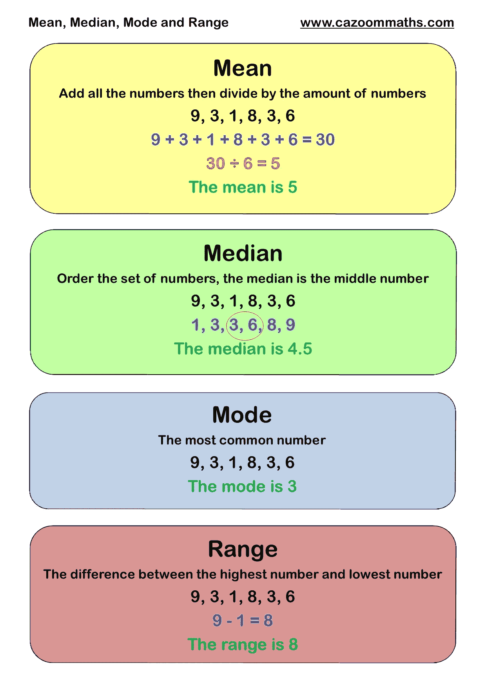
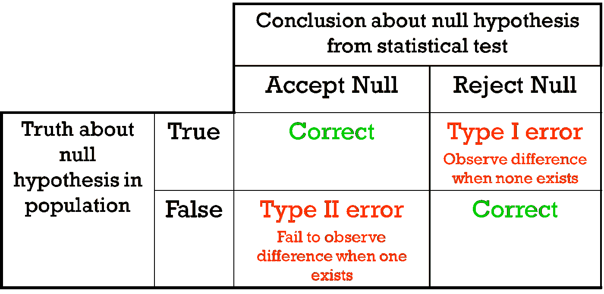
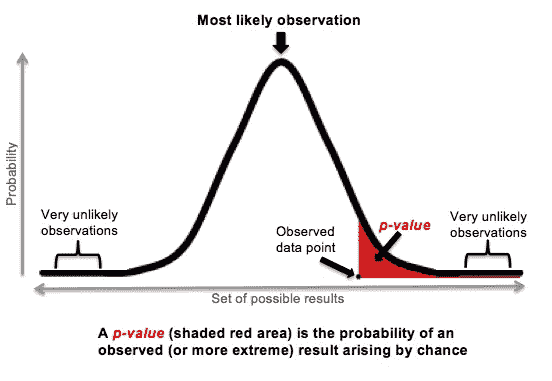
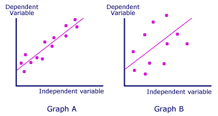
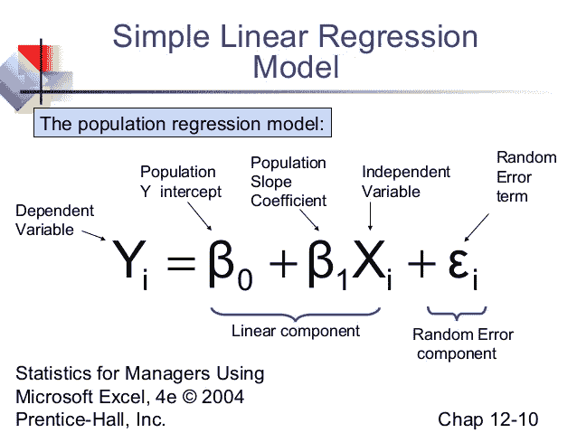
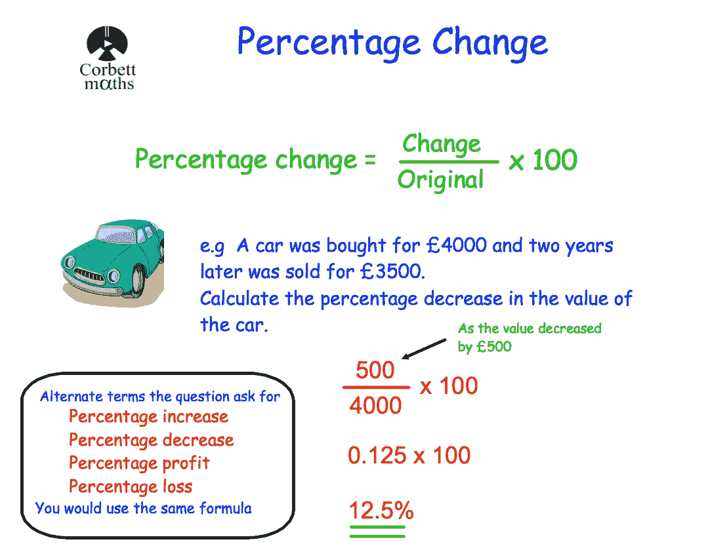

# 统计学快速介绍—用数据为您的故事提供动力

> 原文：<https://medium.com/hackernoon/quick-intro-to-statistics-power-your-stories-with-data-a3a35785692b>

## 不是统计学家？没问题！在几分钟内学习统计分析的基础知识

[Andrew McKay](https://dribbble.com/shots/3494035-Pocketbook-Stats-illustration)

# 用统计数据讲故事

当在技术领域工作时(或任何工作，就此而言)，知道如何利用统计数据可以让你做出数据驱动的决策。无论你是营销人员、设计师还是开发人员，理解统计术语、如何解释调查结果以及何时将调查结果转化为行动都是至关重要的。

最重要的一点应该是，仅凭统计数据并不一定能让你的论点更好。统计数据是你故事的燃料，但它们本身并不是故事。确保你用一种有说服力的方式来组织你的发现，来打动你的听众，用意义和行动号召来丰富你的数据。

> “一旦事情发生了，我们可以编一个故事来解释它，结果似乎就已经注定了。统计数据不能满足我们理解因果关系的需要，这就是为什么它们如此频繁地被忽视或误解。另一方面，故事是一种丰富的交流手段，因为它们强调因果关系。”
> ― [**迈克尔·j·莫布森**](https://www.goodreads.com/author/show/18730.Michael_J_Mauboussin) 、 [**成功方程式**](https://www.goodreads.com/work/quotes/19174277)

# 人口和样本

一个**群体**是任何一个大的物体或个体的集合，比如美国人、学生或树，他们需要关于它们的信息。

**参数**是描述总体的任何汇总数字，如平均值或百分比。

**样本**是从总体中抽取的代表性群体。

**统计数据**是描述样本的任何汇总数字，如平均值或百分比。

[National Center for Education Statistics](https://nces.ed.gov/blogs/nces/post/statistical-concepts-in-brief-how-and-why-does-nces-use-sample-surveys)

# 集中趋势测量

## 平均

一组数字的平均值，有时简称为**平均值**，是数据的总和除以数据的总数。

## 中位数

一组数字的中值是该组中的中间数字(在数字从最小到最大排列后)，或者，如果有偶数个数据，中值是中间两个数字的平均值。

## 方式

一组数的众数是最常出现的数。

## 范围

集合中最低值和最高值之差。

## 进一步学习

*   [何时使用均值、中值或众数](https://statistics.laerd.com/statistical-guides/measures-central-tendency-mean-mode-median.php)——晚期统计
*   [集中趋势公式的度量](http://www.abs.gov.au/websitedbs/a3121120.nsf/home/statistical+language+-+measures+of+central+tendency) —澳大利亚统计局

# 假设检验

假设检验的一般思想包括:

1.  做一个初步的假设。
2.  收集证据(数据)。
3.  基于可用的证据(数据)，决定是否拒绝最初的假设。

## 虚假设

零假设表明在一组给定的观察值中不存在统计学意义。这是研究者试图推翻的假设。

## 替代假设

另一个假设是与原假设相反的。因此，如果我们继续上面的例子，另一个假设将是，在多个变量之间确实存在统计上显著的关系。

## 错误

**1 型错误**是对真零假设的不正确拒绝(也称为“假阳性”发现)。

第二类**错误**错误地保留了一个错误的零假设(也称为“假阴性”发现)

## 进一步学习

*   [假设检验解释](http://www.statisticshowto.com/probability-and-statistics/hypothesis-testing/) —统计学如何
*   [假设检验要领](https://statistics.laerd.com/statistical-guides/hypothesis-testing.php) —拉德统计

[LibGuides at La Trobe University](https://latrobe.libguides.com/maths/hypothesis-testing)

# 统计显著性

## p 值

*p*-值是一个介于 0 和 1 之间的数字，可以解释如下:

*   小的*p*-值(通常≤ 0.05)表示反对零假设的有力证据，因此您拒绝零假设。
*   较大的*p*-值(> 0.05)表明反对零假设的证据较弱，因此您无法拒绝零假设。
*   *p*-非常接近截止值(0.05)的值被认为是边际值(可能是两种情况)。总是报告 p 值，这样你的读者可以得出他们自己的结论。

## 进一步学习

*   如何确定 P 值 —黛博拉·j·拉姆齐
*   [计算 P 值](https://www.wikihow.com/Calculate-P-Value) —如何统计

[Explain XKCD](https://www.explainxkcd.com/wiki/index.php/1478:_P-Values)

[RealClearScience](http://www.realclearscience.com/blog/2016/11/07/httpwwwrealclearsciencecomblog20161107httpwwwrealclearsciencecomblog20161102httpwwwrealclearsciencecomblog201610the_biggest_myth_about_the_p-value.html)

# 回归

一种确定两个或多个变量之间统计关系的技术，其中因变量的变化与一个或多个自变量的变化相关，并取决于一个或多个自变量的变化。另请参见相关性。

**自变量** —它是一个独立的变量，不会因你试图测量的其他变量而改变。例如，某人的年龄可能是一个独立变量。

**因变量**—[因变量](https://www.thoughtco.com/i-ndpendent-and-dependent-variables-differences-606115)是科学实验中被测试和测量的变量。因变量“依赖”于自变量。随着实验者改变自变量，对因变量的影响被观察和记录。

**回归分析** —回归是一种统计方法，试图确定一个因变量和一系列其他变化变量(自变量)之间的关系强度。

**简单线性回归** —仅使用一个自变量的回归，并将自变量和因变量之间的关系描述为一条直线。

**相关系数** ( *r* ) —相关系数 ***r*** 衡量两个变量之间线性关系的强度和方向。范围从-1.0 到+1.0。r 越接近+1 或-1，这两个变量的关系就越密切。如果 **r** 接近 0，则**表示**变量之间没有关系。

**R 平方** — R 平方是数据与拟合回归线接近程度的统计度量。它是可以用线性模型解释的变化的百分比。

*   r 平方=解释偏差/总偏差-
*   r 平方始终介于 0 和 100%之间:
*   0%表示模型没有解释响应数据的可变性
*   100%表示模型解释了响应数据围绕其平均值的所有可变性。

## 进一步学习

*   [计算简单线性回归](http://www.statisticshowto.com/how-to-find-a-linear-regression-equation/) —统计如何
*   [线性回归简介](http://onlinestatbook.com/2/regression/intro.html) —在线统计手册

[AnalyticsBuddhu](https://analyticsbuddhu.wordpress.com/2016/06/28/how-linear-regression-can-also-be-used-to-do-classification/)

# 百分比变动

## 计算增加的百分比

**首先:** *算出你所比较的两个数字之间的差(增)。*

> 增加=新号码-原号码

**然后:** *用增加的数除以原数，将答案乘以 100。*

> %增幅=增幅÷原数× 100。

如果你的答案是负数，那么这是一个百分比下降。

[来源](https://www.skillsyouneed.com/num/percent-change.html)

## 计算下降百分比

**首先:** *算出你所比较的两个数字之间的差(减)。*

> 减少=原始号码-新号码

**然后:** *将减少的数除以原数，再将答案乘以 100。*

> 减少百分比=减少÷原始数× 100

如果你的答案是负数，那么这是一个百分比的增长。

[来源](https://www.skillsyouneed.com/num/percent-change.html)

[Corbettmaths](https://corbettmaths.com/2015/03/18/percentage-change-revision/)

# 了解更多！

这里有一些很棒的在线统计指南可以帮助你。

*   [概率与统计—自定进度](http://online.stanford.edu/course/probability-and-statistics-self-paced) —斯坦福
*   [统计学在线课程简介](https://www.udacity.com/course/intro-to-statistics--st101) — Udacity
*   [数据分析&统计](https://www.edx.org/course/subject/data-analysis-statistics) — edX