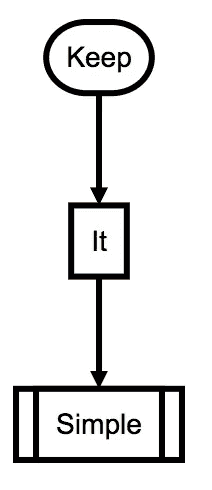
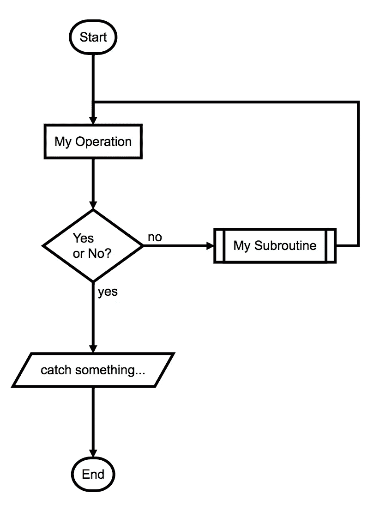
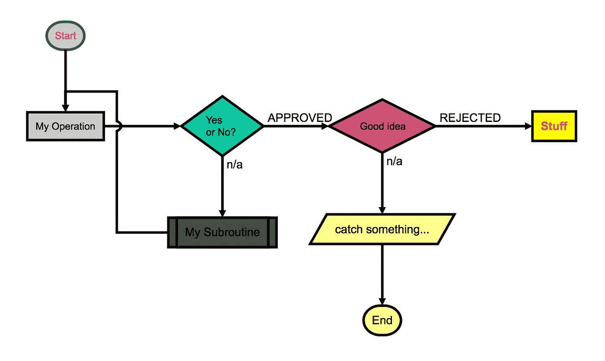

# 面向开发人员的基于文本的快速流程图

> 原文：<https://medium.com/hackernoon/quick-text-based-flowcharts-for-developers-3c68c4728134>


Image from [ellladee](https://unsplash.com/@ellladee?utm_medium=referral&amp;utm_campaign=photographer-credit&amp;utm_content=creditBadge)

我是开发商。我喜欢文本编辑器。我喜欢代码。我喜欢标记。

像许多 90 后的孩子一样，我早期的技能是在 Adobe Dreamweaver、T2、微软 FrontPage、T3 和 T4 GeoCities 的烈火中锻造出来的。找到 WYSIWYG(所见即所得)web 开发的正确组合似乎是这十年的主题。从那以后，UI 工作的共识已经积极地转向了书面的[标记](https://hackernoon.com/tagged/markup)。

一方面，我们有 [Wix](https://medium.com/u/2741d9d88322?source=post_page-----3c68c4728134--------------------------------) 和 [Squarespace Inc.](https://medium.com/u/21796ef64a5d?source=post_page-----3c68c4728134--------------------------------) 用 WYSIWYG 做了很多伟大的事情。尽管如此，大多数开发人员选择编写自己的用户界面。优雅，速度，简单，热键。对我来说，我只是不喜欢用不稳定的手拖拽东西。

正是因为这个原因，我最近尝试了基于文本的浏览器渲染流程图。通过网络搜索，我找到了一些复杂的所见即所得工具，比如 [LucidChart](https://www.lucidchart.com/) 、 [Creately](https://creately.com/) 和 [Draw.io](https://www.draw.io/) 。对于创始人和创意人员来说，我不怀疑这些工具的力量。只是我想要开发人员友好的解决方案。我想要文本输入、默认颜色和默认布局。



进入[流程图. js](http://flowchart.js.org/) 。这是我想要的图书馆。它有一个简单的、基于文本的数据模式，可以被 [JavaScript](https://hackernoon.com/tagged/javascript) 库使用。在[workflow . js](http://flowchart.js.org/)站点上的示例例程看起来像这样:

```
st=>start: Start
e=>end
op1=>operation: My Operation
sub1=>subroutine: My Subroutine
cond=>condition: Yes
or No?
io=>inputoutput: catch something...st->op1->cond
cond(yes)->io->e
cond(no)->sub1(right)->op1
```

它会产生:



我对结果非常满意。不再需要画线，不再需要决定如何画形状，不再需要决定相对大小和距离。

学习数据模式的细节需要几分钟时间。对于我的用例来说，它足够优雅和复杂。这里有一个来自[workflow . js](http://flowchart.js.org/)网站的更复杂的例子:

```
st=>start: Start|past:>[http://www.google.com[blank](http://www.google.com[blank)]
e=>end: End|future:>[http://www.google.com](http://www.google.com)
op1=>operation: My Operation|past
op2=>operation: Stuff|current
sub1=>subroutine: My Subroutine|invalid
cond=>condition: Yes
or No?|approved:>[http://www.google.com](http://www.google.com)
c2=>condition: Good idea|rejected
io=>inputoutput: catch something...|futurest->op1(right)->cond
cond(yes, right)->c2
cond(no)->sub1(left)->op1
c2(yes)->io->e
c2(no)->op2->e
```

使用配置样式，它会产生:



流程图是建模用户体验和产品流程的一种非常强大的方式。开发人员应该将这样的过程放在手边，以便消除现在或未来的争论。产品人员和设计师应该考虑转向基于文本的流程图的可能性。

[流程图. js](http://flowchart.js.org/) 为颜色和外观提供了大量的配置选项。虽然我鼓励您探索这些，但它们超出了我的用例范围。我的工作是制造产品和停止争论。还没见过黑人&白人不能胜任工作的案例。

对于任何试图创建快速、基于文本的流程图的人，我在 textflowcharts.com[创建了一个简单的 web 应用程序。我在本地使用 seed 项目，所以打开用例是有意义的。](http://textflowcharts.com)

对于任何试图复制这个项目的人，我在这里组装了一个种子项目[。克隆或下载回购。运行一个快速 *npm 安装*或*纱线，*然后 *npm 启动*，你就可以出发去比赛了。该项目从 data/sample.txt 文件中提取数据。您应该编辑它以匹配您的流程。](https://github.com/tewen/flowchart-seed)

我欢迎对这个项目的任何贡献。很简单，我希望保持这种方式。我希望开发人员、设计人员和产品人员能够找到种子的用例。

特别感谢流程图创建者 Adriano Raiano，这是一个非常棒的项目，我很高兴他建造了它。