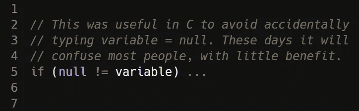
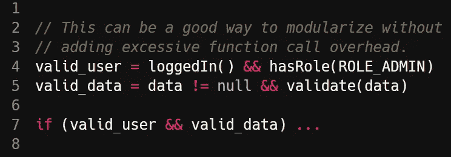
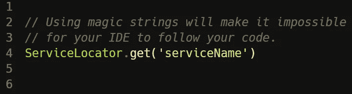
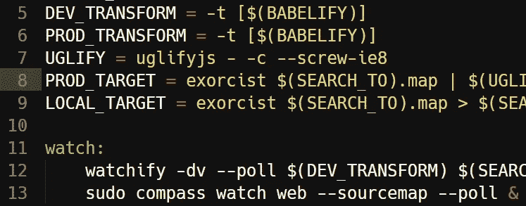
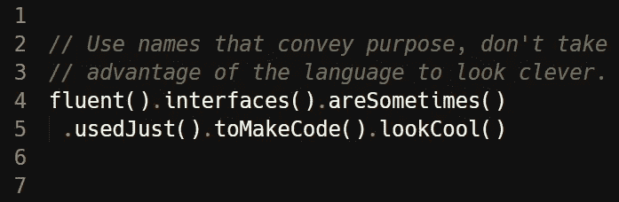

# 减少代码认知负荷的快速技巧

> 原文：<https://medium.com/hackernoon/quick-tips-for-reducing-the-cognitive-load-of-your-code-bb75d43b5676>

这里有五个小贴士，可以帮助你拥有一个简单的心智框架，可以用于任何语言或库，并且默认情况下会产生高质量的代码。记住它们，编写好的代码应该轻而易举。

# 1.忘记你的个人风格

你读了一些文章，这些文章用新的技巧让你大吃一惊。现在你要写聪明的代码，你所有的同行都会印象深刻。

问题是，人们只想修复他们的错误，然后继续前进。你的聪明绝招往往只不过是转移注意力。正如我在“[熟记 API 和其他流畅编码的技巧](https://chrismm.com/blog/memorizing-apis-and-other-tips-for-coding-fluently/)中提到的，当人们不得不消化你的一段代码时，他们的“心理堆栈”就会填满，很难取得进展。

**注意:**在我的博客上有一个更长版本的[这篇文章，我也推荐得到《代码全集](https://chrismm.com/blog/writing-good-code-reduce-the-cognitive-load/)》这本书，里面有更多关于编写干净代码的技巧！

Don’t personalize your work in ways that would require explanations

**不要码“你的方式”。遵循编码标准即可。**这个东西早就想通了。按照人们期望的方式编写代码，使代码可预测、易读。

# 2.无情模块化

复杂的代码通常可以通过模块化来阐明，并且有更多的方法来做到这一点，而不仅仅是创建更多的功能。将长条件的结果存储到一个或两个变量中是模块化的一个很好的方式，而不会产生函数调用的开销。这甚至允许您将它们组合成更大的条件，或者在其他地方重用结果。

**分解问题时的方法应该是使每个部分尽可能集中，只影响局部状态，不掺杂不相关的问题，并且尽可能没有副作用。** [编程](https://hackernoon.com/tagged/programming)语言和库经常有它们的问题，将它们抽象出来可以帮助你的代码关注自己的事业。[单一责任原则](http://code.tutsplus.com/tutorials/solid-part-1-the-single-responsibility-principle--net-36074)是聚焦和本地化代码如何产生好的设计的另一个例子。

I like taking advantage of variable names to document and compartmentalize logic

TDD 除了在正确的情况下带来它自己的好处之外，还迫使人们应用某些以前并不流行的原则。无状态代码被认为是缓慢和不必要的(见:大多数旧的 C/C++代码)，现在每个人都在谈论纯函数。即使你不做 TDD，你也应该学习驱动它的原理。在新的范例下工作将会把你变成一个有弹性的开发者。

# 3.编写 IDE 能够理解的代码

你的计算机和你的工具在处理你的代码时会有和你一样多的困难，在你必须应用的预处理程序和突变的数量和代码的复杂程度之间有一些关联。

让我们暂时把这些额外的构建工具可能带来的好处放在一边。有可能它们要求您使用特定领域的语言，比如定制模板，或者复杂的动态数据结构，比如哈希表。您的 IDE 通常不擅长处理这些东西，定位相关的代码会变得更加困难。

避免使用与您的 IDE 不兼容的语言扩展和库。它们对您工作效率的影响将远远超过更简单的配置或用更简洁的语法节省一些按键的小好处。

Using ServiceLocator is an example of design that leads to poor integration with most IDEs

**保持 IDE“集成”部分相关性的另一个方法是避免神奇代码。大多数语言都会为你提供编写更多动态代码的方法。滥用这些特性，比如使用神奇的字符串、神奇的数组索引和定制模板语言特性，会导致代码库更加脱节。一般来说，任何只有人类才知道其含义的特性都会把你引向这条路，而且这是一条很难回头的路，因为如果你的 IDE 不理解代码，当你想转移到一个更静态的架构时，它所具有的任何重构特性都将是无用的。**

# 4.构建清晰且可预测的架构

努力拥有一个可预测的架构。你的队友会发现更容易找到东西，这将大大减少他们完成事情的时间。**一旦你同意了项目的总体架构，就要清楚地表明主要元素的位置。**使用 MVC？将模型、视图和控制器放在它们自己的文件夹中，而不是三个文件夹深或者分散在几个不同的地方。

我谈到了模块化。也可能有过度的模块化，这通常会使代码更难定位。您的 IDE 可能会有所帮助，但是您经常会在让 IDE 忽略供应商/库文件夹(因为它有太多不相关的代码)和让它建立索引并手动处理问题之间左右为难。这是一个两败俱伤的局面。通过选择尽可能满足您需求的库，尝试使用更少的库。

库和工具也可能成为新开发人员的障碍。我最近使用 EcmaScript 7 (babel)构建了一个项目，后来才意识到我们的初级开发人员正试图弄清楚这一切意味着什么。团队生产力的巨大损失。我低估了这对一个刚刚起步的人来说是多么难以承受。不要使用仍然太难掌握的工具。等待更好的时机。

*Actual code from a makefile I wrote. Junior devs can’t handle overuse of new tech*

# 5.使用信息性和上下文相关的名称

如果你已经做到了这一步，我有个好消息:这可能是最重要的部分。众所周知，选择好名字是软件开发中最大的问题之一。构建工具不太可能在这方面有所改进，原因是计算机无法真正了解解决方案背后的推理。你必须记录下原因。相关的和上下文相关的变量和函数名是一个很好的方法。传达目的的名称甚至会减少对文档的需求。

在名字中使用前缀是给名字增加含义的好方法。这是一种曾经流行的做法，我认为误用是它没有跟上的原因。像[匈牙利符号](http://www.joelonsoftware.com/articles/Wrong.html)这样的前缀系统最初是为了增加含义，但随着时间的推移，它们最终被用于更少的上下文方式，比如只是添加类型信息。

Fluent interfaces have been abused often in recent times

最后，关于保持低圈复杂度，总有一些东西要说。这意味着尽可能减少条件分支的数量。每个额外的分支不仅会增加缩进和伤害可读性，而且更重要的是会增加你必须跟踪的东西的数量。

> [黑客中午](http://bit.ly/Hackernoon)是黑客如何开始他们的下午。我们是 [@AMI](http://bit.ly/atAMIatAMI) 家庭的一员。我们现在[接受投稿](http://bit.ly/hackernoonsubmission)并乐意[讨论广告&赞助](mailto:partners@amipublications.com)机会。
> 
> 如果你喜欢这个故事，我们推荐你阅读我们的[最新科技故事](http://bit.ly/hackernoonlatestt)和[趋势科技故事](https://hackernoon.com/trending)。直到下一次，不要把世界的现实想当然！

.