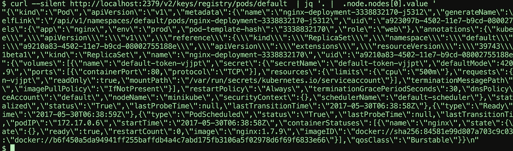
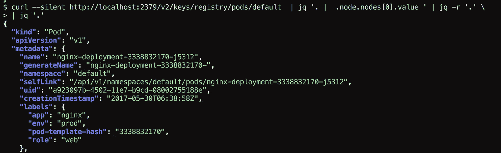

# 在命令行上快速 JSON.parse()

> 原文：<https://medium.com/hackernoon/quickly-json-parse-on-command-line-42f0e52b01b8>

我试图从 **etcd** ( **kubernetes** )中获取一些数据，我发现该值以字符串形式返回:

你可以在开始看到引号，所以在玩了一会 sed 之后，我发现了 **jq** 的 **-r** 标志所以…

如你所见，现在你有了一个 **json** 对象，我们可以将它传递回 **jq** :

就这样。

谢谢你。

> [黑客中午](http://bit.ly/Hackernoon)是黑客如何开始他们的下午。我们是 AMI 家庭的一员。我们现在[接受投稿](http://bit.ly/hackernoonsubmission)并乐意[讨论广告&赞助](mailto:partners@amipublications.com)机会。
> 
> 如果你喜欢这个故事，我们推荐你阅读我们的[最新科技故事](http://bit.ly/hackernoonlatestt)和[趋势科技故事](https://hackernoon.com/trending)。直到下一次，不要把世界的现实想当然！

