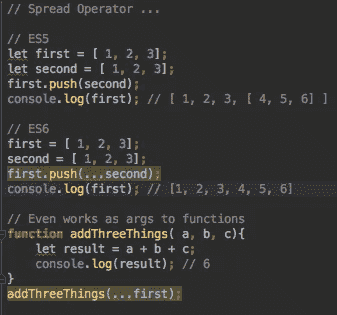
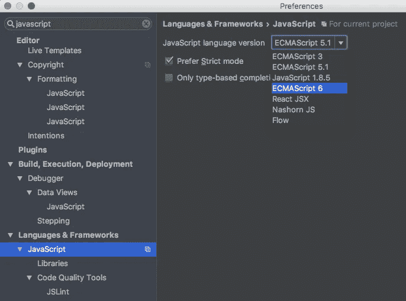
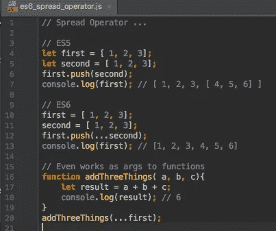
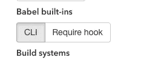
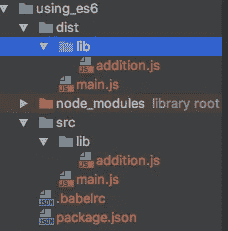

# 将 ES6 用于 Babel、Node 和 IntelliJ 的快速入门指南

> 原文：<https://medium.com/hackernoon/quickstart-guide-to-using-es6-with-babel-node-and-intellij-a83670afbc49>

我很想在我的 web 项目中使用 ES6。

# *为什么？*

因为我想让我的职业生涯保持最新，而且 ES6 是蜜蜂的膝盖！

*喜欢什么？*

首先是 *Let* 关键字。

大奇娃娃

好的，那么*析构*呢，这很酷。

(张贴谷歌搜索)好吧，我会给你很酷。

还有*默认参数、速记属性、计算属性、扩展运算符、字符串模板、块范围。这个清单还在继续…*

*还有导入模块？*

呃，不完全是。为此你仍然需要巴贝尔！

*(一想到要研究如何设置这个就烦)*

(看到紧锁的眉头)不要惊慌，你需要的所有信息都在这里。

耶

# **去除 IntelliJ 红色标记**

我讨厌红色标记。但是我爱林挺。



这以红色突出显示，因为该项目的当前 Javascript 版本没有设置为 ES6。

前往*首选项- >语言和框架- > Javascript*

并选择 ES6！



耶红不见了！



# 这就是我要做的吗？

人们可能会这样想，但是正如你所知道的，JS 处于不断变化的状态，并不是所有的特性都适用于所有的环境。

我知道这不容易。什么在哪里起作用？

看看这个[兼容表](https://kangax.github.io/compat-table/es6/)。它很好地概述了 ES6 对浏览器、聚合填充、服务器和移动设备的支持。

哦，太好了，你能把 tl 给我吗？dr；

很多命令都是原生可用的，但是专业软件工程师喜欢好的构建工具和有组织的代码。因此，为了通过 ES6 导入语句使用模块加载，大多数开发人员使用 trans pile——让我们试试 [Babel](https://babeljs.io/) 。

# **导入数学模块示例**

假设我们有一个执行加法任务的数学模块`sumTwo(number1, number2)`猜猜这两个数相加是什么。

*好的，很好*

但是作为一个更大程序的一部分，它位于文件`lib/addition.js`中

如果能看到整个文件的内容就好了。

```
**function** sumTwo(number1, number2){
    **return** a + b;
}

**export** { sumTwo }
```

然后我们想在一个名为`main.js`的文件中使用这个函数

```
'use strict';
**import** { sumTwo } **from** 'lib/addition';

console.log(
    "2 + 3 = ",
    sumTwo(2,3) // 5
);
```

如果您在节点中运行此命令，您将会看到:

```
Genes-MacBook-Pro-2:javascriptzzzzzzzz thinkjones$ node -v
v7.0.0
Genes-MacBook-Pro-2:javascriptzzzzzzzz thinkjones$ node articles/using_es6/main.js 
/Users/thinkjones/dev/javascriptzzzzzzzz/articles/using_es6/main.js:3
import { sumTwo } from 'lib/addition';
^^^^^^
SyntaxError: Unexpected token import
    at Object.exports.runInThisContext (vm.js:76:16)
    at Module._compile (module.js:545:28)
    at Object.Module._extensions..js (module.js:582:10)
    at Module.load (module.js:490:32)
    at tryModuleLoad (module.js:449:12)
    at Function.Module._load (module.js:441:3)
    at Module.runMain (module.js:607:10)
    at run (bootstrap_node.js:382:7)
    at startup (bootstrap_node.js:137:9)
    at bootstrap_node.js:497:3
Genes-MacBook-Pro-2:javascriptzzzzzzzz thinkjones$
```

据我所知`import`不被支持，并且仍在激烈的讨论中。这就是为什么有这么多 polyfill 和 transpiler 库的原因。为了帮助这个中间阶段，JS 生态系统。

*太棒了，我怎么才能让它工作起来。*

我们试试[巴别塔](https://babeljs.io/)好像很受欢迎。从首页文档“从安装 Babel CLI 和预设开始”:

```
npm install --save-dev babel-cli babel-preset-env
```

然后“在你的项目中创建一个. babelrc 文件(或者使用你的 package.json)”

```
{
  "presets": ["env"]
}
```

*那是搞什么鬼？*

嗯，这是一种考虑到你的目标环境的机制。由于不同的产品和产品版本本身支持不同的 ES6 系统，您可以通过指定目标环境来优化这一点。

*听起来很复杂我该给个 f***？*

不确定。我认为对于这个例子，我们将使用默认设置，如果发现问题，我们将进行调查。

*你在创业公司工作吗？*

是

我喜欢你的斗志昂扬。

让我们试着再运行一次。语法错误:意外的令牌导入"

*参见…*

所以 Babel 实际上并不做任何你需要的事情来编译或者将代码转换成目标环境理解的 ES5 格式。

是的，是的——那我该怎么做呢？

很高兴你问了。巴别塔有一个很棒的设置页面，在这里你可以选择你的构建工具并获得必要的信息— [巴别塔设置页面链接](http://babeljs.io/docs/setup/)

让我们使用 Babel CLI



本地安装 CLI`npm install --save-dev babel-cli`

然后转堆:

```
./node_modules/.bin/babel  ./src --experimental --source-maps-inline -d ./dist
```

这个 src 目录是什么？

是的，当我开始写这篇文章的时候，我把所有的文件都放在了根目录下，但是在玩了 Babel 之后，我意识到这会产生一堆输出文件，于是我决定使用不同的 *src 和 dest* 目录。

听起来不错——那我们现在有什么？

这是两个目录，一个是 src，另一个是 dist 文件。



是的，很好，但是程序现在运行吗？

是啊，应该的。

是的，你确定吗？

不，让我们在 Node 试试。

```
node dist/main.js
module.js:474
    throw err;
    ^Error: Cannot find module 'lib/addition'
```

该死的。

# **调查相关文件参考**

所以这取决于我有限的节点知识，但它取决于如何指定相对文件引用。我的`main.js`文件位于`/src/main.js`，我从`/`运行 node。所以我认为导入是相对于节点运行目录的，如下所示:

```
**import** { sumTwo } **from** 'lib/addition';
```

所以当它运行时，它不工作，因为它期待的是`/lib/addition.js`中的文件，而不是`/dist/lib/addition.js.`

为了解决这个问题，我必须将原来的 import 语句改为相对于当前目录。所以把它改成:

```
**import** { sumTwo } **from** './lib/addition';
```

然后重新运行 Babel 编译器:

```
./node_modules/.bin/babel  ./src --experimental --source-maps-inline -d ./dist
```

给了我正确的编译代码:

```
'use strict';

**var** _addition = require('./lib/addition');

console.log("2 + 3 = ", (0, _addition.sumTwo)(2, 3) // 5
);
```

当我从根目录调用这个命令时，它就会运行:

```
node ./dist/main
2 + 3 =  5
```

耶！

一切都好，代码在哪里？

这里是我的 github — [thinkjones](https://github.com/thinkjones/GeneConroyJonesArticles/tree/master/babel_quickstart)

[](http://bit.ly/HackernoonFB)[](https://goo.gl/k7XYbx)[](https://goo.gl/4ofytp)

> [黑客中午](http://bit.ly/Hackernoon)是黑客如何开始他们的下午。我们是 [@AMI](http://bit.ly/atAMIatAMI) 家庭的一员。我们现在[接受投稿](http://bit.ly/hackernoonsubmission)并乐意[讨论广告&赞助](mailto:partners@amipublications.com)机会。
> 
> 如果你喜欢这个故事，我们推荐你阅读我们的[最新科技故事](http://bit.ly/hackernoonlatestt)和[趋势科技故事](https://hackernoon.com/trending)。直到下一次，不要把世界的现实想当然！

