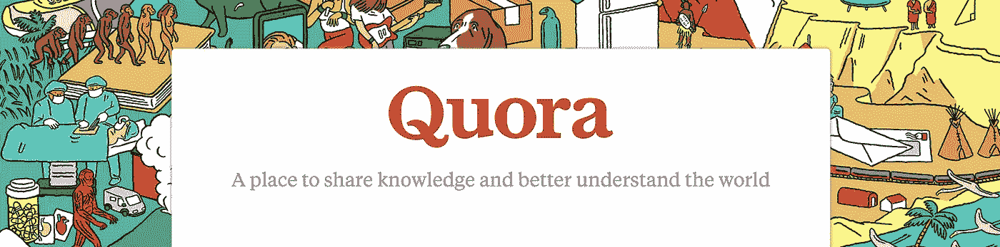
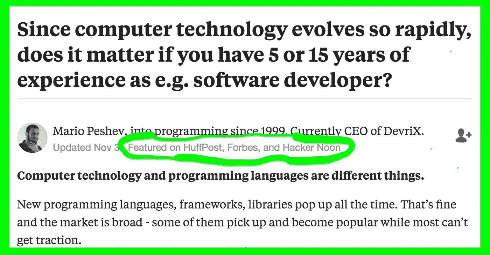

# Quora +黑客正午伙伴关系

> 原文：<https://medium.com/hackernoon/quora-hacker-noon-partnership-d45f198ea526>

# 亲爱的好奇黑客，

问题——而不是答案——推动着对知识的追求。Quora 的使命是分享和增长世界知识，这与我们发布最好的技术是如何和为什么产生的追求是一致的。我们都重视创作者、制造者、该领域的专家的观点，他们实际上正在做他们所写的事情。我非常兴奋地宣布，我们已经合作将 Quora 的热门技术答案带入黑客正午社区。

Hacker Noon 将以每天 1 篇的速度重新发布 Quora 的热门技术故事。转载 Quora 答案的枢纽可以在****找到。****

## **以下是作为《黑客正午》故事重新发布的前 10 个热门 Quora 答案:**

**[**区块链如何改变人权未来的 4 个不可思议的例子**](https://hackernoon.com/4-incredible-examples-of-how-blockchain-is-changing-the-future-of-human-rights-f68ac4a9c068)**Alyssa Satara，法律硕士(LLM)国际公法&人权，伦敦城市大学(2016)****

****[**亚马逊和谷歌的竞争力如何？谷歌前集团产品经理 Alon Amit。**](https://hackernoon.com/how-competitive-are-amazon-and-google-e8457acb46f4)****

****[**开源软件中的安全漏洞**](https://hackernoon.com/security-vulnerabilities-in-open-source-software-f465687119aa) 由 Preethy Soman，IBM 细分市场经理****

****[**用 15 个步骤解决我职业生涯中最有趣的 Bug**](https://hackernoon.com/solving-the-most-interesting-bug-of-my-career-in-15-steps-1a1ccd337c35)**作者 Quora 的 Udayan Banerji。******

******[**医学信息学的 4 个核心研究领域**](https://hackernoon.com/the-4-core-research-areas-of-medical-informatics-7961088a607d) 由美国德克萨斯大学生物医学信息学院提供******

****SafeGraph 公司的 Auren Hoffman 说，销售人员和工程师之间的收入差距正在缩小****

****[**从编码挑战中期待什么**](https://hackernoon.com/what-to-expect-from-a-coding-challenge-9f464e0e31d) 作者 Danielle Kain，斯坦福大学理学学士硕士 16，生物医学信息学硕士 17****

****[**当一个开发人员说，“我们不能那样做……”**](https://hackernoon.com/when-a-developer-says-we-cant-do-that-d3a272034668)**作者 Stan Hanks，软件工程(不仅仅是写代码)******

******[**虽然新技术不断涌现，但开发经验仍然决定着工作质量**](https://hackernoon.com/while-new-technologies-constantly-emerge-experience-still-determines-a-developers-quality-of-work-2f03904464b0) 作者:DevriX 首席执行官 Mario Peshev******

****[**工作与生活的平衡:科技、金融、咨询**](https://hackernoon.com/work-life-balance-tech-vs-finance-vs-consulting-f2dfdfe82de8) 作者艾米·纳西西，供职于商业人才集团****

****在 Quora 上，答案将链接到黑客正午的故事。这里有一个例子:****

********

****如果你对相关的数字出版合作感兴趣，请发电子邮件至 Partners@AMiPublications.com。和往常一样，我们在 Stories@AMiPublications.com 通过电子邮件收听故事。****

****直到下一次，不要把世界的现实想当然。****

****亲切的问候，****

****[大卫·斯穆克](http://www.davidsmooke.net/)，[@阿米](http://twitter.com/ami)****

********

******附言** [**改为【hackernoon.com/quora】**](https://goo.gl/bYjvtw)****