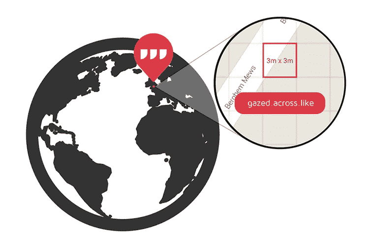
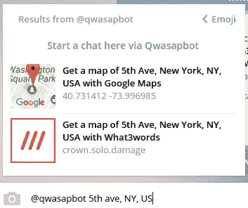

# Qwasapbot，现在用什么 3 个词

> 原文：<https://medium.com/hackernoon/qwasapbot-now-with-what3words-5d8a994dc3da>

> 如你所知，如果你使用 [Telegram](https://telegram.org) 和[其精彩的机器人](https://www.qwasap.com/en/bots.php),[Qwasapbot](https://qwasap.com)最简单和漂亮的功能之一是从任何聊天、群组或电报频道轻松共享地图和坐标。

为此，只需输入 *@qwasapbot，然后输入地址、城市和国家*。然后，单击将显示的选项。结果是你得到了坐标和一张地图，当你点击它，它会在谷歌地图中显示你选择的地址。

好了，从现在开始，**每次你打内线电报: *@qwasapbot 后面跟一个地址，城市或者国家*(也可以是坐标)你会得到两个选项:**

1)给你谷歌地图的那个。

2)另一个带有 What3Words 地图选项，该地图使用易于记忆的 3 字坐标系。

Try it in any Telegram chat!

说到这里，现在是时候稍微开发一下了…

**什么是 What3Words？**

What3words 是仅由 3 个单词组成的独特组合，用于识别 3m x 3m 的正方形。世界上任何地方。

用它自己的开发者的话说:

> 这是一个比邮政地址更精确的系统，也比一组坐标更容易记忆、使用和共享。更好地识别地址可以改善客户体验，提高商业效率，促进增长，推动国家的社会和经济发展。

[在这里你可以阅读更多关于 What3Words 系统](http://what3words.com/about/)的内容。

所以你现在可以选择两个系统使用 [@qwasapbot](https://telegram.me/qwasapbot) 的内嵌功能来共享一个位置，这无疑是在电报内外共享一个位置最简单的方法。

**What3Words 也有适用于你的移动设备的应用程序**

一个用于[安卓](https://play.google.com/store/apps/details?id=com.what3words.android&hl=en)一个用于 [iPhone](https://itunes.apple.com/nl/app/what3words/id657878530?mt=8&ign-mpt=uo%3D4%26amp%3Buo%3D4) 。如果你已经安装了 app，地图的链接会直接在 app 里打开，可能会更实用，给你更多的选择。如果您没有安装应用程序，地图将在内部电报浏览器或您已配置的浏览器中打开。

**肯定**

在 [Qwasap](https://qwasap.com) 中，我们一直想改进这个有用的交流工具。我们发现这是一个共享位置的好系统，我们毫不犹豫地将其作为一个选项。**每次使用**[**@ qwasapbot**](http://twitter.com/qwasapbot)**内联，可以选择想要得到的:一张 Google Maps 和十进制坐标的地图或者一张 3 字坐标的 What3Word 的地图。**

现在，一个很好的视频，如果你想深入了解的话:

> [黑客中午](http://bit.ly/Hackernoon)是黑客如何开始他们的下午。我们是阿妹家庭的一员。我们现在[接受投稿](http://bit.ly/hackernoonsubmission)并乐意[讨论广告&赞助](mailto:partners@amipublications.com)机会。
> 
> 如果你喜欢这个故事，我们推荐你阅读我们的[最新科技故事](http://bit.ly/hackernoonlatestt)和[趋势科技故事](https://hackernoon.com/trending)。直到下一次，不要把世界的现实想当然！

