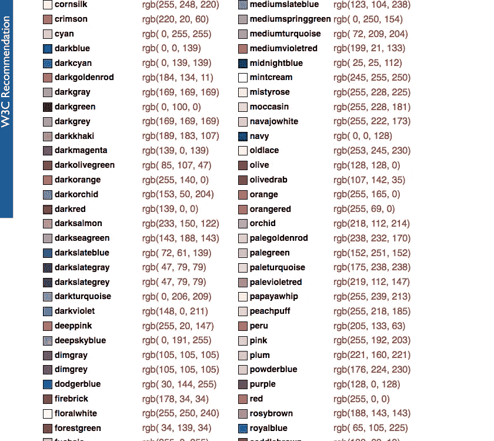

# Clojure 的种族主义安全

> 原文：<https://medium.com/hackernoon/racist-security-with-clojure-377c8362bbc7>

你们中的许多人可能是基于标题的前半部分来到这里的，也许标题有点误导。抱歉，我可能引发了假警报，但这是一个技术职位！“为什么是种族主义者？”你问，多读点《真相》。

在 Swym，我们有许多相互关联的系统。其中一些是公共的，一些是内部的，还有一些既有公共用途又有内部用途。对于公共接口点，带有角色授权策略的用户身份验证是首选解决方案。对于内部接口，访问被隐含地限制到网络的虚拟子网，依赖于网络防火墙策略。

对于公共内部接口，我们将 API 分为公共认证+授权、内部认证组。对于公开认证+授权，重用了角色授权策略的用户认证。公共组还包括无身份验证策略的匿名访问。我们使用了 chummy auth 库——friend(【https://github.com/cemerick/friend】)对超级用户访问做了一些调整。

对于内部认证组，有许多不同的策略可用。一些策略涉及共享访问令牌并验证它们。但这意味着令牌需要定期过期，进而需要令牌交换/刷新机制。我们可以为调用者系统创建一个用户。但它不是真正的用户，因为它可能会与公共认证+授权组混淆。感觉好像没有什么是直接简单的。或者我们可以直接说去你们的，把系统分成两部分——公共的和内部的。这就是我们的设计原则发挥作用的地方。在 Swym，作为一个成长中的创业公司，资源远比黄金珍贵。换句话说，只有当我们真的，真的确信某样东西值得的时候，我们才会建造它。以下是我们对自己的约束:

1.  只有一个节点/节点组应用于部署、监控等。
2.  应该只运行一个 API 网关/服务器，即一个处理频繁的公共调用和不太频繁的内部调用的服务器进程
3.  内部身份验证不应干扰公共身份验证，因此网络防火墙策略将不起作用

在所有这些都摆在我们面前之后，解决方案变得非常清晰。不错的 IP 白名单！(拜托，这听起来绝对是种族歧视，我使用这个标题是完全合理的:)我们开始搜索一个 [Clojure](https://hackernoon.com/tagged/clojure) 库，因为它觉得我们遇到了一个相当普遍的需求，肯定有人在我们之前解决了这个问题。但是，没有，找不到。(如果有，请务必分享！)

我们最终在 Clojure 的 ring web 框架上构建了一个小型轻量级中间件，以轻松地将 IP 白名单策略包装在 API 组周围。这是代码:

目前，中间件支持允许的 IP 地址的 CSV 和“开发”环境的直通。它是作为一个 gist 托管的，还不认为是一个 clojar 库容器。它可以很容易地在一个 API 组中使用，例如为 ring 定义的 defroutes。

请随意使用代码。请评论你对 IP 白名单的喜爱(或厌恶)。

现在标题。为什么是种族歧视？很明显，不是吗？允许加入白名单。黑名单被禁。即使颜色颠倒了，听起来还是有点种族歧视，不是吗？:P

Colors! (Ref: [https://www.w3.org/TR/SVG/types.html#ColorKeywords](https://www.w3.org/TR/SVG/types.html#ColorKeywords))

从所有这些颜色中，随便挑两种。想象一下，如果我们有木瓜酱和西红柿。听起来没那么种族歧视，对吧？随便说说。(不幸的是，Peachpuff 和 Papayawhiff 看起来非常相似)

页（page 的缩写）s:其他有争议但不那么尖锐的标题创意——彩色[安全](https://hackernoon.com/tagged/security)，黑白安全。

> [黑客中午](http://bit.ly/Hackernoon)是黑客如何开始他们的下午。我们是 [@AMI](http://bit.ly/atAMIatAMI) 家庭的一员。我们现在[接受投稿](http://bit.ly/hackernoonsubmission)并乐意[讨论广告&赞助](mailto:partners@amipublications.com)机会。
> 
> 如果你喜欢这个故事，我们推荐你阅读我们的[最新科技故事](http://bit.ly/hackernoonlatestt)和[趋势科技故事](https://hackernoon.com/trending)。直到下一次，不要把世界的现实想当然！

