# 电脑能看到我

> 原文：<https://medium.com/hackernoon/radarboy-3000-the-computers-can-see-me-edition-1e3e2fb06a7f>

## 计算机视觉如何改变一切

艺术、广告、社交媒体、城市游戏和人机互动中灵感和中断的不定期汇总。

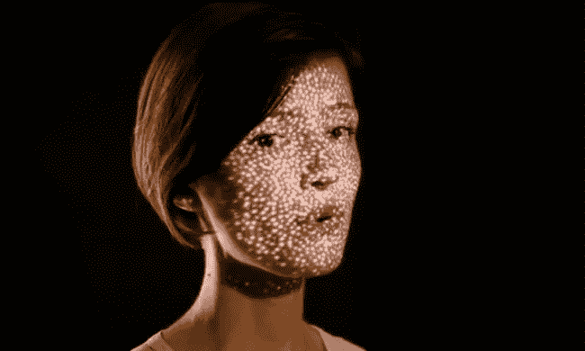

随着人脸检测、图像识别和运动检测在新的方向上推动创造力并迅速改变我们周围的世界，相机正迅速成为我们最重要和最强大的传感器。从[在火星上驾驶机器人](http://www.vision-systems.com/articles/print/volume-7/issue-5/features/robotics-vision/mars-rover-vehicle-self-senses-and-moves.html)，到[购物](http://www.psfk.com/2013/03/retail-tracking-technology.html)和[战争](https://en.wikipedia.org/wiki/File:DARPA_Visual_Media_Reasoning_Concept_Video.ogv)，到[舞蹈](https://www.youtube.com/watch?v=qaT64TYsVgA)和[艺术](https://www.youtube.com/watch?v=STRMcmj-gHc)，[交互设计](https://www.youtube.com/watch?v=z6lf8slV7Ak)，[沉浸式现实](http://www.dailymail.co.uk/sciencetech/article-3156192/Watch-Microsoft-HoloLens-unwrap-human-body-Video-reveals-augmented-reality-headset-lets-doctors-patient-s-skin.html)，[机器学习](http://www.businessinsider.sg/google-offers-computer-vision-tech-2015-12/?r=US&IR=T#.VxXWjJN95E4)和[监控](https://www.youtube.com/watch?v=678EaXPekFo&list=PLOjVh0E3kmKSgt_wS-uxbAiuUnUfwXlCD)，我们才刚刚开始。

这绝不是对计算机视觉中发生的所有酷事情的全面细分，但这里有一些正在发生的更酷的事情，希望能给你带来灵感:

# 计算机视觉创新者:

有趣的是，计算机视觉也是最早的互动艺术品之一。米隆·克鲁格的传奇视频平台研发于 1969 年至 1975 年，其动力来自他的信念，即整个人体都应该在我们与计算机的互动中发挥作用。Videoplace 仍然非常简单和吸引人:

计算机视觉的另一个开创性时刻是 1991 年 Loren Carpenter 在 SIGGRAPH 的社会实验。卡彭特现在是皮克斯动画工作室的联合创始人和首席科学家，他向剧院观众分发桨。一边是红色，另一边是绿色。接下来发生的事情是惊人的…(哈哈，这是非常 Buzfeedy)…

我们也非常感谢计算机艺术家[凯尔·麦克唐纳](http://kylemcdonald.net/)的工作带来的计算机视觉的大爆炸。我是他的超级粉丝，尤其是他对苹果商店电脑的[干预/入侵](http://www.wired.com/2012/07/people-staring-at-computers/)，以及作为数字活动家/恶作剧者 [F.A.T .实验室](http://fffff.at/)的一员。

McDonald 开创了面部跟踪技术[,他将一系列高度技术性的研究论文汇编成一套开源库](https://vimeo.com/29348533),这些库构成了我们今天看到的许多软件的基石。为易于使用的面部追踪铺平了道路，[操纵木偶](https://vimeo.com/13856519)和那些愚蠢的面部交换应用[已经风靡一时](http://www.buzzfeed.com/kirstenking/theres-a-new-face-swap-filter-on-snapchat-and-its-the-stuff#.aiMrvzMNy)。

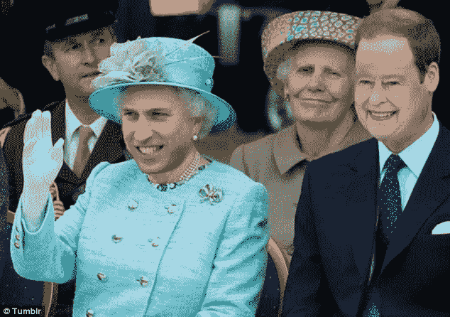

Face swapping, silly and fun.

如今，在浏览器中也可以进行面部交换(尽管有点不稳定)。试一下这里:[http://au duno . github . io/clm trackr/examples/face substitution . html](http://auduno.github.io/clmtrackr/examples/facesubstitution.html)

麦克唐纳和戈兰·莱文的另一个伟大而简单的项目是增强手系列。一个 7 岁的厨房游客解释得最好:“这是一个盒子。你把手伸进去。你看到你的手多了一根手指。”[http://www.flong.com/projects/augmented-hand-series/](http://www.flong.com/projects/augmented-hand-series/)

从现在开始，不要相信你所看到的，实时增强面部重现是一件事:

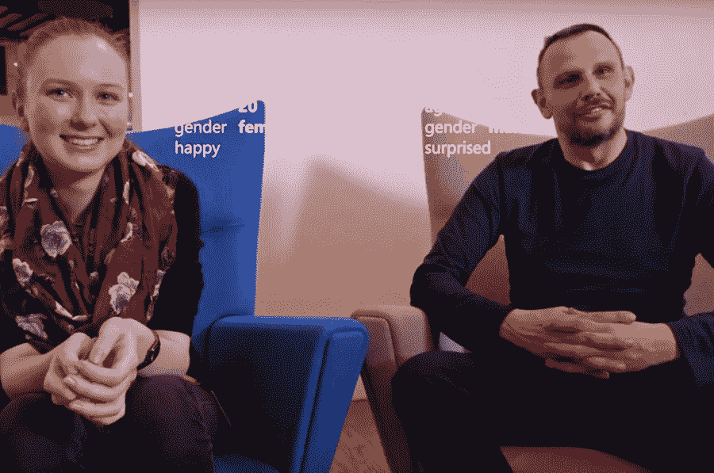

微软和 [Pivothead 的](http://www.pivothead.com/seeingai/)令人敬畏的视觉人工智能帮助盲人导航生活，并让我们再次一瞥计算机视觉将对我们的生活产生多大的深远影响:[http://then extweb . com/Microsoft/2016/03/30/watch-Microsoft-Seeing-AI-help-blind-person-navigate-life/](http://thenextweb.com/microsoft/2016/03/30/watch-microsofts-seeing-ai-help-blind-person-navigate-life/)

# 面部贴图:

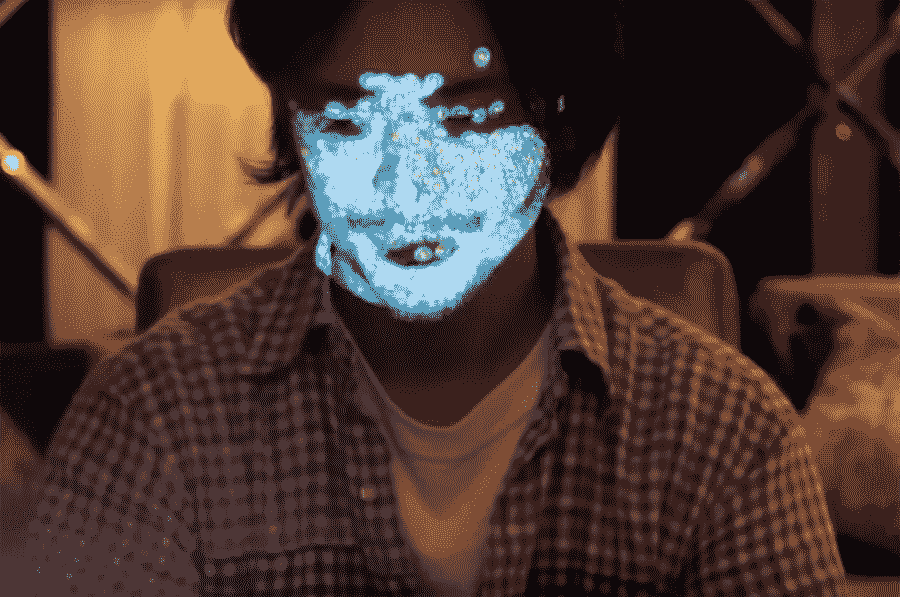

计算机视觉中更令人兴奋的新兴创造性领域之一是实时人脸跟踪和投影映射。

日本[WOW Inc .](http://www.w0w.co.jp/en/)的创意和技术总监浅井信一(Nobumichi Asai)将投影贴图提升到了一个新的水平…

它是这样工作的:

同样值得一看的是奥尔加·贝尔的《无脸追逐》，作者是扎克·利伯曼、弗朗西斯科·萨莫拉诺、安迪·华莱士和米歇尔·卡拉布洛。

 [## 在新视频中，奥尔加·贝尔的脸控制着一个闪闪发光的视频投影

### 面部彩绘是一种简单的快乐，我们大多数人在 7 岁时就放弃了——除非我们跑去加入马戏团。但是…

www.fastcodesign.com](http://www.fastcodesign.com/1664634/in-new-video-olga-bells-face-controls-a-sparkling-video-projection) 

The making of Chase No Face

# 微动:

计算机视觉中一个相对较新的、非常令人兴奋的、未来的领域，微动，将会极大地改变我们看和听事物的方式。

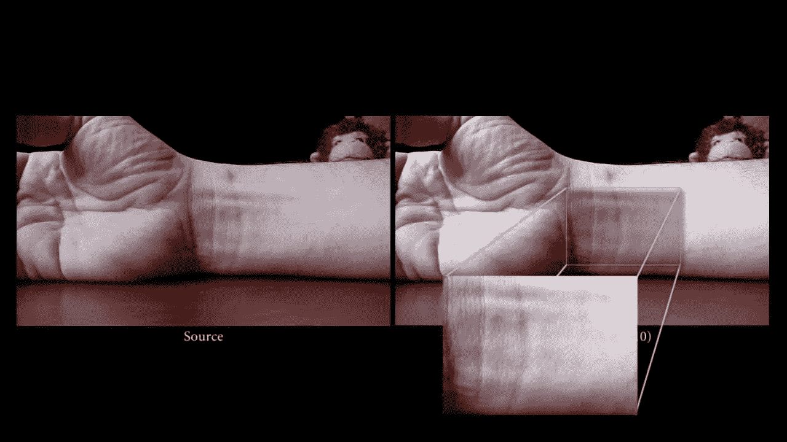

[欧拉视频放大](http://people.csail.mit.edu/mrub/vidmag/)，是运动的放大，它使你能够看到人眼看不到的变化，并且(等着瞧… *因为* *这是你很久以来见过的最疯狂和科幻的事情*)使用视觉从物体中神奇地提取视频中的声音…

观看精彩的迈克尔·温斯顿的 TED 演讲:

你可以用你自己的视频来试试这个:https://lambda.qrilab.com/site/geko/

[https://github.com/corbanbrook/heartrate](https://github.com/corbanbrook/heartrate)

# 增强现实(AR):

我拿不定主意是否把这一部分放进去。但是，尽管它是更主流的计算机视觉创新之一，我们甚至还没有开始理解 AR 将如何彻底重塑我们的世界。有时被称为[增强创新](https://www.linkedin.com/pulse/augmented-innovation-machines-getting-ideas-bo-begole)，向我们展示隐藏的东西并提出新的想法。受影响的不仅仅是游戏、玩具、[维修和维护](http://monet.cs.columbia.edu/projects/armar/)、[购物](http://www.businessinsider.com/11-amazing-augmented-reality-ads-2012-1?IR=T&r=US&IR=T#net-a-porter-makes-storefronts-interactive-1)、[广告](https://www.youtube.com/watch?v=Go9rf9GmYpM&ab_channel=PepsiMax)——在不久的将来，几乎所有行业都将依赖这项技术，我们尚未理解其使用案例。很难不提它，尽管除了 [Hololens](http://www.wired.com/2015/12/hands-on-with-hololens-groundbreaking-potential-for-ar/) 和 [Magic Leap](http://9to5google.com/2016/04/19/magic-leap-demo/) 歇斯底里之外，很难找到一些真正酷的东西(*请在评论中告诉我，我完全错了*)。

身体分离似乎是 AR/VR 艺术领域的一个主要主题:

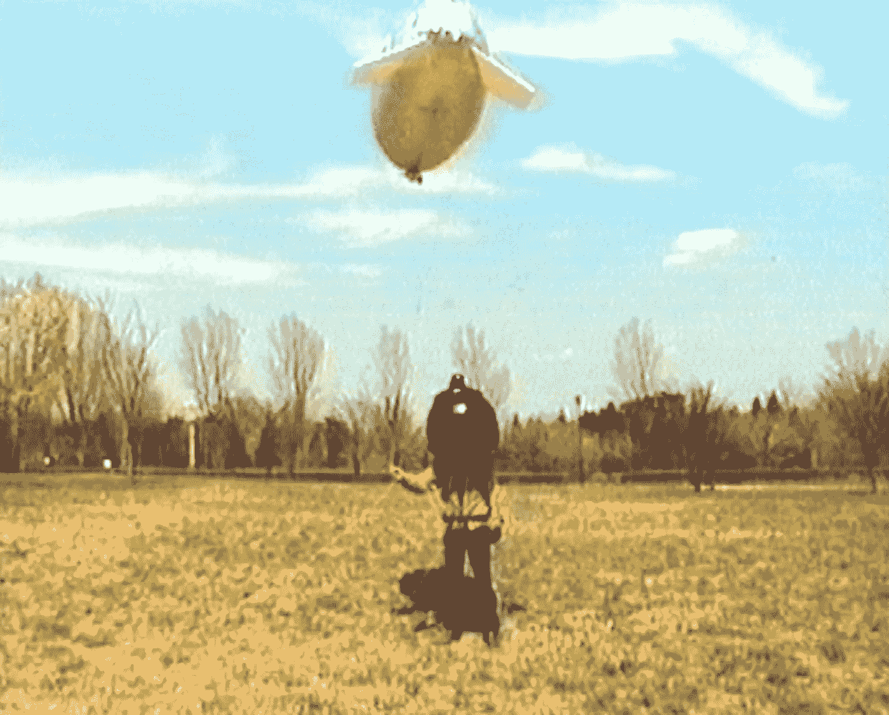

我一直很喜欢岩田浩夫的浮眼，它有一个漂浮在你上方的摄像头。参与者只能看到一张从空中拍摄的广角图像。他们无法直接看到周围的世界。将视觉与身体分离

https://www.youtube.com/watch?v=In-M1eVAnYc&ab _ channel = ikinamo

新加坡艺术家 Eugene Soh 的作品《概览》也是类似的例子，你戴上视频护目镜，通过闭路电视的视角在你头顶上的迷宫中穿行:

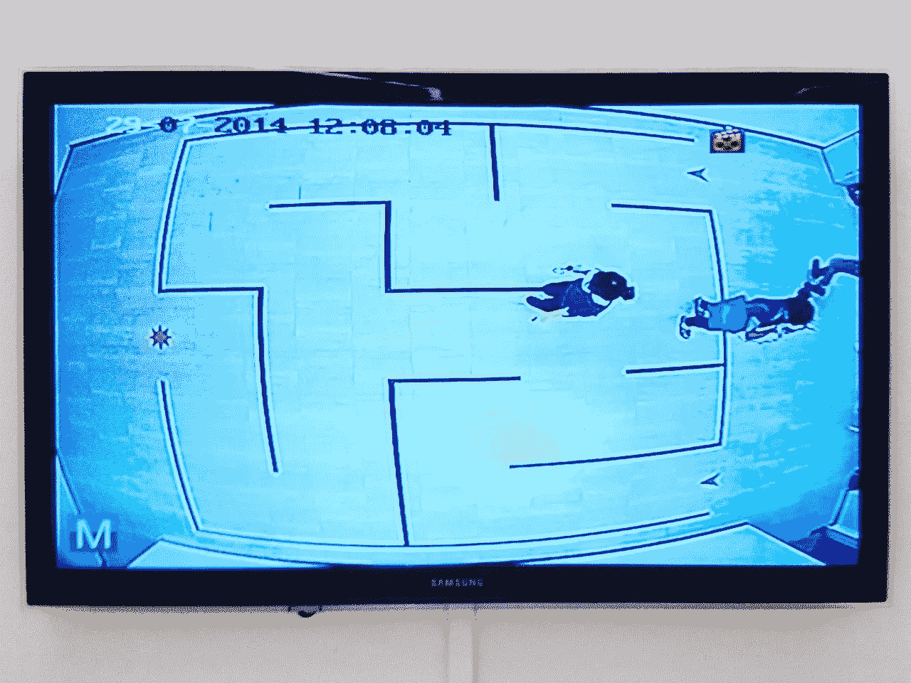

[http://blog . dude . SG/eugenes-2-important-museum-exhibitions-of-2014/](http://blog.dude.sg/eugenes-2-important-museum-exhibitions-of-2014/)

克里斯·奥谢的《从天而降》是一部老歌，但也是一部佳作，它影响了许多其他 AR 类型的体验:

凯尔·麦当劳的 Highsight 相当有趣:

没有广告是一个 AR 应用程序，让你在曾经有广告的地方看到艺术:

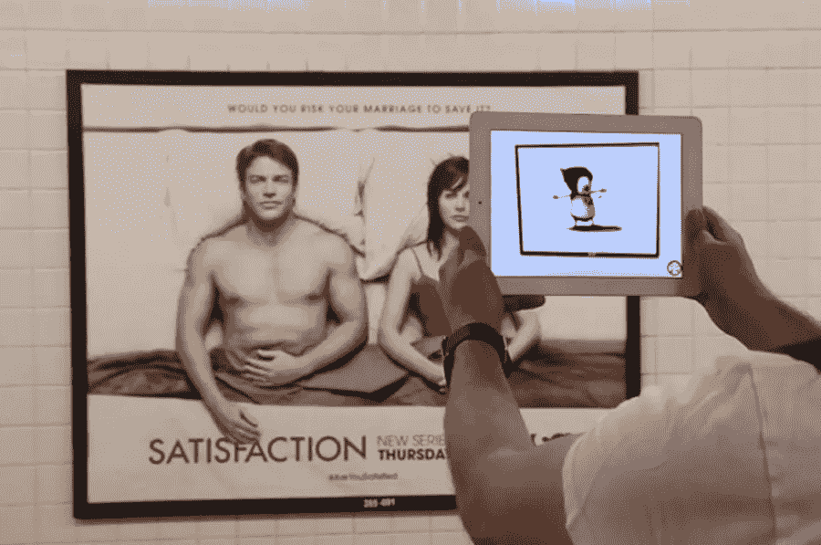

[http://www . digital trends . com/photography/turn-subway-billboard-art-ad-blocking-augmented-reality-app/](http://www.digitaltrends.com/photography/turn-subway-billboards-art-ad-blocking-augmented-reality-app/)

一个类似的项目是广告，我更喜欢它是一个实物:【https://vimeo.com/9291451#at=50】T4

# 艺术和其他领域的计算机视觉(又名其他很酷的东西):

**暗影怪物:**

菲利普·沃星顿的有趣和超级迷人的影子怪物本质上是传统皮影戏的数字版本，它可以把你的手形和身体部位变成怪物般的影子。

你会举报乱穿马路的人吗？

媒体艺术家 [Dries Depoorter 的乱穿马路](http://driesdepoorter.be/)监控不同国家十字路口的实时网络摄像机镜头，并检查乱穿马路者，然后让你选择是否举报他们:[http://www . wired . com/2016/03/turning-live-surveillance-feeds-unomminating-works-art/](http://www.wired.com/2016/03/turning-live-surveillance-feeds-unsettling-works-art/)

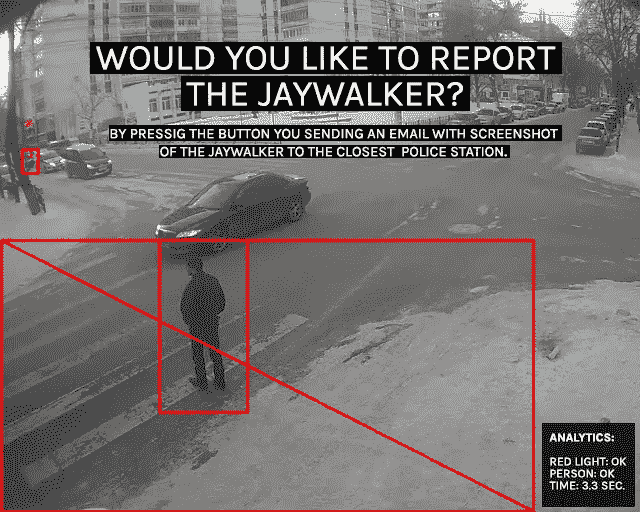

**雨室**

[Random International](http://random-international.com/) 在超级酷的[雨室](http://random-international.com/work/rainroom/)中使用 3D 摄像机的计算机视觉，让雨无处不在，除了你所在的地方:

**方框:**

机器人[小车&小车](http://www.bloomberg.com/news/articles/2014-03-20/bot-and-dolly-and-the-rise-of-creative-robots)和聪明的 [GMunk](http://gmunk.com/) 之间的合作这是一个探索移动物体上投影映射的美丽作品。

**嗅嗅:**

Sniff 是一个店面投影的能对路人做出反应的感知 3D 狗:
[http://www.gravitytrap.com/artwork/sniff](http://www.gravitytrap.com/artwork/sniff)
[http://www . creative applications . net/open frameworks/sniff-open frameworks/](http://www.creativeapplications.net/openframeworks/sniff-openframeworks/)

**表格:**

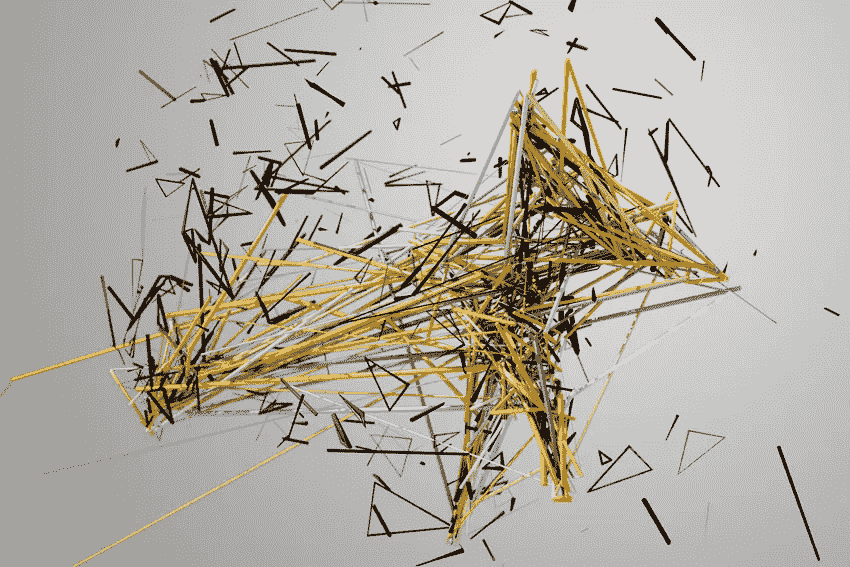

Forms 是由才华横溢的 Memo Atken 和 [Quayola](http://www.quayola.com/) 设计的一个美丽的项目，是对人类运动的研究，以塑造抽象的形式:

这是一段视频，展示了这些镜头是如何处理的:

**谷歌脸:**

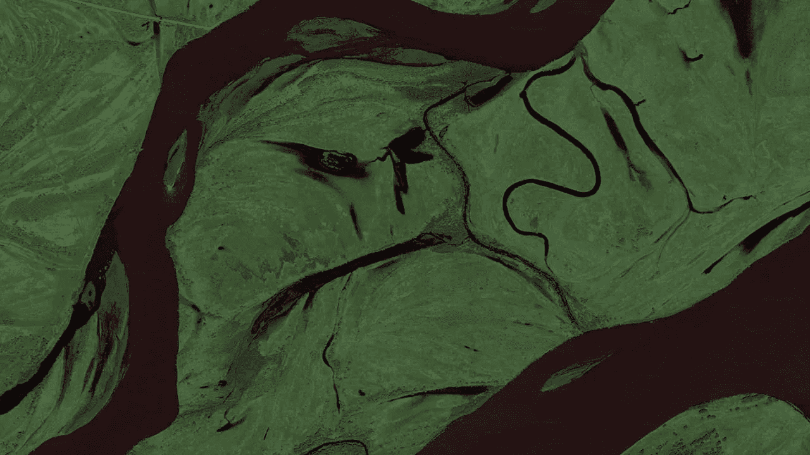

Googlefaces 是一个使用人脸检测在谷歌地图上自主搜索人脸的项目:[http://www.onformative.com/lab/googlefaces/](http://www.onformative.com/lab/googlefaces/)

**上午:**

另一个身体意识项目， [Ali Phi](http://aliphi.com/) 的美丽 AM 装置项目在镜子前投射到你自己身上:

舞蹈与表演:

另一个迅速拥抱计算机视觉的领域，有很多东西在那里。所以我想如果你没看过的话，我会坚持经典:

当谈到计算机视觉时，我曾经告诉人们的第一个项目是 Messa di Voce，因为它对我有如此深远的影响，由 [Golan Levin](http://www.flong.com/) 、 [Zachary Lieberman](http://www.thesystemis.com/) 、 [Jaap Blonk](http://www.jaapblonk.com/) 和 [Joan La Barbara](http://www.joanlabarbara.com/) 于 2003 年完成。！！):

[Klaus Obermaier](http://www.exile.at/ko/)&Ars Electronica Futurelab 的出现是另一个辉煌的经典:

我想我有必要提一下微软的 Kinect。所以这里有一点有趣的是 [Amnon 欠](https://amnonp5.wordpress.com/)的动力舞蹈套路，为香水全球项目:

**音乐控制器:**

V Motion 项目是一台将运动转化为音乐的机器:

以下是如何做到的分类:[http://www . custom-logic . com/blog/v-motion-project-the-instrument/](http://www.custom-logic.com/blog/v-motion-project-the-instrument/)

我一直喜欢的另一个简单的音乐控制器是这个简单的替代音乐控制器，它是 2009 年由伯克利音乐学院的 [Taemin Cho](http://www.taemincho.com/) 设计的:

就这样了。希望你喜欢这个版本的*电脑能看到我*，并受到启发去玩。

顺便说一句。不知道该怎么称呼这个系列。我打算把它叫做无标题文件。但现在不那么确定了。如果你有什么建议，请在评论中告诉我。

 [## 乔治·加里-中等

### 阅读乔治加里在媒体上的文章。媒体艺术家，修补匠，梦想家。动作反应，声音可视化…

medium.com](/@radarboy3000) 

点击 Instagram 关注我:[https://www.instagram.com/radarboy3000/](https://www.instagram.com/radarboy3000/)
点击 Twitter 关注我:[https://twitter.com/radarboy_japan](https://twitter.com/radarboy_japan)
点击我的脸书主页:[https://www.facebook.com/radarboy3000](https://www.facebook.com/radarboy3000)

> [黑客中午](http://bit.ly/Hackernoon)是黑客如何开始他们的下午。我们是阿妹家庭的一员。我们现在[接受投稿](http://bit.ly/hackernoonsubmission)并乐意[讨论广告&赞助](mailto:partners@amipublications.com)的机会。
> 
> 如果你喜欢这个故事，我们推荐你阅读我们的[最新科技故事](http://bit.ly/hackernoonlatestt)和[趋势科技故事](https://hackernoon.com/trending)。直到下一次，不要把世界的现实想当然！

