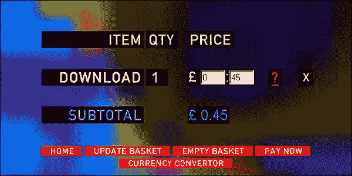

# 电台司令的《彩虹中》在发行十年后仍受到听众的喜爱(数据如是说)

> 原文：<https://medium.com/hackernoon/radioheads-in-rainbows-is-beloved-by-pandora-listeners-ten-years-after-its-release-4d5e38e46c36>

## 在 Pandora，数字营销的里程碑——划时代专辑中的歌曲比其他电台司令专辑更受欢迎。

由格伦人民，[音乐](https://hackernoon.com/tagged/music)潘多拉的见解和分析

*【你可以在这里* *阅读我的文章* [*，也可以在潘多拉的*](/@glennpeoples) [*实测*](http://measured.pandora.com/) *找到它们，这是一个基于数据的写作集合。】*

Radiohead performs at the 2008 Lollapalooza music festival in Grant Park on August 1, 2008 in Chicago. (Photo by Kevin Mazur/WireImage)

电台司令《彩虹中的**今天十岁了。该乐队的第六张录音室专辑改变了音乐营销，并引发了媒体的狂热，以匹配其里程碑式的地位。这张 10 首歌曲的专辑没有像传统的音乐营销活动那样提前发布。然后是定价问题。2007 年的唱片业发起了一场反对盗版的战斗，并热烈讨论音乐的价值。因此，当电台司令把*扔进彩虹*里，让公众能够选择他们想为下载支付的价格时，几乎所有的事情都失控了。**

**《彩虹》中*的音乐代表了它自己，如果不算《蠕变》这首歌，它占了乐队 12 亿潘多拉唱片的 25%。(“蠕变”是该乐队 1993 年首张专辑中的热门歌曲，是迄今为止电台司令的必选歌曲。移除这个异常值可以更好地了解其他歌曲的受欢迎程度。专辑中有四首歌曲位列乐队最受欢迎的 10 首歌曲:第六名是《清算者》；《怪鱼/琶音》# 8；第九名是“拼图就位”；《纸牌屋》排在第十位。这四首歌也是最成功获得拇指的歌曲(拇指是潘多拉现在著名的“喜欢”按钮版本)，表明它们是该乐队目录中最受喜爱的歌曲。在所有专辑中，《彩虹中的*是拇指最成功的。****

****

**The order page for Radiohead’s In Rainbows had blank boxes where fans could receive a download code (via email) after naming their price for the album.**

**《彩虹中的 T1》是数字音乐时代最具影响力的专辑之一。在 2007 年 10 月之前，没有任何一个像电台司令这样有声望的乐队能够自主发行专辑，放弃传统的零售渠道。那是一堂电子商务的大师课。其他艺术家的网站提供商品和音乐，通常通过第三方销售，但没有其他人吸引了同样多的流量——c[omScore 表示，在发布的那个月，有 120 万人](http://www.foxnews.com/story/2007/11/07/survey-most-radiohead-fans-paid-nothing-for-in-rainbows.html)访问了彩虹 T4 网站。最值得注意的是，没有其他主要乐队使用荣誉箱，允许粉丝选择他们为专辑下载支付的价格。一些粉丝和好奇的路人肯定不会付钱。事实上，根据 comScore 的调查，60%下载专辑的美国居民没有付费。但是乐队会获取他们的电子邮件地址，以便发送他们的下载代码。一个电子邮件地址的免费专辑——和粉丝的高度信任——是一个不错的权衡。**

**2008 年的音乐产业变幻莫测。文件共享是一个比今天更大的威胁。收入在下降。在会议和媒体上，贸易团体和行业高管捍卫音乐的固有价值，反对免费、非法获取。在这种环境下，电台司令的“随心所欲”的做法令人震惊，因为它对乐队的财务成功产生了巨大的影响。《纽约时报》的 Jon Pareles [在专辑发行后的第二天写道](http://www.nytimes.com/2007/10/11/arts/music/11radi.html)“他们决定，是或不是，以可获得的价格购买专辑、单曲或演唱会门票。"电台司令在数字时代的灵活性允许更多的支持者让自己为人所知."ComScore 还发现，美国人为彩虹中的 T8 下载支付的平均价格是 8.05 美元——高于 iTunes 专辑的批发价。**

****

**Radiohead performing live in 2008 in support of their October 2007 album In Rainbows. (Photo by Kevin Mazur/WireImage)**

**除了碧昂斯在 2013 年出人意料的数字发行(一张*视频专辑*也是秘密录制并毫无预警地发行)，很少有专辑像它一样重塑了艺术自由的概念。电台司令最近解除了与百代子公司 Parlophone 的合同，它可以制作任何它想要的音乐，决定如何发布音乐，收取多少费用，并为以后的商业发布选择其标签合作伙伴。没有任何一家拥有实质性市场份额的唱片公司能像电台司令一样用荣誉盒子来销售它的音乐。唱片公司已经变了，音乐的授权方式也变了，但单曲和专辑仍然分销给数字零售和流媒体服务。唱片公司继续与艺术家签约，新的唱片公司也不断涌现。考虑到所有的营销工具，包括[潘多拉的艺人营销平台](https://amp.pandora.com/no-artist-associations)，已经不太需要荣誉箱来接触粉丝了。**

**很明显，《彩虹中的 T4》是电台司令唯一一部“随心所欲”的电影。今天，*免费*与其说是一种营销策略，不如说是艺术家们尝试互联网力量和可能性的时代的遗迹。(作为旁注， [*的作者《长尾:为什么商业的未来是少卖多卖*](https://en.wikipedia.org/wiki/Chris_Anderson_(writer)) 》写了一本书，书名为 [*免费:激进价格的力量*](https://en.wikipedia.org/wiki/Free:_The_Future_of_a_Radical_Price) ，讲的是赠送产品的力量。它没有接近长尾的影响。)“关键是一个乐队可以送出一张专辑，仍然可以赚很多钱，”电台司令歌手汤姆·约克在《彩虹中的 T19》发行两个月后向《连线》杂志解释道。“它不应该是其他任何东西的模型。这只是对形势的反应。我们合同到期了。我们有自己的工作室。我们有了新的服务器。我们还能做什么？”**

**媒体对彩虹的关注，价值数百万的付费营销，持续到 CD 和 LP 发行(2008 年 1 月在美国和许多其他国家的 ATO 唱片上)。不出所料，*《T3》这张专辑首次亮相就在 Billboard 200 专辑排行榜上名列第一。六月，歌曲《裸体》在公告牌百强单曲排行榜上名列第 37 位。在媒体关注下，[ATO 唱片集团总裁兼首席执行官威尔·伯特温打趣道。"这支乐队可能比摇滚史上任何一支乐队都更受关注。"十年后，这个记录可能仍然保持着。](https://books.google.com/books?id=LRMEAAAAMBAJ&pg=PA28&dq=billboard+%22in+rainbows%22&hl=en&sa=X&ved=0ahUKEwib36aljNrWAhVXVWMKHXkeCVYQ6AEIKDAA#v=onepage&q=billboard%20%22in%20rainbows%22&f=false)***

***【你可以在这里* *阅读我的文章* [*，也可以在潘多拉上的*](/@glennpeoples) [*实测*](http://measured.pandora.com/) *找到它们，这是一个基于数据的写作集合。查看* [*潘多拉的新闻博客*](http://news.pandora.com/) *也是如此。我的 Twitter 句柄是*[*@ the Glenn people*](https://twitter.com/theglennpeoples)*。】***