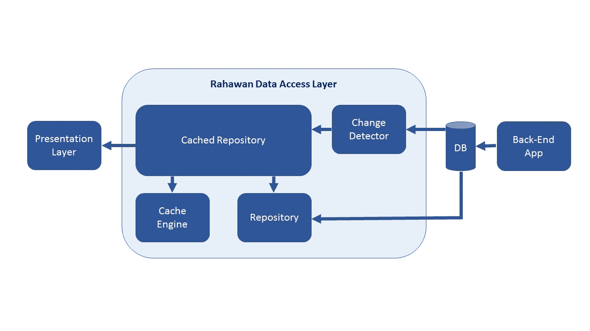
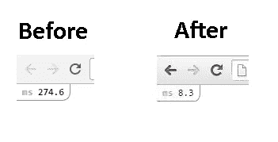
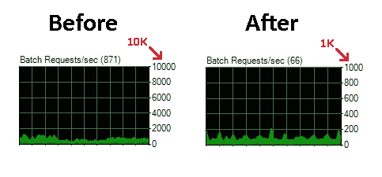

# Rahawan:我们如何通过单向数据访问层设计将响应时间提高了 95%

> 原文：<https://medium.com/hackernoon/rahawan-how-we-achieved-95-better-response-time-by-mostly-unidirectional-data-access-layer-design-1af1f87755f5>

# 介绍

构建网站/应用程序来服务每天数百万的访问是一个真正的挑战，尤其是在尽可能降低响应时间的时候。新闻网站是高负载网站/应用程序的完美例子。构建少数几个并保持良好状态，需要我们从头开始重新设计/重写我们的数据访问层。

“Rahawan”是一个针对数据访问层的全新设计，帮助我们将网站响应时间从 250 毫秒缩短到 10 毫秒。同时将数据库负载从每秒 800 个补丁请求减少到每秒 150 个补丁请求。

# 长话短说

最简单的形式，“Rahawan”只不过是一个由数据缓存引擎驱动的数据访问层。它的主要目的是**即时**提供一个完全加载的[数据模型](https://hackernoon.com/tagged/data-model)来响应 web 请求(比如浏览某个网页)。

大多数情况下，提供“数据模型”的过程是作为直接的键值检索操作来完成的。数据库记录的任何变化都会触发 Rahawan 内部的**后台任务**来重建与修改后的数据库记录相关的“数据模型”。

**注意:在谈论 Rahawan 本身之前，我将做一个闪回来展示这个解决方案是如何发展的。如果你愿意，你可以跳过迭代一&二。**

# 迭代一:凌乱缓慢的代码:)

像许多开发人员一样，我确实参与了一些项目，在这些项目中，所有的灯都是“绿色”的，任何团队成员都可以在任何地方编写任何代码。只要它导致一个工作网站。

客户急于推出他们的网站。通常这会给开发团队带来很大的压力，在这个迭代中，除了构建一个可工作的网站，做任何事情都是次要的。不要谈论代码质量或团队成员之间更好的协调。这导致 fat 控制器直接与数据库通信。这是一个简化的示例:

如图所示，这只是“意大利面条式代码”的完美开端。控制器正在直接与数据库通信。数据通过两种不同的方式(视图模型和视图包)从控制器传输到视图。要在视图内部进行部分渲染，请使用“Html。RenderAction”已经使用过一次，而“Html。“Partial”已在另一个中使用。

这样的代码很难经受住许多团队成员所做的持续的变更请求和错误修复。当一些开发人员在这里修复了一个 bug，新的 bug 就会在那里产生。如果团队设法击落所有的 bug，没有人可以结束糟糕的性能问题。所有这些都消耗了大量的时间和精力来达到近乎稳定的网站。

在这个迭代的末尾，所有的团队都同意他们需要为激动人心的事情休息一下，并思考更好的解决这些问题的方法。这将促使我们:

# 迭代二:清理代码

在前一次迭代中面临很多问题后，团队得到了它。不是所有的绿灯都是好的，一些红旗必须放在导致问题的道路上，并遵循一些统一的设计准则。

以下两点是我们团队一致认同的危险信号的真实例子:

*   除非非常必要，否则不要使用 ViewBag 或 ViewData
*   不要使用 Html。RenderAction，除非真的有必要

这是我们通过第二次迭代后的简化示例

代码已由以下人员清理:

*   使用[工作模式单元](http://martinfowler.com/eaaCatalog/unitOfWork.html)封装数据检索逻辑，这将释放优化数据检索方式的能力，而无需接触控制器。
*   使用[依赖注入](http://structuremap.github.io/)提供控制器所需的工作单元。
*   使用“ViewModel”作为将数据从控制器传输到视图的唯一方式，视图具有严格的模型类型有助于开发人员更加自信地进行更改，减少意外行为。
*   消除对“RenderAction”不必要的调用，因为它会创建新的控制器实例，并且[比“RenderPartial”花费更长的时间&更慢的路径](http://stackoverflow.com/questions/719027/renderaction-renderpartial)。除非真的需要这样做，否则“RenderPartial”是我们的首选。
*   使用输出缓存，这将指导 ASP.NET 进程不调用“索引操作”，除非从最后一次调用到同一操作过去了 60 秒，并在 60 秒过去之前从 ASP.NET 缓存为 web 请求提供服务。

# 迭代三:拉哈万

为了更好的理解，我们来采访一下。

我:你好
拉哈万:你好

我:你能介绍一下你自己吗？
**Rahawan:** 我是一个增强的数据访问层。

**Me:** 你为什么声称自己是“增强的”，是什么让你与其他数据访问层有所不同？
**拉哈万:**我被设计成[尽可能利用单向数据流](https://facebook.github.io/flux/)。

我:你说的利用单向数据流是什么意思？在回答之前，让我先解释一下我要解决的问题:

*   通常当某个网页被请求，**并且没有缓存版本提供服务，**服务器端页面控制器将使用传统的数据访问层从数据库中获取所需的数据，然后为页面做准备。所有这些逻辑都是独立于任何其他页面逻辑完成的。这导致从数据库中获得相同数据的重复，尽管它暂时没有改变。
*   例如，同一作者写的三个新闻网页同时被请求。每个页面将查询数据库以获得自己的作者数据副本，本例中有 3x3 个问题:)
    * 3 个数据库在同一时间查询相同的确切数据。
    * web 服务器内存中相同作者数据的 3 个副本。
    * 3 个比所需速度慢的网页。

**我:**关于这个问题，你的解决方案呢？
**Rahawan:** 我的解决方案是总是将对数据库项所做的修改移动到 web 服务器的内存缓存引擎，即使表示层还没有请求这些数据项。这将确保从数据库到内存再到表示层的大部分单向数据流。

我:这将如何实现？
**拉哈万:**通过这个设计:

Rahawan design diagram

**我:**能解释一下吗？
**拉哈万:**当然，它展示了用来完成我的任务的 4 个组件:

*   **变更检测器:**它的职责是检测数据库中发生的任何变更，并用。
*   **缓存存储库:**它的职责是通过在缓存引擎和存储库之间进行协调来服务数据请求。作为拉哈万的单一联系点。
*   **缓存引擎:**它的职责是在内存中保存数据。
*   **Repository:** 它的职责是与数据库通信，以获取数据。

**我:**但是任何 ORM 比如实体框架都可以做到，为什么还要这样？
**Rahawan:** 有很大的区别，比如实体框架，没有被设计成线程安全的，这意味着多个 web 请求不能使用同一个实体框架上下文安全地处理。而 Rahawan 被设计成线程安全的。

我:线程安全问题可以用某种方式处理，继续使用 ORM 而不是这种复杂性。
**拉哈万:**这样你只解决了一半的谜题，那另一半呢？

**我:**什么另一半？
**拉哈万:**缓慢的数据库查询。你只需要五分钟的时间来监控实时数据库查询——[使用活跃的 sp](http://sqlblog.com/blogs/adam_machanic/archive/2012/03/22/released-who-is-active-v11-11.aspx)——然后你就可以清楚地知道 ORMs 通常和 Entity Framework 不能有效地翻译复杂的查询。这会导致许多超时错误，尤其是在高负载网站/应用程序上。

我:你是如何处理数据库查询缓慢的问题的？
**Rahawan:** 通过将数据缓存逻辑从数据检索逻辑中分离出来，我们可以更好地控制如何检索数据(使用 ORM 或第三方库，如 [Dapper](https://github.com/StackExchange/dapper-dot-net) )。这释放了手动重写特定查询的能力，从而在不影响缓存方式的情况下提高它们的效率。

**我:**你之前说的 4 个组件如何协同工作？拉哈万:举个真实的例子

*   一些作者发表新闻条目。
*   新闻条目保存在数据库中。
*   Change Detector 检测到某个新闻项已经发布，并在从表示层请求之前调用缓存的存储库来获取该新闻项。
*   缓存存储库从数据库中检索新闻项目，并将其传递给缓存引擎。
*   一个网页控制器从缓存存储库请求新闻项目，该存储库直接从缓存引擎提供新闻项目。

管理员从数据库中免费获得这样的新闻条目，这反映了网站用户更好的响应。

我:这意味着你将在缓存引擎中复制整个数据库？
**拉哈万:**当然不是，有某种方法可以决定哪些数据会保留在缓存引擎中，哪些数据不会。

我:关于这种方式的细节？
**拉哈万:**虽然这是根据情况定制的。但是，例如，上个月发布的任何新闻都很可能会有很高的需求。然后是访问率高的新闻条目的优先级。这些可以保存在缓存引擎中，而其他可以根据需要从数据库中检索。

这意味着数据流并不总是单向的。
**拉哈万:**这就是为什么提到了“大多-单向”。因为大部分数据请求(基于真实世界的情况)将是单向的，并且在被服务之前从数据库中检索的百分比将会减少。

**Me:** 如果从数据库中按需检索了某个项目，缓存失效策略是为了什么？
**拉哈万:**缓存的项目——作为单独的项目——没有失效策略。相反，缓存引擎容量受到监控。一旦达到最大容量，最少请求的项目将被删除。

**我:**我明白你的想法了，那么实施呢？
**Rahawan:** 虽然当前的 4 个组件实现可以随着时间的推移而改变，但这些是当前的细节:

*   **变更检测器:**当前的实现对数据库执行定期的 SQL 查询，以找出哪些记录已经被修改。SQL 查询使用修改日期来获取这些记录， [Hangfire](http://hangfire.io/) 用于调度&在同一网站/应用程序的后台线程中运行这些定期查询。
*   **缓存存储库:**非常薄的层没有特殊的实现，只是有引用存储库&缓存引擎来协调之间的关系。并在需要时处理数据。
*   **存储库:**两个 [Dapper](https://github.com/StackExchange/dapper-dot-net) &实体框架都是用来和数据库通信的，这里有一点很重要的说明:
    * raha wan 的目标之一就是尽可能的减少 SQL 连接。例如，新闻 SQL select 查询将只获取作者 id。然后，将从“作者缓存存储库”请求作者数据。作者数据很可能已经存在于缓存引擎中。因此，我们赢得了两次胜利，第一次是通过减少 SQL 连接，第二次是通过避免重复查询使数据库过载。
*   **缓存引擎:**使用 static ConcurrentDictionary 构建，因为它的简单性和它对存储在其中的数据提供的控制量。

**我:**结果呢？
**Rahawan:** 在服务器端级别， [Mini Profiler](https://github.com/MiniProfiler/dotnet) 用于测量响应时间，这是一个区别示例:

Website response time before & after using Rahawan

**拉哈万:**在数据库级别:

Database usage before & after using Rahawan

# 拉哈万 2.0

目前，有一个基于发布/订阅模式重建变更检测器的计划，而不是定期的 SQL 查询。以及 Redis 支持缓存引擎的其他计划，等等。

# 最后:

Rahawan 不是消除任何网站/应用程序性能问题的银弹，它诞生于基于新闻的网站挑战，并且可以用于面临类似挑战的其他网站/应用程序。面临不同挑战的网站/应用将需要更合适的解决方案。可能是 Rahawan 或者是修改版的，甚至是别的什么。

这篇文章谈到了 Rahawan 的设计，并没有深入探讨我们的实现。因为这需要很多文章来分享我们的实现细节，以及在[开发](https://hackernoon.com/tagged/development)期间遇到的问题。例如内存泄漏和进程突然终止，但在深入诊断之后才发现这是未处理的堆栈溢出异常。如果需要的话，我会试着在其他文章中讨论这些细节。

# 等待您的反馈和评论

谢谢，祝你有美好的一天:)
[艾哈迈德·莫扎里](https://www.linkedin.com/in/ahmedmozaly)

> [黑客中午](http://bit.ly/Hackernoon)是黑客们下午的开始。我们是 [@AMI](http://bit.ly/atAMIatAMI) 家庭的一员。我们现在[接受投稿](http://bit.ly/hackernoonsubmission)并乐意[讨论广告&赞助](mailto:partners@amipublications.com)机会。
> 
> 如果你喜欢这个故事，我们推荐你阅读我们的[最新科技故事](http://bit.ly/hackernoonlatestt)和[趋势科技故事](https://hackernoon.com/trending)。直到下一次，不要把世界的现实想当然！

