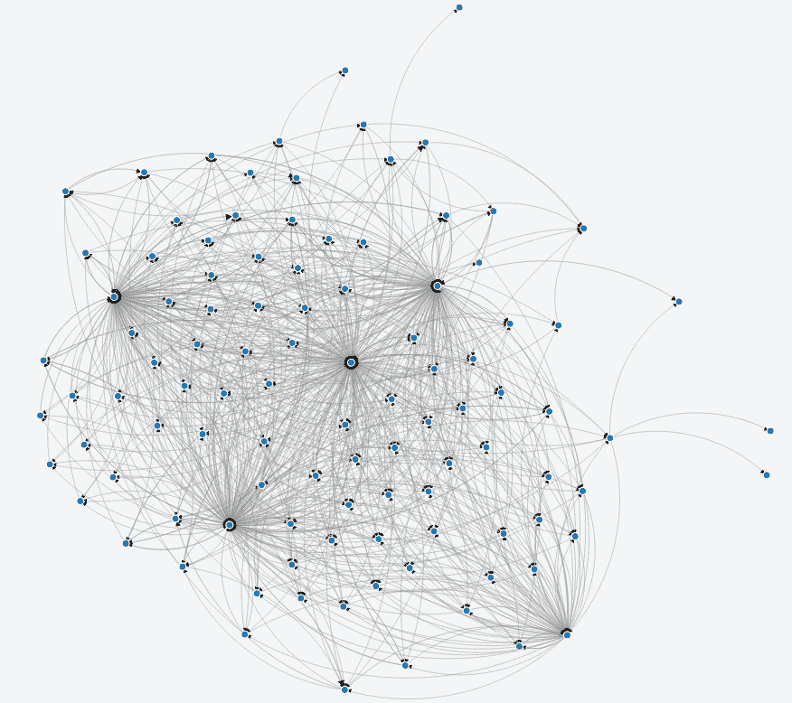

# 雷电网络开发者预览版

> 原文：<https://medium.com/hackernoon/raiden-network-developer-preview-dad83ec3fc23>

**TL；DR:我们发布了** [**雷电网**](https://raiden.network/) **的开发者预览，并推出了 testnet (** [**下载**](http://github.com/raiden-network/raiden/releases/tag/v0.1.0) **，** [**文档**](http://raiden-network.readthedocs.io/en/stable/) **，或者观看简短的** [**演示视频**](https://www.youtube.com/watch?v=DDQP9EZ6qJM) **)。**

Raiden Network 是一项备受期待的技术，支持以太坊快速、廉价和可扩展的 ERC20 令牌传输。

今天，我们的团队自豪地宣布雷电网络开发者预览版。自从我们六个月前的最后一次更新以来，我们已经提交了 2000 多份，解决了(并创造了)一大堆问题，合并了一堆 pr，最终发布了一个值得与开发者社区分享的版本。

Visualization of commits to the Raiden Network repository

“雷电什么时候准备好？”可能在 Reddit 上被问了上千次，每当我们遇到我们生态系统的其他成员时也是如此。我们通常会参考我们在 GitHub 上的知识库，以表明虽然有不断的进步，但也有很多未解决的问题。自 [PoC-0 发布](https://github.com/raiden-network/raiden/releases/tag/PoC-0)以来，我们一直在进一步改进和实施该协议。在此期间，我们了解到支付通道网络技术比预期的更加困难，其复杂性超过了大多数常见的软件开发挑战。

# 开发者预览版

今年早些时候，我们的目标是很快发布一个最小可行产品(MVP)。然而，在某种程度上，我们同意，在它实际上可以安全地在 mainnet 上使用和部署之前，我们不应该称它为“可行的”。因此，我们将重点转向发布“开发者预览版”，以便让开发者尽早熟悉支付渠道网络的 API 和特性。

虽然开发者预览版可以工作，但我们认为在以太坊主网上使用它并不安全。更重要的是，**还没有对系统进行外部安全审计**，在这成为一个可行的系统之前，还有很多工作要做。

尽管如此，原型化基于雷电网络的 DApps 所需的核心功能已经实现，并且该版本给开发人员一个熟悉雷电网络 API 的机会。我们希望开发人员会检查这个版本，开始开发 DApps 原型，发现并报告错误，这将有助于我们在 MVP 版本的道路上改进 Raiden。

该版本包括加入网络、打开通道、启动令牌传输、关闭通道、停止和重启客户端所需的所有基本功能。它很容易在 Linux 上安装二进制文件，有一个很好的 API，甚至还有一个网络接口(即第一个建立在 API 之上的应用程序)来与雷电网络交互。

我们已经在 ropsten testnet 中部署了大约 100 个节点的测试[雷电网络](https://ropsten.etherscan.io/address/0xce30a13daa47c0f35631e5ed750e39c12172f325#code)。我们创造了 2 个代币， [RTT](https://ropsten.etherscan.io/address/0x0f114a1e9db192502e7856309cc899952b3db1ed#code) 和 [ORTT](https://ropsten.etherscan.io/address/0xc67f4b9a7592b43a474df44939c0630e24c414dd#code) ，你可以很容易地铸造它们来玩雷电提供的功能。其中一个已部署的节点也是 echo 节点，这意味着无论何时您向它发送传输，它都可能(根据一些[预先确定的规则](http://raiden-network.readthedocs.io/en/stable/api_walkthrough.html#interacting-with-the-raiden-echo-node))向您发回传输。下面是部署在 Ropsten 中的雷电网络的可视化表示:

View of deployed testnet. For a fully interactive version go [here](https://jsfiddle.net/UloPe/3jy8dwn3/2/show/).

要开始并加入网络，请访问我们的文档！

为了快速浏览一下雷电的功能，我们准备了一个简短的视频来演示更具体的版本。

Demonstration of the Raiden Developer Preview

# 敬请关注

请继续关注即将到来的未来更新！

**雷电队**