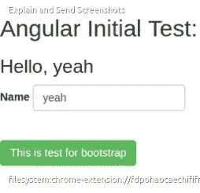

# 轨道 5，角形，Heroku，Bower，Postgres

> 原文：<https://medium.com/hackernoon/rails-5-angular-heroku-bower-postgres-c25f42864bb9>

最近，我将一个 Html 管理模板集成到了我的 rails 应用程序中。我希望它像 Rails 一样，快速、可靠、易于更新。因为我对 Rails 有点陌生，所以花了我一整天的时间。把系统做好之后，想分享给大家作为参考。

## 它是如何工作的？

基本上，我们将使用 Rails 5，Bower 用于前端依赖，Heroku 用于部署。我们将使用指向供应商/资产目录的 bower 添加我们的依赖项，然后我们将为生产预编译它们。

我们将使用 bower 进行前端依赖，git 进行版本控制，heroku 进行部署。应用程序将有角度支持，但是一旦你设置了系统，你可以很容易地添加任何依赖项，比如 React。我们还需要 heroku 工具带。

```
$ git --version
version 1.9.1$ rails -v
Rails 5.0.0.rc1$ npm -v
v2.5.1$ node -v
v0.12.0$ bower -v
1.7.9$ heroku --version
heroku-toolbelt 3.43.2
heroku-cli 5.2.9
```

我假设您已经安装了 rails 5、npm、node、git 和 heroku toolbelt，所以我从 bower 开始。

```
$ npm install -g bower
```

然后我们可以开始新的铁路项目。

```
$ rails new project --skip-turbolinks --skip-spring$ cd project
```

在我们创建了我们的项目之后，我们将它放入 cd，并为 package.json 初始化 git 存储库和 npm。通过在我们的应用程序目录中初始化 npm package.json，我们将能够告诉 heroku 执行 npm 包并安装 bower。一旦我们安装了 bower，我们就可以轻松地将我们的依赖项集成到 Rails 应用程序中。

```
$ git init$ npm init
```

在我们输入 npm init 之后，命令行会问你一些简单的问题。我认为没有必要一一解释。您可以为项目命名，并通过按 enter 键跳过其他问题。最后一步，它会问你这样可以吗？按 enter 键并创建 package.json 文件。

完成设置后，您需要看到如下所示的文件:

```
{
 “name”: “project”,
 “version”: “1.0.0”,
 “description”: “This README would normally document whatever steps are necessary to get the application up and running.”,
 “main”: “index.js”,
 “directories”: {
 “test”: “test”
 },
 “scripts”: {
 “test”: “echo \”Error: no test specified\” && exit 1"
 },
 “author”: “”,
 “license”: “ISC”
}
```

然后，我们将安装鲍尔作为我们的依赖。

```
$ npm install bower --save
```

我们添加了'— save '，因为我们希望将它保存到 package.json 文件中，而不是临时保存。一旦我们安装了带有-save 标记的 bower，我们的 package.json 文件现在应该是这样的；

```
{
 “name”: “project”,
 “version”: “1.0.0”,
 “description”: “This README would normally document whatever steps are necessary to get the application up and running.”,
 “main”: “index.js”,
 “directories”: {
 “test”: “test”
 },
 “scripts”: {
 “test”: “echo \”Error: no test specified\” && exit 1"
 },
 “author”: “”,
 “license”: “ISC”,
 “dependencies”: {
 “bower”: “^1.7.9”
 }
}
```

当我们部署到 heroku 时，首先我们的应用程序将被视为节点应用程序。它将为我们安装 bower，然后它将继续运行 ruby 应用程序。

现在我们可以初始化 bower.json 了

```
$ bower init
```

你可以再次，只需按回车键，跳过问题。一旦初始化了 bower 文件，它应该是这样的；

```
{
 “name”: “project”,
 “description”: “This README would normally document whatever steps are necessary to get the application up and running.”,
 “main”: “index.js”,
 “authors”: [
 “MrWilhelm <[batuhanwilhelm@gmail.com](mailto:batuhanwilhelm@gmail.com)>”
 ],
 “license”: “ISC”,
 “homepage”: “”,
 “ignore”: [
 “**/.*”,
 “node_modules”,
 “bower_components”,
 “vendor/assets/bower_components”,
 “test”,
 “tests”
 ],
 “dependencies”: {

 }
}
```

在将 bower 作为 npm 的依赖项安装之后，现在我们需要定制我们的 bower 安装。因为当我们安装 bower 时，它会自动将依赖项安装到“node_modules/bower”目录中。对于 rails 应用程序，我们不希望这样，因为我们希望它们安装在“供应商/资产”目录中。

我们将创造”。bowerrc "文件放在我们的应用程序的根目录下。然后我们会加上这一行；

```
{
 “directory”: “vendor/assets/bower_components”
}
```

现在 bower 可以将我们的依赖项安装到我们的 rails 应用程序中了。

接下来，我们将安装我们与 bower 的依赖关系。我们将安装“Bootstrap，Jquery，AngularJS”作为我们的依赖项。

```
$ bower install bootstrap-sass-official --save
```

我们再次添加了“— save ”,因此它将被保存到“bower.json”中。当我们想安装 bootstrap 时，它会自动为我们安装 jquery。现在我们可以安装 angular。

```
$ bower install angular --save
```

现在我们有依赖系统为我们工作。

我们将得到 rails-assets.org 的帮助，他们是这样解释的；

> Rails Assets 是 [Bundler](http://bundler.io/) 和 [Bower](http://bower.io/) 之间的无摩擦代理。
> 
> 它自动将打包的组件转换成宝石，可以很容易地放入您的资产管道并保持最新。

当我们用 bower 安装依赖项时，它会为我们创建 bower.json 文件。Rails-assets.org 将检查我们的 bower.json 文件中的依赖项，并作为 rails gem 为我们安装它们。

我们将把 rails-assets.org 作为源添加到我们的 gemfile 中，然后我们将把我们的依赖项添加到我们的 gemfile 中。

我们需要将“rails-assets-BOWER _ PACKAGE _ NAME”添加到 gemfile 中。比如说；

```
gem 'rails-assets-bootstrap-sass-official'
```

如你所见，我们只是在“rails-assets-”的末尾添加了 bower 包名。

```
source 'https://rails-assets.org' do
  gem 'rails-assets-bootstrap-sass-official'
  gem 'rails-assets-angular'
end
```

然后“捆绑安装”

```
Fetching gem metadata from [https://rails-assets.org/](https://rails-assets.org/)...
Installing rails-assets-jquery 2.2.4...
Using rails-assets-bootstrap-sass-official 3.3.6...
Using rails-assets-angular 1.5.5...
```

然后，我们可以在“application.js”和“application.css”文件中要求我们的依赖关系。

```
app/assets/javascripts/application.js //= require bootstrap
//= require angular
```

Now application.css 文件

```
app/assets/stylesheets/application.css*= require bootstrap
```

我们将创建测试控制器，这样我们就可以测试我们的依赖项是否正常工作。

```
$ rails g controller test index
```

这将为我们创建必要控制器和视图。现在我们需要编辑我们的路由文件。

```
root 'test#index'
```

现在我们有了测试页。我们将在同一页中测试引导和角度。为此，我们将使用引导网格系统按钮，这样我们可以看到引导工作。此外，我们将创建简单的角度应用程序，看看事情的工作与否。

```
views/test/index.html.erb<div class=”row”>
 <div class=”col-md-6">
 <h2>Angular Initial Test:</h2>
 <article ng-app=”test<div class="row">
  <div class="col-md-6">
    <h2>Angular Initial Test:</h2>
    <article ng-app="test">
      <header>
        <h3 ng-init="name">Hello, {{name}}</h1>
      </header>
      <section>
        <form class="form-inline">
          <div class="form-group">
            <label for="name">Name</label>
            <input class="form-control"
              type="text"
              name="name"
              placeholder="Enter your name"
              autofocus
              ng-model="name">
          </div>
        </form>
      </section>
    </article>
    <br /><br />
    <a class="btn btn-success"> This is test for bootstrap </a>
  </div>
</div>
```

现在我们有了测试视图。然后我们将初始化角度应用程序。我们将只使用一行代码。

```
app/assets/javascripts/test.jsangular.module('test', []);
```

耶！它非常有效。



现在是时候部署到 Heroku 了！

稍后我会写这部分。你也可以给我发邮件来写这篇文章，如果我错了，有错误或只是解释，任何东西。联系:batuhanwilhelm@gmail.com