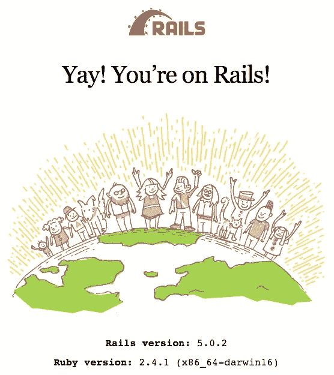

# Rails 5 Imgur 克隆教程…第 1 部分

> 原文：<https://medium.com/hackernoon/rails-5-imgur-clone-tutorial-part-1-8fa6e08d5d>


Rails 5 Imgur Clone

使用载波和 Cloudinary 无痛上传和管理图片，并部署在 Heroku 上，快速与世界分享您的照片。

大家好，今天我将向大家展示如何在 Rails 5 应用程序中轻松分享和上传图片。这是我通过浏览几个过时的教程，博客帖子和一堆文档了解到的。大多数文章都是老版本的 Rails 4，所以我把集成到 Rails 5 的步骤拼凑在一起，我目前在一些项目中使用它，并会继续使用更多。另外，在这个过程中，我们今天将通过添加所有 CRUD(创建、读取、更新、删除)功能来构建一个 imgur 克隆。

这将是一个由两部分组成的系列，解释每一个细节。本教程对初学者非常友好，也适合中级到高级用户。

> 现在，让我们开始编码，好吗？

首先，让我们在您的终端中创建一个新的 rails 项目，方法是:

> rails 新 rimgur

立即开始使用 Git 总是一种好的做法，因此，我们在这里将遵循相同的做法:

> git 初始化
> 
> git 添加。
> 
> git commit -m '项目初始化'

让我们使用这个命令启动服务器，在浏览器中测试我们的应用程序。

> rails 服务器

然后在你的浏览器里转到 *localhost:3000。你会看到这个。*



Rails default home

太好了，你的应用正在成功运行。在您喜欢的 IDE 或文本编辑器中打开项目。

现在我们要创建一个控制器。

```
rails generate controller pics
```

打开文件***pics _ controller . Rb****和一个动作 ***索引****

```
***class PicsController < ApplicationController
    def *index* end
end***
```

*在***app/views/pics/index . html . erb***中为我们的索引操作创建一个视图文件*

*打开 *index.html.erb* ，写一些类似*“Hello”*的虚拟文本*

*现在，我们将创建一个路由来显示页面。*

*转到***config/routes . Rb***写这个。*

```
***Rails**.**application**.**routes**.**draw do
    root 'pics#index'
end***
```

*好的，这一行简单的表示你正在设置*根*路径到 *pic* 控制器和*索引*动作。*

*而且你应该*“你好”或者随便你写什么。**

**现在，我们将像这样创建我们的模型。**

```
**rails generate model Pic**
```

**好了，现在我们有了一些路线和模型设置，现在我们可以开始整合我们的图像处理系统了。**

**首先，打开你的 ***Gemfile*** 然后把它们放在中间的任何地方。**

```
****gem 'carrierwave'
gem 'cloudinary'****
```

**其次，在你的终端中运行 ***bundle*** 来安装 gems，然后重启你的服务器。**

**第三，我们将像这样生成我们的图像上传程序。**

```
**rails generate uploader Image**
```

**去***app/uploaders/image _ uploader . Rb***把这个加到我们的类里面。**

```
****include Cloudinary::CarrierWave****
```

**并注释掉文件中的其他内容。重要！**

**现在，在***config/initializer***目录名***cloud inary . Rb***中创建一个新文件，然后添加这个文件。**

```
****Cloudinary**.**config do |*config*|
    *config***.**cloud_name = ENV**[**'CLOUDINARY_CLOUD_NAME'**]
    ***config***.**api_key = ENV**[**'CLOUDINARY_API_KEY'**]
    ***config***.**api_secret = ENV**[**'CLOUDINARY_API_SECRET'**]
**end**** 
```

**好吧，让我解释一下。我们正在动态安全地添加所有配置变量。我稍后会更详细地解释。**

**打开***app/models/pic . Rb***然后把这个。**

```
****class Pic < ApplicationRecord
    mount_uploader :image**, **ImageUploader
end****
```

**然后运行`rails db:migrate`来添加我们的模式。你的 ***db/schema.rb*** 应该是这样的:**

```
****create_table "pics"**, **force**: **:cascade do |*t*|
  *t***.**datetime "created_at"**, **null**: **false
  *t***.**datetime "updated_at"**, **null**: **false
end****
```

**现在我们将生成一个迁移，将我们的*图像上传器*添加到 *pic 模型中。***

```
**rails generate migration add_image_to_pic**
```

**打开你的 ***<时间戳>_ add _ image _ to _ pic . Rb***加上这个。**

```
****class AddImageToPic < ActiveRecord**::**Migration**[**5.0**]
    **def *change* add_column :pics**, **:image**, **:string
    end
end****
```

**然后运行`rails db:migrate`将其添加到我们的模式中。**

**太好了，我们的数据库部分已经完成，现在我们要将 CRUD 功能添加到我们的应用程序中。**

**这样打开你的 ***routes.rb*** 文件**

```
****resources :pics****
```

**让我们通过在您的终端中执行 ***铁路路线*** 来检查我们的路线。你应该知道所有的行动路线。**

**在你的***pics _ controller . Rb***中创建所有这样的动作方法**

```
****class PicsController < ApplicationController
  def *index* end

  def new
  end

  def *create* end

  def *edit* end

  def *show* end

  def *update* end

  def *destroy* end
end****
```

> **谢谢大家到目前为止的阅读，希望你们喜欢。在下一部分中，我们将完成我们的应用程序并将其投入使用。下次再见。**