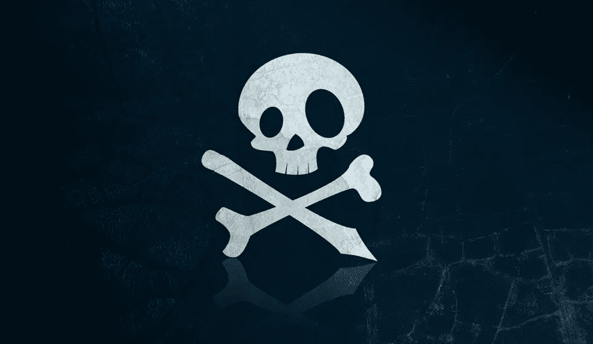

# 勒索软件网络攻击:保护计算机的 5 个步骤

> 原文：<https://medium.com/hackernoon/ransomware-cyber-attack-5-steps-to-protect-your-computer-b7b98d8a5c4b>

我们相信你现在已经听说了正在发生一场大规模的全球网络攻击。如果公司保持对微软操作系统补丁的关注，大多数攻击实际上是可以避免的。

Windows Vista、Windows 7 和 Windows 8.1 的用户可以通过在其系统上运行 [Windows Update](https://support.microsoft.com/en-us/instantanswers/c4a6d3df-d0d4-42b6-0018-ca48577f9909/update-windows-10) 来轻松保护自己免受主要感染途径的侵害。
2-进行多次频繁的[备份](http://www.pcworld.com/article/2065126/the-absurdly-simple-guide-to-backing-up-your-pc.html)(到云服务并使用物理磁盘驱动器。)
3-微软推荐运行其【Windows 版免费杀毒软件。
4-遵循基本安全协议。不要点击可疑链接或打开可疑附件。
5-千万不要下载未经官方商店验证的 app。

*最初发表于*[*SocialUnderground*](https://socialunderground.com/2017/05/ransomware-cyber-attack-5-steps-protect-computer/)*。*

> [黑客中午](http://bit.ly/Hackernoon)是黑客如何开始他们的下午。我们是 T21 家庭的一员。我们现在[接受投稿](http://bit.ly/hackernoonsubmission)并乐意[讨论广告&赞助](mailto:partners@amipublications.com)机会。
> 
> 如果你喜欢这个故事，我们推荐你阅读我们的[最新科技故事](http://bit.ly/hackernoonlatestt)和[趋势科技故事](https://hackernoon.com/trending)。直到下一次，不要把世界的现实想当然！

