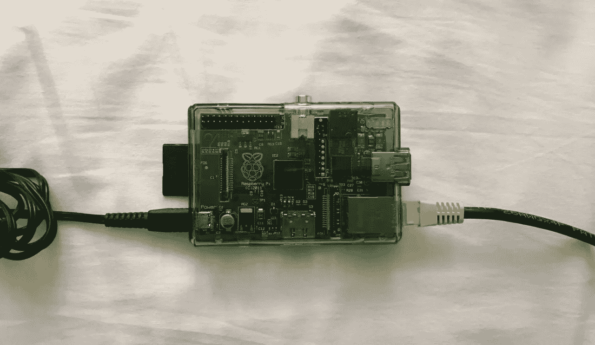
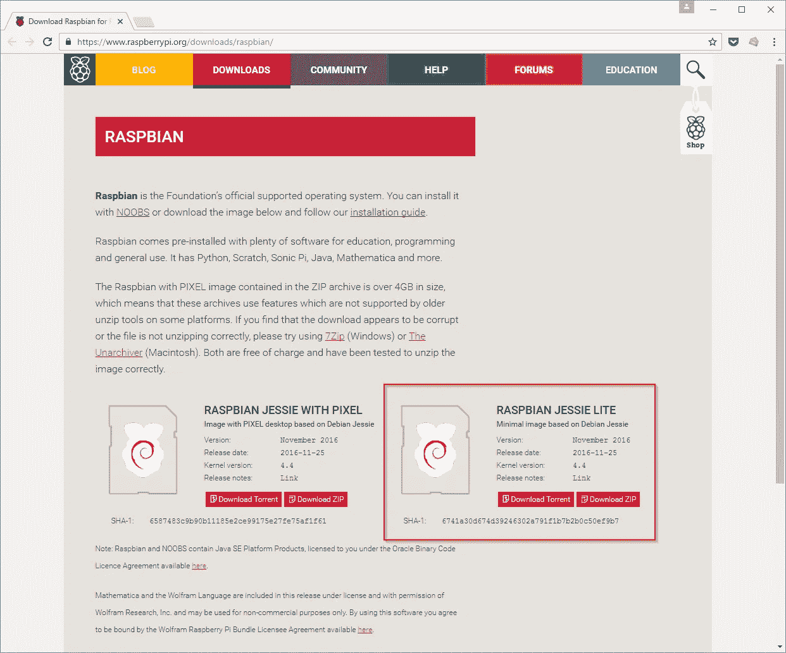
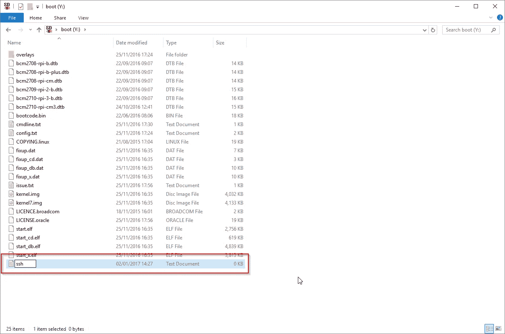
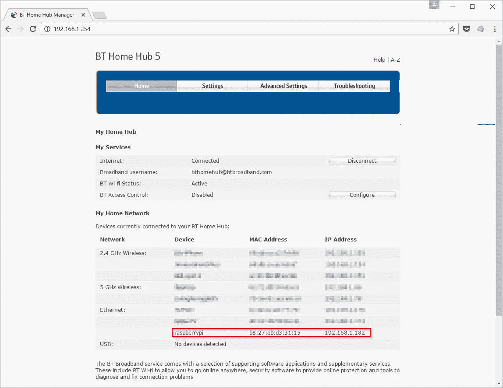
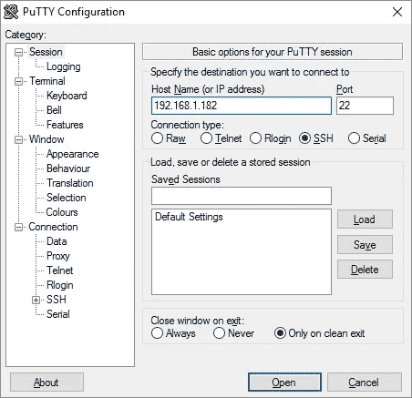
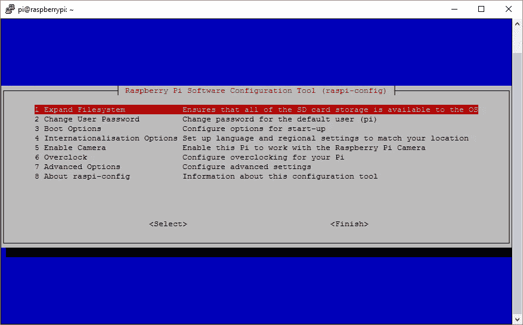

# 无头 Raspberry Pi 设置

> 原文：<https://medium.com/hackernoon/raspberry-pi-headless-install-462ccabd75d0>



没有多余的键盘或者 HDMI 线？以下是如何在你的 Pi 上安装无头 [Raspbian](https://www.raspbian.org/) 的方法。

# 第一步。下载 Raspbian 图像

前往[这里](https://www.raspberrypi.org/downloads/raspbian/)获取拉斯边图像的副本。“精简版”就可以了。



# 第二步。将图像写入 SD 卡

将图像写入 SD 卡。你可以在这里找到详细说明[。](https://www.raspberrypi.org/documentation/installation/installing-images/README.md)


# 第三步。将“SSH”文件添加到 SD 卡根目录

通过将名为“SSH”的文件(不带任何扩展名)放入 SD 卡的引导分区来启用 [SSH](https://en.wikipedia.org/wiki/Secure_Shell) :



# 第四步。启动你的 Pi

将准备好的 SD 卡、电源和网线插入 Pi。


# 第五步。找到你的 Pi 的 IP 地址

要配置您的 Pi，您需要 IP 地址。您可以在路由器的 DHCP 租约分配表中找到它:



# 第六步。嘘进入你的 Pi

使用您最喜欢的 SSH 客户端(我更喜欢 [PuTTY](http://www.putty.org/) )来访问 Pi。默认凭据是:

```
username: pi
password: raspberry
```



# 第七步。配置您的 Pi

就是这样！您现在可以通过`sudo raspi-config`来[配置您的 Pi](https://www.raspberrypi.org/documentation/configuration/raspi-config.md)



最初发表于[jamesfmackenzie.com](http://www.jamesfmackenzie.com/2017/01/02/raspberry-pi-headless-rasbian-install/)

[](http://bit.ly/HackernoonFB)[](https://goo.gl/k7XYbx)[](https://goo.gl/4ofytp)

> [黑客中午](http://bit.ly/Hackernoon)是黑客如何开始他们的下午。我们是阿妹家庭的一员。我们现在[接受投稿](http://bit.ly/hackernoonsubmission)并乐意[讨论广告&赞助](mailto:partners@amipublications.com)机会。
> 
> 如果你喜欢这个故事，我们推荐你阅读我们的[最新科技故事](http://bit.ly/hackernoonlatestt)和[趋势科技故事](https://hackernoon.com/trending)。直到下一次，不要把世界的现实想当然！

