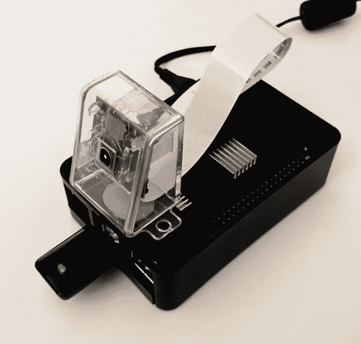
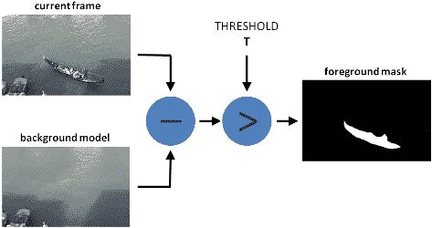
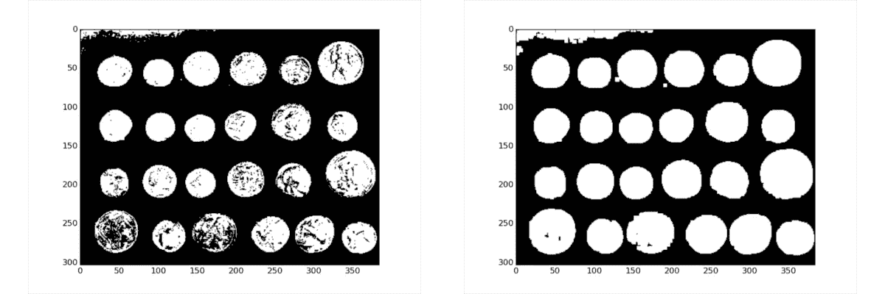
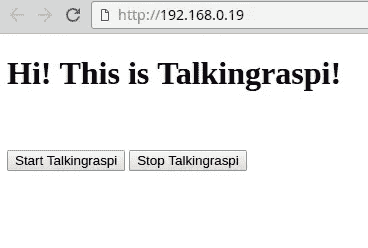
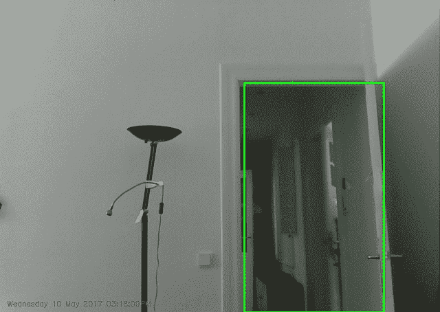

# RaspberryPi 家庭监控，只有大约 150 行 Python 代码。

> 原文：<https://medium.com/hackernoon/raspberrypi-home-surveillance-with-only-150-lines-of-python-code-2701bd0373c9>

很久以前我有一个树莓派，它就放在我的技术清洗箱里。在看了 Youtube 上一段充满创意的覆盆子应用程序后，带着羡慕，我决定自己尝试一下。第一个显而易见的想法，我是一个家庭安全系统，检查你的房子，而你不在。

最后一个东西能够通过摄像机检测和粗略定位任何运动。它会拍照并把照片发到你的邮箱里。此外，我们能够在本地网络中使用简单的 web 界面与它进行交互，因此我们能够在家门口激活或停用它。我假设，如果有人能够到达本地 wifi 网络，那么他/她很可能是我们中的一员(够公平吧？).

This is the final look of my raspi.

对于本文的其余部分，我试图总结重要的实现细节。希望你会觉得有趣。也可以直接去 [**Github**](https://github.com/erogol/RaspiSecurity) 查看执行情况。

从硬件开始。你需要这个项目:

*   [树莓 Pi 2 B+](https://www.amazon.com/gp/product/B01CD5VC92?ie=UTF8&tag=erogol-20&camp=1789&linkCode=xm2&creativeASIN=B01CD5VC92) (其他版本也可以)
*   [树莓相机](https://www.amazon.com/gp/product/B012V1HEP4?ie=UTF8&tag=erogol-20&camp=1789&linkCode=xm2&creativeASIN=B012V1HEP4)和一个相机外壳(或称创意外壳)
*   [Wifi 加密狗](https://www.amazon.com/gp/product/B06Y5MX9Q8?ie=UTF8&tag=erogol-20&camp=1789&linkCode=xm2&creativeASIN=B06Y5MX9Q8)(不需要 Pi 3)
*   [覆盆子盒](https://www.amazon.com/gp/product/B01CDVSBPO?ie=UTF8&tag=erogol-20&camp=1789&linkCode=xm2&creativeASIN=B01CDVSBPO)(可选)

我们需要安装相关的 Python 库。它们都符合“pip 安装”的条件

*   **PiCamera** :用于从 Raspi 相机中取帧
*   **cv2** :全智能计算机视觉算法
*   **smtplib** :发送邮件
*   **电子邮件:**格式化邮件数据
*   **烧瓶**:简单的开/关安全网站

# 运动检测

开始编码吧！我们需要做的第一件事是像老板一样导入我们的库！然后初始化 raspi camera，使其准备好传输帧。

我们喜欢检测每一帧的运动，但我们也喜欢忽略错误的警报。因此；我们计算连续检测的数量，如果它大于一个给定的值，我们真的报警；否则我们就无视。此外，在开始运行之前，我们给系统一些时间来进行自我调整。

作为下一步，我们开始通过帧循环，并运行背景减除算法。具体而言，我们应用以下操作来检测运动；

*   将帧转换为灰度
*   模糊帧以减少帧细节。
*   计算帧和平均背景帧的差异。
*   用加权移动平均更新平均背景帧。

This is a overall scheme of background subtraction. We only use average frame for background model but there are many smarter algorithms for more robust modelling. However, in Raspi faster is better

以上步骤给了我们一个像素变化的遮罩。这还不够。在继续之前，我们需要更多的调整来减少噪音，填补漏洞和收集指示移动部分的轮廓。走得更远；

*   阈值差异帧降噪。
*   用于填孔扩张门槛框架。
*   查找轮廓
*   找到轮廓周围的边界框来定位运动。

Effect of dilation

在所有这些老派算法阶段之后，我们检测运动。现在是实现警报系统逻辑的时候了。我们首先检查连续运动检测的数量。如果计数高于阈值，我们会发送一封邮件，其中包含在特定时间间隔内拍摄的快照。这里，我们喜欢用合理数量的帧快照捕捉各种视图。

# 发送电子邮件

使用 Python 时，做事情总是很容易，发送电子邮件也是如此。最初，我们需要租用一个电子邮件地址(我租用了一个 gmail 地址)。然后，我们只需使用下面的代码发送一封包含我们需要的所有内容的电子邮件。棘手的部分是在附加到电子邮件之前将帧转换成正确的数据格式。

# 网站(全球资讯网的主机站)

该项目的最后一部分是创建一个网站，可从本地网络，用于启用和禁用安全系统。为此，我们使用 Flask framework，它是世界上最简单的 web 服务器框架。

现在，我们需要用 jQuery 支持的基本 html 代码创建一个漂亮的登录页面，以便向我们的服务器发送 on/off ajax 请求并更新系统状态。我们对此进行编码，并将其放入项目根文件夹中名为“templates”的文件夹中。这是烧瓶 html 内容的默认位置。

Screenshot of system interface

# 可能的改进

通过更好的算法处理，某些人可能会有更健壮的检测结果。也许是一个更强大的背景建模，更多的图像处理步骤或更好的算法参数。

您也可以使用 powerbank 移动相同的系统。我试过我的 10000 mAh Anker powerbank，它可以让系统运行 15 个小时。如果你喜欢在无插头的地方使用，这足够用一天了。

一个简单的改进是在黑暗的地方使用红外摄像机。我上面分享的设备有一个简单的黑暗盲相机，但我最近开始使用红外版本。真的很好用。

# 最后的话

我们完成了，可以走了！这里我也分享一下我的 [**Github 回购**](https://github.com/erogol/RaspiSecurity) 。请随意评论和投稿。

希望你的房子永远不需要监控系统。但是如果你还需要一个便宜的，这里我给你一个。如果你懒于实施所有这些【(erengolge@gmail.com】联系我，让我给你安排一些事情。祝你好运！

在离开我的星球大战的收银台之前。

Catching up my wife in a false alarm !! GIF of mailed images

> [黑客中午](http://bit.ly/Hackernoon)是黑客如何开始他们的下午。我们是 [@AMI](http://bit.ly/atAMIatAMI) 家庭的一员。我们现在[接受投稿](http://bit.ly/hackernoonsubmission)并乐意[讨论广告&赞助](mailto:partners@amipublications.com)机会。
> 
> 如果你喜欢这个故事，我们推荐你阅读我们的[最新科技故事](http://bit.ly/hackernoonlatestt)和[趋势科技故事](https://hackernoon.com/trending)。直到下一次，不要把世界的现实想当然！

