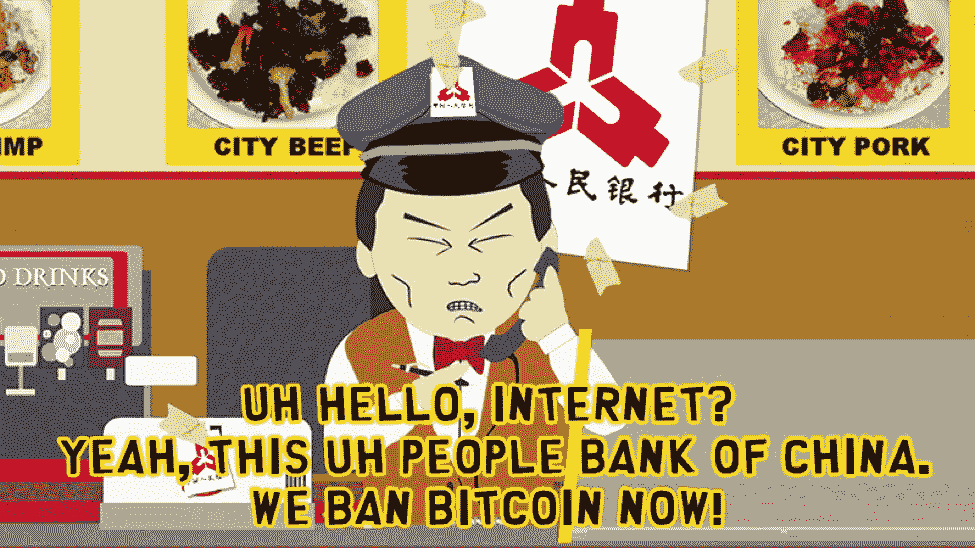
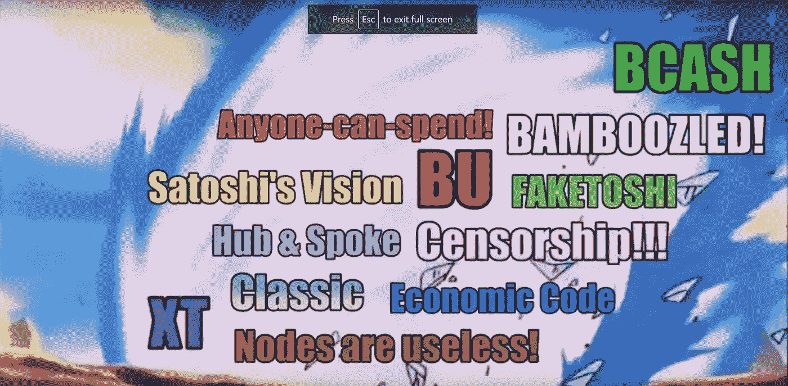
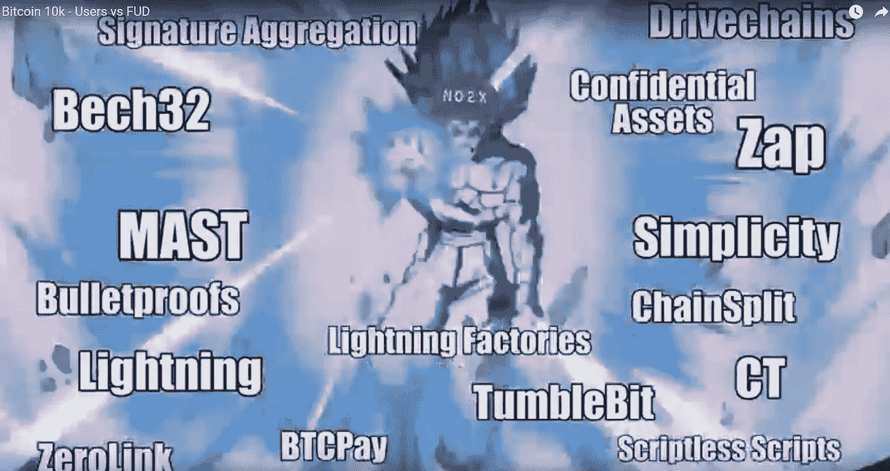

# 将 2017 年比特币价格涨势合理化至 1 万美元

> 原文：<https://medium.com/hackernoon/rationalizing-the-2017-bitcoin-price-rally-to-10-000-16e30a1320ee>

**编辑:** DBZ 图片取自视频:[比特币 10k——用户 vs FUD](https://www.youtube.com/watch?v=BgQUuoYHrI0) 。

**不要买比特币，因为它会崩溃。**不过，我不会卖。在可预见的未来，我会全力以赴，因为它正在改变世界。我可以忍受一夜之间无家可归。如果你也一样，你可以不理会我的第一个建议。

# 又到 2013 年了

2013 年，在最近一次比特币上涨期间，比特币的价格从 200 美元涨到了 1000 美元以上。然后它就坠毁了。多年来，价格一直保持在 200 至 300 美元左右。

注意我写的是“它崩溃了”，而不是“它崩溃了”和“它被压住了”，而不是“它压住了”？这就是我的文章要讲的。

# 2014 年—市场崩盘

通常，当一种商品的价格突然飙升至月球时，一些负面事件会促使其回落至地球。这对比特币来说没有什么不同。先是中国第一次禁止比特币，然后 MtGox 崩溃。

我很好奇，在没有重大负面因素的情况下，这波反弹会持续多久。

# 2014 年至 2016 年:停滞

接下来的几年，比特币的价格尝试了一些微弱的波动，但新的问题出现了。缩放问题。显然，这个问题对开发商来说并不新鲜，但对市场来说却是新鲜事。问题出现的方式绝对是最灾难性的。它引起了人们对开发商在地块大小问题上的内讧的关注。经济学家、首席执行官和其他主流比特币创造者加入了这场斗争，当开发者达成共识时，主流人群已经情绪化地投入到一方或另一方，只有社区分裂的正式化才能部分解决这种内讧。

话虽如此，但在此期间，比特币交易所、暗网市场和混合器如雨后春笋般涌现。问题的答案:“你的交易所要退出骗局吗？”不是如果，而是何时。

# 2016 年:物价上涨

大约一两年前，价格开始慢慢上涨。什么？真的吗？我们有所有这些问题，我们还没有准备好成为主流，你现在敢起来吗，混蛋！但确实如此。它不再保持低位。人们想要比特币，事实就是如此。

2013 年的涨势被外部因素摧毁，价格被内部内讧压低多年，而坏消息没有停止，比特币的未来方向仍不明朗，普遍的负面情绪无法保持价格的下行压力。

# 2017 年:月球拍摄

BCH 出生了，隔离证人被激活，2X 叉子被召回。但它真正的意思是:比特币未来方向的不确定性消失了。

当然，内讧并没有消失，但这不是重点。让我告诉你一些需要思考的事情:在足球比赛中，如果所有 11 名球员都致力于此，那么一个糟糕的策略比 11 个每个球员都遵循自己的好策略要优越得多。

简而言之，事情就是这样。我们找到了我们的战略，并致力于此，任何不想参与的人都向 BCH 投降，外部世界感觉到了情绪的变化，并给了我们一个登月计划。

# 结论

这可能是我们现在价格为 11000 美元的原因，但也有可能[人们只是想看到有人吃他的鸡巴](https://redd.it/7g9jpo)。

**更新:** [他果然吃了自己的鸡巴。请三思而后行。很血腥。](https://streamable.com/svn6e)