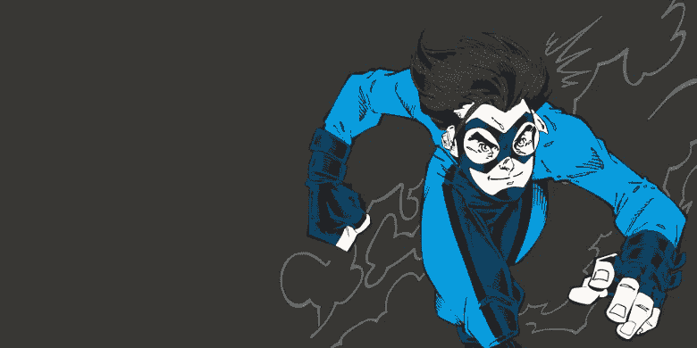

# RCC 2017:全世界编码人的新挑战

> 原文：<https://medium.com/hackernoon/rcc-2017-new-challenge-for-coders-all-over-the-world-e98d57411866>

昨天约翰在他的手机上下载了一个新游戏……—这篇课文看起来像是小学问题书中的一个任务。但是不是每个学生都能解决这个问题。这是 2016 年俄罗斯代码杯决赛任务的开始。RCC 是国际竞争最大的[编程](https://hackernoon.com/tagged/programming)锦标赛。

竞赛成员应该了解杰克下载的神秘游戏的规则。他们需要创建完美游戏的算法，并将其转化为代码。真正的运动开始了:成员们对他们的程序有时间和记忆的限制。每次他们送一个错误的解决方案，他们得到一个罚款。比别人更快解决最多问题的程序员成为最优秀的。

在竞争性编程竞赛决赛上有许多伟大的程序员，同时冠军的第一步对每个人开放。这是一个让你的大脑工作更快的好方法。

# 谁需要使用竞争性编程技能？

关于这个问题有很多争议。一方面，真正的开发人员以团队的形式开发项目。他们必须以清晰的方式编写代码，以便团队的其他成员能够理解。在竞争性编程中，时间是有限的，所以你需要快速编码。这对你的代码的清晰是有害的。

另一方面，你需要牺牲代码的效率来使它清晰。在竞争性编程中，这是不可能的。以最大效率编码的能力在开发高负载系统时很有用。这个系统中的一个模块即使是很小的错误，也会因为使用这个部件百万次而造成很大的麻烦。

无论如何，竞争是有益的。这是研究算法的好方法——竞争性编程任务解决方案的基础部分。如果你能在有压力的情况下快速做出决定——你将在竞争性和开发性编程中表现出色。

# 为什么参加锦标赛是个好主意？

对于没有任何工作经验的学生来说，像俄罗斯代码杯这样的锦标赛是一个很好的机会来看看他们是什么。他们能找到自己知识的薄弱面，努力学习。参加这样的活动对雇主来说也是很好的推荐。

最强大的程序员可以在决赛中获得奖金。RCC 是唯一一个有如此巨额奖金的锦标赛。前 25 名程序员可以获得！第一名有 15 万卢布(约 2500 美元)的奖励，第二名 10 万卢布，第三名 6.5 万卢布。从第 4 位到第 10 位的每个程序员可以得到 30 000 rub，从第 11 位到第 25 位的每个程序员可以得到 15 000 rub。

每个冠军成员都可以获得一份难忘的奖品。淘汰赛的每个用户都将获得一个特殊的证书，其中前 200 名将获得 RCC 的一件酷 t 恤。

# 如何训练和尝试自己的技能？

如果你想在锦标赛上取得好成绩，你需要做好准备。训练竞争性编程技能的最好方法是解决以前锦标赛中的实际问题。你可以在[codeforces.com](http://codeforces.com/?locale=en)上找到很多来自真实比赛的任务。有一个特殊的回合，你可以在有限的时间内尝试编码。

# 登记

第一轮资格赛将在 4 月 2 日举行。如果你那天不在线，在 4 月 16 日或 29 日试试吧。在 russiancodecup.ru/en 的[上找到更多。祝你好运！](http://russiancodecup.ru/en)

> [黑客中午](http://bit.ly/Hackernoon)是黑客如何开始他们的下午。我们是 [@AMI](http://bit.ly/atAMIatAMI) 家庭的一员。我们现在[接受投稿](http://bit.ly/hackernoonsubmission)并乐意[讨论广告&赞助](mailto:partners@amipublications.com)机会。
> 
> 如果你喜欢这个故事，我们推荐你阅读我们的[最新科技故事](http://bit.ly/hackernoonlatestt)和[趋势科技故事](https://hackernoon.com/trending)。直到下一次，不要把世界的现实想当然！

