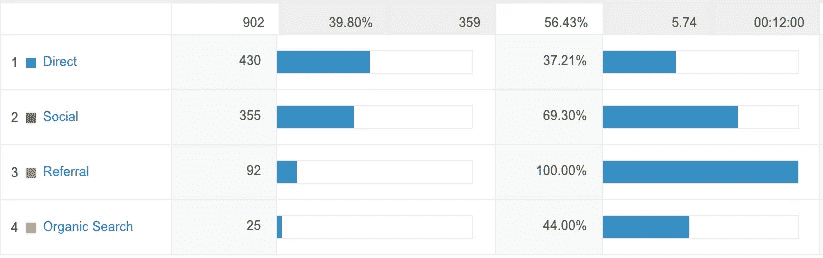
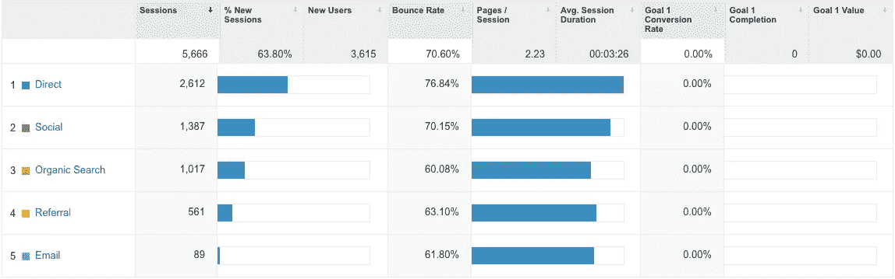
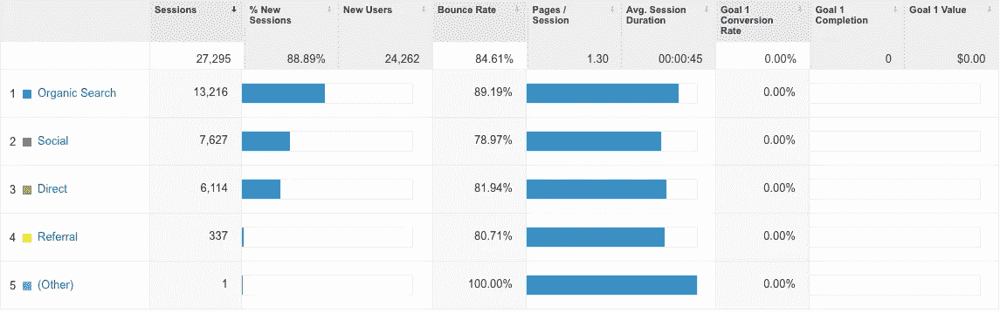
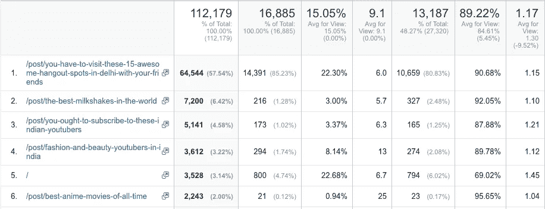

# 仅用一篇博客文章就能在 3 个月内获得 0 到 13k 的搜索流量。

> 原文：<https://medium.com/hackernoon/reaching-0-to-13k-search-traffic-with-just-one-blog-post-in-3-months-818a04959958>

当我加入 InstaLively 时，它还是一家初创公司。我是第一个加入的营销人员，坦白地说，我没有太多的经验。摆在我面前的挑战很简单，但也很严峻。

*   想办法快速获得牵引力。
*   让更多的人注册测试版。
*   针对某些关键词对网站进行排名。

前两个非常直接，因为它们遵循了行业中每个数字营销人员遵循的最佳实践。我在社交媒体上发帖，在 Quora 上发帖询问，最后单独联系一些人，然后用登陆页面关闭他们。给网站排名更加困难，因为我完全没有预算。

没错，我没有预算，没有现成的网络可以利用，也没有什么实践经验。

This is how it looked on the day of joining.

现在，网站的许多流量是直接的，也就是说，它来自于口头传播。对于一家仍在运营第一个月的公司来说，社交网站也给了我们可观的流量。

This is how it looked after completion of a month

当我开始完成所有的日常 DM 杂务时，我注意到所有频道的流量都在稳步增长。这仍然不够。这是一个稳定的增长，而我所寻求的是更具指数性的东西。我开始寻找更多的方法来获得网站的流量。必须有一个更有效的用户漏斗，这将有助于我在网站上获得更多的人。

This is how it looked in 3 months

我们终于在 3 个月的工作中实现了这一目标。这是怎么发生的？所有这些都是通过投入**绝对 0 投资完成的。你需要的只是一个好的起点，当然还有一点运气。我们是这样做的:**

**博客-** InstaLively 是一款专注于生活方式的流媒体直播应用。我们瞄准了生活方式细分市场，开始创建 SEO 优化的帖子，这些帖子慢慢地但肯定地开始加快步伐。在这个过程中，我们终于在“德里的去处”上发了一篇博文。这篇帖子在发布的第一个月就获得了 3000 多条分享和超过 10000 次阅读。注意到人们对这件作品的兴趣，我优化了它的“德里的去处”，并耐心地等待了几个星期。

This data is over the span of 13 days

这个帖子开始获得疯狂的流量，最终像病毒一样传播开来，成为网站稳定的流量来源。正如你所看到的，其他博客虽然没有第一个做得好，但仍然做得很稳定。

社交- 社交是一块难啃的骨头，因为作为一家流媒体直播公司，我们很难让内容与社交媒体的异步本质保持一致。然而，我们制定了以下计划，帮助我们获得了巨大的吸引力，同时也帮助 InstaLively 成为目标市场中的知名品牌

*   一天一个关于当地新闻的视频，以自拍风格采访。
*   一个 Gif 格式的日历，显示应用程序上一天发生的特殊流。
*   每日视频的一个主题可以是技术、时尚、教育等。&
*   该应用程序中的一条视频在脸书上获得了分享。

这帮助我们在社交类别中实现了预期的数字，并获得了巨大的牵引力。

然而，你可能会问它是如何帮助我们获得应用程序的下载量的。不过这是另一个博客的话题了。我将在下一篇博客中详细介绍 ASO 和 blog 如何帮助我每月获得 20k 的下载量，而没有任何成本。

在这里向我伸出手。

> [黑客中午](http://bit.ly/Hackernoon)是黑客如何开始他们的下午。我们是 [@AMI](http://bit.ly/atAMIatAMI) 家庭的一员。我们现在[接受投稿](http://bit.ly/hackernoonsubmission)并乐意[讨论广告&赞助](mailto:partners@amipublications.com)机会。
> 
> 如果你喜欢这个故事，我们推荐你阅读我们的[最新科技故事](http://bit.ly/hackernoonlatestt)和[趋势科技故事](https://hackernoon.com/trending)。直到下一次，不要把世界的现实想当然！

