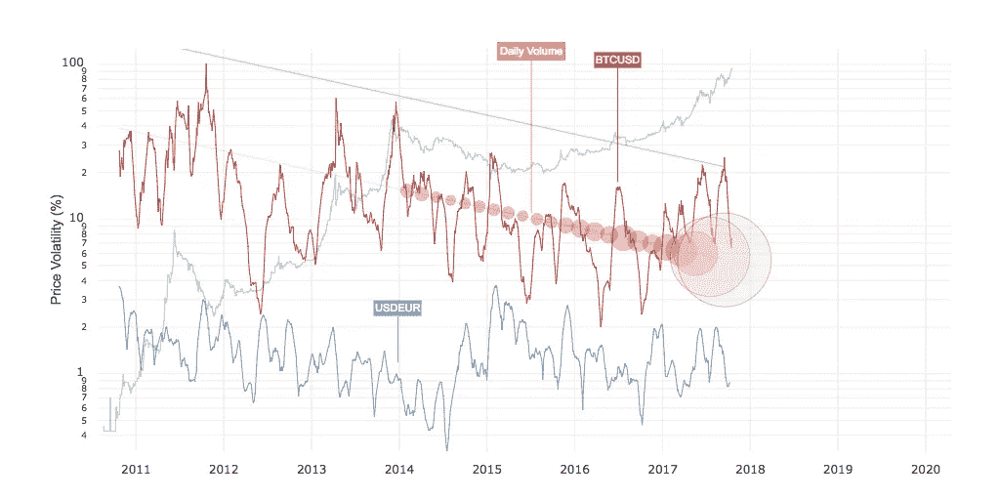
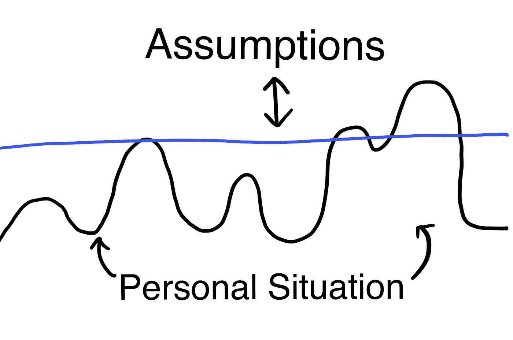

# 到达加密货币奇点

> 原文：<https://medium.com/hackernoon/reaching-the-cryptocurrency-singularity-c09c8f1940c1>

一个月前，我写了一篇名为 [*的博文，在博文中我介绍了这个被称为加密货币奇点*](/@ramontayag/the-cryptocurrency-singularity-7e37ae4aa4) *的想法。这篇文章变得比我预期的更受欢迎，我有机会从许多聪明人那里获得信息。*

*这篇文章介绍了相同的主题，但是更详细地介绍了我们将如何达到这个奇点。它是以一种读者不需要参考原文的方式写的。我决定写另一个版本，用更新的数据更清晰地组织我的想法，并解决读者提出的不同异议。*

A scene from [Ex Machina](http://www.imdb.com/title/tt0470752/).

人工智能奇点描述了未来的一个点，即我们最终创造出一台比我们更聪明的机器。当有比我们更聪明的机器时，它能够创造出比自己更聪明的机器。仅仅凭借速度，因为这些机器的运行速度比我们人类快数百万倍，我们将有一个智能爆炸——这个过程将远离我们。

加密货币奇点描述了未来某一时刻，加密货币或其子集将成为比法定货币更好的价值储存手段。当加密货币成为更好的价值储存手段时，大量资金将流入加密货币，增加法定货币的供应。当足够多的法定货币被加密货币取代时，一个恶性(或良性)循环就开始了。由于通货膨胀，法定货币的价值将下降，促使更多的人将他们的钱转换成加密货币。

这是一个很大的声明。然而，我们一直看到这种行为。当人们在网络之间移动时，会出现一个临界点，足够多的人移动，人们的移动会像滚雪球一样。

想想 myspace 和脸书。或者，也许是一个更好的例子:美国公用事业行业对太阳能电池板如何摧毁美国公用事业的评估。其要点是，越多的人使用离网产生的太阳能，对其余不自己发电的客户来说，成本就越贵。随着成本变得越来越高，他们被迫跳槽，进一步加剧了恶性(或良性)循环。

这种人类行为感觉很直观。毕竟，当一个网络变得越来越不值钱时，为什么还要留在这个网络中呢？

说到钱，你可以问:谁不想把他们的钱变成一种不会随着时间流逝而贬值的形式呢？在真实、古老的金属硬币世界中也可以看到足够相似的东西，但是是在不同的环境中。它甚至有一个名字——格雷欣定律。我见过的最好的例子是古希腊人的例子。

# 雅典的通货膨胀

公元前 400 年左右，雅典人失去了对银矿的控制。斯巴达人接管了这里。这对雅典人来说是个问题，因为他们用这些银铸造硬币来支付士兵和政府工作人员的工资。他们没有放弃，而是将手中的银币熔化，用这些银币镀上铜币。

[Ancient Athenian coins](https://commons.wikimedia.org/wiki/File:001-athens-dekadrachm-1.jpg).

将这些硬币印上相同的面值，他们以此作为对士兵和雇员的支付。当这些钱在经济中流通时，人们注意到一些比另一些轻。经过更仔细的观察，他们发现那些较轻的盒子镀了一层薄薄的银，而不是纯银。

到了赶集日，他们自然会扔掉较轻的硬币，而把纯银的放在口袋里。随着这种社会行为的继续，实心银币在野外会越来越少，因为铜币仍在流通。因为银币变得越来越稀有，它们的价格相对于铜币上涨——顺便说一下，雅典政府继续通货膨胀，因为他们有账单要付。

[Bazar of Athens](https://upload.wikimedia.org/wikipedia/commons/7/75/Bazar_of_Athens.jpg)

将格雷欣定律应用到这个场景中，实心银币就是“良币”，铜币就是“[劣币](https://hackernoon.com/tagged/bad-money)”。

> ***格雷欣法则*** *是陈述“劣币驱逐良币”的货币原理——*[*布列塔尼卡*](https://www.britannica.com/topic/Greshams-law)

格雷欣法则用于描述两种面值相同但商品价值不同的硬币。虽然我们今天不再使用金属硬币，但你仍然可以通过回答这个简单的问题来看到法律的效果:

如果你一手拿着购买力逐年下降 5%的货币 A，另一手拿着购买力保持不变的货币 B，你会花多少钱去买下一杯咖啡？

现在，用您的政府货币替换“货币 A ”,用加密货币替换“货币 B”。

你可能已经猜到了，在比较加密货币和法定货币时，我会将它们与格雷欣法则联系起来。这种联系在表面上并不明显，因为对大多数人来说，这两种货币在功能上差别太大。但是，当某些特质被人接受的时候，就足够有可比性了。到那时，将他们的钱转换成更耐用的形式将是合理的。

如果你怀疑这个奇点是否会到达，那么你可能会怀疑至少下面的一个假设:

1.  加密货币的波动性将持续下降，直到它变得像主要法定货币一样稳定
2.  技术社区将继续提高加密货币的每秒交易限制
3.  可用性将会持续改进
4.  在加密货币之间兑换法币将变得越来越容易

# 假设

随着这些假设继续为真，它们在对格雷欣法则至关重要的方面变得越来越相似。将会有一个点，差异是如此之小，以至于它们将相当于一只手拿着实心银币，另一只手拿着镀银的铜币。

## 波动性

我们有像比特币这样的加密货币，但为什么大多数人没有将他们的财富转移到这种形式，即使价格疯狂上涨？

作为习惯动物，我们是享受可预测性的动物。只有少数人能接受自己的净资产每天都在波动。只有少数人愿意用一周前价值两倍的货币支付账单。

这是今天大多数人的感觉，但让我们向前看。关于比特币波动的未来，这些数据显示了什么？

[Chart from woobull.com](http://charts.woobull.com/bitcoin-volatility/).

很明显，趋势是向下的，如果这种情况继续下去，BTCUSD 的波动性将在大约 10 年内与 USDNZD 的波动性相当。

我用美元来比较波动性，因为美元是世界储备货币。当比特币达到这些稳定水平时，单就波动性而言，大众开始将他们的钱转移到比特币是有意义的。

要知道这里没有时间限制。没有“太久”。<insert your="" favorite="" cryptocurrency="">可能需要 50 年才能到达那里。</insert>

## 可量测性

如果你和我一样，你不会想等几个小时甚至几天(T4)来付电费。如果网络不能满足我们的需求，那么你可能总是不得不以一种更容易获得的形式保留一大笔钱——口袋里的现金。

如果一个人主要将加密货币用作财富储存，并在需要花费时转换为法定货币，那么我们将看到交易量的显著增加。作为“不可扩展”的网络，这将是一个问题。

对于比特币，已经有很多关于规模的工作(也有很多争论)。比特币的一些例子有闪电网络、SegWit 和 bigger blocks。答案可能是这些东西中的一个，一个组合，[分类账互联网](https://interledger.org/)，或者其他还没有被发明出来的生活在这些之上的东西。

无论解决方案是什么，请记住，技术社区已经能够将互联网扩展到今天的样子。它过去不能处理像网飞这样的事情。

## 可用性

让我们面对现实吧:越难用的东西，人们越不愿意用。

加密货币现在还不是最容易使用的，但它们肯定比几年前更容易使用。

你有像 [Copay](http://copay.io) 这样的钱包，可以很容易地创建多签名钱包，任何有智能手机的人都可以免费下载和使用。在更安全的路线上，你有像[莱杰](https://www.ledgerwallet.com/)和[特雷佐](https://trezor.io/)这样的钱包。它们是硬件钱包，可与一些银行分发的[钱包相媲美](https://en.wikipedia.org/wiki/Security_token)。这使得远程攻击者几乎不可能窃取您的加密货币。当然，如果坏人在你旁边，还有一个老办法，就是用扳手打你，直到你说出密码。公平地说，法定货币也存在这个问题。

几乎毫无疑问，我们将看到加密货币的可用性不断提高，就像我们一直看到的那样。

## Fiat x 加密货币

加密货币与法定货币之间的交换越困难，人们就越不可能这么做。

由于对加密货币作为投资工具的兴趣，人们兑换加密货币的途径数量有所增加。现在有了新的交易所，人们对像 localbitcoins.com 这样的点对点市场更感兴趣。

我们可能有更多的方式来交换加密货币，但政府不会为此做点什么吗？只有少数几个政府似乎正在采取激烈的措施来完全禁止加密货币。其余的人似乎要么知道他们可能会像禁止 BitTorrent 一样成功，要么不想错过围绕这项新技术的创新。

# 地形图

在上面，我用了“点”这个词，好像它对每个人都一样。事实上，人们开始将财富转移到加密货币的起点不同。

People are distributed throughout the landscape of peaks and valleys, depending on their personal situation: what their main fiat currency is, how technically knowledgable they are, etc. People move to cryptocurrencies when they hit the blue line. This line goes up and down depending on the assumptions listed above.

我们每个人都有要移动的点。主要的决定因素是我们住在哪里，因为这决定了我们使用什么货币。一个人移动的理由越多，他在顶峰的位置就越高。我上面列出的假设越是正确，他们就越需要在一个更低的峰值上有更好的理由去移动。

让我们举一些真实世界的例子:

*   委内瑞拉人民正处于一个高峰，因为他们的货币不仅非常不稳定，而且通货膨胀率也很高。
*   瑞士的人们很可能在一个山谷里。
*   拥有技术知识并在委内瑞拉的人很可能已经采取了行动。
*   当另一场全球经济危机爆发时，将会有一些重大的板块构造运动将所有人推高。

向加密货币的转变并不是一个要么全有要么全无的事件。人的国家会比其他国家先采取行动。此外，他们也不必转移所有的钱，他们可以转移一部分存款。如果世界上 20%的人将他们 20%的资金转移到这种形式，这是否足以使其余的法定货币膨胀，甚至是稳定的货币，将人们推上货币景观的顶峰？

# 离别的思绪

## 展望

我看到的对这个想法的许多批评都集中在此时此地。我敦促你提前思考，因为这就是这篇论文的主题:如果趋势继续，未来会怎样。

波动率在下降吗？与以前相比，您现在可以发送更多的交易吗？加密货币变得更容易使用了吗？与几年前相比，它们是否更易于使用？他们现在比四年前更容易保持安全吗？

## 政府会提供更好的东西吗？

Central Bank Coin ;)

显然，有影响力的头头们并没有忽视加密货币。然而，无论央行发行什么样的硬币，都会像我们今天拥有的货币一样——引发通货膨胀。我对此表示欢迎。由于其可编程的特性，这些不仅有助于解决偏远地区人民的现金分配问题，它们的存在还将使通货紧缩加密货币的兑换更加容易。

## 政府会禁止吗？

我认为，要让任何政府禁令发挥作用，他们需要采取一致行动。鉴于气候变化谈判的进展，我非常怀疑这种情况会发生。

假设一些人禁止了加密货币，并且有效地禁止了加密货币，他们将失去让他们的公民成为这场加密货币土地争夺战的一部分的机会。最终，他们将手里握着一袋袋毫无价值的现金，而世界其它地区并不想要这些钱。

## 重大社会变革

如此巨大的变化，如果社会没有准备好，很可能会取代那些最后搬家的人，因为这将取代我们赖以维持相对稳定生活的系统。我不知道那会不会比今天更好——毕竟，世界上有一半的人不在我们受益的这个金融体系中。

无论使用通缩货币对整个社会来说是否更好，我认为这不会对这一举措产生影响。你会因为对社会有益而期望人们不把他们的钱转换成更好地储存其价值的形式吗？

## 古希腊课程

阿里斯托芬，对他看到的他们的货币正在经历的通货膨胀做出反应，在*青蛙*中写道:

> 就标准而言，古钱币是极好的；他们肯定是最好的钱；只有他们被击中，给一个纯粹的戒指；他们到处获得货币，在希腊和陌生的土地；然而，我们没有使用它们，而是喜欢那些最近发行的坏铜币，受到了如此糟糕的打击。

如果他今天还活着，我想知道他会不会在键盘上敲这个:

> *加密硬币在标准方面是优秀的；他们肯定是最好的钱；只有它们在数学上是安全的，而且旅行时没有重量；他们到处获得货币，在这里和陌生的土地；我们很好地利用了它们，避免了那些糟糕的、不小心打印出来的纸片。*

## 进一步讨论

我发现很难在媒体上进行讨论——在 Twitter 上发 Tweet 或 DM me，而不是 [@rtayag](http://twitter.com/rtayag) 。