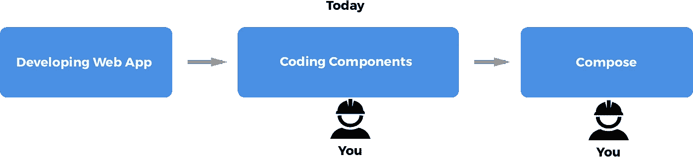
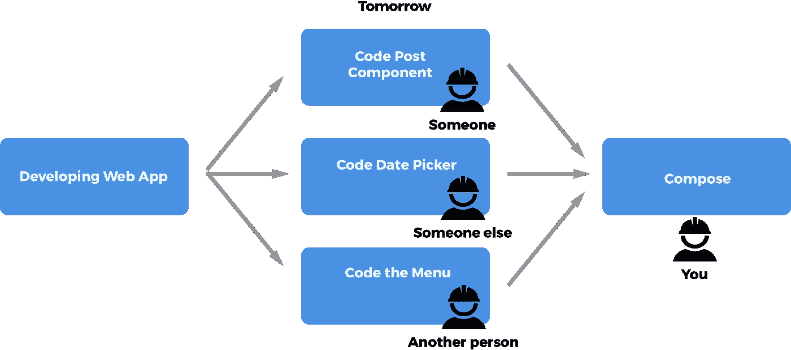

# 反应和神话人月

> 原文：<https://medium.com/hackernoon/react-and-the-mythical-man-month-5ac12ba91f34>

## 基于组件的开发与棉花采摘

> 关于 React 如何揭开神秘人月的神秘面纱，并通过分布式工程师网络使前端开发更容易，就像摘棉花一样。

## 神话中的人月

神话中的人月是弗雷德·布鲁克斯写的一篇文章。在这篇文章中，Fred 写了软件开发项目计划的困难和他们的时间估计。明确说明一个项目需要 X 个人月的时间，因此分配给它的工程师越多，完成的速度就越快。例如，估计一个项目需要 9 个月的时间，那么指派一个 9 人的工程师团队将导致项目在 1 个月内交付。当然，在现实中，这与事实相去甚远。

> "..以人月作为衡量工作规模的单位是一个危险且具有欺骗性的神话。这意味着人和月是可以互换的。只有当一项任务可以在许多工人之间没有交流的情况下分配时，人和月才是可互换的商品。收割小麦或摘棉花都是如此；甚至对于系统编程来说也不尽然。”

让我们深入到这一部分:“一个*任务可以在许多工人之间分配，他们之间没有通信*。收割小麦或者**摘棉花**都是如此。”

作者用摘棉花作为一个例子，这个任务可以**分配**给许多**工人**，他们不需要知道彼此的工作。

## 原子设计

2013 年，布拉德·弗罗斯特发表了一篇博客，他创造了术语“[原子设计](http://bradfrost.com/blog/post/atomic-web-design/)”。在这篇文章中，Brad 描述了一种设计系统的方法，将分成越来越小的部分，称为原子、分子、有机体、模板和页面。这些零件本质上是组件。

> 我们不是在设计页面，我们是在设计组件系统。— [*斯蒂芬·海伊*](http://bradfrost.com/blog/mobile/bdconf-stephen-hay-presents-responsive-design-workflow/)

这种方法通过编写基于组件的用户界面代码，使得构建用户界面更加简单。

## 基于组件的前端开发的兴起

大约在《原子设计》出版的同时(2013 年)，一个基于组件构建用户界面的框架被脸书开源。它的名字:[反应](https://facebook.github.io/react/)。

如今，React 在 Angular 和 Vue.js 等许多其他 [Javascript](https://hackernoon.com/tagged/javascript) 前端框架中领先流行。所有顶级框架的一个共同点是，它们都促进基于组件的开发。

为了让事情变得更好，正如我们所说的那样，web 组件正在被起草，以成为浏览器的本机部分，这意味着即使不使用任何第三方 Javascript 框架，基于组件的开发也将变得可用。Web 组件官方草案— [链接](https://w3c.github.io/webcomponents/spec/custom/)

> **web 组件**是 W3C 目前添加到 HTML 和 DOM 规范中的一组特性，允许在 Web 文档和 Web 应用程序中创建可重用的小部件或组件。

Single developer working in serial

Distributed network of developers coding in parallel

## 基于组件的开发和棉花采摘

一个用户界面可以分解成许多小组件。如果你是一个开发人员，正在设计一个 web 应用程序，为了构建一个完整的应用程序，你可能要做的第一件事就是将它分解成尽可能小的组件，并对它们进行编码。如果遵循最佳实践，这些组件将独立于您正在构建的应用程序。它们是可重用的、封装的和可测试的。

UI 组件可以彼此独立地开发。这意味着它们可以由不同的开发者开发。开发人员甚至不需要相互交流。每个开发人员创建一个功能齐全的**，**可重用的**，**可独立测试的**组件，该组件接收输入并提供输出，而不管它在哪里被使用，并且对它被使用的应用一无所知。**

***任务可以在许多工人之间分配，他们之间没有交流。*就像神话人月里摘棉花一样。**

**本文讨论的概念是我们在 [Anima](https://www.animaapp.com) 积极开发的。如果你对简化你的前端开发感兴趣，或者对在空闲时间开发组件获得报酬感兴趣 [**点击这里**](https://animaapp.typeform.com/to/NqeUZZ) 。**