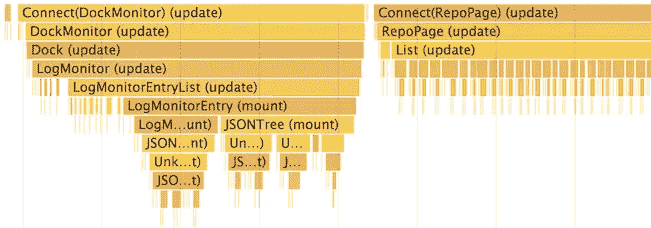
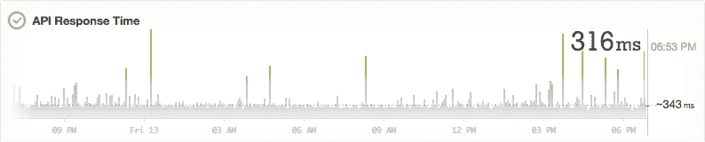

# 以 60fps 的速度反应

> 原文：<https://medium.com/hackernoon/react-at-60fps-4e36b8189a4c>

React 是 DOM 上的一个抽象，和任何抽象一样，它有它的成本和限制，你迟早会遇到。理解并能够克服这些限制是使用抽象的重要部分。

有一种观点认为 React 是开箱即用的，在某种程度上这是正确的——大多数时候用 React 构建用户界面时，您可能不会考虑性能优化。但是有时候，为了获得更好的性能(和更好的用户体验)，人们必须打破常规。

我想分享一些我在使用 React 时使用的技巧。

## 不要过早优化！

在我们开始之前给你一个警告。无论做什么，请不要为了性能过早优化。这意味着，不要做任何事情，直到你有证据表明你有一个性能问题。使用 React，优化太多可能会导致奇怪的错误。

每个性能优化过程应该是这样的:

1.  意识到存在性能问题
2.  使用 DevTools 进行测量和分析，以找到瓶颈
3.  解决这个问题
4.  再次测试以确认改进
5.  如果需要，转到 2

顺便说一下， [React 15.4 引入了新的性能工具](https://facebook.github.io/react/blog/2016/11/16/react-v15.4.0.html)，它与 Chrome 的 DevTools 很好地集成在一起，使得在渲染树中定位缓慢的组件变得更加容易。

现在让我们深入了解一些我在各种项目中使用的常见和不常见的与 React 相关的性能优化技术。

## 要不要 shouldComponentUpdate？

许多人都熟悉 React 的生命周期方法，称为[shouldcomponentwupdate](https://facebook.github.io/react/docs/react-component.html#shouldcomponentupdate)。该方法返回一个布尔值，取决于哪个 React 将跳过实现该方法的组件的 render 方法调用。

当我几年前开始使用 React 时，我天真地认为如果状态和道具没有改变，这个库会通过不调用 render 来自动优化渲染。事实上，默认情况下这个方法不做任何事情，因此 React.js 总是在你调用`this.setState`或者一个组件接收到新的道具时触发重新渲染。

实现`shouldComponentUpdate`方法可能是让一个慢的组件更快的最简单的方法，但是这种方法有一些缺陷。通过在组件树的较高位置退出渲染，您可能会错过树的较低位置所需的重新渲染，因为它将跳过对定义该方法的组件的所有子组件的渲染。最常见的实现如[shoulpurecomponentupdate](https://github.com/gaearon/react-pure-render/blob/master/src/function.js)简单地比较下一个和当前的`state`和`props`也可能很棘手:

1.  它不会比较深度嵌套的对象(并且比较深度嵌套的对象很慢——这就是为什么您应该考虑使用不可变的数据结构)
2.  通过`props`传递回调函数的新实例也会使这个函数总是返回`true`。提示:使用 ESLint 和 [eslint-plugin-react](https://github.com/yannickcr/eslint-plugin-react/blob/master/docs/rules/jsx-no-bind.md) 来捕捉它。
3.  支票不是免费的。做大量的检查会降低应用程序的速度。

实际上，这意味着在大多数情况下，它只应用于:

1.  使用简单道具的纯组件(道具中没有深度对象或数组)
2.  “叶”-位于渲染树深处的组件。

这就是为什么我认为，甚至在你开始在你的类上实现 shouldComponentUpdate 之前(或者，如果你喜欢功能组件，用 [pure HoC](https://github.com/acdlite/recompose/blob/master/docs/API.md#pure) 组合)，你应该分析并找出是什么组件使应用程序变慢。

## 将昂贵的代码转移到更高级别的组件

如果您在 render 方法中有一些开销很大的派生数据计算，您可以通过将这些计算卸载到更高级别的组件或[记忆](https://en.wikipedia.org/wiki/Memoization)结果来减少调用数量。使用像 [reselect](https://github.com/reactjs/reselect) 这样的库会有很大的帮助。

在我从事[https://status.postmarkapp.com](https://status.postmarkapp.com)工作期间，我能够通过以下方式提高服务指标图表的悬停性能:

1.  将可视化和覆盖信息分割成单独的组件
2.  将昂贵的数据转换卸载到包装组件
3.  为可视化和覆盖组件实现`shouldComponentUpdate`方法
4.  使用不可变的数据结构，这样比较就不那么昂贵了

ServiceMetric Component hover example

不过，我工作过的应用程序中最慢的部分之一通常是在用户输入之后触发 DOM 操作。对滚动或鼠标事件做出反应是降低应用程序速度的一个好方法。从本质上讲，这类事件会以非常高的频率发生。由于浏览器只有 16 毫秒的时间来完成以 60fps 运行的所有工作，对这些事件中的每一个做出反应都会完全阻塞您的 JS 应用程序。

通常使用 [*去抖*](http://okonet.ru/slides/debounced/) 模式来防止性能下降。它们确实减少了回调调用的次数，但同时也让我们的 UI 对用户输入的响应度降低了。我们还能对鼠标事件做出反应，并且保持在性能预算之内吗？

## 同步滚动组件示例

为了说明这个过程，我构建了一个同步滚动组件，类似于我为 [Netlify CMS](github.com/netlify/netlify-cms) post editor 所做的组件:

该组件应该保持两个窗格的滚动位置同步。由于每个窗格内容的高度可能不同，组件需要以不同的速度滚动窗格。它还应该与任何其他组件一起工作，并且无论您的应用程序结构如何，都应该易于集成。

## 不要滥用这个. setState

我在 React 应用程序中经常看到的一个常见错误是使用`this.setState`方法在组件中存储内部 DOM 状态。

> 如果`render()`里没有用的东西，就不应该在状态里。

现在考虑下面的例子，这是我提出的 SyncronizedPane 组件的第一个实现:

将所有的州放入`this.state`很有诱惑力(我猜是因为它的名字)。这样做的问题是，每次你调用`this.setState`来改变它，React 将重新呈现整个元素的结果树，这可能会花费大量的 CPU 时间。

Slide from [https://speakerdeck.com/vjeux/react-rally-animated-react-performance-toolbox](https://speakerdeck.com/vjeux/react-rally-animated-react-performance-toolbox)

问题是:您真的需要*使用 React 生命周期将`scrollTop`值作为支柱传递到组件的树上吗？许多人忘记了您仍然可以在实例变量中存储任意状态。在上面的例子中，做*

不会触发重新渲染。但是我们如何更新底层组件的滚动位置呢？这里的技巧是手动完成。

*—什么？！那不再是声明性代码了！—* 这时候你可能会喊。

*不，不是！也不是习惯性的反应！*

React 的一个好处是，通过使用上下文，您仍然可以编写命令性代码或直接访问 DOM，但对其他组件隐藏它，这样应用程序的其余代码仍然保持整洁和声明性。

上下文允许在组件之间创建父子关系。这意味着我们的子组件可以访问父组件的某些状态甚至方法。

## 直接 DOM 操作

因此，以前面的例子为例，我们可以将其重写为(简化版):

这里发生了什么？

1.  ScrollContainer 组件实现 register / unregister 方法，用于添加/移除窗格和附加/分离事件侦听器
2.  ScrollPane 组件现在做得很少:它只在挂载和卸载时调用 register 和 unregister
3.  每当其中一个窗格触发一个`onScroll`事件时，回调就会被触发，为所有窗格计算并设置新的`scrollTop`位置。

看看我们如何完全跳过使用`this.setState`和沿树向下传递道具。这允许更新 DOM 节点的滚动位置，而不会触发 React 的 CPU 密集型虚拟 DOM 操作。除此之外，那里还发生了一些更有趣的事情:

1.  我们现在可以在应用程序的任何地方使用 ScrollPane，而不仅仅是作为 ScrollContainer 的子对象。
2.  所有 ScrollPane 组件都通过传递对其 DOM 节点的引用在容器组件中注册自己。这使得 scrollTop 属性的计算和操作变得很简单。
3.  我们现在可以拥有任意数量的同步滚动的“窗格”。

你可以在 GitHub 上找到工作组件的完整代码:[https://github.com/okonet/react-sync-scroll](https://github.com/okonet/react-sync-scroll)，还有一个工作演示和文档在这里:[http://react-sync-scroll.netlify.com/](http://react-sync-scroll.netlify.com/)。

原来，这种技术也被用在 React Native 的[动画](http://www.reactnative.com/react-native-animated/)中。参见@vjeux 的演示幻灯片:[https://speaker deck . com/vje UX/react-rally-animated-react-performance-toolbox](https://speakerdeck.com/vjeux/react-rally-animated-react-performance-toolbox)

# 结论

有许多最佳实践和模式可以带来更好的应用程序架构，您一定要遵循它们，直到应用程序的用户体验开始受到影响。有时候，以不太习惯的方式做事或者不总是遵循“反应方式”可以带来更好的用户体验。

在良好的性能和代码可维护性之间找到平衡是很棘手的，但这是每个 UI 开发人员工作的一部分。最终，我们构建软件不是为了遵循模式，而是为了人。

## 相关阅读和观看:

1.  [使用 React 的性能工程](http://benchling.engineering/performance-engineering-with-react/)
2.  [在抽象的光谱上](https://www.youtube.com/watch?v=mVVNJKv9esE)程露
3.  [反应本土:构建流畅的用户体验](https://youtu.be/xDlfrcM6YBk)作者斯潘塞·阿伦斯
4.  来自[的幻灯片动画！@vjeux](https://speakerdeck.com/vjeux/react-rally-animated-react-performance-toolbox)

感谢[卡尔·霍基](https://medium.com/u/4a0f6a534c55?source=post_page-----4e36b8189a4c--------------------------------)的编辑和[马克斯·斯托伊伯](https://medium.com/u/908fb8fea30c?source=post_page-----4e36b8189a4c--------------------------------)的审核。

> [黑客中午](http://bit.ly/Hackernoon)是黑客如何开始他们的下午。我们是 AMI 家庭的一员。我们现在[接受投稿](http://bit.ly/hackernoonsubmission)并乐意[讨论广告&赞助](mailto:partners@amipublications.com)机会。
> 
> 如果你喜欢这个故事，我们推荐你阅读我们的[最新科技故事](http://bit.ly/hackernoonlatestt)和[趋势科技故事](https://hackernoon.com/trending)。直到下一次，不要把世界的现实想当然！

