# react-欧洲 2017

> 原文：<https://medium.com/hackernoon/react-europe-2017-551961487403>

又到了欧洲最大的[反应](https://hackernoon.com/tagged/react) [会议](https://hackernoon.com/tagged/conference)的时候了🎉。我想给你我参加会议的经历，以及会议的大致概况(上传后会添加视频链接)。我希望它能帮助你更好地理解为什么你明年也应该来参观，以及哪些会谈需要详细了解。

# 前一天晚上

React-Europe 的组织者在会议前一天在会场附近的一家酒吧举办了一场[开幕派对](/@ReactEurope/reacteurope-bar-night-party-on-the-17th-of-may-for-reacteurope-attendees-e0744e80702)。这很酷。我们得到了免费的饮料，直到大约 22:00，然后很多非常棒的人就买了投手，到处去帮助每个人。丹尼尔·班克和我在那里呆了大约 4 个小时，很难离开，因为我们和很多不同的人进行了很多精彩的对话。

气氛棒极了；我从未参加过如此令人敬畏的一群人。有很多很酷的对话在进行，每个人都邀请你和他们交谈，讨论很棒的东西(我认为 react 原生导航解决方案是讨论最多的话题😂).我觉得你可以走到每个人面前，和他们聊聊 React 生态系统，每个人都很高兴和你在一起。比约恩·布劳尔毫不夸张地说，那天晚上他向很多人介绍了我，感觉棒极了。

我最长的一次聊天是和[罗滕·米兹拉奇-梅丹](https://medium.com/u/60e6105b5bc7?source=post_page-----551961487403--------------------------------)，他是[排毒](https://github.com/wix/detox)的创造者，我以前用过这个方法，我在同一天开了三期。与创造者讨论你使用和喜爱的工具是如此美好；我可以给他关于文档的反馈，并提交我的功能请求。我们讨论了一些实现它的方法，这是非常有见地和有趣的。这种合作方式非常棒，至少对我来说，会议是一种以非常私人的方式联系人们的非常棒的方式。

对我来说，这个派对是大会上最重要的事情，能够与这么多背景各异的人谈论你整天使用的工具和语言是一种很好的体验。实心 10/10 也行！

# 场地

丹尼尔·班克和我很早就到达了会场。欢迎仪式非常热烈，我们得到了很多很棒的礼物，比如衬衫、毛衣和贴纸。早餐相当不错，甚至在会议开始之前，我们就进行了很多精彩的谈话。我不想谈论更多的场地，我只想在这里贴一些图片:

**一旦会议真正结束，我会用更详细的总结来更新会谈。**

# 基督教公谊会对星期日的称呼

[Brent Vatne](https://medium.com/u/d5a707474bd2?source=post_page-----551961487403--------------------------------) 带领我们度过这一天，并提供了一天的良好概览。他用个人趣闻来介绍每一位发言者，给会议增添了个人色彩。

## 安德鲁·克拉克的主题演讲

**TL；博士**

*   React 16 中有纤程、偏程和误差边界
*   (很有可能)在 React 中将会有一个选择异步渲染的 API。它仍然需要得到一些 API 表面的澄清
*   超越 React 16:为屏幕外或隐藏内容渲染优先级&更好的代码分割支持

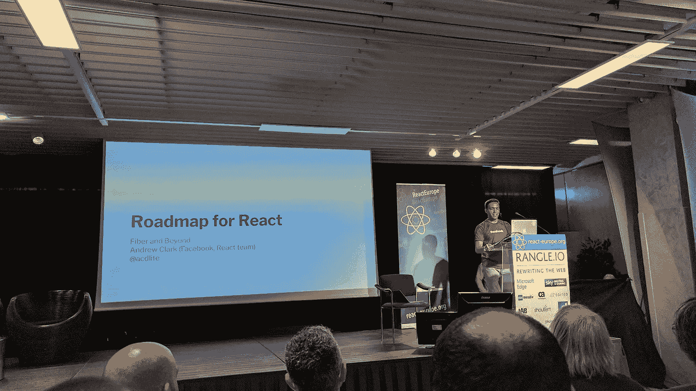

**视频**

*   即将推出

## 我所学到的标杆反应由[多米尼克·甘纳威](https://medium.com/u/2cd0dccd3af3?source=post_page-----551961487403--------------------------------)

**TL；博士**

*   汇总平面模块有助于 react 在包大小和加载时间方面获得约 10%的改进
*   Rollup 是提高库中性能的一个很好的匹配
*   [Google Lighthouse](https://developers.google.com/web/tools/lighthouse/) 是一个很棒的性能基准测试工具

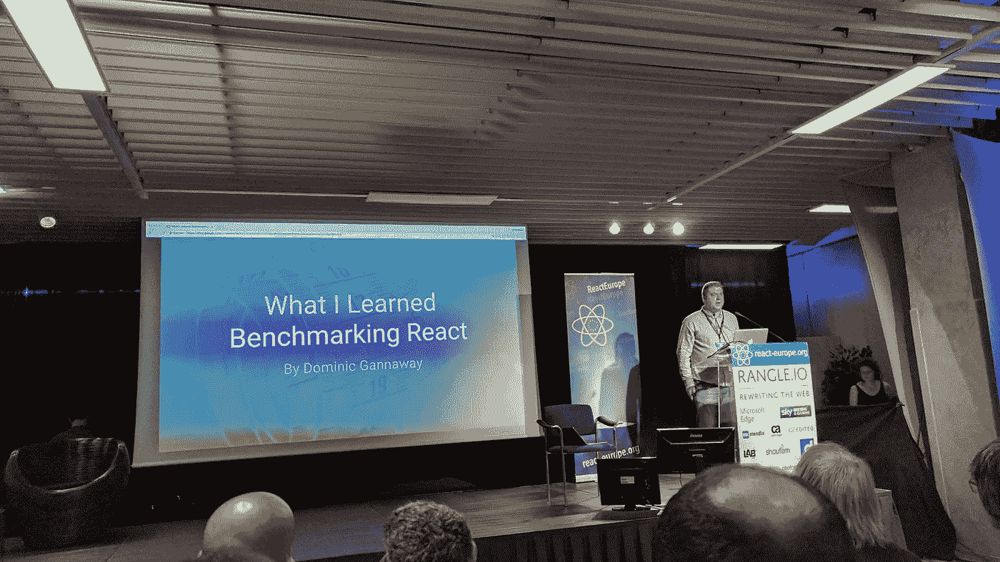

**视频**

*   即将推出

## Christoph Pojer 开发高质量的 JavaScript 工具

**TL；博士**

*   新的特性和改进的性能使 Jest 变得更好，并使 100 多家公司采用了它
*   快照测试对于获得良好的覆盖率来说是很棒的，并且正在与没有测试而不是常规测试进行比较。
*   Jest 转向了模块化结构，这些模块已经在不同的开源项目中使用

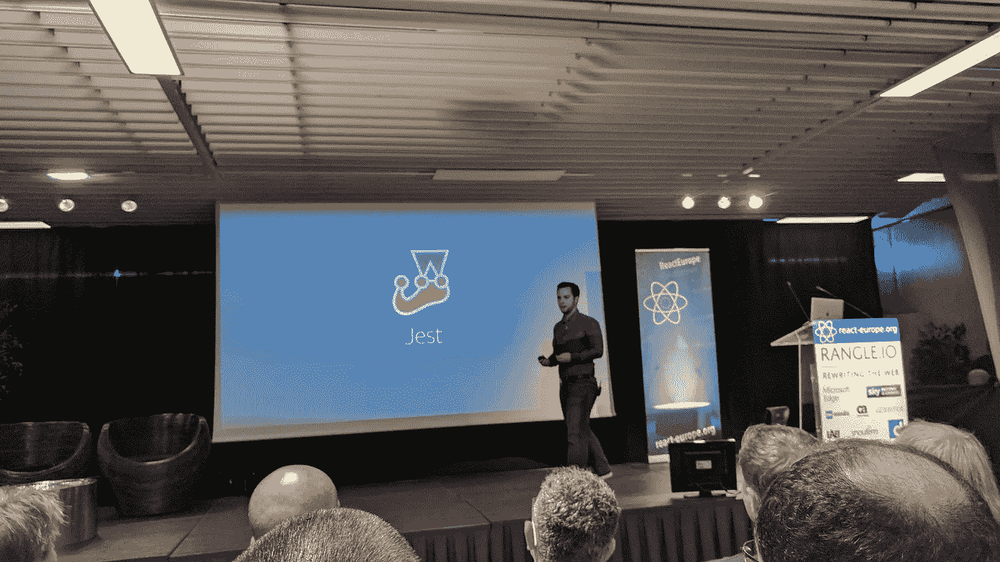

**视频**

*   即将推出

## La nouvelle 暧昧由[Sunil Pai](https://medium.com/u/e970465f2c1e?source=post_page-----551961487403--------------------------------)**(**[π](https://www.utf8icons.com/character/960/greek-small-letter-pi))

**TL；博士**

*   新的浪潮是从运行时到编译器的转变
*   很好的例子是 [Gatsby](https://github.com/gatsbyjs/gatsby) 、 [next.js](https://github.com/zeit/next.js) 、[relay](https://github.com/facebook/relay)&[prepack](https://github.com/facebook/prepack)，它们利用编译器来减少它们的运行时间
*   “如果你不能逐步引入一个库，它在到达时就死了”

**视频**

*   即将推出

## 越差越好:JavaScript 疲劳的好处，凯文·莱克

**TL；博士**

*   简单性是决定软件系统成功的最重要的属性(例如，只考虑视图层)
*   简单= >受欢迎= >贡献者

**视频**

*   即将推出

## WebAssembly 对 React 意味着什么

**TL；博士**

*   如果 React 协调器被移植到 Web 程序集，则 Web 程序集的当前状态可能不允许显著的性能改进
*   通过改进的 API 和工具，性能和生态系统可能会有重大改进

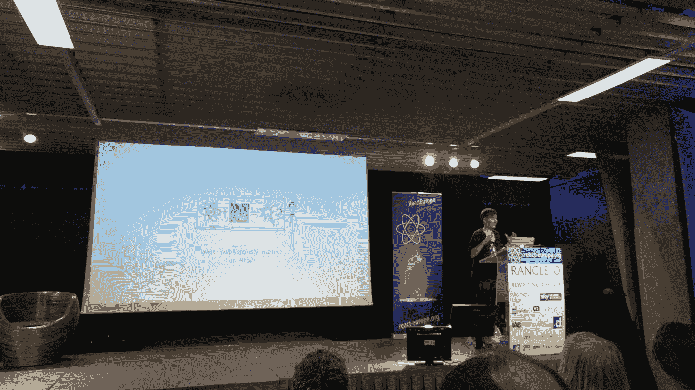

**视频**

*   即将推出

## 亚当·佩里

**TL；博士**

*   “类型是对数据结构的测试”
*   类型注释还通过编辑器集成减少了计算代码中变量类型的认知开销
*   Flow 有很多推理特性，所以大多数时候只需要输入模块的导出

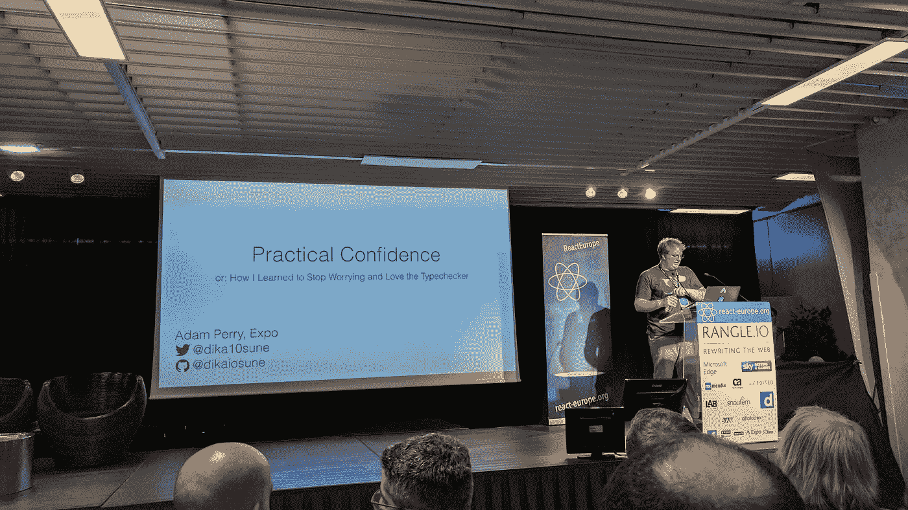

**视频**

*   即将推出

## 百密一疏由[程露](https://twitter.com/_chenglou)

**TL；博士**

*   软件工程意味着做出取舍；选择正确的是一门艺术
*   用 20%的努力做 80%的事，大多数时候已经足够好了。这只适用于如果你的基础(语言，类型系统等。)是固体(100%)
*   “通过以 100%的心态接近某些部分，如基础，增加你的草率预算

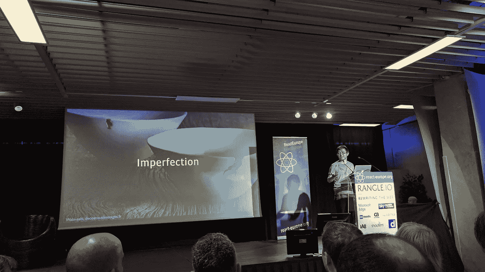

**视频**

*   即将推出

## 由 [Eric Vicenti](https://medium.com/u/f34d331b9b55?source=post_page-----551961487403--------------------------------) 开发的带有 React 导航的最大模块化应用

**TL；博士**

*   用一个小演示程序展示了[反应导航](https://github.com/react-community/react-navigation)的威力
*   react-navigation 可以在 web 和本地使用

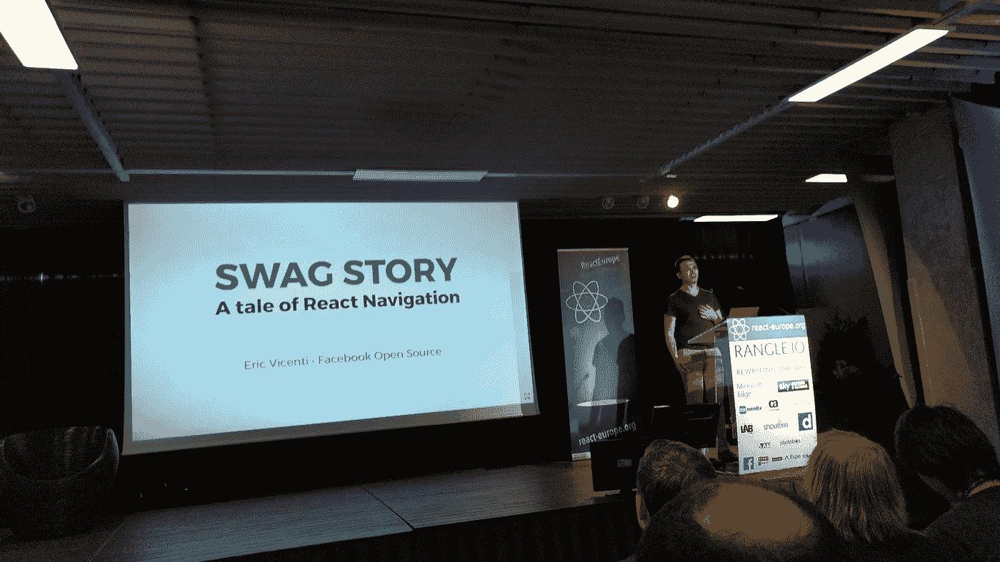

**视频**

*   即将推出

## 《超级充能》如何应对

**TL；博士**

*   首次渲染时间和首次交互时间对于企业来说非常重要
*   客户端加载会给用户带来不好的体验，服务器端渲染会好一些，但是非交互网站的时间会长一些
*   分块呈现允许应用程序的不同部分单独加载，这也带来了更好的容错能力

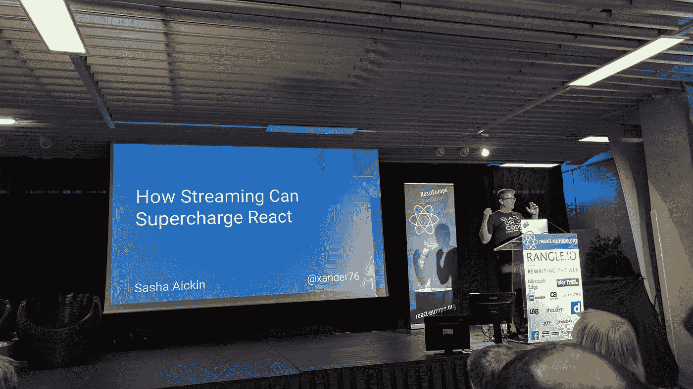

**视频**

*   即将推出

## ⚡会谈

*   **返回 null 约书亚·科莫**:除了渲染用户界面，使用组件做其他事情也是有价值的
*   Brendan Moore、Sarah Mogin 和 Serge Rose 设计的花式步法:他们用 React 和 Redux 构建了一个包含模块化设计原则的 CMS 前端
*   Shoutem 团队的 ShoutemUI:他们为 React 本地扩展(想想认证)建立了一个市场
*   Charles Mangwa 的《React Native 中的一千种导航方式:他介绍了[React-router-navigation](https://github.com/LeoLeBras/react-router-navigation)，这是一种仅使用组件在 React Native 中导航的方式
*   塔尔·科尔 & [罗特姆·米兹拉奇-梅丹](https://medium.com/u/60e6105b5bc7?source=post_page-----551961487403--------------------------------):他们为 React Native 创建了一个非常易用、稳定且快速的 E2E 测试框架
*   Danielle Man 的 GraphQL 开发工具:Apollo 团队开发了一个 Chrome 扩展，用于使用 Apollo 进行开发，具有查询监视和商店检查等功能

# 第二天

再次[布伦特·瓦特恩](https://medium.com/u/d5a707474bd2?source=post_page-----551961487403--------------------------------)带领我们度过了这一天。早上人们进来的时间比昨天晚了一点，昨天晚上很多人聚集在青蛙，我们前一天已经在那里见过面了。

## 下一代国家管理由 [Michel Weststrate](https://medium.com/u/de4496bfa1e2?source=post_page-----551961487403--------------------------------)

**TL；博士**

*   他引入了 [mobx 状态树](https://github.com/mobxjs/mobx-state-tree)，这是一种使用 mobx 基于图的优势并将其与 Redux 基于树的优势相结合的新方法
*   他演示了 Redux TODO MVC 应用程序，使用了一个交换的 MobX reducer，并展示了时间旅行等功能

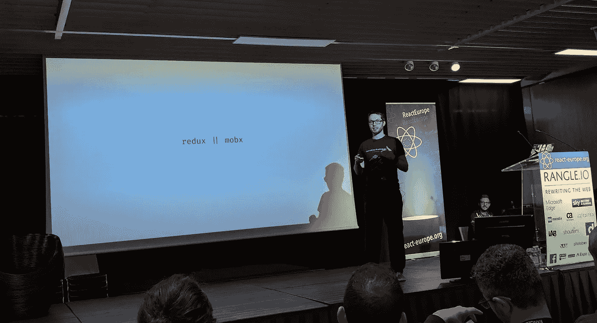

**视频**

*   即将推出

## 尼克·格拉芙作曲

**TL；博士**

*   组合中的状态容易出错。因此，我们应该将函数编程范例视为高阶函数和组件
*   他展示了[如何改进](https://github.com/styled-components/polished)库和一个使用 HOC 加载屏幕的 Apollo 应用程序

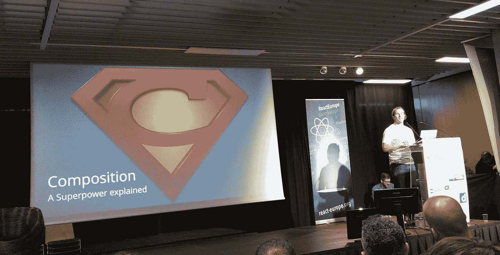

**视频**

*   即将推出

## 尼古拉斯·加拉格尔制作的 Twitter Lite

**TL；博士**

*   Twitter Light 在加载时间、数据消耗和交互时间方面有更好的性能
*   它不使用服务器端渲染；他详细解释了原因
*   在设计系统时，考虑应用程序各部分的可处置性

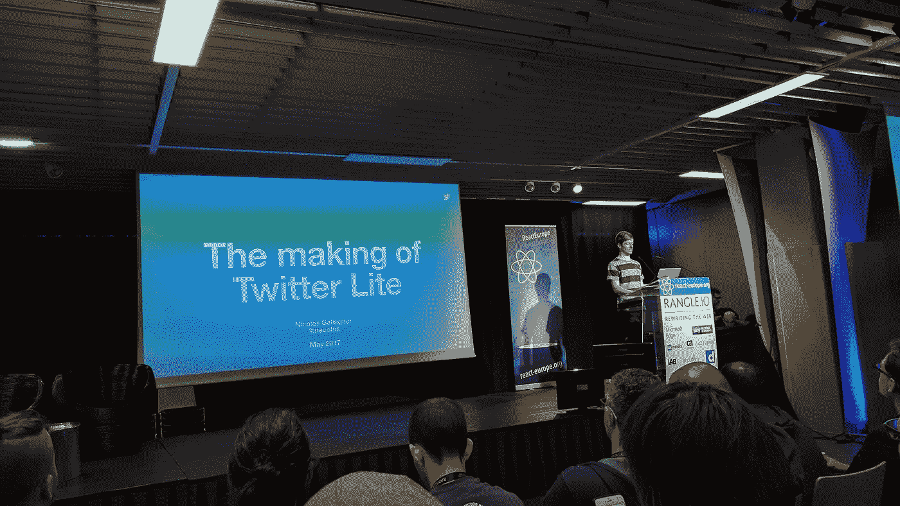

**见 0**

*   即将推出

## ⚡会谈

*   **点心由** [**布伦特 Vatne**](https://medium.com/u/d5a707474bd2?source=post_page-----551961487403--------------------------------) **:** 在浏览器上使用 react-native[https://snack.expo.io/](https://snack.expo.io/)
*   **React Android 应用中的原生组件由** [**皮特·赫塞尔伯格**](https://medium.com/u/a0c4d3aeeeab?source=post_page-----551961487403--------------------------------) **:** 在[https://github.com/petterh/react-europe-demo](https://github.com/petterh/react-europe-demo)看演示
*   **量化最佳实践由杰克森·汉堡和** [**路易·安东内里**](https://medium.com/u/8bfc09cf350a?source=post_page-----551961487403--------------------------------) **:** 纯组件和关键道具如何提高您的绩效
*   **利用由** [**进行的代码分解**](https://medium.com/u/1bf092f8ff4d?source=post_page-----551961487403--------------------------------) **:** 使用 babel 和 webpack 的动态导入语句简介
*   Brandon Dail 的**更智能的代码分割和预加载:**对 [react-loadable](https://github.com/thejameskyle/react-loadable) 和 [react-perimeter](https://github.com/aweary/react-perimeter) 的一个简短而好的介绍
*   **低配置工具的兴起** [**卡尔·霍基**](https://medium.com/u/4a0f6a534c55?source=post_page-----551961487403--------------------------------) **:** 配置导致开源的诸多不良影响；仅在真正需要时添加它们

## 探索继电器现代由[李拜伦](https://medium.com/u/d9b1a61823fa?source=post_page-----551961487403--------------------------------)

**TL；博士**

*   Relay Modern 将假设从动态查询转移到静态查询，允许编译器提前进行优化
*   这些优化带来了更好的性能和更少的网络流量(在 Facebook Marketplace 应用上获得 900 毫秒的胜利)
*   你可以一步一步地引入 Relay Moderns API，一旦你完成了转换，就可以完全切换到它

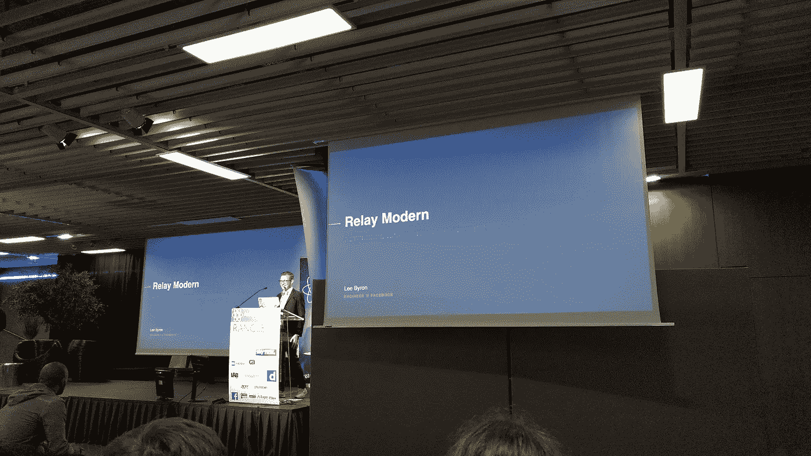

**视频**

*   即将推出

## 莎拉·德拉斯纳制作的虚拟 DOM 动画

**TL；博士**

*   动画对于保持用户注意力和减少感知等待时间非常重要
*   每项工作都有合适的工具，CSS-in-JS 用于简单的过渡， [GreenSock](https://github.com/greensock/GreenSock-JS) 用于连续的&复杂的运动， [React-Motion](https://github.com/chenglou/react-motion) 用于简单的基于物理的动画

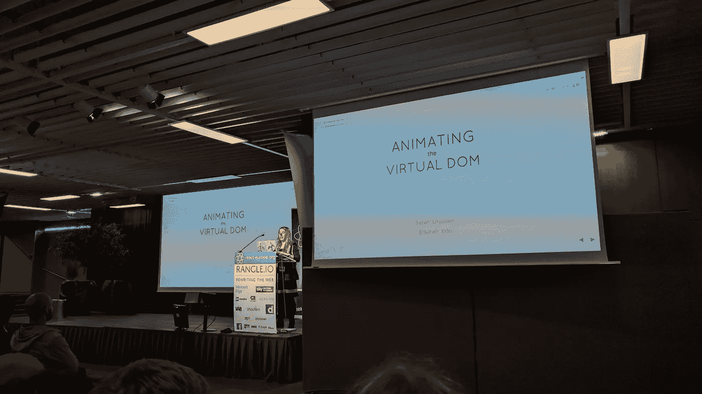

**视频**

*   即将推出

# 信用

特别感谢丹尼尔·班克作为这次会议的犯罪伙伴并提供了所有的图片💙

*想听我说更多吗？随时订阅我的时事通讯；我大概一个月发一次消息。*

> [黑客中午](http://bit.ly/Hackernoon)是黑客如何开始他们的下午。我们是阿妹家庭的一员。我们现在[接受投稿](http://bit.ly/hackernoonsubmission)并乐意[讨论广告&赞助](mailto:partners@amipublications.com)机会。
> 
> 如果你喜欢这个故事，我们推荐你阅读我们的[最新科技故事](http://bit.ly/hackernoonlatestt)和[趋势科技故事](https://hackernoon.com/trending)。直到下一次，不要把世界的现实想当然！

