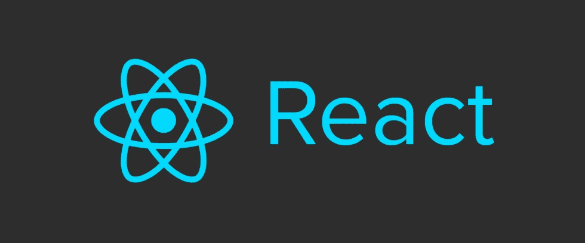

# 如何用基于 API 的 CMS 构建一个 SEO 友好的 React 博客

> 原文：<https://medium.com/hackernoon/react-js-cms-blog-tutorial-e090c699845b>



你有没有想过使用 [React](https://hackernoon.com/tagged/react) 和 Node.js 建立一个服务器渲染的、SEO 友好的网站？实现这一点的典型解决方案是使用 Prerender.io 等预呈现服务，或者实现 React 组件的服务器端呈现。

一个相对较新的选择是 [Next.js](https://github.com/zeit/next.js/) ，一个构建通用 React webapps 的框架。Next.js 为服务器端渲染提供了现成的[工具](https://hackernoon.com/tagged/tools)，包括为 SEO 设置 HTML 标签以及在渲染组件之前获取数据。点击阅读更多关于 Next.js [背后的哲学。](https://zeit.co/blog/next)

在本教程中，我们将向您展示如何使用 [React](https://facebook.github.io/react/) 、 [Next.js](https://github.com/zeit/next.js/) 和 [ButterCMS](https://buttercms.com/) 构建一个基于 CMS 的博客。本教程的最终代码是 Github 上的[。](https://github.com/buttercms/react-cms-blog-with-next-js)

[ButterCMS](https://buttercms.com/) 是一个[基于 API 的 CMS 和内容 API](https://buttercms.com/cms) 。你可以认为 Butter 类似于 WordPress，除了你用你选择的语言建立你的网站，然后用 API 插入动态内容。你可以通过[登录 Github](https://buttercms.com/github/oauth) 亲自尝试 [ButterCMS](https://buttercms.com/nodejs-cms/) 。

# 入门指南

为您的应用程序创建一个新目录，并添加 package.json 文件:

```
{
  "name": "react-blog"
}
```

安装 Next.js 并反应。在撰写本文时，我们希望安装 Next.js，以便以后可以设置动态路由:

```
npm install next@beta react react-dom --save
```

然后将一个脚本添加到您的包中。

```
{
  "scripts": {
    "start": "next"
  }
}
```

Next.js 将`./pages`目录中的每个 js 文件视为一个页面。让我们通过在项目中创建一个`./pages/index.js`来设置一个基本的主页:

```
export default () => (
  <div>My blog homepage</div>
)
```

然后只需运行`npm run start`并前往`http://localhost:3000`。

最后，创建一个`./pages/post.js`并确保它在`[http://localhost:3000/post](http://localhost:3000/post:)`加载:

```
export default () => (
  <div>A blog post</div>
)
```

# 获取博客文章

接下来我们将集成 [ButterCMS](https://buttercms.com/react-cms/) ，这样我们就可以动态地获取和呈现博客文章。

首先安装 ButterCMS Node.js API 客户端并重启服务器:

```
npm install buttercms --save
```

我们将更新`index.js`成为一个 React 组件，使用 ButterCMS SDK 获取并显示帖子:

```
import React from 'react'
import Link from 'next/link'
import Butter from 'buttercms'

const butter = Butter('de55d3f93789d4c5c26fb07445b680e8bca843bd')

export default class extends React.Component {
  static async getInitialProps({ query }) {
    let page = query.page || 1;

    const resp = await butter.post.list({page: page, page_size: 10})    
    return resp.data;
  }
  render() {
    const { next_page, previous_page } = this.props.meta;

    return (
      <div>
        {this.props.data.map((post) => {
          return (
            <div>
              <a href={`/post/${post.slug}`}>{post.title}</a>
            </div>
          )
        })}

        <br />

        <div>
          {previous_page && <Link href={`/?page=${previous_page}`}><a>Prev</a></Link>}

          {next_page && <Link href={`/?page=${next_page}`}><a>Next</a></Link>}
        </div>
      </div>
    )
  }
}
```

使用 Next.js `getInitialProps`将在初始页面加载时在服务器上执行，然后在使用内置的`<Link>`组件导航到不同的路径时在客户端上执行。`getInitialProps`也接收具有各种属性的上下文对象——我们访问`query`属性来处理分页。我们正在从 ButterCMS 测试帐户获取帖子——使用 Github 登录来设置您自己的帖子。

在我们的`render()`方法中，我们使用了一些巧妙的语法，仅在适用时才显示分页链接。我们的帖子链接会将我们带到 404-我们接下来会让这些工作。

# 显示帖子

为了让我们的文章链接工作，我们需要为我们的博客文章设置动态路由。创建一个定制服务器`./server.js`，将所有`/post/:slug`URL 路由到我们的 post 组件:

```
const { createServer } = require('http')
const { parse } = require('url')
const next = require('next')

const dev = process.env.NODE_ENV !== 'production'
const app = next({ dev })
const handle = app.getRequestHandler()

app.prepare().then(() => {
  createServer((req, res) => {
    // Be sure to pass `true` as the second argument to `url.parse`.
    // This tells it to parse the query portion of the URL.
    const parsedUrl = parse(req.url, true)
    const { pathname, query } = parsedUrl

    if (pathname.includes('/post/')) {
      const splitPath = pathname.split("/");

      // Add post slug to query object
      query.slug = splitPath[2];

      app.render(req, res, '/post', query)
    } else {
      handle(req, res, parsedUrl)
    }
  })
  .listen(3000, (err) => {
    if (err) throw err
    console.log('> Ready on http://localhost:3000')
  })
})
```

我们还将更新我们的 post 组件，通过 slug 获取博客文章，并呈现标题和正文:

```
import React from 'react'
import Butter from 'buttercms'

const butter = Butter('de55d3f93789d4c5c26fb07445b680e8bca843bd')

export default class extends React.Component {
  static async getInitialProps({ query }) {
    const resp = await butter.post.retrieve(query.slug);  
    return resp.data;
  }
  render() {
    const post = this.props.data;

    return (
      <div>
        <h1>{post.title}</h1>
        <div dangerouslySetInnerHTML={{__html: post.body}} />
      </div>
    )
  }
}
```

最后，更新我们的`package.json`启动脚本以使用我们的客户服务器并重启:

```
"scripts": {
  "start": "node server.js"
}
```

# 搜索引擎优化

Next.js 提供了一个用于设置 HTML 标题和 meta 标签的`<Head>`组件。将`import Head from 'next/head'`添加到`./pages/post.js`的顶部，并使用`render()`方法中的组件:

```
render() {
  const post = this.props.data;

  return (
    <div>
      <Head>
        <title>{post.seo_title}</title>
        <meta name="description" content={post.meta_description} />
        <meta name="og:image" content={post.featured_image} />
      </Head>

      <h1>{post.title}</h1>
      <div dangerouslySetInnerHTML={{__html: post.body}} />
    </div>
  )
}
```

重启服务器，检查一篇文章的 HTML 源代码，验证标签设置是否正确。

# 包裹

Next.js 是一个强大的框架，可以轻松构建通用的 React 应用程序。有了 ButterCMS，你可以用 React 快速构建基于 CMS 的博客和网站。

一定要看看 [ButterCMS](https://buttercms.com/) ，这是一个[托管的基于 API 的 CMS 和内容 API](https://buttercms.com/cms/) 以及博客引擎，让你使用任何编程语言构建 CMS 驱动的应用，包括 [Ruby](https://buttercms.com/ruby-cms) 、 [Rails](https://buttercms.com/rails-cms) 、 [Node.js](https://buttercms.com/nodejs-cms) 、[。网](https://buttercms.com/asp-net-cms)、[蟒蛇](https://buttercms.com/python-cms)、[凤凰](https://buttercms.com/phoenix-cms)、[姜戈](https://buttercms.com/django-cms)、[反应](https://buttercms.com/react-cms)、[角](https://buttercms.com/angular-cms)、[围棋](https://buttercms.com/golang-cms)、 [PHP](https://buttercms.com/php-cms) 、[拉拉夫](https://buttercms.com/laravel-cms)、[仙丹](https://buttercms.com/elixir-cms)、[流星](https://buttercms.com/meteor-cms)。

我们希望你喜欢这个教程。如果你有任何关于设置你的 ButterCMS 驱动的 Next.js/React 应用的问题，请通过 roger@buttercms.com[或 Twitter](mailto:roger@buttercms.com) 上的[联系我。](https://twitter.com/buttercms)

[](http://bit.ly/HackernoonFB)[](https://goo.gl/k7XYbx)[](https://goo.gl/4ofytp)

> [黑客中午](http://bit.ly/Hackernoon)是黑客如何开始他们的下午。我们是 [@AMI](http://bit.ly/atAMIatAMI) 家庭的一员。我们现在[接受投稿](http://bit.ly/hackernoonsubmission)并乐意[讨论广告&赞助](mailto:partners@amipublications.com)机会。
> 
> 如果你喜欢这个故事，我们推荐你阅读我们的[最新科技故事](http://bit.ly/hackernoonlatestt)和[趋势科技故事](https://hackernoon.com/trending)。直到下一次，不要把世界的现实想当然！

