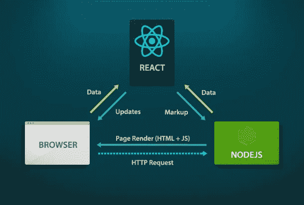
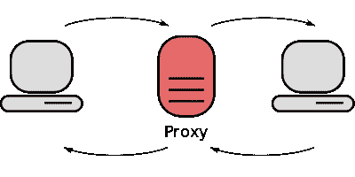

# React.js 高效服务器渲染

> 原文：<https://medium.com/hackernoon/react-js-efficient-server-rending-5dcb2a0ae14a>



大约一年来，我一直在开发基于 React.js 的 Web 应用程序，令我惊讶的是，我编写的代码实际上可以与 JSX 组件而不是函数一起伸缩，这使得前端更加简单。

但在某些情况下，我们需要动态 JSX 内容的搜索引擎优化，或者我们需要更多的前端页面加载时间的性能。在这种情况下，脸书的开发人员以这种方式制作了 React.js，因此它也可以在服务器端使用 Node.js 的基本功能进行渲染。

所以流程和这个差不多

1.  客户端发送请求以获取一些 JSX 模板页面
2.  Node.js 服务器获取包含 JSX 代码的主文件
3.  将其呈现为普通的 HTML 代码
4.  向客户端发送 HTML 响应
5.  使用 HTML 标记，然后客户端加载 React.js 客户端代码，用于向呈现的 HTML 添加动态逻辑

这有助于以比 React 更快的速度显示 HTML 内容，并且有助于向搜索引擎机器人或网站爬虫提供一些内容。

# 但是如果你没有 Node 呢？JS 后端？

当我开始从事大型项目时，这是我真正的追求。我决定把 React.js 作为前端，但是他们在后端有很多 Python 的东西，我不能仅仅为了服务器端渲染而重写所有代码。当时我找到了一些解决方案，将一些 JS 引擎嵌入到 Python 中，并将服务器端渲染交给 Python，但是`Seriously!! Do we need to embed JS to Python just for server side rendering?`我认为我们**真的不需要！**

我有了一个想法，只为 React.js JSX 模板渲染建立独立的 Node.js 服务器，所以我可以向该服务器发出代理请求，它将为我渲染 JSX 内容，并将纯 HTML 响应回 Python Django 模板。
**这就像一个基本的 JSX 渲染的代理服务器。**



所以在几个小时的测试和破坏之后，我做了一个项目 [React.js 代理渲染](https://github.com/tigranbs/proxy-render)，它拯救了我的项目，让我成为了提供更多性能的超级英雄。

# 代理渲染？那是什么？

因此，利用代理请求的基本原理，我为 Python 编写了非常简单的代码

```
import requests
import json

PROXY_RENDER_ADDRESS = 'http://localhost:3000/'

def get_html(filename, props):
    try:
        props_str = json.dumps(props)
        r = requests.post(url=PROXY_RENDER_ADDRESS + filename
                          , data=props_str
                          , headers={'Content-Type': 'application/json'})

        if r.status_code == 200:
            return r.text, props_str
    except Exception as e:
        print(e)

    return False, False
```

这基本上是将`POST Request`转换为代理渲染服务，并通过将全局状态作为 JSON 传递，取回 Node.js 服务器渲染的 HTML 代码。

所以我的主要优势是

1.  不需要在后端集成 Node.js，或者在 Python 中使用蹩脚的 js 引擎，这些引擎会占用大量内存
2.  能够保持 JSX 模板缓存，这极大地改善了加载时间
3.  扩展后端服务，而不扩展基本渲染服务，因此您可以拥有多个具有单个缓存渲染服务的服务器，并获得更好的性能
4.  编写代码的巨大灵活性。不，我知道我只需要将一个对象传递给代理渲染工具并接收 HTML，我不需要担心 JS 中的状态变量或服务器端代码执行
5.  **最后，这是守护美丽的策略，分别移动不同的部分:)**

# 生产中的代理渲染

在生产代理渲染工具运行了近 3 个月，没有任何重新启动和内存，CPU 使用率最低。第一次渲染页面平均需要 600 毫秒，但是第一次渲染之后，平均 HTML 响应时间是 10 毫秒，这是因为 Node.js 本身需要缓存和服务缓存。

这个工具对我继续使用 Python、Go、Ruby 或 Java 进行开发帮助很大，但仍然使用花哨的前端框架和工具。希望你也不要待在 Node.js 监狱:)

[](http://bit.ly/HackernoonFB)[](https://goo.gl/k7XYbx)[](https://goo.gl/4ofytp)

> [黑客中午](http://bit.ly/Hackernoon)是黑客如何开始他们的下午。我们是 [@AMI](http://bit.ly/atAMIatAMI) 家庭的一员。我们现在[接受投稿](http://bit.ly/hackernoonsubmission)并乐意[讨论广告&赞助](mailto:partners@amipublications.com)机会。
> 
> 如果你喜欢这个故事，我们推荐你阅读我们的[最新科技故事](http://bit.ly/hackernoonlatestt)和[趋势科技故事](https://hackernoon.com/trending)。直到下一次，不要把世界的现实想当然！

