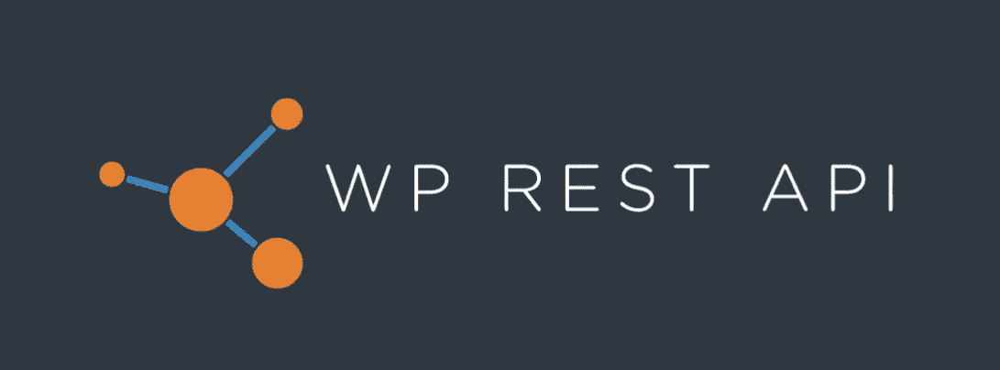
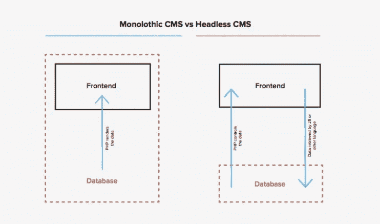
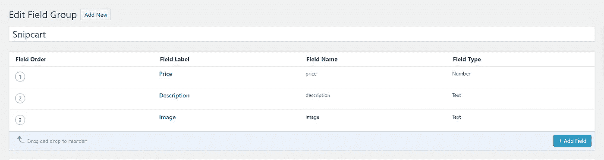
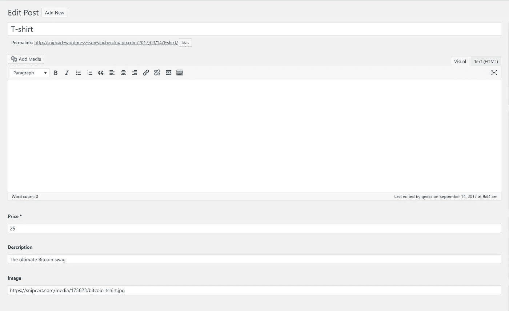
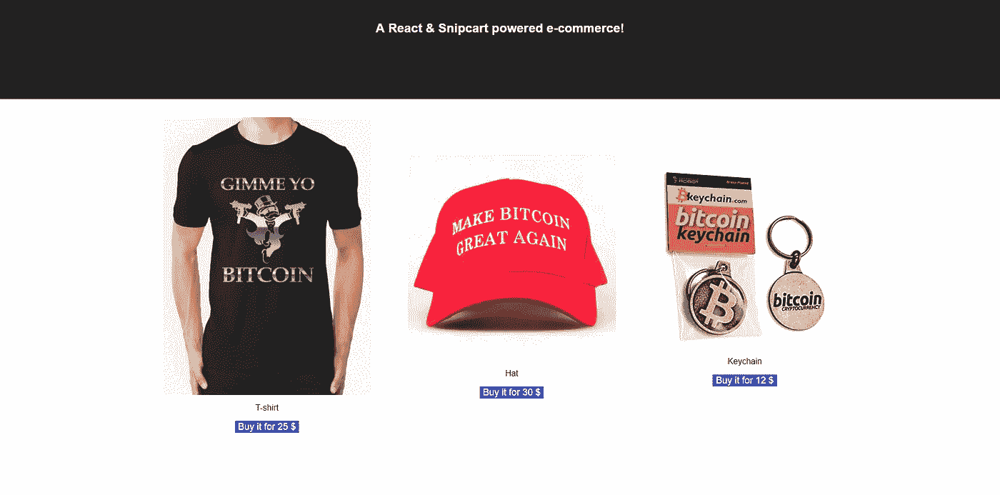

# 以 WordPress 为后端的 react . js:WP REST API 示例

> 原文：<https://medium.com/hackernoon/react-js-with-wordpress-as-a-backend-wp-rest-api-example-127639a6cc41>

Photo by [Ross Findon](https://unsplash.com/photos/mG28olYFgHI?utm_source=unsplash&utm_medium=referral&utm_content=creditCopyText) on [Unsplash](https://unsplash.com/?utm_source=unsplash&utm_medium=referral&utm_content=creditCopyText)

即使是特定领域中最大的公司也需要适应才能生存。苹果和 iPod。用 AdWords 谷歌。你明白了。

另一条科技大鱼 WordPress 一直在紧跟最近的趋势——无头 CMS——表现出保持相关性和发展的意愿:

每个开发者和他们的狗都有关于 WordPress 的话要说，而且不总是奉承。远非如此。然而，即使是最狂热的批评者也不得不注意到这个新功能，因为它可能会改变我们使用流行的 CMS 的方式。

对于希望将 React.js 等 JavaScript 工具的功能与 WordPress 结合起来的前端开发者来说，WordPress Rest API 是一个**巨大的**进步。

这正是我今天想做的，在工作中演示 WordPress REST API。我将尝试找出这是否真的是一个游戏规则改变者，并解构围绕它的[炒作](http://observer.com/2015/07/wordpress-rest-api/)。

我将使用 WordPress 作为后端，并使用 WordPress REST API 将数据输入一个简单的 React 电子商务 SPA:

*   用 WP 高级自定义字段插件创建产品
*   将定制字段映射到 JSON 有效负载
*   使用 React 使用 JSON REST API
*   渲染我们商店的产品

在我们开始之前，让我们看看 WordPress 的新 REST API 是什么，以及为什么您应该关注它。

# 什么是 WordPress REST API？

WordPress 本身不需要任何介绍，但是让我们仔细看看最近的 WP REST API。在我们开始沿着它的进化之路滑下去之前，让我们先弄清楚一些定义:

一个 **API** (应用程序接口)是[一组用于构建软件应用的协议](http://www.webopedia.com/TERM/A/API.html)。它定义了程序之间共享信息的方式，并构建了应用程序不同组件之间的交互方式。一个好的 API 通过提供所有必要的部分，使得程序开发更加容易。

REST(表述性状态转移)是一种架构风格，定义了对程序制作方式的约束。当 web 服务遇到这种架构时，我们称之为 RESTful APIs，或者简称为 REST APIs。

**JSON** (JavaScript 对象符号)是[一种用于结构化数据](http://www.json.org/)的格式，以便大量应用程序可以读取。它使得像 WordPress 这样的东西和任何种类的应用程序之间的交互都很方便。

从 WordPress 4.7 开始，这些概念已经被应用于创建 WordPress JSON REST API。它允许一种解耦的方法，有效地将数据(背面)与视图(正面)分开。

# 对用户意味着什么？

**从现在开始，WordPress 可以作为一个无头 CMS 使用了。**

这为开发者提供了一个全新的可能性世界，因为 WordPress [的前端不需要是“WordPress”](https://poststatus.com/wordpress-json-rest-api/)——PHP 生成的视图。越来越多的前端框架现在可以连接到 WordPress 后端来开发网站和应用程序。

Monolothic CMS vs Headless CMS [[source]](https://hmn.md/wordpress-rest-api-white-paper/)

说到 WP REST API，好处比比皆是。

不要只相信我的话，[已经在使用它的开发人员](/digital-times/my-wordpress-renaissance-ff4c0a224f30)对这种范式转变感到兴奋不已:

> “我已经能够忘记 WordPress 的一些较弱的方面，并利用它的一些较好的特性——例如修订、简单的编辑界面和熟悉度。然后，我可以使用任何前端框架来使用 REST API，并以我选择的形式显示内容，利用这些 JavaScript 框架的强大功能，而没有 WordPress 主题化的麻烦。”

我自己并不是 PHP 的最大粉丝，所以对我来说最令人兴奋的部分是摆脱它，至少在前端。

独自做一个小的演示意味着我仍然需要处理它来运行 WordPress。然而，在一个更大的项目中，前端开发人员可以用他们选择的语言工作(不需要接触 PHP ),即使所有的数据都在后端用 WordPress 管理。JSON 的魔力就在这里。

# 更简单的应用程序&使用 React.js

WordPress REST API 让连接应用程序变得更加容易。一个定制外观的移动应用程序现在比以往任何时候都更容易，不仅可以读取 WordPress 数据，还可以创建、编辑和删除这些数据。

许多人已经开始[在“奇怪的地方”](https://wordpress.tv/2014/11/03/k-adam-white-wordpress-in-weird-places-content-management-for-node-using-rest/)使用 WordPress，就像在几年前使用它会很痛苦的应用程序一样。

至于我们？我们为这个演示选择 React 是因为，嗯，我们最近已经谈论了太多关于 Vue 的内容。玩笑归玩笑，我们确实想让我们的内容多样化，React 仍然是最好的框架之一:灵活的&可重用组件系统，脸书支持的开源项目，JSX 的高效工作流，等等。

说够了；是时候实际一点了。

# WordPress with react . js:JSON REST API 示例

现在我们将使用 WP REST API 来组装一个完整的 JAMstack。

我们的办公室现在正为加密货币而疯狂(我们的内容制作人 Franç ois 戴着比特币福音传道者的帽子)，所以我们想到为所有的加密朋克建立一个比特币商店。在 Snipcart 集成比特币作为支付方式之前，我们将为社区提供内容帮助！

按照本教程，你只需要一个 Snipcart 帐户(在测试模式下永远免费)和一个运行中的 WordPress 实例。

## 1.在 WordPress 中创建带有自定义字段的产品

让我们直接进入 WordPress 管理仪表板。

我们将使用 [ACF(高级定制字段)](https://www.advancedcustomfields.com/)插件开始构建我们的演示商店。

这个插件允许你添加自定义字段到本地 WordPress 实体，比如*帖子*。它经过了全面的测试，非常稳定，并为我们向页面添加自定义数据提供了一个良好的开端。

让我们声明这些自定义字段。我们需要价格、描述和图片。

现在我们可以在 WordPress 的文章中添加自定义数据，让我们用它们来创建三个产品。

这是我们的:

## 2.将定制字段映射到 JSON 有效负载

因为我们正在用 JSON API 构建 React SPA，所以我们需要使用我们的 JSON 爬虫[来使 Snipcart 产品验证工作](https://docs.snipcart.com/configuration/json-crawler)。

我们的产品属性必须在返回对象的顶层。

所以我们将制作一个小插件来完成这个映射。

移动到你的`wp-content/plugins`文件夹，创建一个新的 Snipcart 文件夹。

在其中，生成一个 snipcartplugin.php 文件并使用以下代码:

我们在这里做的是使用`rest_api_init` WordPress 钩子来注册新的 rest 字段。

这些字段通过使用高级自定义字段功能`get_field`在`get_callback`功能中定义。因此，对于我们的每个属性，我们获得相关联的定制字段值，并简单地在顶级对象中返回它。

## 3.使用 React 使用 JSON API

想现在测试一切吗？点击你的服务器进行测试:`/wp-json/wp/v2/posts`。

您应该可以看到所有的帖子都映射了适当的自定义字段。

现在是时候将 React SPA 添加到组合中了！

我们将使用 [create-react-app](https://github.com/facebookincubator/create-react-app) 模块来搭建它。

继续创建您的项目，然后用下面几行代码启动您最喜欢的编辑器:

`create-react-app snipcart-wp cd snipcart-wp/`

根据我们的逻辑，我们不会制作一个完整的组件。我们将简单地使用搭建中创建的`App.js`。

首先，让我们创建一个构造函数来实例化我们的状态:

接下来，让我们使用 React 的生命周期钩子`componentDidMount`来获取我们的数据:

然后，让我们添加映射中使用的`mapProduct`函数，这样我们就可以保持代码的可读性，并适当地分离关注点。

开始了。一旦组件被加载，它将获取数据并把它以期望的格式放入我们的`this.state.products`变量中。

## 4.渲染我们的产品

在同一个`App.js`组件中，让我们重新实现我们的渲染功能，使其反映我们的需求。

在这里，我们使用 map 函数遍历我们的产品，并为每个产品设计一个购买按钮。

现在唯一缺少的是 [Snipcart 的必要脚本](https://docs.snipcart.com/getting-started/installation)。

我们将它们直接放在 body 标签末尾的`/public/index.html/`文件中:

用`npm run start`启动应用程序，你应该可以在你的主页上直接看到你的产品了！

我们的:

重要的是要记住**这不是真正的 SEO 友好**，因为内容不会被搜索引擎抓取。您可以使用与 Vue 相同的流程[来确保它是正确的。](https://snipcart.com/blog/vuejs-tutorial-seo-example)

# 带有 React live 演示的 WordPress REST API

您现在可以浏览我们的演示网站，查看产品详情并将其添加到购物车中:

> [*参见 GitHub 代码回购*](https://github.com/snipcart/snpcart-wordpress-react)
> 
> [*见 WP + React 现场演示*](https://snipcart-wordpress-react.netlify.com/#!/)

***请注意*** *我们不会真的出售所有那些牛逼的比特币设备。在这里你可以真正买到***[*帽子*](https://store.btcc.com/products/official-make-bitcoin-great-again-hat)*[*t 恤*](https://www.redbubble.com/people/nibiruhybrid/works/11515188-gimme-yo-bitcoin-chrome?p=t-shirt) *。****

## **结束语**

**我们目前加载帖子的方式产生了一些开销，因为我们不会使用我们收到的所有信息。事实上，这可能是 REST APIs 的缺点之一。如果我们只想获得购物车的相关数据，我们可以创建一个完整的插件，只提供 JSON 中的产品信息，而不提供其他信息。**

**否则，对于像我这样没有经验的 WordPress 用户来说，发现这个新工具还是很棒的。我花了大约两个小时来制作演示，我想对于一个经验丰富的 WP 开发人员来说会更快。**

**能够在 WordPress 后端上使用 JavaScript 框架无疑是一个进步。演示中的反应部分很有趣，玩起来总是很棒！**

**我不得不提到，我不确定我会推荐 WordPress REST API，而不是其他专门做为 headless CMS 的系统，感觉不那么臃肿。我真的很想知道你们对此有什么想法，所以点击评论区吧！**

**要了解更多关于 WP REST API 的信息，你可以在这里找到文档[，或者在这里](https://developer.wordpress.org/rest-api/)找到一份完整的白皮书。**

**如果你喜欢这篇文章，请鼓掌并分享到推特上。评论，问题？点击下面的部分！**

***这篇文章最初发表在* [*Snipcart 的博客*](https://snipcart.com/blog/reactjs-wordpress-rest-api-example) *上，并分享在我们的* [*简讯*](http://snipcart.us5.list-manage2.com/subscribe?u=c019ca88eb8179b7ffc41b12c&id=3e16e05ea2) *上。***