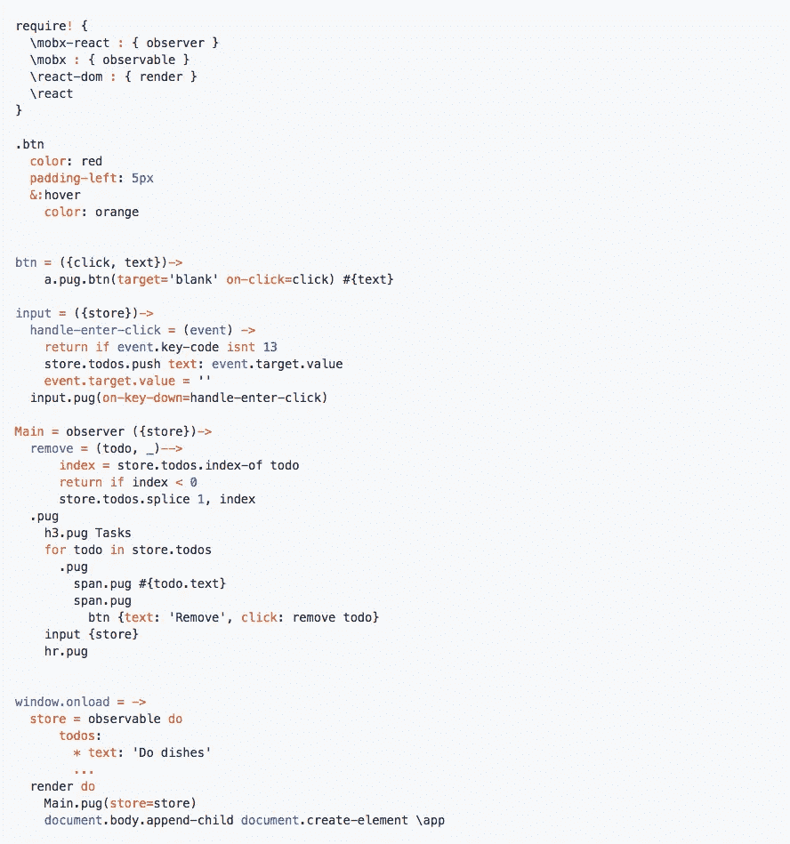

# React + LiveScript + Pug + SASS

> 原文：<https://medium.com/hackernoon/react-livescript-livescript-2-0-164d35ca5373>


我已经和 LiveScript 合作了 5 年，发现这是有史以来最好的网络语言。当然，我在之前的项目中也尝试过其他语言，比如 **Typescript** 、 **CoffeeScript** 、 **OCaml** 、 **Javascript** 、 **Haskell** 、 **C#** 、 **F#** 。但最终还是决定使用 LiveScript

*   JSON 支持
*   管道系统
*   模式匹配
*   部分应用
*   **OCaml-** like 语法
*   前奏库
*   *所有其他功能特性*

如果你熟悉功能开发，你会爱上 LiveScript。

大部分时间我都在和 AngularJS 一起做前端工作，非常满意。

我周围所有使用 **AngularJS** 的朋友都开始使用 **React** 并提供了很好的反馈，但没有人使用 **LiveScript** 。他们更喜欢用面向对象的方式编写，或者懒得学习。

我决定也尝试一下 **React** ，但是有一个小小的条件，那就是我仍将使用 LiveScript 作为我的第一语言。

最后，我感到惊讶的是 **LiveScript + React** 非常友好，我甚至没有为了使用它而离开我的舒适区。



*这里有更多的例子*[https://github.com/askucher/lsxc](https://github.com/askucher/lsxc)

为了让你更好的理解，我提供了编译后的 **LiveScript** 到 **JavaScript** 中

[https://gist . github . com/asku cher/8173 DC 8815 DC E0 df 547 ef 7 F3 b5 c 5796 e](https://gist.github.com/askucher/8173dc8815dce0df547ef7f3b5c5796e)

```
Install the **lsxc** library which provides you pug syntax to write **React DOM**.
```

这段代码看起来更加优雅，我想开发者会喜欢它的。

顺便说一下， **Pug/Jade** 语法可以用于其他目的。不仅用于 React，还用于角度模板。

加入并协作:)

[](http://bit.ly/HackernoonFB)[](https://goo.gl/k7XYbx)[](https://goo.gl/4ofytp)

> [黑客中午](http://bit.ly/Hackernoon)是黑客们如何开始他们的下午。我们是 [@AMI](http://bit.ly/atAMIatAMI) 家庭的一员。我们现在[接受投稿](http://bit.ly/hackernoonsubmission)并乐意[讨论广告&赞助](mailto:partners@amipublications.com)机会。
> 
> 如果你喜欢这个故事，我们推荐你阅读我们的[最新科技故事](http://bit.ly/hackernoonlatestt)和[趋势科技故事](https://hackernoon.com/trending)。直到下一次，不要把世界的现实想当然！

