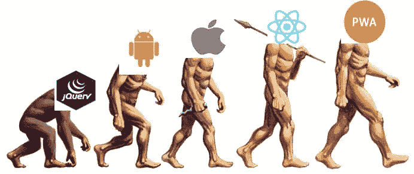
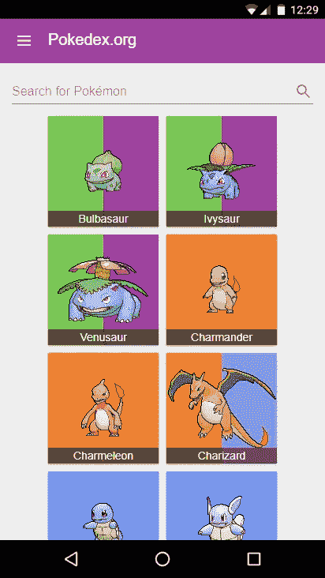

# 反应自然——一个错误问题的好答案？

> 原文：<https://medium.com/hackernoon/react-native-a-good-answer-to-the-wrong-question-bd42bcefc8ab>

React Native 是一项相对较新且令人兴奋的技术。由脸书设计，但在他们的团队之外使用，它因其简化了原生开发而获得了 web 开发者和传统原生应用开发者的青睐。[脸书](https://facebook.github.io/react-native/)这样描述它:

> React Native 允许您仅使用 JavaScript 构建移动应用程序。它使用与 React 相同的设计，允许您从声明性组件构建丰富的移动 UI

这是一个 React Native 肯定会实现的崇高目标，但像大多数事情一样，它并不像听起来那么简单。结果，它成为了错误问题的一个很好的解决方案。

那么什么是正确的问题呢？

> 如何做一个跨平台的高质量且一致的移动体验？

随着越来越多的用户使用移动设备，这无疑是一个重要的问题。台式机占主导地位的日子已经一去不复返了；移动用户现在是主要的互联网消费者。

# React Native 如何回答这个问题？

*   **React** 你写的代码和普通 React 几乎一样，只是在样式&测试上有些不同。因此，从 React 转换到 React Native 相当容易。
*   原生抽象
    React Native 使得为 Android/iOS 手机开发应用变得非常简单。你做的东西 80%都可以在两个平台上运行，开箱即用。
*   **高质量的移动应用体验** 当你发布一款原生应用时，它能让你做出一款真正高质量的应用，能做原生应用能做的一切。

# React Native 如何回答这个问题失败？

*   **说到底还是原生应用** 如果你需要一个基于网络的应用(为了迎合不会/不能下载应用的移动用户)，那就要单独构建了。

React Native 在很大程度上回答了我们的问题。它能让你创建高质量和一致的移动体验，但是，关键是，它属于跨平台部分

这是一个很好的答案…对于错误的问题。那么，它在回答什么问题呢？

> 如何做出高质量且一致的跨平台原生 app？

为什么这是个错误的问题？因为，在我看来，为不同平台(iOS/Android)打造两个原生 app 是死的。

这就是为什么 React Native 不是移动优先开发的好解决方案。它觉得不够大！

React Native 实现了对原生应用的抽象；进步的网络应用试图抽象移动开发。

# [渐进式网络应用](https://developers.google.com/web/progressive-web-apps/)

谷歌描述的渐进式网络应用:

*渐进式网络应用是具有网络影响力的用户体验，并且是:*

*   [***可靠***](https://developers.google.com/web/progressive-web-apps/#reliable) *—即时加载，永不停机，即使在不确定的网络条件下。*
*   [***快速***](https://developers.google.com/web/progressive-web-apps/#fast) *—以丝滑流畅的动画对用户交互做出快速响应，没有笨拙的滚动。*
*   [***引人入胜***](https://developers.google.com/web/progressive-web-apps/#engaging) *—感觉就像设备上的一个自然应用程序，具有身临其境的用户体验。*

这种新的质量水平让渐进式网络应用在用户的主屏幕上赢得一席之地。

基本上，PWAs 是看起来和感觉上都像本地应用程序的网站，甚至可以保存到你的手机上供离线使用。

Mobile Development Evolution

# 为什么渐进式网络应用会赢得 React Native 的支持

React Native 还没有被取代，它仍然可以做很多网络做不到的事情，但是网络正在变得越来越好。

渐进式网络应用和 React Native 都还处于起步阶段，它们都有自己的问题。然而，我认为 pwa 将成为主导，因为他们最初比 React Native 有更少的问题。

**反应原生问题**

*   **原生设备警告**
    你最终还是要处理应用商店分发/锁定和 Android/iOS 的差异。
*   **自动化很难**
    自动化构建、测试&部署很难，因为 iOS 与 OSX/XCode 紧密相关，例如，你不能轻易利用容器架构。
*   **Android&iOS**
    TL:DR[之间不抽象端到端测试添加对 android:id 的支持破坏了 Facebooks 内部测试，因此被拒绝](https://github.com/facebook/react-native/pull/9942)。你必须使用 accessibility 标签，这个标签很糟糕。
*   **功能不全
    功能不全** React Native 还不是 1.0.0 版本。因此，许多突破性的变化仍在继续。
*   **库婴儿期**
    有很多组件不见了——我正在看你的对话框！这意味着你要花很多时间去观察社区中是否有人做了你想要的事情。这个社区既不是特别大也不是特别老，这意味着你最终会得到很多不完整的/废弃的组件，这些组件你无法使用，你将不得不自己制作。这意味着您最终会得到大量质量和一致性不一的不完整/废弃的组件。
*   **依赖杂耍**
    有了 Web Dev，你(大部分)只需要担心拥有正确的 React/Angular 版本，以及你的目标浏览器版本。使用 React Native，您必须担心 React Native 和 React (RN 目前使用 React 16 beta…)，以及 iOS/Android 构建依赖关系。试图让你的应用程序的依赖关系保持最新成为一个逻辑上的噩梦。我们目前正在使用 NavigationalExperimental，无法升级到新的导航库，因为它是一个完整的导航重写(参见 [⛵Thousand 在 React Native 中导航的方式](/the-react-native-log/thousand-ways-to-navigate-in-react-native-f7a1e311a0e8)))。因此，我们停留在 React Native v0.42.3 上。

React Native 苦于你还需要建一个网站。ReactXP 和 React Native for Web 试图通过修改 React Native 解决方案以在 Web 上使用来解决这个问题，但这似乎是对 React Native(及其所有问题)的双倍下注。你不仅要处理 React Native 的问题；你也有网络问题要解决。为什么要重新发明轮子， [React](https://facebook.github.io/react/) 已经存在，并且有一个庞大的社区和支持。

**渐进式网络应用问题**

*   这是最著名的浏览器之一，但它缺少许多制作 PWA 所需的重要功能(参见 iDevice 上的[https://whatwebcando.today/](https://whatwebcando.today/))。服务人员是缺失的功能之一，尽管它正在开发中。
*   硬件支持
    Safari 也缺少很多硬件支持；具体功能参见设备&上的[https://whatwebcando.today/](https://whatwebcando.today/)和[https://caniuse.com/](https://caniuse.com/)。与 React Native 不同，如果需要的话，您无法深入底层并与现有/新的 Java/Objective C/Swift 代码集成。
*   **向后兼容支持**
    由于这些功能只会出现在未来的浏览器版本中，因此不可能将旧浏览器支持到与原生应用相同的水平。

## 渐进式 Web 应用程序示例

[https://pwa.rocks/](https://pwa.rocks/)有很多 PWAs 的好例子，包括一些已经采用 PWAs 作为前进方向的大公司。其中包括全球速卖通、推特和福布斯。您可以在 [PWA 展示页面](https://developers.google.com/web/showcase/)上了解这些公司的更多信息。我最喜欢的是[Pokedex.org](https://www.pokedex.org/)。

[Gotta Catch ’Em All](https://www.youtube.com/watch?v=SVp-zIONsrs)

反应本地姿态的问题比那些进步的网络应用更难。PWAs 背后也有大量的开发，因为它们不是新技术，它们只是用 React 或 Angular 编写的非常好的移动应用程序。这意味着所有已经存在的优秀库都可以用来构建你的应用程序；你不必创建新的对话框，只需使用 [Material-UI one](http://www.material-ui.com/#/components/dialog) 。谷歌提供了大量的资源来帮助你将你的新网络应用构建成 PWA，比如[灯塔工具](https://developers.google.com/web/tools/lighthouse/)和这个[清单](https://developers.google.com/web/progressive-web-apps/checklist)。

## 未来

现在，如果你能制作一个 iOS 和 Android 应用，React Native 是一个很好的解决方案——它将所需的工作量减半。然而，如果 android/web 是你的主要用户群，pwa 是必由之路——也是让它们现在就存在的工具……希望 iOS 不会花太长时间来添加对 pwa 的适当支持，这样你也可以向他们推广它。

那个问题是什么来着？正确的，而不是错误的:

> 如何做一个跨平台的高质量且一致的移动体验？

如果你想用最好的用户/开发者体验和最小的成本来回答这个问题，那么我的钱在渐进式 Web 应用上。

## 延伸阅读和资源

 [## 为什么“渐进式网络应用与原生应用”是一个错误的问题

### 2017 年 4 月更新

medium.com](/dev-channel/why-progressive-web-apps-vs-native-is-the-wrong-question-to-ask-fb8555addcbb)  [## SE-Radio 第 300 集:乔纳森·斯塔克谈移动应用开发

### 内特·布莱克就移动应用开发采访乔纳森·斯塔克。主题包括:移动开发平台…

www.se-radio.net](http://www.se-radio.net/2017/08/se-radio-episode-300-jonathan-stark-on-mobile-app-development/)  [## 灯塔|网络|谷歌开发者

### 了解如何设置 Lighthouse 来审核您的 web 应用程序。

developers.google.com](https://developers.google.com/web/tools/lighthouse/)  [## 原生应用注定要失败

### 从现在开始，我不会再开发任何本地应用了。我所有的应用都将是渐进式的网络应用…

medium.com](/javascript-scene/native-apps-are-doomed-ac397148a2c0)  [## 这个问题的核心是一个令人惊讶的权衡:是构建一个本地应用还是 Web 应用

### 选择在网站上构建原生应用程序通常是因为应用程序“感觉”比网站好得多，而且…

medium.com](/@owencm/the-surprising-tradeoff-at-the-center-of-question-whether-to-build-an-native-or-web-app-d2ad00c40fb2)