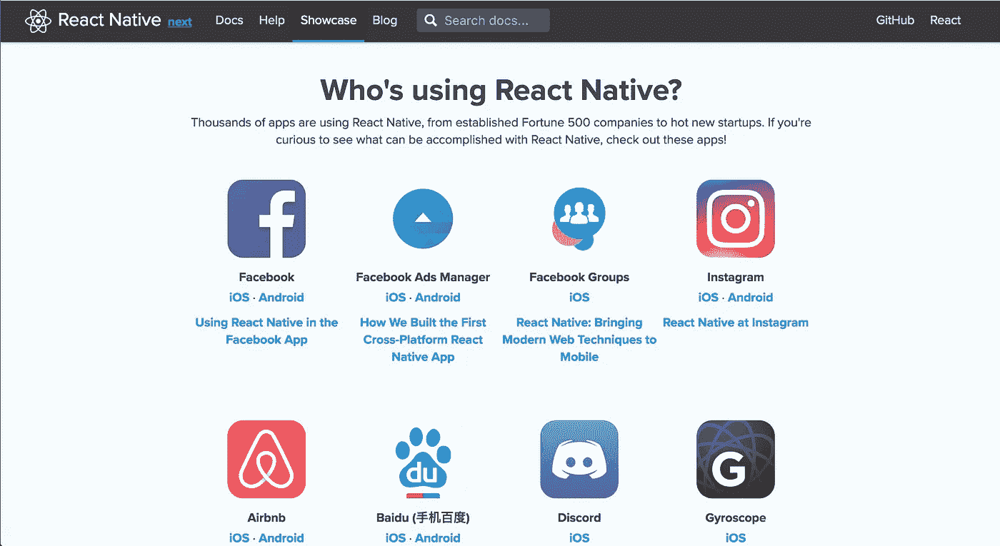
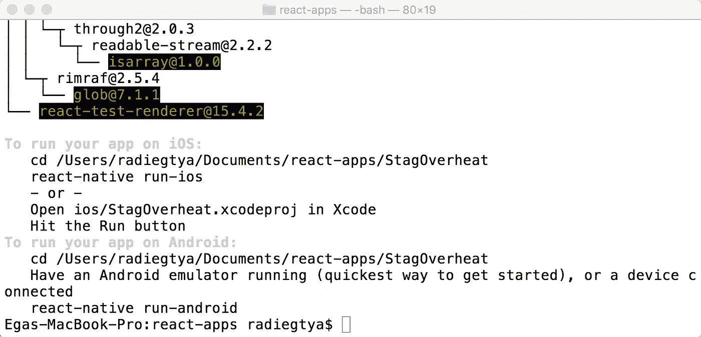
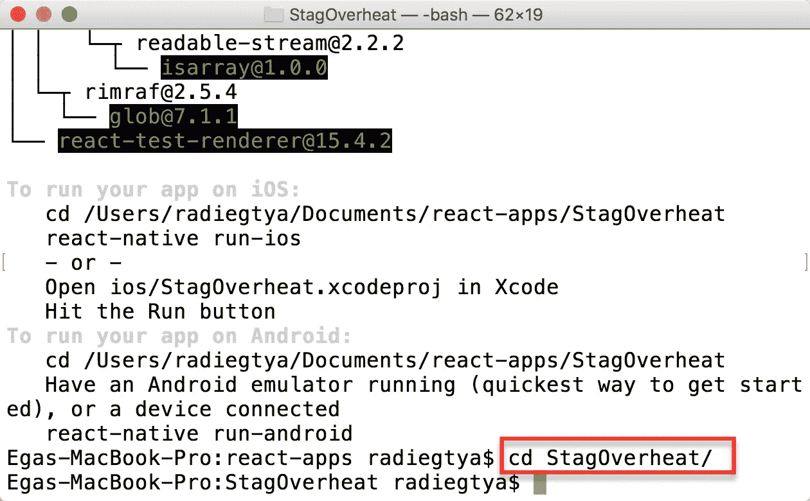
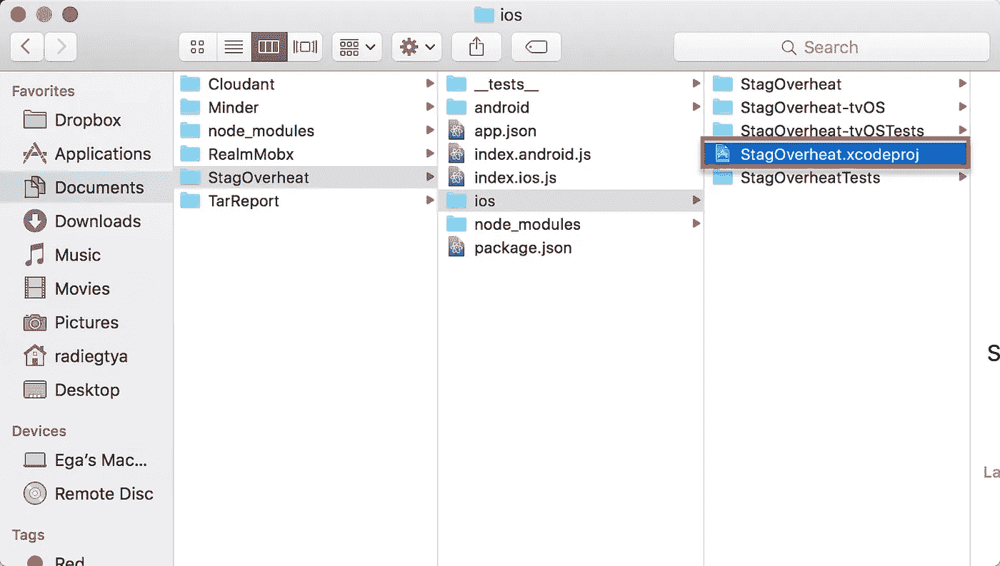
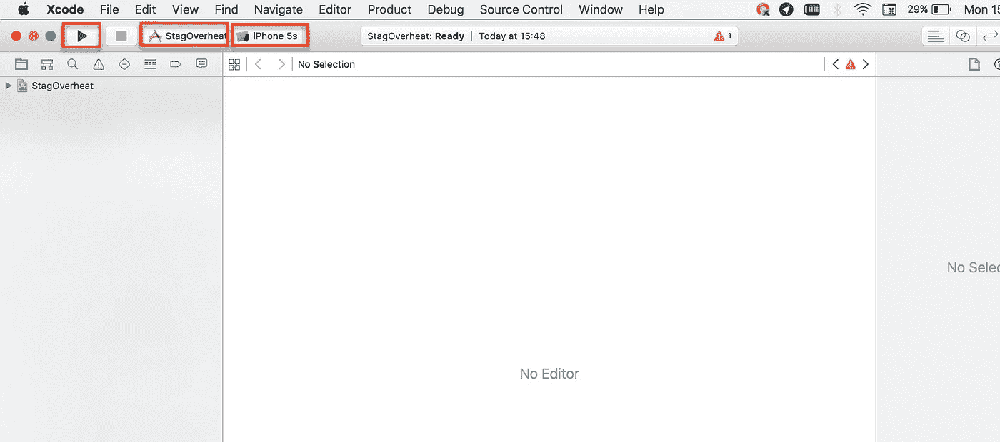
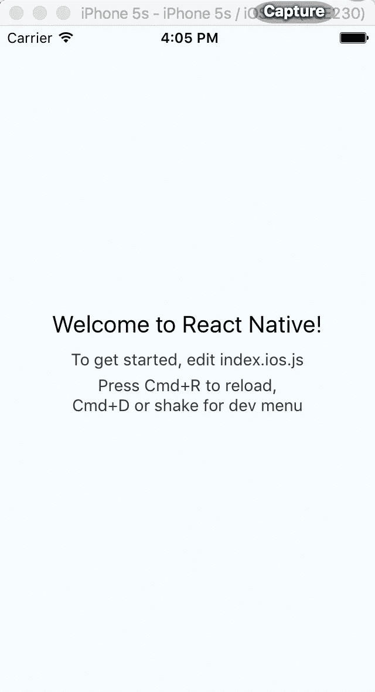
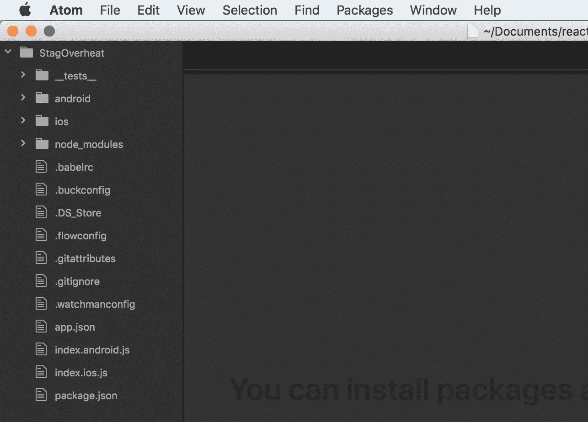
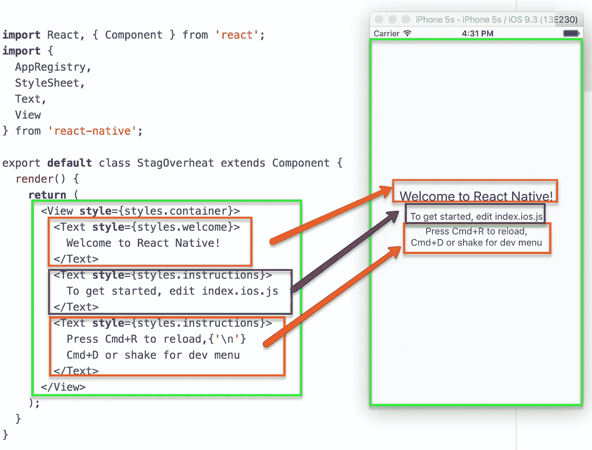
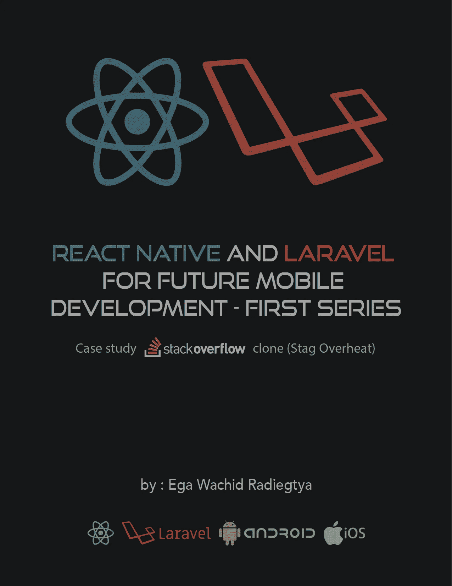

# React Native 和 Laravel 面向未来移动开发

> 原文：<https://medium.com/hackernoon/react-native-and-laravel-for-future-mobile-development-f86fdee9e554>

## REACT NATIVE & LARAVEL 游戏攻略

React Native 是由 [facebook](https://hackernoon.com/tagged/facebook) 开发的一个开源框架，它使得开发者只需使用 [Javascript](https://hackernoon.com/tagged/javascript) 就可以更容易地开发真正的原生应用或在 iOS 或 Android 上感觉原生的应用。这是可能的，因为 React Native 使用 React Bridge 将 Javascript 代码转换为本机 iOS (obj-c)或本机 Android (Java)。它不像使用 webview 的混合移动应用程序，如 cordova/phonegap。

我尝试为我的几个企业应用程序开发 React Native，这些应用程序已经被许多人和公司用于 Android 和 iOS。React Native 还帮助我们更快地开发，因为它只需要 Javascript 来开发。

React Native 也被一些大公司使用。你可以在 https://facebook.github.io/react-native/showcase.html 的[看到展示。](https://facebook.github.io/react-native/showcase.html)



Picture 1.1 React Native Showcase

您不需要被迫使用 React Native 进行移动开发。真正的原生 Android 或 iOS 现在仍然是一个很好的选择。

## 在 MAC OS 上安装 RN ANDROID

**节点&守夜人**

http://brew.sh/建议使用 Node 进行安装，而 Watchman 使用自制软件([)进行安装。安装 Homebrew 后，在终端中运行以下命令:](http://brew.sh/)

```
$ brew install node
$ brew install watchman
```

**React Native CLI**

Node.js 附带了 npm，它允许您安装 React 本机命令行界面。

在终端中运行以下命令:

```
$ npm install -g react-native-cli
```

**Android 开发环境**

1.  **下载丹安装安卓工作室**

您可以使用此链接下载 Android studio:
[https://developer.android.com/studio/install.html](https://developer.android.com/studio/install.html)

Android studio 需要运行和测试 React 本地应用程序。

Android Studio 需要最新版本的 [Java SE 开发套件(JDK)](http://www.oracle.com/technetwork/java/javase/downloads/jdk8-downloads-2133151.html) 版本 8。要确保已经安装了 java，请在终端/命令提示符下键入“javac -version”。如果您的计算机上没有安装 JDK，请访问以下链接:

[http://www . Oracle . com/tech network/Java/javase/downloads/JDK 8-downloads-2133151 . html](http://www.oracle.com/technetwork/java/javase/downloads/jdk8-downloads-2133151.html)

**2。安装 AVD dan HAXM**

Android 虚拟设备允许你在电脑上运行 Android 应用程序，而不需要实际的 Android 手机或平板电脑。第一次运行 Android Studio 时选择`Custom`安装。确保选中以下所有选项旁边的框:

*   Android SDK
*   Android SDK 平台
*   性能(英特尔 HAXM)
*   Android 虚拟设备

然后，单击“下一步”安装所有这些组件。

> [https://developer . Android . com/studio/run/emulator-acceleration . html # VM-Linux](https://developer.android.com/studio/run/emulator-acceleration.html#vm-linux)

**3。安装安卓 6.0(棉花糖)SDK**

Android Studio 默认安装最新的 Android SDK。然而，React Native 需要`Android 6.0 (Marshmallow)` SDK。要安装它，启动 SDK 管理器，在“欢迎使用 Android Studio”屏幕中点击“配置”。

SDK 管理器也可以在 Android Studio“首选项”菜单中找到，在**外观&行为** → **系统设置** → **Android SDK** 下。

从 SDK 管理器中选择“SDK 平台”，然后选中“显示软件包详细信息”旁边的框。查找并展开`Android 6.0 (Marshmallow)`条目，然后确保以下项目都被选中:

*   谷歌 API
*   英特尔 x86 凌动系统映像
*   英特尔 x86 Atom_64 系统映像
*   Google APIs 英特尔 x86 Atom_64 系统映像

接下来，选择“SDK Tools”选项卡，并选中“Show Package Details”旁边的框。查找并展开“Android SDK 构建工具”条目，然后确保选择了`Android SDK Build-Tools 23.0.1`。

最后，点击“应用”下载并安装 Android SDK 和相关的构建工具。

**4。设置 ANDROID_HOME 环境变量**

React 本地命令行界面需要设置`ANDROID_HOME`环境变量。

将下面几行添加到您的`~/.profile`(或等效的)配置文件中:

```
export ANDROID_HOME=${HOME}/Android/Sdkexport PATH=${PATH}:${ANDROID_HOME}/toolsexport PATH=${PATH}:${ANDROID_HOME}/platform-tools
```

键入`source ~/.profile`将配置加载到您当前的 shell 中。

请确保您为`ANDROID_HOME`导出了正确的路径。如果你用自制软件安装了 Android SDK，它将位于`/usr/local/opt/android-sdk`。

**启动安卓虚拟设备**


Gambar 1.2 Starting AVD on Mac Os

你可以通过打开 Android Studio 中的“AVD 管理器”来查看可用 AVD 的列表。您也可以在终端中运行以下命令:

```
$ android avd
```

在“AVD 管理器”中，选择您的 AVD 并点击“编辑…”。在设备下选择“Android 6.0 — API Level 23”，在 CPU/ABI 下选择“英特尔凌动(x86_64)”。点击确定，然后选择您的新 AVD，并点击“开始…”最后，“启动”。

## 在 MAC OS 上安装 RN iOS

**节点&守夜人**

http://brew.sh/，脸书推荐使用 Node 安装，Watchman 使用家酿。安装 Homebrew 后，在终端中运行以下命令:

```
$ brew install node$ brew install watchman
```

**React Native CLI**

Node.js 附带了 npm，它允许您安装 React 本机命令行界面。

在终端中运行以下命令:

```
$ npm install -g react-native-cli
```

**Xcode**

安装 Xcode 最简单的方法是通过 [Mac App Store](https://itunes.apple.com/us/app/xcode/id497799835?mt=12) 。安装 Xcode 也会安装 iOS 模拟器和所有必要的工具来构建您的 iOS 应用程序。

## 初始化 RN 项目堆栈溢出克隆(STAG 过热)

完成各种安装后，使用 React Native 命令行界面生成新的 React Native 应用程序，命名为“StagOverheat”，然后运行命令“react-native-run-ios”，或者导航 Xcode 到目标文件夹。

```
$ react-native init StagOverheat$ cd StagOverheat$ react-native run-ios
```

在本文中，作者将只使用 Xcode 和 iOS 作为模拟器来模拟将要制作的应用程序。对于 Android，您可以轻松地首先运行 Android 模拟器，然后简单地运行命令“react-native run-android”。

对于编程初学者来说，上面的步骤可能不是很清楚。所以，让我们从视觉上练习。

1.  **初始化名为 StagOverheat 的 RN 项目**

您可以随时在任何想要的文件夹中创建项目。在我的 Mac 上，我使用目录~/Documents/react-apps

```
$ cd Documents/react-apps/
$ react-native init StagOverheat
```

等待一段时间，所以它出现如下



Picture 1.3 Init StagOverheat Succeded

**2。将目录更改为 stag overhead**

stag overhead 项目创建完成后，你可以进入 stag overhead 文件夹。



Picture 1.4 Change Directory to StagOverheat

**3。通过 Xcode 运行 iOS 模拟器**

您可以通过键入“react-native run-ios”来运行该应用程序，或者在您的应用程序文件夹中打开 Xcode，如下所示。



Picture 1.5 Create xcodeproj on application folder

双击 stag overhead . Xcode proj，让 Xcode 出现在你的 Mac 上



Picture 1.6 XCODE Display

你应该注意 3 个主要按钮，从左边看，第一个是播放按钮，用于启动 iOS 模拟器，第二个是模式，确保与上面的图片一致，第三个是将用于运行模拟器的设备选项，在上面的图片中，我们选择了 iphone 5s 以获得更舒适的视图。如果一切正常，单击 play 按钮，确保显示“Build Success ”,然后查看模拟器，如下所示:



Picture 1.7 iOS Simulator Display

**4。代码结构**

用你喜欢的文本编辑器或 IDE 打开“StagOverheat”项目文件夹。在本书中，我使用 Atom 作为文本编辑器(https://atom.io/)。要打开，只需键入以下命令:

```
$ atom .
```



Picture 1.8 StagOverheat Code Structure

我们可以看到 react-native-cli 生成的 React 原生结构代码。既然我们用的是 iOS，那么我们就把重点放在一个文件“index.ios.js”上。不要担心你想建立 Android 应用程序，我们将在下一次讨论中讨论它。


Picture 1.9 index.ios.js code

让我们逐一讨论这些代码:

1.  从 React 类导入对象组件。
2.  导入组件根据需要进行本地反应。
3.  导出名为 StagOverheat 的主类，它从我们从 React 导入的组件继承了
    。
4.  将结果渲染或显示到屏幕上。渲染功能应该由每个组件拥有，该组件可以显示所有的数据显示。Text 用于
    显示文本。而在 html 中用 View 代替“div”，而样式将在下一章介绍。对于代码的解释，可以更容易地看到下图:



Picture 1.10 Render Detail

目前就这些了。希望它能帮助你理解 React Native 的基本用法。这篇文章是我的电子书**“React Native 和 Laravel for Future Mobile Development——第一辑”**的一部分。如果你愿意学习更多关于 React Native 的知识，这本书是给你的。我**如果你幸运的话，前 100 名买家会有特别折扣，以下是链接:**

[https://leanpub.com/rn_laravel/c/uoMEakQzBH9g](https://leanpub.com/rn_laravel/c/uoMEakQzBH9g)

[](http://bit.ly/HackernoonFB)[](https://goo.gl/k7XYbx)[](https://goo.gl/4ofytp)

> [黑客中午](http://bit.ly/Hackernoon)是黑客如何开始他们的下午。我们是 [@AMI](http://bit.ly/atAMIatAMI) 家庭的一员。我们现在[接受投稿](http://bit.ly/hackernoonsubmission)并乐意[讨论广告&赞助](mailto:partners@amipublications.com)机会。
> 
> 如果你喜欢这个故事，我们推荐你阅读我们的[最新科技故事](http://bit.ly/hackernoonlatestt)和[趋势科技故事](https://hackernoon.com/trending)。直到下一次，不要把世界的现实想当然！

