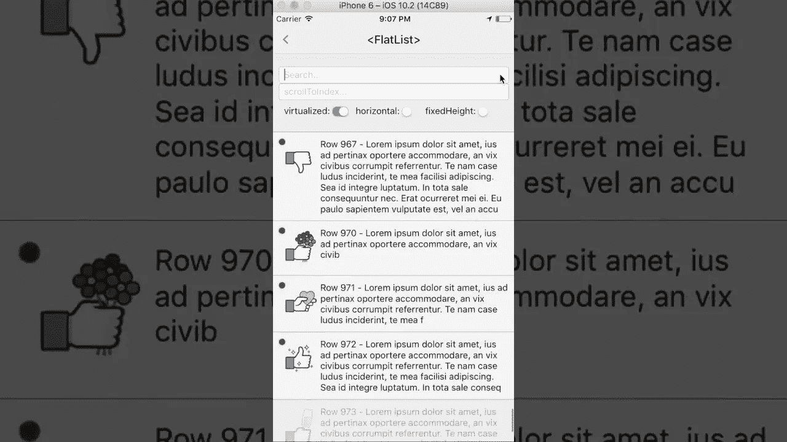

# React Native 的新 FlatList 组件

> 原文：<https://medium.com/hackernoon/react-native-new-flatlist-component-30db558c7a5b>

*包括:如何从* `*ListView*` *(即将成为* [*弃用*](https://github.com/facebook/react-native/commit/a3457486e39dc752799b1103ebe606224a8e8d32#commitcomment-21097746) *)迁移过来，如何在自己的 app 中不从源码构建 React Native 进行尝试。*

The demo video [posted on Facebook](https://www.facebook.com/spencer/videos/10106313941687053/) by Ahrens. Image link goes to YouTube.

*更新 4:现在已经足够稳定，可以默认从*[*React-Native-不可变-list-view*](https://github.com/cooperka/react-native-immutable-list-view#immutablevirtualizedlist)*with*[*React*](https://hackernoon.com/tagged/react)*Native v 0.43 导出，无需自定义下载！请继续阅读轻松迁移的步骤。*

*更新 3:3 月 1 日起* [*不再实验*](https://github.com/facebook/react-native/commit/7b35eb3fdb803ddb00a82d0cda7904771f15e438) *。下面的一切仍然是最新的和准确的。*

*更新 2:现在有多个新组件:*[*flat list*](https://github.com/facebook/react-native/blob/master/Libraries/Lists/FlatList.js)*，*[*section list*](https://github.com/facebook/react-native/blob/master/Libraries/Lists/SectionList.js)*，*[*virtualized list*](https://github.com/facebook/react-native/blob/master/Libraries/Lists/VirtualizedList.js)*，以及*[*virtualized section list*](https://github.com/facebook/react-native/blob/master/Libraries/Lists/VirtualizedSectionList.js)*。他们的位置已经移动了几次，但是下面的链接应该是最新的。*

*更新 1:原*[*ListView*](https://facebook.github.io/react-native/docs/listview.html)*为* [*计划弃用*](https://github.com/facebook/react-native/commit/a3457486e39dc752799b1103ebe606224a8e8d32#commitcomment-21097746) *。*

二月早些时候，[永远不支持](https://medium.com/u/6b0501eb19c#commitcomment-20777251)像`[ListView](https://facebook.github.io/react-native/docs/listview.html#rendersectionheader)` [一样拥有](https://facebook.github.io/react-native/docs/listview.html#rendersectionheader)；为此，有一个单独的组件叫做`SectionList`，或者你可以直接使用较低级别的`VirtualizedList`。

如果您觉得这很有用，请点击**来帮助您👏想按多少次**就按多少次，这样其他人也能找到。谢谢大家！

请关注更多更新，我会保持这篇文章的更新。