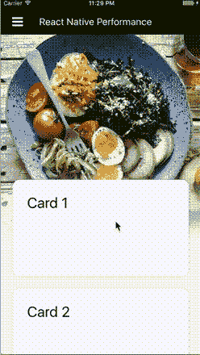
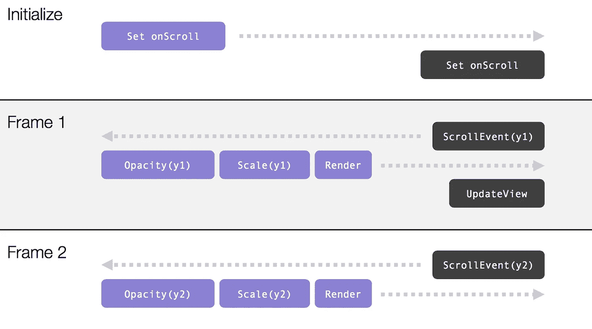
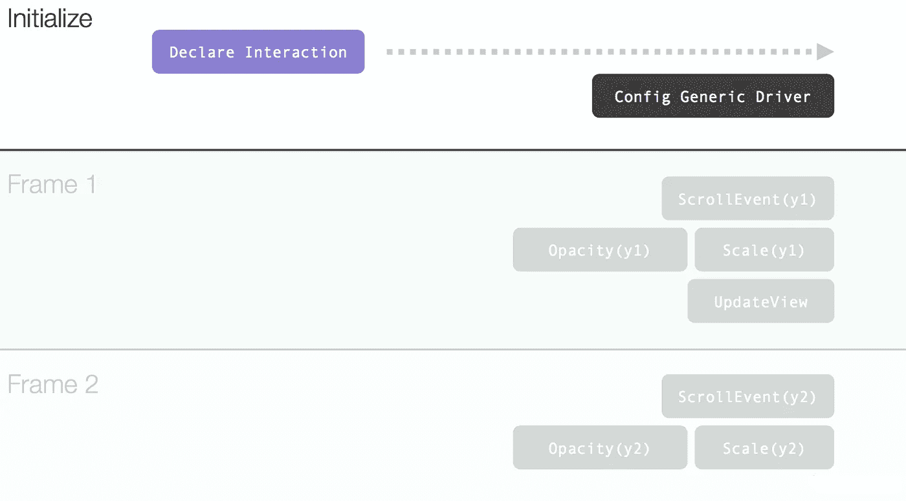
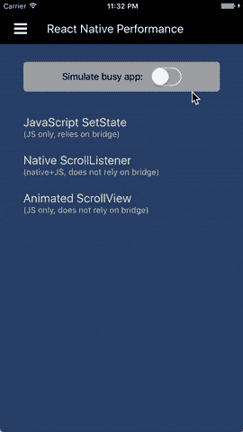

# 反应本机性能—更新的示例

> 原文：<https://medium.com/hackernoon/react-native-performance-an-updated-example-6516bfde9c5c>

我正在为 [React Amsterdam 2017](https://react.amsterdam/) 进行我的性能演讲，它基于帖子“[React Native 的性能限制以及如何克服它们](/@talkol/performance-limitations-of-react-native-and-how-to-overcome-them-947630d7f440)”。我决定更新一下我们将要讨论的例子，以便介绍一些令人兴奋的新 API。

## 一些背景

在这篇文章中，我们假设你已经熟悉了[React Native](https://hackernoon.com/tagged/react-native)——*Native realm*,[*JavaScript*](https://hackernoon.com/tagged/javascript)*realm*和连接两者的*桥*的基本架构。如果没有，这个话题会在[上一篇](/@talkol/performance-limitations-of-react-native-and-how-to-overcome-them-947630d7f440)中详细讨论。

让我们也记住前一篇文章的主要结论，它将指导我们以性能为导向的讨论:

> 为了构建高性能的 React 本机应用程序，我们必须尽量减少过桥次数。

因此..是时候进入我们新的有趣用例了，事实证明，用 React Native 以一种高性能的方式实现这个用例并不容易。

## 一个新的现实生活的例子

我们的用例灵感来自[Wix.com 应用](https://itunes.apple.com/il/app/wix.com/id1099748482?mt=8)的主屏幕。屏幕上有一堆卡片，并包含一个欢迎用户使用该应用程序的大标题图像。这是 UX 的样子:

注意两个有趣的效果。第一个——当用户向下滚动卡片列表时，标题图像慢慢消失在灰色背景中。第二种——如果用户向上滚动并且已经在列表的顶部，为了移动的连续性，标题图像稍微缩放直到它反弹回来(这被称为*过度滚动效应*)。

像这样的影响可能看起来很小，但却是最后一英里的一部分，它创造了神奇的用户体验，并将平庸的应用程序与伟大的应用程序区分开来。不过，我们必须小心实现。如果它不能以 60 FPS 的速度流畅运行，效果可能会适得其反，降低用户的沉浸感，而不是增强它。

屏幕的一般组件布局非常简单:

请注意，标题图像不是 ListView 的一部分，因为它保持静态，不随列表内容滚动。还要注意，我们仍然使用旧的 [ListView](https://facebook.github.io/react-native/docs/listview.html) 实现，而不是推荐的 [FlatList](https://facebook.github.io/react-native/docs/flatlist.html) 。这是因为 ListView 提供了一些额外的[灵活性，而这在 FlatList 中还没有。](https://facebook.github.io/react-native/docs/listview.html#renderscrollcomponent)

## 我们的第一个实现 JavaScript 中的 onScroll 事件

像往常一样，我们将从简单的方法开始。如果我们希望效果与滚动位置相关联，我们可以监听滚动事件。每当滚动位置改变时，我们的事件监听器将被触发，我们将能够重新呈现标题图像并应用适当的效果。

这个设置有些棘手，因为 [ListView](https://facebook.github.io/react-native/docs/listview.html) 没有公开用于滚动内容的内部 [ScrollView](https://facebook.github.io/react-native/docs/scrollview.html) 。它允许我们使用`[renderScrollComponent](https://facebook.github.io/react-native/docs/listview.html#renderscrollcomponent)` prop 提供自己的自定义 ScrollView。

将效果应用到标题图像就像定义样式属性一样简单。我们将使用`[opacity](https://facebook.github.io/react-native/docs/view.html#style)`来控制溶解效果，使用`[transform.scale](http://facebook.github.io/react-native/releases/0.40/docs/transforms.html)`来控制缩放效果。我们将在本地组件状态中存储两者的值，并通过调用`setState`来重新呈现。

这是完整的实现:

如你所见，在每个`onScroll`事件中，我们根据滚动位置(`contentOffset`)来决定应用哪种效果。如果滚动位置为正(向下滚动)，不透明度从`1.0`降低到`0.0`。如果滚动位置为负(向上过度滚动)，刻度从`1.0`增加到`1.4`。

## 第一次尝试—性能分析

我们应该从这个实现中期待什么样的性能？主要的性能瓶颈可能是通过桥的次数。

让我们通过分析运行在 *JavaScript 领域*(左边的紫色)和运行在*本地领域*(右边的黑色)中的内容来计算通过次数:

就像任何其他视图事件一样，滚动事件起源于*本地领域。*我们的 JavaScript 逻辑运行在 *JavaScript 领域*中。一旦我们重新渲染，新的视图属性必须应用到*本地领域*中的实际本地视图。这意味着我们每一帧都要过桥两次。

在繁忙的应用程序上，这将阻止我们以 60 FPS 运行。让我们改进。

## 第二种实现尝试——本机滚动监听器

关于哪些组件用 JavaScript 实现，哪些组件用纯 Native 实现，React Native 非常灵活。本地组件可以包含 JavaScript 组件，JavaScript 组件可以包含本地组件。

每当我们遇到性能问题时，我们通常可以从帽子里拉出这只兔子。将我们的一个组件移植到 native 通常可以解决问题。让我们试着在这里应用这个原则。

我们的性能瓶颈源于用 JavaScript 实现我们的滚动监听器。由于滚动事件起源于*本地领域*，在 JavaScript 中执行我们的`onScroll`逻辑总是会产生开销。让我们将`onScroll`逻辑移到本机。

`onScroll`的目的是更新视图属性(不透明度和比例)。我们也可以通过在 native 中关闭整个循环来节省过桥的时间。我们可以用一个原生容器组件(方便地命名为`NativeWrapper`)来包装图像，而不是直接改变标题图像的不透明度和比例，这将改变它自己的属性。这是可行的，因为容器的不透明度和缩放也会影响其子容器。这个`NativeWrapper`组件将包含我们的`onScroll`逻辑的本地实现。

我们的新布局:

到目前为止，唯一的挑战是将我们的本地 scroll 监听器连接到正确的 ScrollView。ScrollView 是 ListView 的一部分，它既不是我们的`NativeWrapper`的子视图也不是父视图。为了连接侦听器，我们需要能够从本机实现中找到它。每个 React 组件都有一个*节点句柄*——有时称为 *React 标签*。这只是唯一标识该组件实例的编号。我们可以使用`[ReactNative.findNodeHandle](https://github.com/facebook/react/blob/72196da82915bee400edb1599d4223926aa2a8a0/src/renderers/native/findNodeHandle.js#L59)`找到这个数字，并简单地将它作为道具传递给`NativeWrapper`。

现在 JavaScript 方面已经设置好了，是时候用 Objective-C 来弄脏我们的手了。

将`onScroll`逻辑本身移植到 Objective-C 很容易。代码实际上看起来几乎完全一样。不用调用`setState`来更新视图属性，我们可以简单地直接改变视图属性，因为我们是在*本地领域*中运行的。

这里唯一的挑战还是挂钩我们的本地滚动监听器。一旦 ScrollView 的数字*节点句柄*通过 props 到达，我们需要将其转换回视图对象引用，以便访问底层的 ScrollView 实例。这涉及到一点借用的样板文件，它使用 [UIManager](https://github.com/facebook/react-native/blob/bc1ea548d0017f131c36a30ce06bf4d512cb2f8c/React/Modules/RCTUIManager.h) 来完成翻译。

这是目标 C 的实现:

如您所见，`onScroll`的实现与 JavaScript 的几乎相同。如果滚动位置为正(向下滚动)，不透明度自然从`1.0`降低到`0.0`。如果滚动位置为负(向上过度滚动)，比例自然从`1.0`增加到`1.4`。

## 第二次尝试—性能分析

我们预计性能会好得多，因为这种实现是为减少过桥次数而定制的。

让我们通过分析在 *JavaScript 领域*(左边的紫色)和*原生领域*(右边的黑色)中运行的东西来统计遍数:

这并不奇怪，我们确实已经消除了初始化后的所有过桥通道。相应地，滚动事件的处理和视图属性的更新现在都发生在*本地领域*中。

尽管如此，我们还是不开心。这种实现可能是高性能的，但是它相当复杂，并且需要本地的专业知识。我们能从 JavaScript 中做同样的事情吗？

## 第三次是一种魅力——胜利的宣告式 API

那么，我们能从 JavaScript 中做同样的事情吗？这是 React Native 的百万美元问题。为了让框架真正有用，我们必须找到解决这些性能问题的方法，而不求助于本机代码。

自从[上一篇文章](/@talkol/performance-limitations-of-react-native-and-how-to-overcome-them-947630d7f440)以来，这是一个已经取得很大进展的领域。减少过桥次数的关键是*声明式 API* 。它允许我们在 JavaScript 中预先声明行为，序列化整个声明，并在初始化期间通过桥发送一次。从这一点开始，一个通用的*本机驱动程序*——一个你不需要自己编写的驱动程序——将根据声明的规范在*本机领域*中执行行为。

我们想要的行为由两部分组成—监听滚动位置的变化和更新视图属性(不透明度和缩放)。对于后者，我们知道 [Animated](https://facebook.github.io/react-native/docs/animated.html) ，作为核心一部分的优秀动画库，提供了很好的支持。

鲜为人知的是，Animated 也可以基于滚动事件[驱动一个](https://github.com/facebook/react-native/blob/c7387fefc85fd15dceadfa291857099ed3e848b8/Examples/UIExplorer/js/NativeAnimationsExample.js#L195)`[Animated.Value](https://facebook.github.io/react-native/docs/animated.html#animatedvalue)`。

这是怎么回事？让我们进入完整的实现:

我们从定义一个`Animated.Value`开始，我们将使用它在任何给定的时间保持滚动位置。我们为 ListView 提供了一个定制的 ScrollView 组件——一个`Animated.ScrollView`，而不是一个常规的 ScrollView。`Animated.ScrollView`让我们声明我们的`Animated.Value`由本地`onScroll`事件的`contentOffset`属性驱动。

从这一点开始，我们可以使用基于`Animated.Value`的内插视图属性的标准动画方法。这需要将我们的标题图像改为`Animated.Image`，并允许我们从滚动位置插入`opacity`和`transform.scale`。

注意，整个实现是声明性的。我们不再有一个强制性的`onScroll`函数来计算我们的效果。

还要注意，我们已经指定了`useNativeDriver`。React Native 最新版本中动画库的实现最终包含了一个*本机驱动程序*，它可以在不使用桥的情况下执行来自*本机领域*的整个声明。

## 第三次尝试—性能分析

像往常一样，我们将通过分析运行在 *JavaScript 领域*(左边的紫色)和运行在*本地领域*(右边的黑色)中的内容来计算通过次数:

在 *JavaScript 领域*中唯一运行的部分是我们声明的初始化。整个声明的行为被序列化并通过桥发送一次，以便配置动画的通用本地驱动程序*。*

配置好驱动程序后，它会在*本地领域*中为我们一帧一帧地进行处理，无需额外的过桥。这一部分已经变灰，因为它不再由我们的代码负责。

## 比较三种实现

GitHub 上提供了所有三个实现的完整代码:

 [## wix/rn-性能-实验 2

### rn-perf-experiments2 -重温反应本机性能实验

github.com](https://github.com/wix/rn-perf-experiments2) 

这个演示项目让您选择使用哪个实现，以便可以并排比较它们。尝试在真实设备上运行它。在模拟器上判断性能通常是不准确的。

由于它只是一个简单的演示应用程序，所以很少有无关的桥梁活动。您可能不会注意到实现之间的任何差异。为了帮助这一点，演示应用程序提供了一个开关来模拟大量活动的压力条件。如您所见，打开它将使性能差异更加明显:

## 摘要

构建高性能的 React 本机应用程序并不总是简单明了的。通常你应该从简单的方法开始，但是如果你开始注意到你的应用程序的性能问题，总是要考虑过桥的次数。

随着框架的成熟，容易产生大量桥接流量的常见任务可以通过声明式 API 来解决，该 API 旨在减少桥接次数。[动画](https://facebook.github.io/react-native/docs/animated.html)库就是一个很好的例子。另一个有趣的例子是[react-native-interactive](https://github.com/wix/react-native-interactable)，我已经在 [ReactConf 2017](https://youtu.be/mjsv8NJnt5k) 中演示过了。要了解更多信息，请查看帖子“[在 React Native](https://hackernoon.com/moving-beyond-animations-to-user-interactions-at-60-fps-in-react-native-b6b1fa0ba525) 中以 60 FPS 的速度超越动画到用户交互”。

如果遇到瓶颈，找不到解决性能问题的声明式 API，您总是可以依靠本机实现。让一两个本地开发人员加入你的团队，像我们在第二个实现中所做的那样，将有问题的部分移植到本地。它并不总是漂亮的，但它的工作。

> [黑客中午](http://bit.ly/Hackernoon)是黑客如何开始他们的下午。我们是 [@AMI](http://bit.ly/atAMIatAMI) 家庭的一员。我们现在[接受投稿](http://bit.ly/hackernoonsubmission)并乐意[讨论广告&赞助](mailto:partners@amipublications.com)机会。
> 
> 如果你喜欢这个故事，我们推荐你阅读我们的[最新科技故事](http://bit.ly/hackernoonlatestt)和[趋势科技故事](https://hackernoon.com/trending)。直到下一次，不要把世界的现实想当然！

