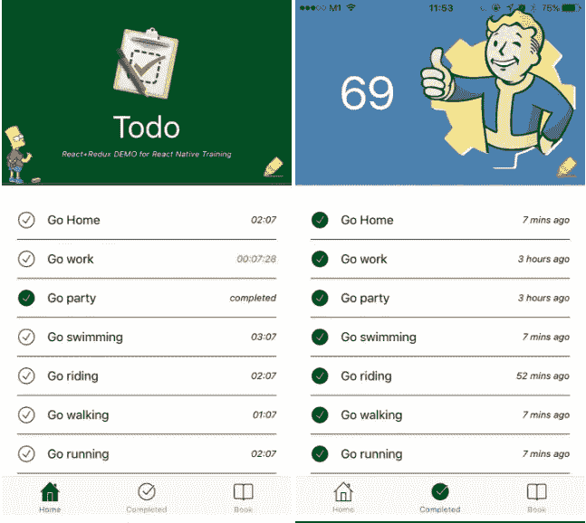
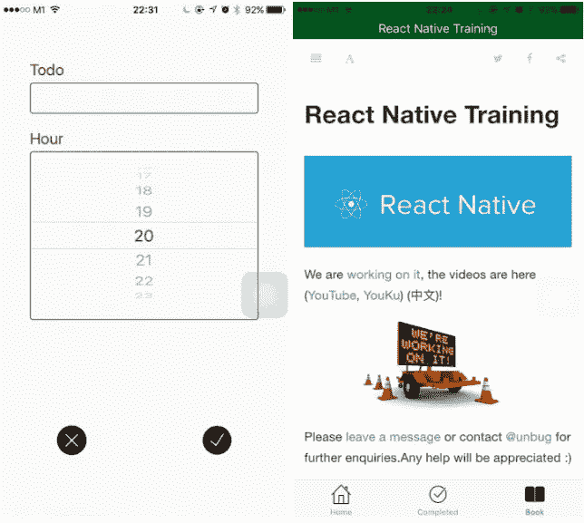
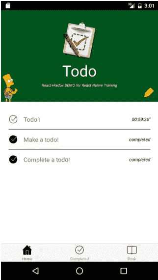

# React Native+Redux TodoMVC 演示

> 原文：<https://medium.com/hackernoon/react-native-redux-todomvc-demo-a7d67073ce5>

[https://github.com/unbug/TodoRN](https://github.com/unbug/TodoRN)

[React+Redux DEMO React 原生训练](https://www.gitbook.com/book/unbug/react-native-training/details)。

> [黑客中午](http://bit.ly/Hackernoon)是黑客如何开始他们的下午。我们是 [@AMI](http://bit.ly/atAMIatAMI) 家庭的一员。我们现在[接受投稿](http://bit.ly/hackernoonsubmission)并乐意[讨论广告&赞助](mailto:partners@amipublications.com)机会。
> 
> 如果你喜欢这个故事，我们推荐你阅读我们的[最新科技故事](http://bit.ly/hackernoonlatestt)和[趋势科技故事](https://hackernoon.com/trending)。直到下一次，不要把世界的现实想当然！

