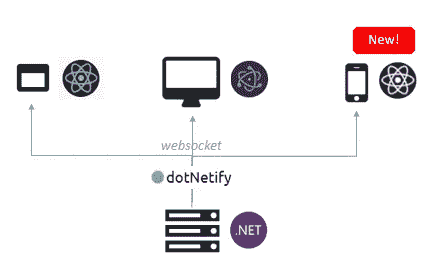

# React Native + SignalR +。带 dotNetify 的网络核心

> 原文：<https://medium.com/hackernoon/react-native-signalr-net-core-with-dotnetify-f919083170d4>



在跨平台 C#/上构建基于 React 的实时应用程序的简单、轻量级且强大的方法。网络后端。

[DotNetify](http://dotnetify.net) 是一个免费的开源项目，旨在促进实时推送模型对[使用的](https://hackernoon.com/tagged/react)网络应用做出反应。NET 作为他们的后端。它超级容易使用，可以在 WebSockets 上运行，可以在浏览器和电子桌面应用程序上工作，现在它支持 React 原生移动应用程序！

# 活性 MVVM

在 dotNetify 的[编程](https://hackernoon.com/tagged/programming)模型中，容器组件本身并不显式地获取数据，而是被动的。它们只将动作分派给后端，后端通过将与动作相关联的数据推回该组件(或者可以推回其他组件)来异步响应。

你会问，为什么这样更好？像大多数其他事情一样，它取决于用例。这种模型适用于复杂的应用程序，这些应用程序需要进行大量的数据编排、过滤、转换，可能还需要与其他(微)服务进行通信。与其在前端有这种逻辑，不如让后端来做这个。这正是它的用途。

容器组件与 MVVM 风格的后端视图模型配对。视图模型实例遵循组件的生命周期，负责以组件所需的精确形式提供数据，并通过 WebSockets 推送数据，作为对组件自身操作或其他一些外部事件的反应(例如来自物联网传感器的数据更新)。

# React Native +。网络核心演示

React Native 是构建原生移动应用的一种很好的方式，尤其是使用 create-react-native-app (CRNA)工具，即使是新手移动开发人员也可以非常快速地工作。无论是在模拟器中还是在真实设备中，在保存时自动更新代码并立即看到更改的能力极大地改善了开发人员的体验。

我提供了一个简单的用 CRNA 引导的 g [ithub 演示程序](https://github.com/dsuryd/dotnetify-react-native-demo)来展示你可以用 dotNetify 做的一些事情。您可以在本地运行服务器代码(用。NET Core，所以可以在任何地方运行:Windows、Linux、macOS)，或者使用托管在 [dotNetify 网站](http://dotnetify.net)上的那个。


## 实时仪表

演示如何实现实时数据更新。从组件构造函数中的一个简单 API 调用开始，连接到后端视图模型，数据将被定期推入组件状态，以触发重新呈现:

```
dotnetify.react.connect("LiveGaugeVM", this);
```

## 无限滚动

演示了如何实现一个随着用户向下滚动而不断增长的列表。与该功能的常见实现相比，前端没有处理查询构造、分页或数据获取的代码。这些事情都是在后端完成的；该组件只保存它所在页面的引用，并在到达结尾时请求下一页。保持你的前端轻薄简洁！

## 基于令牌的认证

DotNetify 最近有能力为其 WebSockets 通信编写中间件，这对于身份验证来说非常方便。认证令牌不是放在查询字符串中，而是放在指定为“头”的有效负载的一部分中，由后端中间件提取和验证:

```
dotnetify.react.connect("AFITop100ListVM", this, {          
   headers: { Authorization: "Bearer " + token }
});
```

# 一些警告

这个项目，连同它所依赖的技术，正处于风口浪尖。信号员。NET Core 直到 2010 年才投入生产。网芯 2.1 出来了。

虽然有一些 API 可以用来处理连接状态事件和服务器异常，但是要支持离线优先的应用程序还有很多工作要做。我目前没有把这作为优先事项，但请让我知道你的想法。

如果你对这个项目感兴趣，并想获得最新的更新，请在 [twitter @dotnetify](https://twitter.com/dotnetify) 上关注我。我也非常感谢您能在[项目的 GitHub 问题论坛](https://github.com/dsuryd/dotNetify)上发布您的问题或反馈。谢谢！