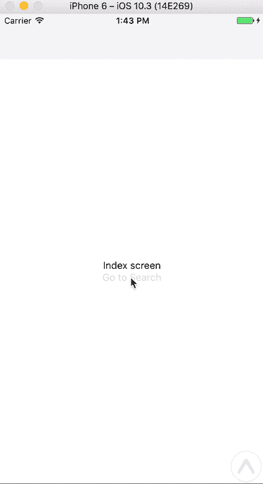
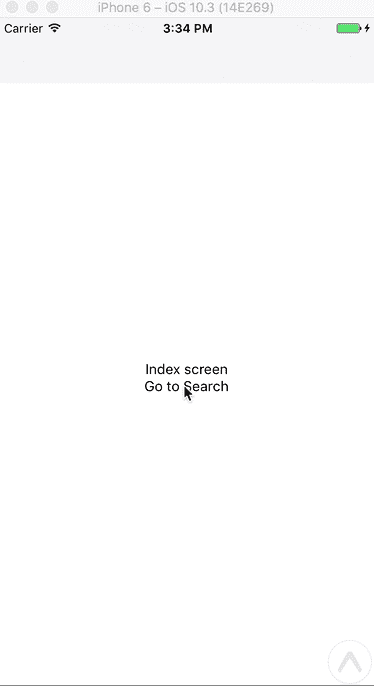

# 用 MobX 反应导航

> 原文：<https://medium.com/hackernoon/react-navigation-with-mobx-2064fcdaa25b>

(更新了^v1.1.0 反应导航系统)

这是一个帮助你建立一个 [react-native](https://hackernoon.com/tagged/react-native) 应用的逐步指南，用 [react-navigation](https://github.com/react-community/react-navigation) 作为你的导航器，用 [MobX](https://github.com/mobxjs/mobx) 驱动你的中间数据存储。完整的源代码在 [Github](https://hackernoon.com/tagged/github) 上。让我们言归正传。

* **编辑:2018 年 2 月。**

我已经更新了^1.1.0.反应导航的指南唯一需要的修改是给助手添加一个存根函数`addListener`。当然，对于事件订阅的最初目的，请在这里仔细阅读作者[所做的惊人工作。就我个人而言，我不需要这个(也许我错了？).看看然后告诉我。](https://github.com/react-navigation/react-navigation/pull/3345)

同样，完全可运行(带 expo)和更新的演示项目源是[这里是](https://github.com/pxue/react-native-navigation-mobx-demo)。

## 1.从头开始设置您的注册护士应用程序:

如果你是从零开始，一定要使用新的`create-react-native-app`命令。当您需要更多的控制和灵活性时，您可以随时更换 Expo。

```
$ yarn global add create-react-native-app
$ create-react-native-app my-project
$ cd my-project
$ yarn start
```

## 2.反应-导航

```
yarn add react-navigation
```

## 3.Mobx 和 Mobx-react 绑定

```
yarn add mobx
yarn add mobx-react
```

## 4.设置基本堆栈导航器

这个基本设置包括一个初始“索引”屏幕和一个“搜索”屏幕。通过调用`navigate`助手函数并给它一个路径名(即搜索)。



Basic stack navigation with back button.

## 5.用 MobX 替换 RN-Navigation 的内部状态

使用默认导航器，屏幕状态由导航包在内部管理。用同一个状态管理器来管理你的所有状态是一个很好的实践，无论是 Redux、MobX 还是其他。在这种情况下，MobX 应该负责所有的动作调度和状态管理。

基本导航存储来观察状态，修补调度并通过 MobX 路由它。

确保可观察对象是一个`ref`。了解更多信息。关于修饰语及其含义，请阅读 MobX [参考可观测量](https://mobx.js.org/refguide/modifiers.html)。

在主 App.js 中，用 Provider 包装呈现的视图，并将导出的商店作为属性传递给它。

功能不应该改变，但是底层导航状态现在由 MobX 管理。

## 6.从子屏幕传回更新

一个常用的功能是让子屏幕更新父屏幕上的一些参数。例如，如果用户在搜索屏幕上搜索“Cat gif ”,并导航回索引，索引屏幕应该显示“Cat gif”的结果，导航标题应该反映搜索词。



就是这样。具有基本导航的简单应用程序，由 MobX 管理状态。同样，完整的源代码可以在 Github 上看到。

## 来源和灵感:

[](https://github.com/pxue/react-native-navigation-mobx-demo) [## pxue/react-native-navigation-mobx-demo

### React-native-Navigation-mobx-demo-用 MobX 演示反应原生导航。博客文章撰写->

github.com](https://github.com/pxue/react-native-navigation-mobx-demo) [](https://github.com/react-community/react-navigation/issues/34#issuecomment-281651328) [## 这个包依赖 Redux 吗？可以配合 Mobx 使用吗？问题# 34 react-社区/react…

### 反应-导航-学习一次，导航到任何地方

github.com](https://github.com/react-community/react-navigation/issues/34#issuecomment-281651328) [](https://github.com/wojteg1337/MobXApp) [## wojteg1337/MobXApp

### 基本的 MobX 应用程序，有 FlatList，StyledComponents，Flow，react-navigation。

github.com](https://github.com/wojteg1337/MobXApp) [](http://bit.ly/HackernoonFB)[](https://goo.gl/k7XYbx)[](https://goo.gl/4ofytp)

> [黑客中午](http://bit.ly/Hackernoon)是黑客如何开始他们的下午。我们是 [@AMI](http://bit.ly/atAMIatAMI) 家庭的一员。我们现在[接受投稿](http://bit.ly/hackernoonsubmission)并乐意[讨论广告&赞助](mailto:partners@amipublications.com)机会。
> 
> 如果你喜欢这个故事，我们推荐你阅读我们的[最新科技故事](http://bit.ly/hackernoonlatestt)和[趋势科技故事](https://hackernoon.com/trending)。直到下一次，不要把世界的现实想当然！

