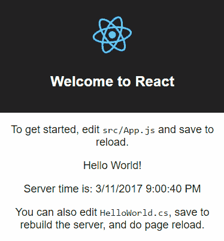

# React +。网芯+ SignalR =惊艳！

> 原文：<https://medium.com/hackernoon/react-net-core-signalr-amazing-ea0a83e4357e>

构建实时 React + C#的简单、轻量级但功能强大的方法。NET 核心 web 应用程序。

> **更新:** [**DotNetify-React 发布:用 React + SignalR 构建反应式 MVVM app。网芯 2.1！**](https://hackernoon.com/https-hackernoon-com-dotnetify-react-released-efc7de44a47e)

我很兴奋地宣布我一直在做的[开源项目](https://hackernoon.com/tagged/open-source)的测试版，以集成 [React](https://hackernoon.com/tagged/react) 于其中。网芯。它被称为 **dotNetify-React** ，它让你的 React 应用与. NET 核心后端连接起来变得超级简单，你都知道，它可以在任何地方运行:Windows、Linux 和 Mac。

不仅如此，你的应用将免费获得实时 WebSockets 功能！

这个项目使用 SignalR 将 React 组件连接到后端视图模型。它不使用 MVC 模式，不需要编写 web API，也不需要从 React 端发出 AJAX 请求。在其最基本的形式下，您只需要在 React 组件的构造函数中声明一个单独的 **connect** API，它就会自动地在 connect 上合并初始状态。

# 实时 MVVM

当一个实时应用程序需要一个有状态的模型时，这就是 dotNetify 显示其关键优势的地方。那些后端视图模型，它们不仅仅是贫血的对象，还可以用来托管应用程序逻辑，否则您将在客户端用 Javascipt 编写这些逻辑。从某种意义上来说，它是一个真正的 MVVM，视图模型代表了一个视图的抽象，包含了数据和行为来完成一个用例。

后端有一个瘦控制器，其唯一的工作是在浏览器上显示相关视图时维护视图模型实例，您可以使用您最喜欢的 IoC 容器(或者使用 ASP.NET 依赖注入)来实例化它们。结合实时将数据推送到客户端的能力，您可以真正选择*让您的应用程序非常后端驱动，并保持您的前端瘦而笨*。

如果你认为这是向 IBM 哑终端时代的倒退，不可能是可扩展的，嘿，[这已经在现代完成了，不亚于 Spotify](https://realm.io/news/mbltdev-hector-zarate-consistent-thin-dumb-spotify/) 的公司！

# 几分钟内开始运行

我在[项目的网站](http://dotnetify.net)上放了一些非常简单的步骤，介绍如何从头开始制作一个实时的“Hello World”应用程序，使用了三种不同的选项:。NET Core CLI，Visual Studio 2017 + WebPack，或者脸书自己的 [create-react-app](https://facebook.github.io/react/blog/2016/07/22/create-apps-with-no-configuration.html) 用 Node.js 和。网芯。

后者最让我兴奋，因为 *create-react-app* 是创建新 react 应用的官方标准，号称零配置
，因为它只是以一种非常自以为是(但专家)的方式为你打包所有内容。我喜欢每当脚本文件更新时页面自动重新加载，并且有一种方法可以添加 WebPack 的热模块替换功能，这样更新将只重新呈现组件，而不是完全重新加载。

但更让我高兴的是，我们可以做类似的事情。NET Core:任何服务器端的文件更新都会导致它重新构建，只需添加 [dotnet watch](https://docs.microsoft.com/en-us/aspnet/core/tutorials/dotnet-watch) 特性。想象一下我们在这里可以获得的生产力提升:每当你做一些代码更改时，我们可以跳过停止、重新编译、重新运行和重新加载页面的循环。

要了解更多信息并观看充实的现场演示，请访问[项目的网站](http://dotnetify.net)及其 [Github 站点](https://github.com/dsuryd/dotNetify)。

我对这个项目的期望是达到一个可以支持全栈微服务的状态。NET 平台:拥有一个由独立的*前端+后端*模块组成的复杂 web 应用程序的能力，这些模块可以由完全自主的团队在最短的停机时间内进行工作和部署。听起来像是一个高要求？希望不会，因为那真的是我未来想要的工作方式！

> [黑客中午](http://bit.ly/Hackernoon)是黑客如何开始他们的下午。我们是阿妹家庭的一员。我们现在[接受投稿](http://bit.ly/hackernoonsubmission)并乐意[讨论广告&赞助](mailto:partners@amipublications.com)机会。
> 
> 如果你喜欢这个故事，我们推荐你阅读我们的[最新科技故事](http://bit.ly/hackernoonlatestt)和[趋势科技故事](https://hackernoon.com/trending)。直到下一次，不要把世界的现实想当然！

