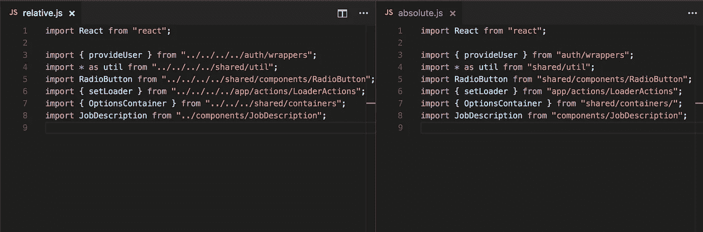

# React Pro 提示:使用绝对导入以获得更好的可读性和更容易的重构

> 原文：<https://medium.com/hackernoon/react-pro-tip-use-absolute-imports-for-better-readability-and-easy-refactoring-2ad5c7f2f957>



..unless you love typing dots and slashes

如果你正在处理一个大的单页应用程序，你可能有一个深度嵌套的文件夹层次结构(深度> 2)，由于这个原因，你的大多数`import`语句看起来像左边的图片。这显然不理想，原因有几个，包括:

*   写起来很不方便(反复试验来计算你需要用点-点-斜线到什么程度)。
*   不得不一遍又一遍地输入`../` 会让你紧张和沮丧。这对你的生产力(或脾气)不是太好。
*   很难读懂。所有这些点和斜线只是给代码添加了噪声。你不能只看一眼就知道你要升多少级。
*   重构真的是很大的痛苦。你可能最终不得不在一大堆文件中修改一打左右的`import`。只要一想到必须修复所有这些点-点-斜线就能说服你完全放弃重构的想法。

幸运的是，有一个足够简单的解决方案可以避免这种情况:**使用绝对导入！**

如果你使用的是`[create-react-app](https://github.com/facebookincubator/create-react-app)`，你需要做的就是在项目根目录下添加一个名为`.env`的文件，内容如下:

```
NODE_PATH=src/
```

就是这样！现在你可以这样写你的`import`:

```
import { provideUser } from "auth/wrappers";
import * as util from "shared/util";
import RadioButton from "shared/components/RadioButton";
import { setLoader } from "app/actions/LoaderActions";
import { OptionsContainer } from "shared/containers/";
import JobDescription from "../components/JobDescription";
```

任何时候你需要一直到`src/`，你可以跳过`../` s，直接从文件夹名开始。您仍然可以在有意义的地方使用相对导入(参见上面的最后一个导入)。

如果您正在使用 Visual Studio 代码，并且希望代码完成和其他 [Intellisense](https://code.visualstudio.com/docs/languages/javascript#_intellisense) 功能能够处理绝对导入，只需创建一个名为`jsconfig.json`的文件，包含以下内容:

```
{
  "compilerOptions": {
    "baseUrl": "src"
  }
}
```

这就是全部了。现在去吧，把那些讨厌的东西扔掉！