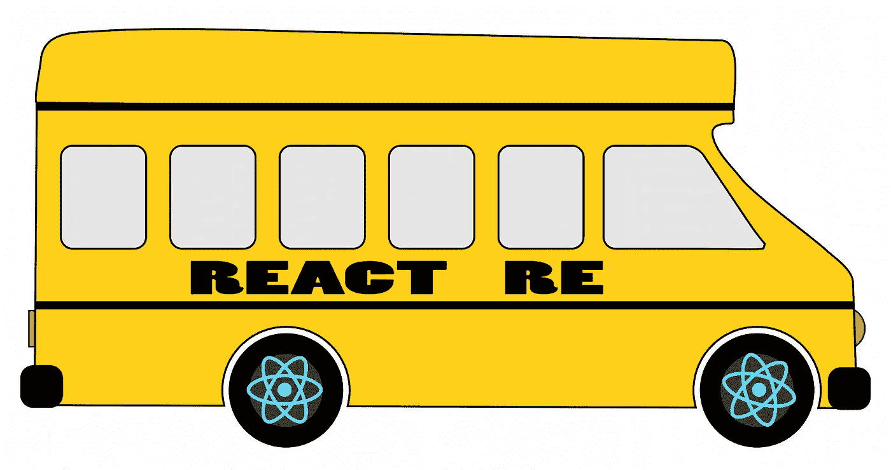
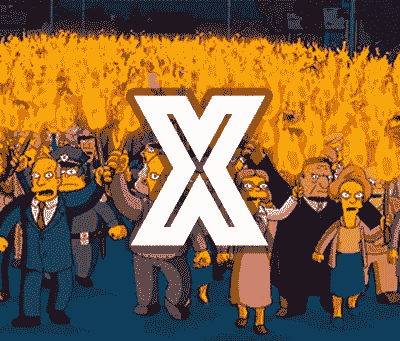
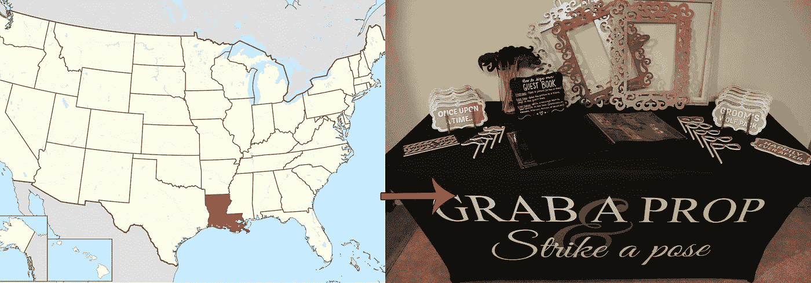
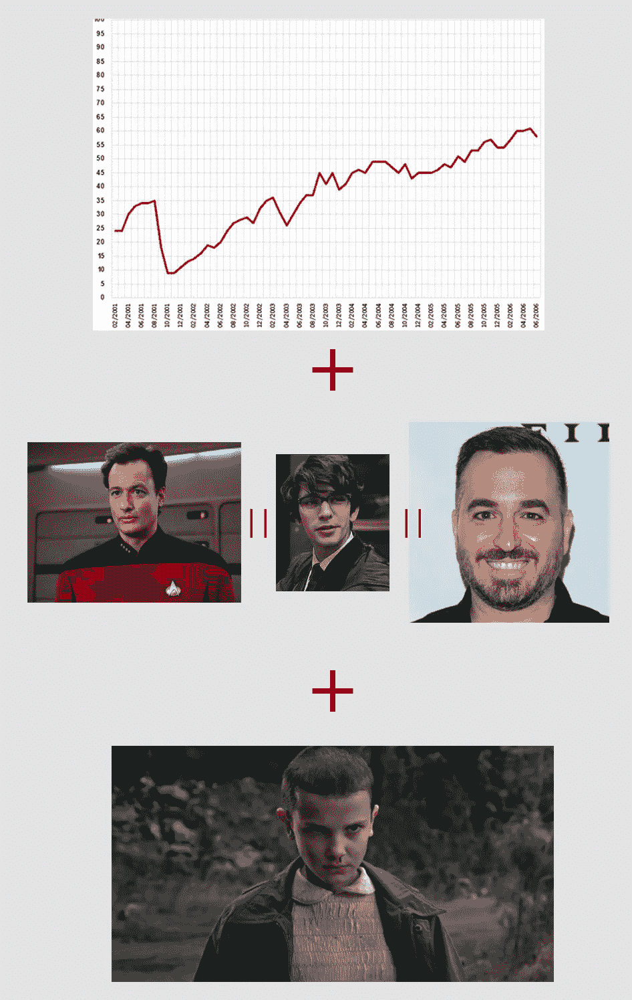
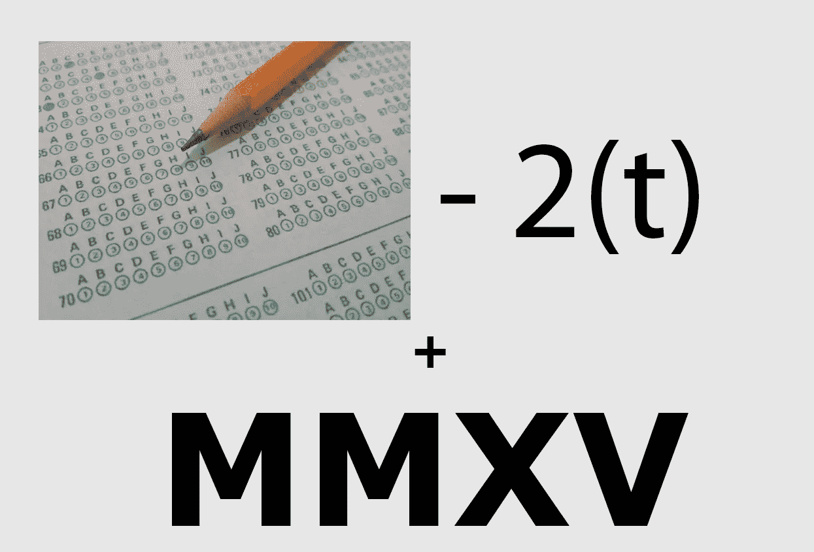
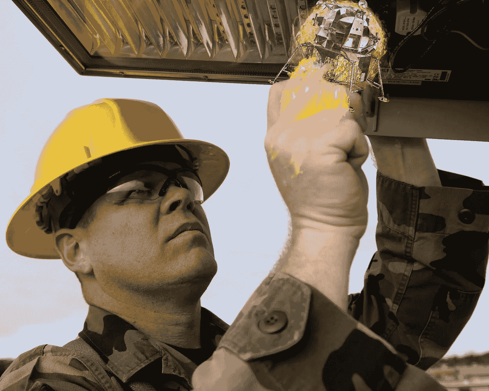
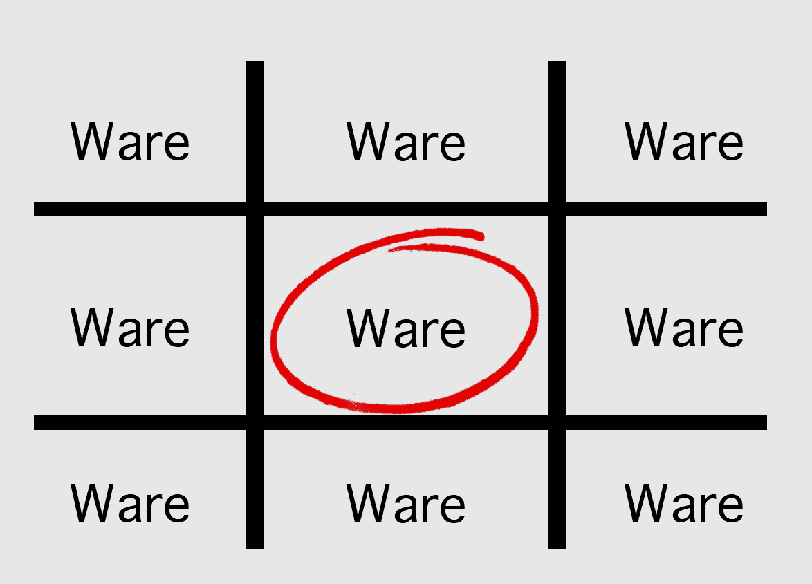

# 回应反驳

> 原文：<https://medium.com/hackernoon/react-rebuses-9f72e761ae56>

## 10 个有趣的反应谜题

> 你对以反应为中心的术语了解多少？

The React ReBus

> Rebus 是一个代表单词的图像拼图。

**TL:DR；**我们在 [IR 社区 slack 的#谜语频道玩得太开心了](https://infiniteredcommunity.herokuapp.com/)，我们做了书呆子做的事情，我们开始创建自己的 React rebuses。

这里有 10 个主题为**以反应为中心的技术**的重组。你能算出几个？

## 谜题 1:

thanks [Derek Greenberg](https://medium.com/u/c751048e5e2f?source=post_page-----9f72e761ae56--------------------------------)

## 谜题 2:

by [Samuli Hakoniemi](https://medium.com/u/e8b6d834b249?source=post_page-----9f72e761ae56--------------------------------)

## 谜题 3

## 谜题 4

## 谜题 5

## 谜题 6

## 谜题 7

thanks Justin Lane

## 谜题 8

## 谜题 9

## 谜题 10

# 答案

我想只是简单地张贴答案，但一半的乐趣是看到人们猜测什么。所以我们开始评论。

# 关于甘特🎉

在 Twitter 上用 [@GantLaborde](http://twitter.com/GantLaborde) 查看技术推文和双关语，或者在 [Medium](/@gantlaborde/) 和 [GitHub](https://github.com/gantman) 上关注他。你可以在 http://GantLaborde.com/的[节目中看到他的下一个演讲](http://gantlaborde.com/)

Gant Laborde 是 Infinite Red 的首席技术策略师，出版作家，兼职教授，世界范围内的公共演说家，以及培训中的疯狂科学家。

**在我们的** [**红移刊物**](https://shift.infinite.red/) **上阅读甘特及其同事的著作，或者邀请他在您的下一次会议上发言。**