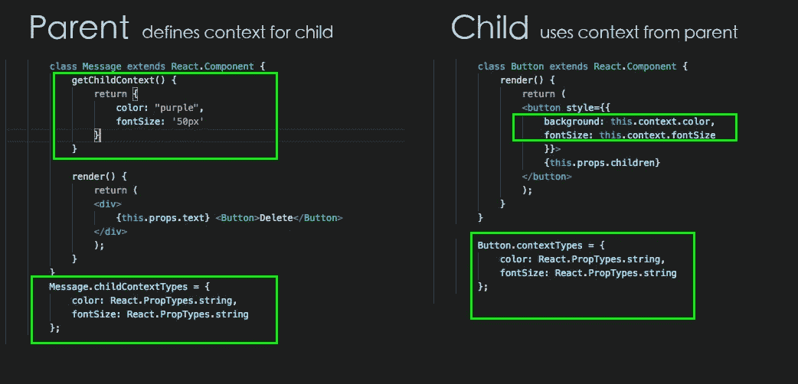
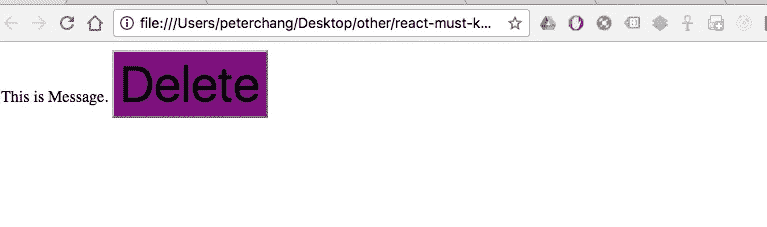

# [反应]使用上下文很容易(30 秒阅读)

> 原文：<https://medium.com/hackernoon/react-redux-example-tutorial-context-why-explicitly-implicitly-e7350eecffc5>

为什么要使用上下文而不是显式地将属性传递给子元素？

> 通过使用上下文，您不必显式地传递一大堆`props`来传递一些上下文数据。

简而言之，上下文是一个从组件隐式传递到其子组件的对象( *by* [***何塞·马加良斯***](https://blog.jscrambler.com/author/jose-magalhaes) )。

从[***git***](https://github.com/wahengchang/react-must-know/blob/master/context/index.html)***:***中克隆例子

# 参考:

[https://facebook.github.io/react/docs/context.html](https://facebook.github.io/react/docs/context.html)

[https://github . com/wahengchang/react-must-know/blob/master/context/index . html](https://github.com/wahengchang/react-must-know/blob/master/context/index.html)