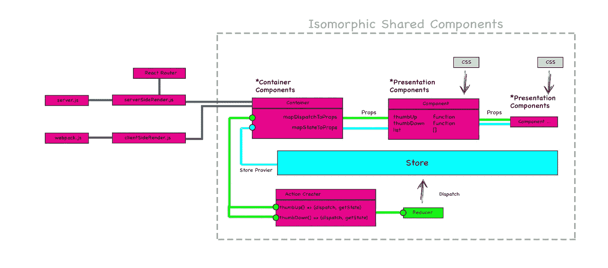
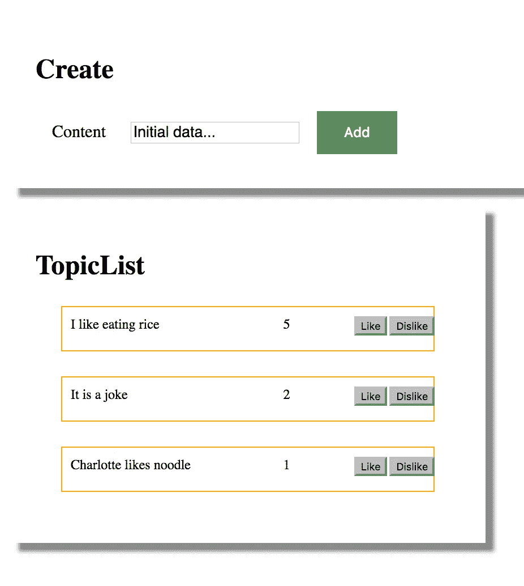

# React Redux 同构应用程序:最佳实践

> 原文：<https://medium.com/hackernoon/react-redux-isomorphic-boilerplate-best-practice-example-tutorial-learning-rendering-reducer-action-8a448d0dbddb>



react-redux-universial-isomorphic-compont.jpg

***同构的 Web 应用*** :客户端和服务器端都包含 MVC。相同的渲染引擎和相同的 JavaScript 逻辑可以在服务器端使用(由[***Redux******)***](https://medium.com/u/df956081226#action-creator)

1)它是创建动作的工厂函数。
2)调用*动作创建者*只会产生一个动作，而不会调度它。您需要调用商店的`[dispatch](http://redux.js.org/docs/api/Store.html#dispatch)`函数来实际引起变异。
`ActionCreator = (...args: any) => Action`

## **中间件** ( *由* [*redux-thunk*](https://github.com/gaearon/redux-thunk) )

它是一个高阶函数，组成一个调度函数，返回一个新的调度函数。

`middleware => (dispatch, getState)`

# 玩耍

```
$ git clone https://github.com/wahengchang/react-redux-boilerplate-example
$ npm install
$ npm run test
$ npm run dev
```



## 你可能也喜欢

*   [【React】【Redux】同构样板:添加新页面](https://hackernoon.com/node-javascript-react-redux-isomorphic-boilerplate-tutorial-example-adding-new-page-component-router-match-f0347ad42c67)
*   [分解同构通用样板:React-Redux 服务器渲染](https://hackernoon.com/isomorphic-universal-boilerplate-react-redux-server-rendering-tutorial-example-webpack-compenent-6e22106ae285)

# 参考:

[https://medium . com/Airbnb-engineering/同构-JavaScript-the-future-of-web-apps-10882 b 7 a2 ebc](/airbnb-engineering/isomorphic-javascript-the-future-of-web-apps-10882b7a2ebc)

[https://medium . com/monitisemea/同构-通用-javascript-496dc8c4341a](/monitisemea/isomorphic-universal-javascript-496dc8c4341a)

[http://redux.js.org/docs/recipes/ServerRendering.html](http://redux.js.org/docs/recipes/ServerRendering.html)

[](http://bit.ly/HackernoonFB)[](https://goo.gl/k7XYbx)[](https://goo.gl/4ofytp)

> [黑客中午](http://bit.ly/Hackernoon)是黑客如何开始他们的下午。我们是 [@AMI](http://bit.ly/atAMIatAMI) 家庭的一员。我们现在[接受投稿](http://bit.ly/hackernoonsubmission)并乐意[讨论广告&赞助](mailto:partners@amipublications.com)机会。
> 
> 如果你喜欢这个故事，我们推荐你阅读我们的[最新科技故事](http://bit.ly/hackernoonlatestt)和[趋势科技故事](https://hackernoon.com/trending)。直到下一次，不要把世界的现实想当然！

