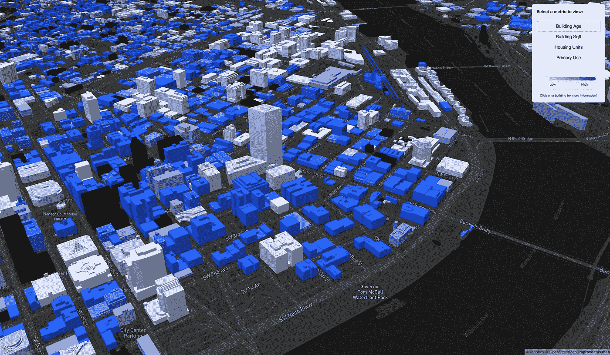

# 用地图框反应/还原

> 原文：<https://medium.com/hackernoon/react-redux-with-mapbox-78fa3767211e>

> *想为 Mapbox 应用程序使用 React/Redux，但不确定从哪里开始？请继续阅读！*

## 动机

我在 R&D 的建筑和房地产开发领域工作，在 [Ankrom Moisan 建筑师事务所](http://www.ankrommoisan.com)。这意味着两件事:

1.  我用地图。很多。我们做的大多数事情都是面向地理空间的。Mapbox 在这方面发挥了不可估量的作用。我可以控制地图外观的每一个方面(表现就是一切，尤其是对建筑来说)，当我向它扔进[大量的数据时，它也不会抱怨。](https://github.com/mapbox/tippecanoe)
2.  经常需要快速迭代几个复杂的应用，强迫大脑频繁换挡(我也在做[设计](https://hackernoon.com/tagged/design)和构造工作)。

使用 mapbox 示例中典型的命令式和过程式技术构建大型应用程序会很快使应用程序流难以理解，状态难以跟踪。第二点成为了这些挑战之上的力量倍增器，减缓了开发，并使错误更有可能发生。

最终对我来说完美的解决方案是过渡到用 [React](https://hackernoon.com/tagged/react) 和 Redux 构建应用程序；但目前还不清楚如何将 Mapbox 整合到这个框架中。

幸运的是，Mapbox 的优秀员工实际上已经考虑了很多，Tom MacWright 就这个问题写了一篇非常有用的文章。我觉得让其他地理开发者看看更具体的例子可能会有帮助。因此，我有一个简短的教程:

# 构建一个简单的 React/Redux/Mapbox 应用程序:

我最近收集了一个数据集，其中包含了大量关于俄勒冈州波特兰市建筑及其 3D 几何图形的元数据。我需要构建一个简单的界面，以便用户可以在可视化中切换数据属性，如平方英尺和单位计数。[你可以在这里看到最终产品。](http://ryantm.io/buildings)

整个应用程序非常简单，我已经把它放到了 github 上。在这篇文章中，我将详细介绍围绕 mapbox 制作一个灵活的 React/Redux 包装器所需的步骤。*补充说明:这个例子非常简单，不需要 react/redux，但是这个过程可以很好地扩展。*

## 样式表

在我们编码之前，当试图用 Mapbox 管理应用程序状态时，有一件重要的事情要记住:**地图的样式表是所有事情的唯一来源。**如果您有当前的样式表，您就能确切地知道映射处于什么状态。

为了遵循 React 的声明式编程哲学，我们希望获取样式表并对其进行修改以反映我们想要看到的内容，然后将其交还给地图进行渲染。

mapbox 本身不接受样式表作为更新。然而，正如他们在上面链接的 Tom 的帖子中概述的那样，Mapbox 开发人员为存在于[样式规范 github repo](https://github.com/mapbox/mapbox-gl-js/blob/master/src/style-spec/diff.js) 中的样式表编写了一个不同的算法。它接受两个样式表，一个表示地图现在的样子，另一个表示您想要的样子，并生成一组命令，将地图从一种样式转换为另一种样式。

## 过程

有了这些知识和 diffStyles 函数，我们可以概括包装 Mapbox 的过程:

1.  在 React 组件中使用 mapbox-gl-js 创建一个“map”对象。
2.  当 map 加载后，获取它的样式表对象并将其放入应用程序状态。
3.  当用户交互需要改变样式时，让一个 reducer 获取一个样式状态的副本，并在其中更改您希望的属性。
4.  对状态树的这一更改将触发一个更新，该更新可以与地图组件中的“componentWillRecieveProps”挂钩。在这个函数中，您可以获取当前样式表和新样式表(来自 nextProps)。然后用 diffStyles 区分两者，并应用更改。

1 我们将从一个组件开始，它只返回一个标识为“map”的空 div，就像传统的 html 一样:

在非 react 设置中，我们将有一个标识这个 div 并实例化地图画布的脚本。这也正是我们在这里要做的，但是我们需要确保它在 React 生命周期中的适当时间发生，所以我们将它放在“componentDidMount”中:

现在我们的变量中有了名为“style”的初始样式表，我们需要将它保存到应用程序状态中。

> 首先简单介绍一下这个变量的内容:如果您以前从未真正看过样式表(我没有)，继续在控制台中研究它，您会看到它是一个*深度*嵌套的 JSON 文档，其结构可以根据层顺序和属性选择而变化。

由于这个原因(以及其他无数的好处)，我非常推荐在存储样式表之前使用 Immutable.js 来包装它。Immutable 有许多方法可以在深度嵌套的对象和列表中找到特定的属性，这将为您节省大量时间。这也会给你信心，只有你想要的东西*改变风格就能做到。*

*因此，让我们编写一个 action 和 reducer 来接收 JSON 样式表，并将其作为不可变对象保存到应用程序状态:*

*现在让我们假设在一些其他的 React 组件中，我们有一些按钮，用户可以点击这些按钮来改变控制建筑物颜色的属性。按钮将触发一个名为“CHANGE_VIZ”的动作，有效负载将只是按钮的“value”属性。为了简单起见，我将在这里展示两种情况，用“平方英尺”着色和用“单位数”着色:*

*太好了，现在 Redux 包含了一个样式表，显示了我们想要的地图的外观！最后一步是改变当前地图的外观，并应用这些改变。这发生在我们的 map React 组件的“componentWillRecieveProps”方法中，如下所示:*

*对于奖励积分，我们还可以捕获地图点击事件，并将其作为一个动作发送出去，供您使用！我们只是将它添加到我们的地图组件中的“this.map.on('load'…)”中，我们还将在这里添加用于保存初始样式状态的动作创建器:*

*就是这样！这可以扩展到添加更多的功能(延迟源代码加载，挂钩其他事件，如移动和缩放等)，但这确实是拥有一个非常灵活的 React 包装器所需要的。与 action / reducer / re-render 范例相结合，它允许我非常快速地构建接口，我可以在以后轻松地修改这些接口，而不必每次都真正地跟踪所有东西是如何连接在一起的。*

*这样就有更多的时间进行实验和做重要的工作！*

*如果你想了解关于 reducers、actions 和 UI 的所有内容，完整的项目在 github 上。*

*最后，这里是我们完成的 ReactMap 组件、样式表缩减器和动作创建器:*

*[**ReactMap 组件**](https://gist.github.com/McCulloughRT/95ab459cd0a3ffcaf071e6f7de727978)*

*[**样式减速器**](https://gist.github.com/McCulloughRT/9afae4b7aae6e5e6a78e59886426bec8)*

*[**动作创作者**](https://gist.github.com/McCulloughRT/2a2bec86c5c2454f5979904f3f2ec3ae)*