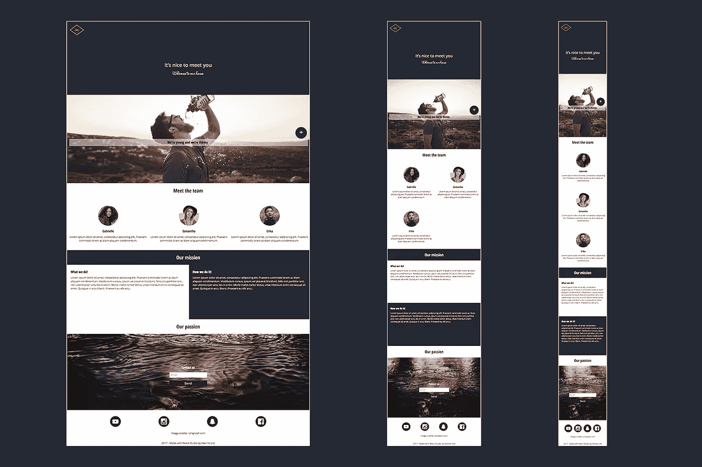
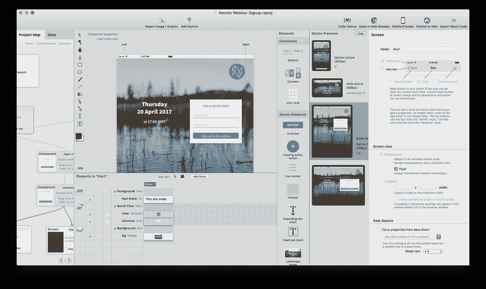

# React Studio: 1.0.2 更新，路线图，对 Native 的想法，以及对微软 ReactXP 的了解

> 原文：<https://medium.com/hackernoon/react-studio-1-0-2-update-roadmap-thoughts-on-native-and-a-look-at-microsofts-reactxp-b78fc405a676>

A new sample project called “One page template”, included in React Studio 1.0.2

我们[推出 React Studio 1.0](/@reactstudio/react-studio-1-0-is-out-now-ea28dc687a1d) 已经一个月了。我们正努力保持每两周一次的稳定发布周期…到目前为止，我们正在按计划进行(*敲木头)*。所以，今天是 1.0.2 版本的时候了！

在这篇文章中，我们将首先看看这个更新的细节，然后深入到未来的一些计划，包括短期和长期的。

我们的下一个版本将更多地关注数据和后端服务(提示——我们正在努力支持一个以*【单词】*开头，与*【象棋】*押韵的平台)……并且展望未来，我们将看看 React Native 的可能性，以及探索微软全新的 ReactXP:一个非常有趣的库，它消除了 web ReactJS 和 React Native 之间的一些差异。准备好了吗？

## React Studio 1.0.2 的新增功能

让我们从今天发布的内容开始吧！像往常一样，一旦重启应用程序，更新就会自动可用。或者，如果你没有 React Studio，去[https://reactstudio.com](https://reactstudio.com)(MAC OS 10.9+)下载。

值得注意的变化如下:

*   **用于向项目地图添加项目的新 UI 布局。**
    以前这是通过工具栏上的按钮完成的。现在在项目地图的右边有一个新的*组件*面板，您可以从那里将项目拖动到地图上。(顺便说一下，这一变化是为即将到来的“预置”功能做准备。很快你就可以将你自己的组件保存为预置，它们会显示在组件窗格中。因此现在是空的！)
*   **新*显示/隐藏*交互。**
    你可以使用它来显示或隐藏元素，以响应按钮点击(或任何其他交互)。这对于显示额外内容的弹出菜单、“更多信息”样式的按钮非常有用。
*   **新增*嵌入内容*元素。**
    这允许你在布局中放置自定义的 HTML 代码。适用于嵌入来自其他网站的内容，如地图、社交媒体按钮等。(但是，您需要对该功能保持谨慎！根据定义，自定义 HTML 代码可能是不安全的…所以只对您自己编写的代码或您信任的原始网站使用此功能。)
*   **新的示例项目:*一个页面模板***
    演示了如何创建一个所谓的“登录页面”风格的屏幕:一个长的可滚动页面，采用响应式设计，利用组件、网格和列元素。
    你可以在*文件*菜单>中找到*新建自*模板>中级模板。
*   **新增*自定义 CSS* 动画类型。**
    这个特性可以让你添加完全自定义的动画到元素中，尽管为了得到结果，你需要知道一些 CSS(或者你可以像其他人一样谷歌一下 CSS 动画片段…？😉)
    你可以在元素的*交互*设置中找到这个设置，在*动画触发器*部分下。创建一个触发器，并选择“自定义 CSS 动画”作为动作。现在，您可以输入自定义值，这些值将写入该元素的应用程序 CSS 中。具体来说，“关键帧”文本框变成了一个[@关键帧 CSS 规则](https://developer.mozilla.org/en/docs/Web/CSS/@keyframes)的内容。(该规则的名称将由 React Studio 决定)。“动画”文本框成为一个 [CSS 动画属性](https://developer.mozilla.org/en-US/docs/Web/CSS/animation)的内容。您可以将“animation”值留空，在这种情况下，React Studio 将写入一个与您在 UI 中输入的动画持续时间相对应的值。(如果您确实输入了自定义动画属性值，您需要某种方式来引用关键帧规则:只需输入 *$KEYFRAMES* ，React Studio 将在导出时用该名称替换它。)

*   UI 外观&感觉调整，尤其是画布和元素面板中的工具栏。
*   先前分开的“导入图像”和“导入矢量图形”**工具栏按钮被合并成一个功能**。
*   **工具栏现在是上下文相关的**，因此如果画布不可见，与编辑画布相关的命令不会显示。
*   元素+状态列表现在显示组件实例的**小预览。**
*   **调整组件大小**现在更智能，防止组件采用不实际的尺寸。
*   修正了**文本字段**的样式定制选项。
*   修正了 CSS 导出和 Studio 预览中的**文本阴影**(以前应用阴影时，文本会有一个小的偏移)。
*   固定**列元素**的水平/垂直间距设置 UI。
*   杂项 CSS 修复。

## 短期路线图

假设你读了上面的变更日志，你可能注意到提到了即将到来的**预置**特性。这将是一个个人库，您可以在其中保存组件并轻松访问它们。新的*组件*面板，位于项目地图的右侧，是为预置做准备而构建的:一旦我们引入预置，这就是你会发现它们被列出的地方。还会有一个搜索栏，这样你就可以找到你的路了。

有了预置，你就可以开始构建一个定制组件的*设计语言库*。总是发现自己在重用显示用户照片、姓名和状态的“用户”组件？图片和标题位置恰到好处的特定标题样式怎么样…？将它们保存为预设，您马上就可以用自己的构建模块构建应用程序了！

我们正在开发的另一个主要特性是对 WordPress API 的支持。几个月前， [WordPress 4.7 为 WP 驱动的网站引入了一个标准 API](https://wordpress.org/news/2016/12/vaughan/) 。这些被称为“REST 内容端点”，这是一个非常专业的名称，代表一个非常简单的概念。WordPress 博客这样描述它:

> 内容端点通过一个清晰的、标准驱动的界面，提供机器可读的外部访问你的 WordPress 站点，为通过插件、主题、应用等与站点交互的创新方法铺平了道路。准备好开始开发了吗？[查看 REST API 参考。](https://developer.wordpress.org/rest-api/reference/)

这实际上意味着你不再需要写一个 WordPress 主题/插件来定制你的 WordPress 站点了！相反，你可以**使用 React Studio** 这样的工具制作一个现代化的前端，并通过标准 API 从 WordPress 访问你的内容。它已经可以在 WordPress 的每个博客上使用，也可以在每个升级到 4.7 的独立 WordPress 网站上使用。(如果你运行的是 WP 系统，你真的应该升级一下，希望你知道……！)

我们的第一次迭代不会覆盖全部的 WordPress API——仅仅是因为如果可能的话，我们想在两周内发布它！但是我们希望提供一个有用的子集，让你可以构建许多有趣的基于 WordPress 的网络应用。(如果您对我们最初应该努力支持哪些 WP APIs 有任何意见，我们希望听到您的意见！请写信到 hello@neonto.com*给我们*

## 关于反应本土化的思考

这是一个我们经常被问到的问题:React Studio 会支持 React Native 吗？如果会，什么时候？

首先，值得一提的是，React Studio 有一个“姐妹产品”，名为 [Neonto Native Studio](https://neonto.com/nativestudio) 。它是*而不是*一个 React 原生工具——相反，它为 iOS 和 Android 输出真正的原生代码。它与其他跨平台解决方案非常不同，因为没有库，没有框架，没有 webviews 甚至 JavaScript，没有任何类型的额外层。(实际上 Native Studio 是在 React Native 存在之前创建的，所以当时根本没有使用 React 的问题……！)

因此，一方面，我们在原生移动应用程序方面有非常丰富的经验(以原生工作室的形式)，另一方面，我们有专门为 React JS 设计的工具(以 React Studio 的形式)。只需要 1+1 的算术水平就可以推断出 React Native 是我们力所能及的。

正如在技术领域经常发生的那样，这是一个时间和资源优先级的问题。React Native“准备好”了吗？这当然是年轻的技术，但进展令人印象深刻。直到最近，Android 的实现还很欠缺，但是贡献者们已经在这方面取得了很大的进步。

阻碍我们使用 React Native 的一个因素是工具链的相对复杂性。使用“普通”ReactJS，它只是一个 web 应用程序，因此我们可以轻松地做一些事情，如 React Studio 中的“在浏览器中预览”和“移动预览”功能。使用 React Native，应用程序需要建立在 Xcode / Android Studio 工具链上……这些年来我们从 Native Studio 中学到的是，尽管这些工具按照开发人员的标准可以访问，但对于普通人来说仍然非常可怕。

然而，React Native 的伟大之处在于强大的社区，因此新的有趣的解决方案不断涌现。特别是 [Expo](https://expo.io) 在让 React Native 功能更全、更易访问方面做了大量工作，他们正在解决一些与工具链复杂性相关的问题。Expo 的平台可能是 React Studio 的 React 本地“分支”的巨大基础。

## 微软的 ReactXP

另一个非常有趣的全新开发是微软 Skype 团队创建的库 [ReactXP](https://microsoft.github.io/reactxp/) 。

*(这里 XP 代表“跨平台”；与 Windows XP 没有关系。如果你问我，这是一个相当令人困惑的微软工具包的名字！哦好吧。)*

ReactXP 团队的博客[详细解释了这个新库背后的基本原理](https://microsoft.github.io/reactxp/blog/)。简而言之，它是一组组件和最佳实践，让您可以从单个 JavaScript 代码库同时面向 ReactJS (web)和 React Native (iOS、Android、Windows 10)。

这对于 React Studio 来说也是一个很好的解决方案。我们已经有了“UI 框架插件”的概念，它在 React Studio 的设计环境和产生实际代码的设计编译器[之间提供了一个抽象层。我们可以简单地将 ReactXP 支持实现为 React Studio 的 UI 框架插件，这也将为 React Native 打开大门。](/@reactstudio/meet-the-design-compiler-17ae89f985bb)

正如你所看到的，React Native 场景中有很多令人兴奋的东西，几乎每周都有新的开发！这就是我们密切关注这些新解决方案的原因。随着 React Native 社区集中于什么是最好的，我们一定会提供我们关于 React Studio 将如何让你也在 React Native 中工作的计划。

像 React Studio 这样的工具的一个伟大之处是**我们跟踪所有这些令人兴奋的新东西，所以你不一定必须**。当我们提供新的设计编译器目标时，例如 ReactXP 或 Expo，您将能够重新导出您的项目，并让它遵循该目标的最佳实践。如果您已经用代码编写了 React UI，那么手动将所有代码转换到一个新的框架(甚至是一个新的 React 版本！)可能是一项非常乏味的工作，而且容易出错。这是 React Studio 的设计编译器方法可以为您的 web 应用程序项目提供的[封装安全性](/@reactstudio/meet-the-design-compiler-17ae89f985bb)程度的一个很好的例子:在可视化布局中最好地表示的 ui 以这种形式建模，并保持重定向的灵活性，同时 React Studio 的 [clean 插件和脚本接口](/@reactstudio/meet-the-design-compiler-17ae89f985bb)允许您根据需要扩展和注入自定义代码。

好了，暂时就这样了。我希望在两周后我们的下一个版本中见到你！

我们还将于 4 月 20 日举办**网络研讨会。主题是核心工具和使用组件建模应用的不同方式。非常欢迎您的加入— [在这里报名](http://neonto.cloud/webinar-signup)！**

关注我们的[媒体帖子](/@reactstudio/)和[推特](https://twitter.com/neontostudio)获取新闻——当然，如果你还没有[下载 React Studio，为什么不现在就下载](https://reactstudio.com)？

> [黑客中午](http://bit.ly/Hackernoon)是黑客如何开始他们的下午。我们是 [@AMI](http://bit.ly/atAMIatAMI) 家庭的一员。我们现在[接受投稿](http://bit.ly/hackernoonsubmission)并乐意[讨论广告&赞助](mailto:partners@amipublications.com)机会。
> 
> 如果你喜欢这个故事，我们推荐你阅读我们的[最新科技故事](http://bit.ly/hackernoonlatestt)和[趋势科技故事](https://hackernoon.com/trending)。直到下一次，不要把世界的现实想当然！

