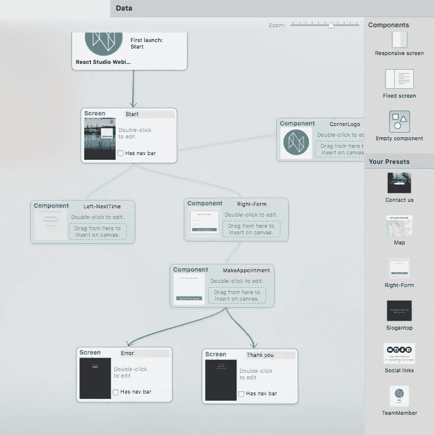
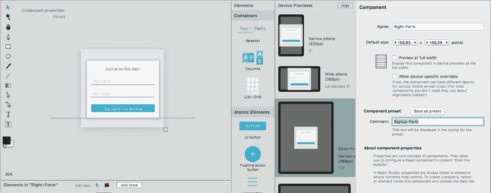
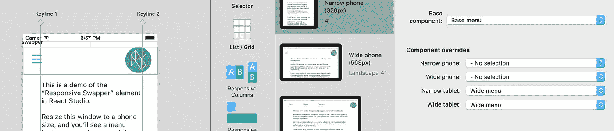
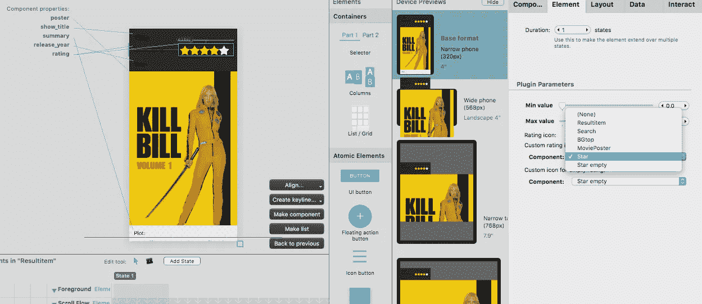
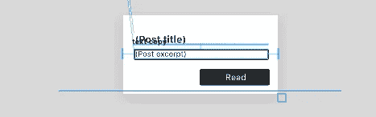
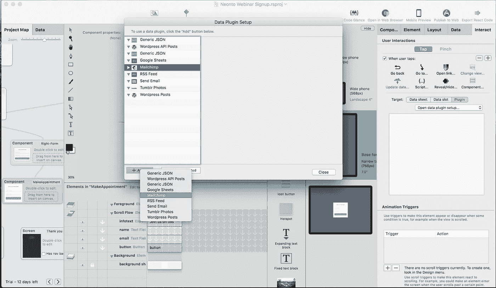
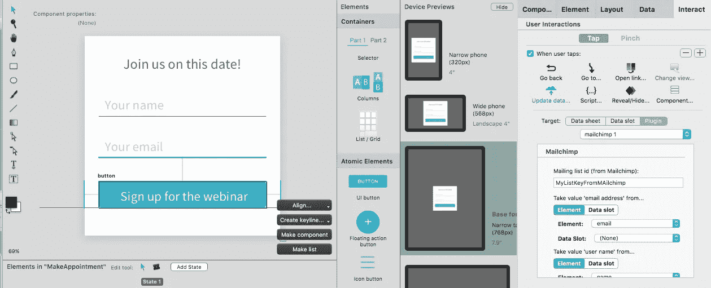

# React Studio 1.1:组件预设、交换元素、数据插件、API 桥、渐进式 Web 应用程序

> 原文：<https://medium.com/hackernoon/react-studio-1-1-d604df294f10>

React Studio 的最新更新加载了特性和修复！有很多要讲的，所以让我们直接开始吧。

一个强制性的提醒:如果你没有 React Studio，那就去 reactstudio.com 下载一个试用版。如果你已经是 React Studio 用户，只需重启软件就能获得 1.1 更新。

同时也向我们在 YouTube 上的 [React 工作室网络研讨会致敬](https://www.youtube.com/channel/UCrcoH14H-MLS-MKxZGMwVGQ)！在上一期节目中，我们[从头开始构建了一个现场注册页面](https://www.youtube.com/watch?v=pD082KOVqo8)，包括将数据保存到第三方 API。(这篇文章中描述的许多功能可以在那个视频中看到。)

## 组件预设

预设是保存的组件。存储为预置后，它们可用于所有项目。您可以在项目地图右侧的组件窗格中找到它们。

这是一个非常重要的特性，因为它使您能够开始构建自己的 React 组件设计库。发现自己总是在使用那个漂亮的“用户头像+标语”组件吗？将其保存为预设，并在任何地方重复使用！

预设对于团队来说可能更加重要。也许你已经有了一个风格指南来传达你的设计系统是如何工作的。使用组件预设，您可以将该样式指南变成 React 组件的动态集合！通过 React Studio 对属性和组件状态的支持，您可以轻松地创建具有大量内置灵活性的组件。

要创建预置，只需在项目地图中选择任何组件，并在右侧的检查器中查看:

在“另存为预设”按钮旁边，有一个“注释”栏。您在那里输入的任何文本都将显示在预置列表的悬停信息窗口中。(如果你需要添加更多的说明到一个组件预置中，你也可以使用一个自定义的属性 UI。这与 [React Studio 插件](/@reactstudio/meet-the-design-compiler-17ae89f985bb)的工作方式完全一样:使用 JSON 格式，您可以定义在布局中使用组件时显示的界面。这是为组件用户放置说明的好地方。)

请注意，使用预置后(通过从“预置”面板拖到项目地图中)，它会创建组件的副本。因此，您可以安全地修改新组件，而不会意外影响创建它的原始预设。

在未来的帖子中，我们将展示如何使用组件预设构建设计系统库的一些想法，以及 React Studio 的 Sketch 插件如何在其中发挥作用，以便您继续使用 Sketch 进行矢量绘制，并仍然获得使用实时 React 组件进行设计的好处。

## 响应交换元件

这是响应式设计的一个很酷的组成部分。用一个活生生的例子来解释最容易了:[使用响应式交换者的菜单](https://neonto.cloud/u/menuexample/)

顶部的菜单在窄屏幕的“汉堡”菜单按钮和宽屏的三元素菜单之间切换。这是它在 React Studio 中的样子:

Swapper 元素有一个“基本组件”设置，并允许您覆盖特定的大小。在上面的截图中，汉堡菜单被设置为基础，还有另一个为平板电脑大小的屏幕指定的组件，称为“宽菜单”。

## 渐进式 Web 应用程序和 React 15.5.4

React Studio 的项目输出已经更新，以匹配上周刚刚发布的脸书*Create React App*1.0 版本(点击阅读更多关于该版本的信息)。

由于 Create React 应用程序的强大基础，您的项目可以免费获得许多很酷的功能。你需要做的就是再出口。

最值得注意的亮点是 React 15.5.4、Webpack 2，以及默认添加的[渐进式 Web 应用(PWA)](https://developers.google.com/web/progressive-web-apps/) 支持。

PWA 是 Google 创建的一个规范，旨在使 web 应用程序更像本地移动应用程序一样工作。这将是非常大的，有了 React Studio，您已经为未来做好了准备。在即将发布的版本中，我们将努力增加对 PWA 功能的进一步支持，如本地缓存数据，以支持 web 应用程序的离线模式。借助 React Studio 的数据管理功能，我们计划让这一过程完全无缝。只需勾选一个框，你的应用就会获得离线支持。

## 过渡动画

对于导航到不同屏幕的交互，您现在可以指定动画。设置在“交互”选项卡>“前往”操作中。

目前只有几个动画可用，但我们很快就会添加指定自定义 CSS 的能力，所以你可以提供任何你喜欢的过渡。

## 插件 UI 改进

为了启用更高级的插件，已经做了大量的工作。新的 API 包括对定义数据链接的支持(如标准安装中包含的*评级*插件所示)，以及为交互创建自定义 ui(如标准安装中也提供的 *Mailchimp* 和 *Send Mail* 插件所示)。

评级插件还演示了新的“组件选择器”UI 元素类型，插件可以使用它来访问 React Studio 项目中的任何组件。在评级中，这用于指定充当“满”和“空”评级图像的组件。用截图更好解释:

这是一个可视化来自电影数据库 API 的数据的组件。看到海报上面那些黄白相间的星星了吗？这是评级部分。星形设计作为单独的组件提供。插件的 UI 包括“满”和“空”状态的组件选择器，这就是插件如何访问这些定制的可视项目。相当酷！

## 复选框元素

默认元素集中缺少 good old 复选框。它现在就在那里，并且它有一个接受数据链接的“checked”属性，因此您可以将它连接到数据。

## 组件动态高度指示器

组件流动内容的高度现在用蓝线表示:

这一点很重要，因为组件的高度可以根据流内容而变化。蓝线的出现表示该组件将调整大小。

假设有一个组件显示来自用户的消息:一些消息可以放在一行中，而另一些消息要长得多。通过将 message 元素放在组件内部的 Scroll Flow 组中，您可以告诉组件的容器您希望该组件相应地调整大小。

对于其他一些组件，您可能不希望发生这种情况(即，您希望它们保持固定的大小)，因此在这种情况下，您应该将所有内容放在前景组中。蓝线指示器使您更容易看到该组件是否会调整大小。

## 新数据插件

这个话题实际上太大了，以至于不能在这种“最新动态”的帖子中涵盖！我们为插件添加了许多新功能，并增加了一个新界面，以便更轻松地管理项目中的数据插件。你仍然可以在同一个地方找到它，数据选项卡，点击“数据插件设置”:

在设置窗口中，所有已安装的数据插件都列在左侧。默认安装包括以下内容:

*   通用 JSON
*   Wordpress API 帖子
*   谷歌工作表
*   Mailchimp
*   简单讯息聚合订阅
*   发送电子邮件
*   Tumblr 照片

顺便说一下，所有这些的源代码都是用 JavaScript 编写的，所以如果你想看看它们是如何完成的，很容易做到。(在 React Studio 中，打开插件菜单中的插件管理器，然后点击“在 Finder 中显示插件文件夹”。然后，您可以通过右键单击插件文件并选择“显示包内容”来检查任何插件。更多信息，请看[这篇文章](/@reactstudio/meet-the-design-compiler-17ae89f985bb)。)

一个插件在一个项目中可以有多个实例——例如，您可能希望使用 RSS 提要插件显示多个不同的新闻提要。因此，您需要首先创建一个插件实例。点击插件列表下方的+按钮，选择插件类型。

一旦你有了一个数据插件实例，你可以用它做一些有趣的事情，但是两个接口是最常用的:

1.  **将数据载入数据表。**要轻松测试这一点，你可以使用 Tumblr 照片插件——只需将一个博客的名称放入插件的用户界面，然后创建一个数据表并将其链接到插件。该插件将在 React Studio 中填写表格，并在导出的应用程序中进行同样的操作。
2.  **通过插件**更新数据。下面是在注册页面中如何使用 Mailchimp 插件的截图:

“注册”按钮选择了“更新数据”交互。它的目标是 Mailchimp 插件实例。这里，插件为这种交互提供了一个定制的 UI:用户可以指定重要的参数，比如邮件列表的标识符，使用哪些元素来收集数据，等等。([我们最近的网络研讨会](https://www.youtube.com/watch?v=pD082KOVqo8)展示了这个项目是如何建立的。这里可以看到现场直播[。)](https://neonto.cloud/u/webinarsignup/)

## API 桥

最后，我们有一个全新的服务来支持您的网络应用。它被称为 API 桥，它存在的全部理由是帮助您更容易地制作丰富的 web 应用程序，而不必做服务器端的工作。

考虑一下上面[我们网上研讨会注册页面](https://neonto.cloud/u/webinarsignup/)的截图。当用户输入他们的详细信息时，我们使用 Mailchimp 插件将用户添加到特定的邮件列表中。这使用 Mailchimp 的公共 API 工作——但是访问它需要来自 Mailchimp 的有效 API 密钥。

一般来说，我们不想将这样的 API 键放入我们的客户端 React 应用程序中！Mailchimp API 键提供了对相当多特性的访问，我们宁愿确保它不会被那些可能在我们的 web 应用程序源代码中寻找它的人直接看到。因此，密钥需要放在某个服务器上…但是在哪里呢？谁来开发服务器代码呢？

Neonto 的 API 桥是这个问题的一个非常简单的解决方案。我们提供了一个基于 web 的管理 UI，您可以在其中输入您的 Mailchimp API 密钥。您的密钥存储在我们的服务器上。相反，API Bridge 会给你一个 ***客户端密钥*** ，你可以在 React Studio 应用中输入这个密钥。通过使用客户端密钥，我们实现了一个很好的保护层，因为它不提供对完整 Mailchimp API 的访问。

仍然不确定这是如何工作的？[观看本次网络研讨会](https://www.youtube.com/watch?v=pD082KOVqo8)，我们在现场构建了注册页面…它还展示了 API bridge 的实际应用！

当您订阅 React Studio 时，您会收到一个 API 桥服务器的访问密钥。我们正在联系所有用户，向您提供如何使用该功能的更多详细信息。

API 桥目前提供了一些服务:

*   谷歌工作表
*   Mailchimp
*   发送电子邮件

但是，我们渴望添加更多！所以让我们知道你想看到什么 API 被桥接，我们会倾听。把你的想法发送到 hello@neonto.com

> [黑客中午](http://bit.ly/Hackernoon)是黑客如何开始他们的下午。我们是 [@AMI](http://bit.ly/atAMIatAMI) 家庭的一员。我们现在[接受投稿](http://bit.ly/hackernoonsubmission)，并乐意[讨论广告&赞助](mailto:partners@amipublications.com)机会。
> 
> 如果你喜欢这个故事，我们推荐你阅读我们的[最新科技故事](http://bit.ly/hackernoonlatestt)和[趋势科技故事](https://hackernoon.com/trending)。直到下一次，不要把世界的现实想当然！

