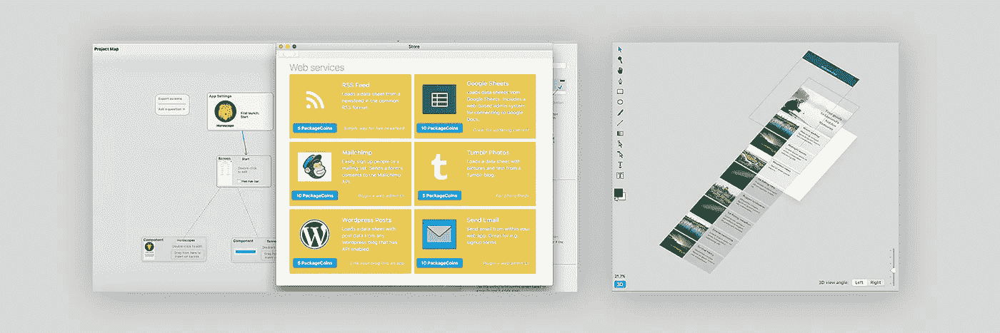
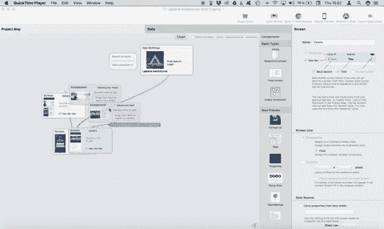
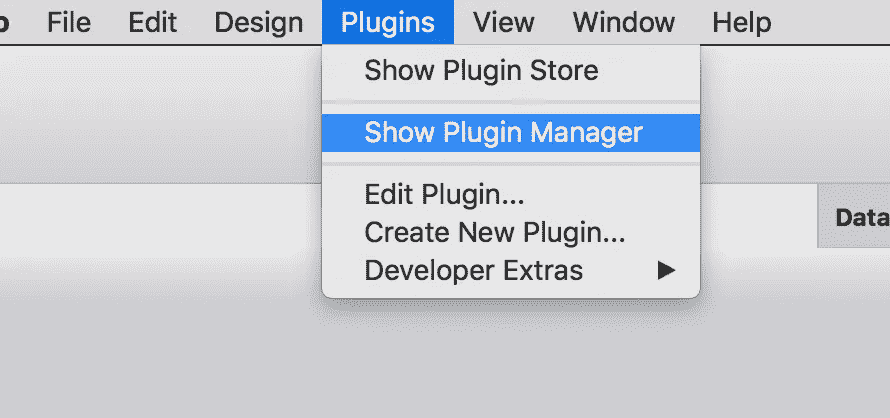
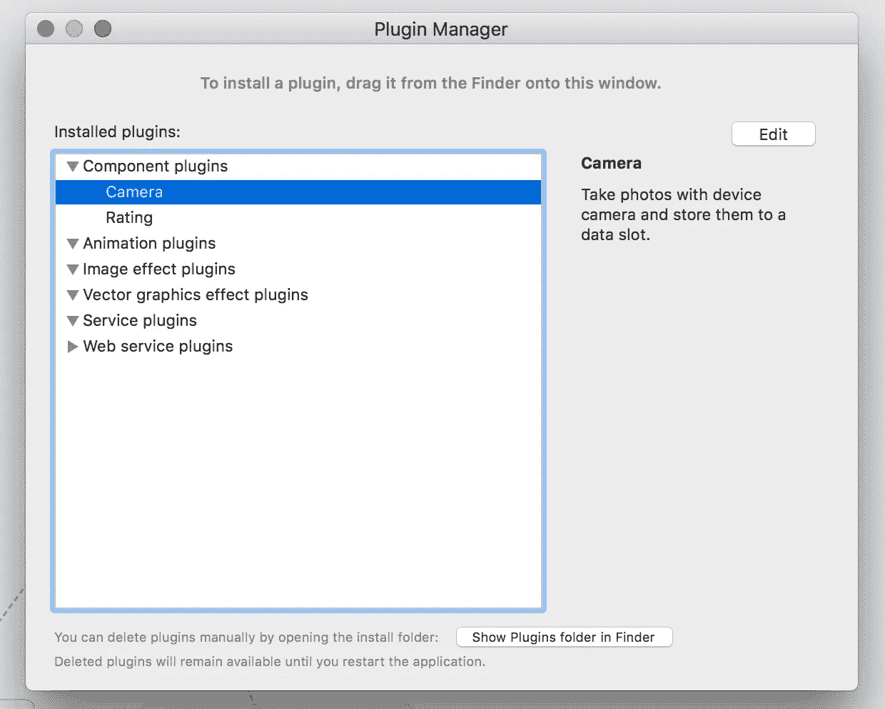
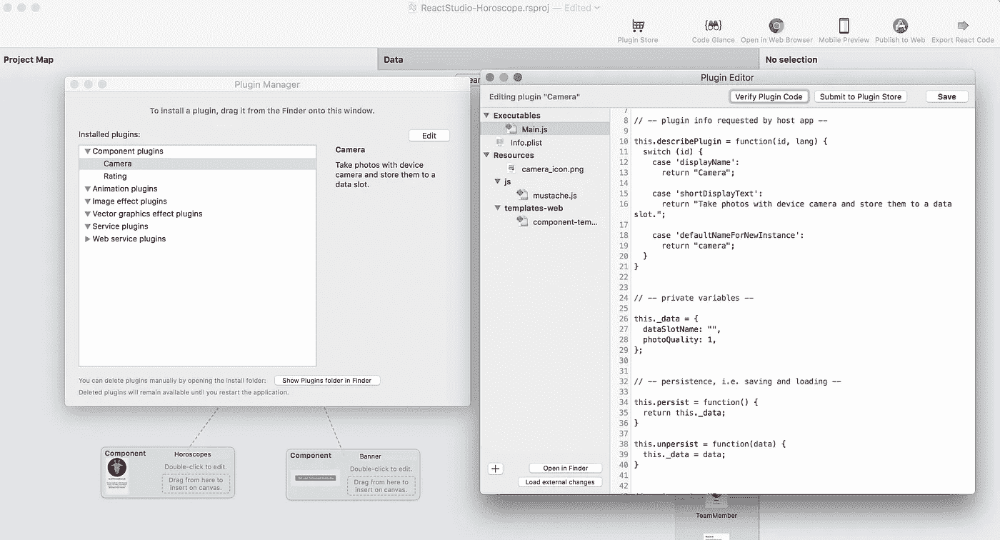
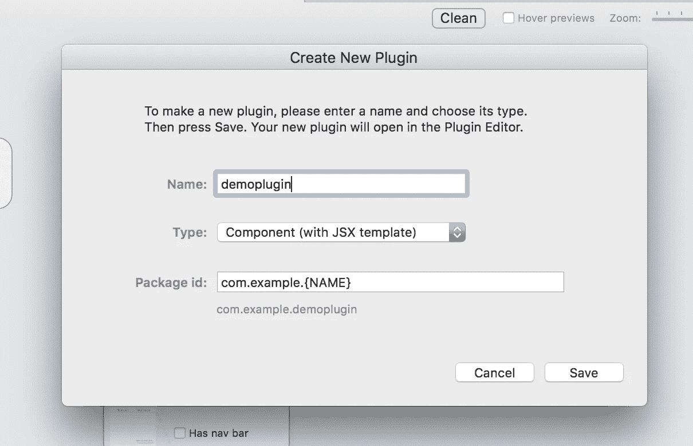
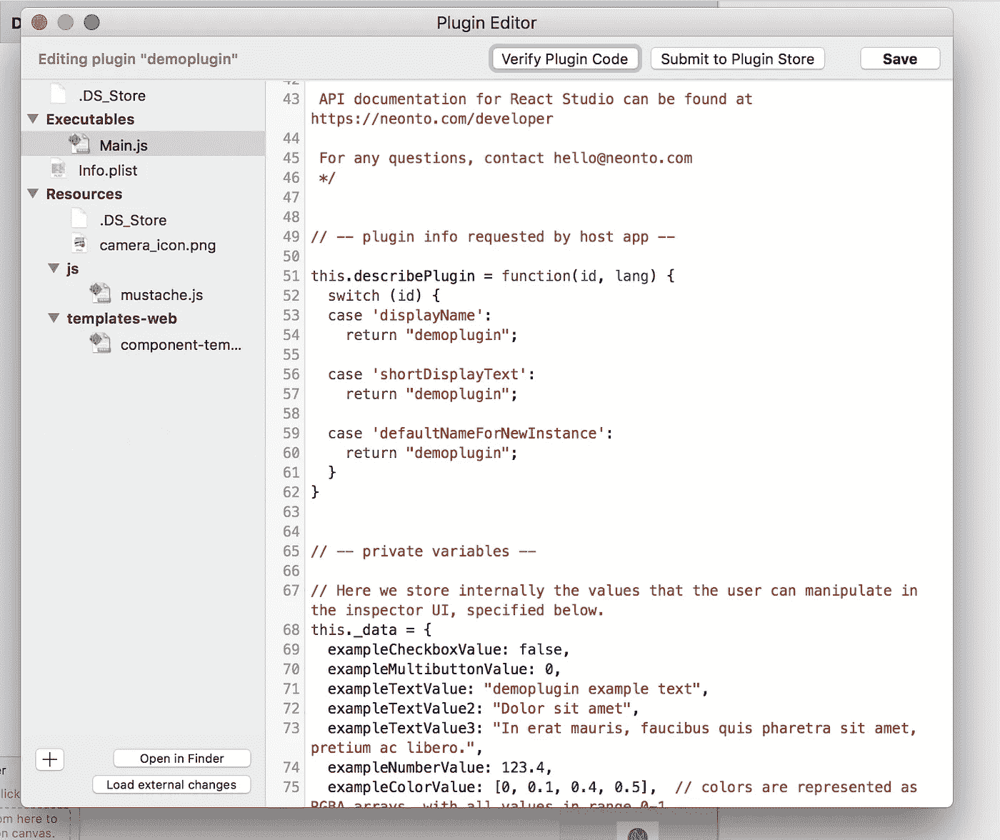
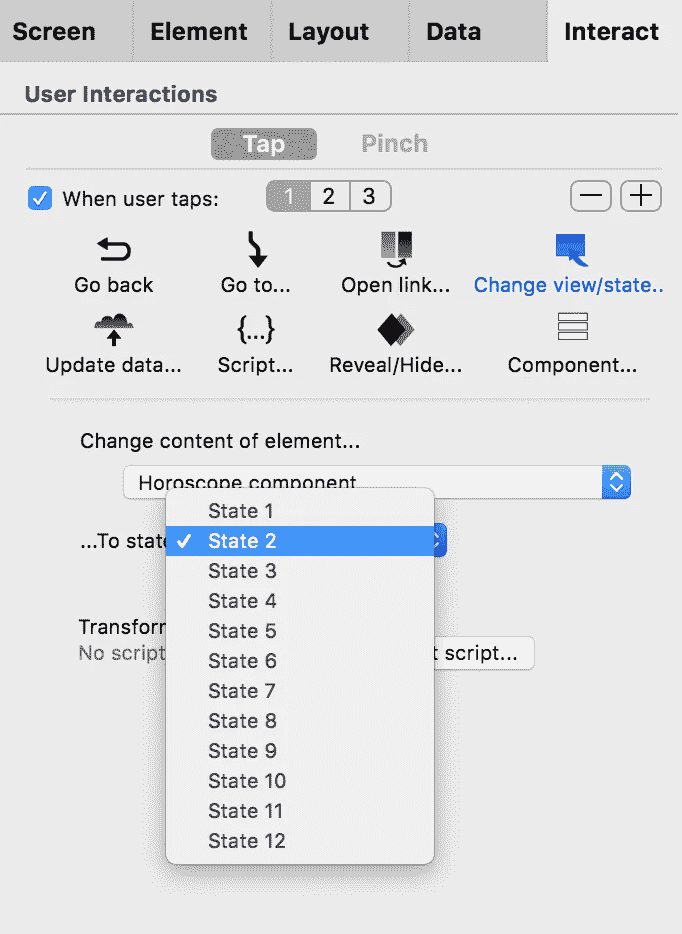
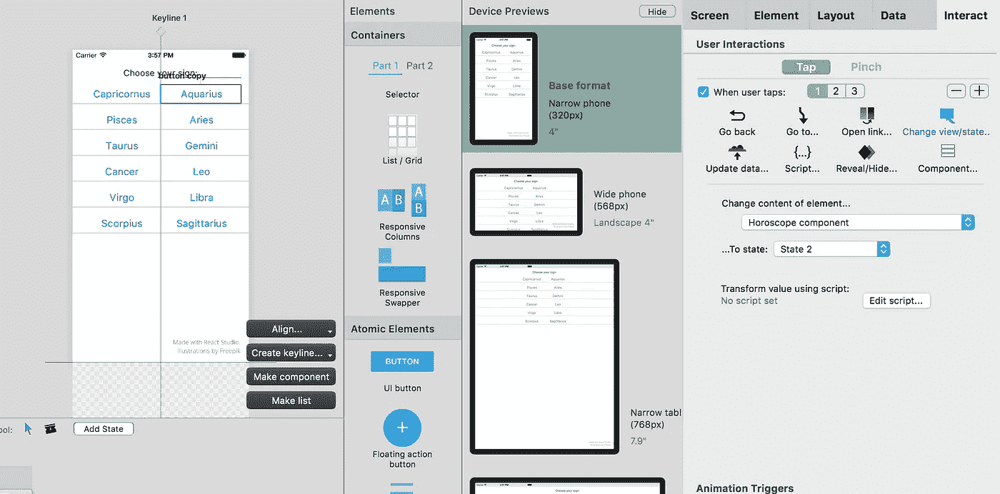

# React Studio 1.2:版本控制、插件编辑器和商店、3D 预览——而且是免费的！

> 原文：<https://medium.com/hackernoon/react-studio-1-2-version-control-plugin-editor-store-3d-previews-and-free-30ad75bb3feb>

我们刚刚发布了 React Studio 的更新。这一次是在工作了一段时间，但我们认为它值得等待。有一条大新闻并不是一个真正的功能，但改变了许多事情:**从今天起，React Studio 是免费的**。

> 【reactstudio.com 下载 React Studio→

是的，我们放弃了订阅定价模式。你的反馈响亮而清晰——许多 Mac 用户就是不喜欢订阅单个软件。现在 React Studio 是免费使用的，它也不是试用版或限量版:没有**限制导出功能或你可以用你的项目做什么**。

代替订阅，我们现在把所有的努力放在为插件和组件建立一个生态系统上。我们希望 React Studio 成为构建现代 web 应用程序的团队工作流的一个独特而强大的工具，本版本中的新功能是这一目标的一部分。我们已经通过电子邮件通知了当前的订户，我们要感谢所有早期用户对我们的支持(我们将根据您订阅的时间赠送一份特殊的礼物)。

## 1.2 中的功能亮点:

*   使用 Git 的版本控制集成
*   集成插件编辑器
*   *创建插件*命令(在插件菜单中)
*   *【改变组件状态】*交互
*   编辑画布中的 3D 预览

我们还修复了许多 bug 和 UI 不便之处。非常感谢所有报告问题的人！

## 如何更新

如果你已经有了 React Studio，只需打开应用程序，它应该会向你展示更新。如果你还没有，当然可以在 reactstudio.com 下载这个应用。

# 3D 预览

这种新的“分解”预览模式让您对设计中的图层组有更清晰的了解。

点击设计画布左下角的*“3D”*按钮:

3D Preview in editing canvas

在上面的截图中，你可以看到前景，滚动流和背景层组明显分开。更容易理解什么内容是可滚动的！

# 项目地图更新

“Clean” a messy project map with one button click

*   ***【清洗】*功能**。点击一个按钮，重新安排一个混乱的项目地图。(如果你不喜欢自动清理的状态，撤销会带你回去。)
*   **悬停预览**。当鼠标悬停在项目地图节点上时，显示预览。
*   **更新了连接线的视觉样式**。

# 使用 Git 的版本控制

React Studio 现在自动支持 Git，这是一个流行的对源代码进行[版本控制的系统。](https://en.wikipedia.org/wiki/Version_control)

版本控制实际上是关于两件事:1)管理你的变更历史，这样你就可以回到以前的版本，不会意外地覆盖新的变更，2)与他人合作，这样你就可以很容易地结合你的工作。React Studio 的 Git 集成做到了这两点。

当您第一次在 React Studio 项目中执行代码导出时(使用工具栏中的“在浏览器中打开”或“导出 React 代码”命令)，会创建一个 Git 存储库。从那以后，您对同一个项目所做的任何导出都将存储在同一个存储库下的版本控制中(Git 术语中的“提交”)。

如果您在导出的代码中进行手动修改，React Studio 将在您下次进行导出时检测到这一点。您将看到一个对话框，询问您如何继续:

这样，您的手动更改就不会被意外覆盖。

还有更多。多亏了一个名为 *branches* 的 Git 特性，您可以使用这个集成来轻松地处理 React Studio 和手动更改的代码。以下是如何…

## **将 React Studio 导出与手动代码更改相结合的工作流**

React Studio 将其所有提交放在一个名为*“react-Studio”*的 Git 分支中。这使得手动处理代码变得容易，然后在分支之间进行合并。

让我们假设您将在从 React Studio 进行一些导出后进行手动代码更改。工作流程如下所示:

*   将 git repo 切换到不同的分支。(分支机构的命名没有严格的规则。可以根据开发人员，例如*“John-doe-changes”*，或者根据您正在使用的功能，例如*“会计-数据库-连接”*。)
*   在文本编辑器中处理导出的代码。
*   回到 React Studio 做一些设计上的改动。
*   从 React Studio 导出。此时，您会得到关于本地修改的警告，因此选择*“Stash，export & commit”。*

现在，您的手动代码更改保留在分支*“John-doe-changes”*中，而来自 React Studio 的最新更改则保留在分支*“React Studio”*中。要继续手动编辑，切换回*“John-doe-changes”*分支，执行“git stash pop”以恢复您的修改，然后使用“git merge”从*“react studio”*分支拉入更改。

通过这种方式，版本控制更改历史保持非常清晰:来自 React Studio 的所有内容总是在一个*“React Studio”*分支中，任何手动更改都被合并到它们自己的分支中。合并点在 git 历史中清晰可见，因此很明显哪一行代码来自 React Studio，哪一行来自程序员。

这就像在你的团队中多了一个开发人员——一个做所有设置 ui 的无聊的样板工作的人！

# 插件编辑器

新的集成插件编辑器窗口本质上是一个最小的 JavaScript IDE，向您显示插件中包含的文件。更容易修改和测试你的插件！

在插件菜单中找到它:

Click Plugins -> Show Plugin Manager

Select plugin and click “Edit”

Modify Plugin and reload code directly in the editor view

# 创建插件

为了让你更快地开始使用插件，我们增加了这个命令，让你选择一个合适的模板，这个模板已经包含了一些特性。

在插件菜单中，选择*“创建新插件”*，您可以选择名称和类型:

插件模板包含一个带有所有可用控件(复选框、输入框等)的起点 UI。)，所以你可以简单地复制粘贴提供的例子来制作插件的控制界面。

# *【改变组件状态】*交互

可视化创建的组件状态是 React Studio 的一个强大功能。为了使它们更有用，我们添加了一个交互类型，允许您通过单击按钮来修改组件的状态。

在即将到来的版本中，我们将扩展这一功能，让你对组件状态做更多的事情，比如在组件内部使用它们，以及将状态交互连接到状态管理插件(比如 Redux、Mobx 等)。)

# 新示例项目“星座”

这个项目演示了如何使用组件状态(包括上面讨论的“更改组件状态”交互)。

看起来是这样的:[每日星座运势演示](https://neonto.cloud/u/horoscopedemo/)

你可以在文件菜单中找到这个项目>*【从模板新建】*

# 更新的按钮样式

按钮的默认样式现在与材质设计外观相匹配:较小的文本以大写形式显示。我们使用 [MUI](https://www.muicss.com/) 作为导出项目的 UI 框架，因此按钮的样式来自那里。(请注意，您很快就可以切换到另一个 UI 框架——我们一直希望 React Studio 的这部分导出和渲染可以通过插件轻松修改。)

您总是可以将按钮样式替换为其他样式。如果您不希望按钮有大写文本，在应用程序样式下有一个新的设置*“按钮的大写文本”*(点击项目图中的应用程序块。

# 插件商店

我们对插件商店有很大的计划——大到足以保证有一个自己的博客帖子！但老实说，它开始很小。你可以在工具栏和插件菜单中找到它。

插件有一键安装系统。它们在 React Studio 中立即可用。它们还可以包括一个 PDF 手册和示例项目，展示如何使用插件。还有一个自动更新系统:当你拥有的插件被它的作者更新时，你会在 React Studio 中得到通知。

**你也可以向商店提交自己的插件和组件**并获得报酬。要提交一个编码插件，在 React Studio 中打开插件编辑器，然后点击“提交到商店”。

你不必是一个程序员来制作一个插件，因为 React Studio 的组件预置也可以在商店上分发。要提交组件预设，请在“您的预设”列表中右键单击它，然后选择“提交至商店”。

新的插件商店是更大的东西的一部分。作为让 React Studio 免费使用的一部分，我们加入了软件包交换(SPX)。你可以在[他们的网站(https://spx.exchange](https://spx.exchange) )上了解更多关于 SPX 的信息。简而言之，这是一个基于加密令牌的市场，在这里，React Studio 等低代码和无代码工具的用户可以共享和发现打包的插件。这个代币叫做 PackageCoin (PKC)。在 React Studio 插件商店上的任何购买都在 PKC 执行。

这样，你为 React Studio 制作的插件会变得更有价值。当您在 React Studio 插件商店上发布插件或组件预设时，它也可以与加入 SPX 生态系统的任何其他商店共享。作为一名 SPX 软件包开发者，你将会很方便地自动从 PKC 令牌中获得报酬:首先，当你的插件被审查并被接受时，你将获得一笔固定数额的奖金，随后，当你的插件从插件商店被下载时，你将获得同样多的奖金(在 PKC，价格由你设定)。

SPX 公司正在为年底前的一次大规模发布做准备。目前，React Studio 是 PackageCoin 的试验场。目前，PKC 代币只能通过 React Studio 插件商店获得…但在 SPX 推出后，您将能够从 React Studio 帐户将 PKC 代币转移到全球区块链。感兴趣吗？查看 [SPX 网站](https://spx.exchange)。

# 下一步是什么？

我们的路线图中有一些项目我们希望很快实现:

*   **UI 框架插件**。允许您用 Bootstrap、Zurb Foundation 或任何您喜欢的东西替换 mui.css。
*   **状态管理插件**。将您的互动连接到 Redux、Mobx 或任何您喜欢的东西。
*   **本地化**。对于现实世界的 web 应用程序来说，这是一个很大的实际问题，我们已经通过 React Studio 中的数据表制定出了核心解决方案。

…但也许你有其他想法？你认为还有什么需要优先考虑的吗？在[hello@neonto.com](mailto:hello@neonto.com)取得联系，我们在倾听！