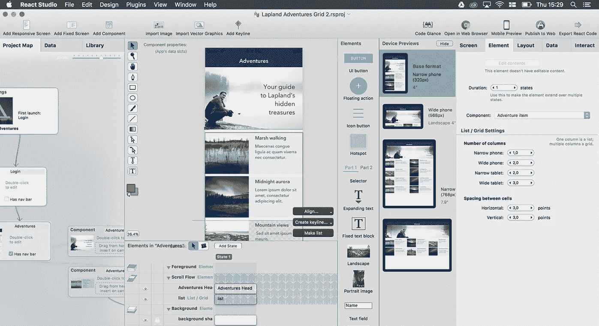
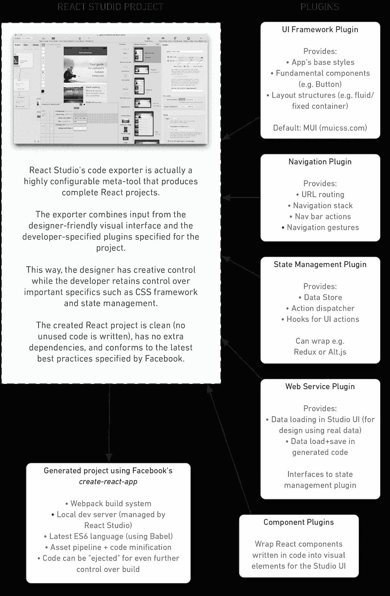

# React Studio 公测版 1 现已推出！

> 原文：<https://medium.com/hackernoon/react-studio-public-beta-1-is-out-now-e4b30da43693>

我们在 2016 年 10 月宣布了 [React Studio](https://reactstudio.com) ，并在 12 月初向预购客户发布了 alpha 版本。今天，我们非常高兴地告诉您，第一个公开测试版可供所有人使用。

如果您注册了等候名单，您应该已经收到了您的下载链接。如果你是 React Studio 的新手，你可以[现在就去注册](https://reactstudio.com)，你很快就会收到下载。不用再等了！

现在真正艰难的工作开始了。这个软件已经可以使用了，但是我们需要你的反馈来使它更加出色。我们想更好地了解您的需求。请查看测试版，尝试示例和功能，并使用一对一聊天或 Slack 频道让您知道您的想法。我们甚至会在测试者中发放一些“感谢”的奖品——详情见下文！

等等，你问，React Studio 是什么？答案取决于你的观点…

## 如果你是一名设计师

React Studio 是现代网络应用时代的网络设计工具。默认情况下，一切都是响应式的和“移动优先”的。您可以使用 ReactJS(脸书创建的尖端 web 框架)将组件设计和应用程序流导出为干净的 HTML/JavaScript 代码。为了让您的工作更容易，我们有一个高质量的草图插件，让您可以将画板转换为工作 React 代码。最后，我们有超级简单的“移动预览”和“发布”功能，所以你可以查看和发布你的创作。

## 如果你是一名网络开发人员

React Studio 是一个 GUI，它使用[脸书的“创建-反应-应用”模板](https://github.com/facebookincubator/create-react-app)创建完整的 React 项目。与其他一些“所见即所得”风格的工具不同，我们努力让开发人员的生活更加轻松。导出的 JavaScript 干净而现代，只包含表示可视化设计的必要代码，并且尊重 ReactJS 的概念。React Studio 可用于整个移动友好的 SPA 流程，或简单地设计单个组件——由您决定。使用内嵌脚本或插件，代码生成器是高度可配置的，所以你甚至可以通过简单地切换一个插件来切换 CSS 框架和状态管理等主要组件(更多信息见下文)。

## 如果你是项目经理

React Studio 是设计师和开发人员之间缺少的一环。它不仅仅是一个原型工具:React Studio 为您提供了来自可视化设计的真实、可用的代码。您的团队可以对响应式 web 设计进行建模，并立即获得高质量的 ReactJS 代码。React 是一种非常方便的 web 应用前端开发方式，现在任何 web 开发团队都可以通过 React Studio 轻松采用 React 的先进技术。

# 下载公测版

来吧，访问[reactstudio.com](https://reactstudio.com)并获得第一个测试版！

(对不起 Windows 和 Linux 用户——React Studio 目前只针对 macOS。这是一款真正的原生 Mac 应用，因为我们希望提供最佳的用户体验。)

# 示例项目

以下三个网站直接从 React Studio 导出:

【https://neonto.cloud/u/examplelaplandadventures/
T5[https://neonto.cloud/u/examplecomments/](https://neonto.cloud/u/examplelaplandadventures/)
https://neonto.cloud/u/exampleindieartist/

想看看这些是怎么做的吗？自己去查这些项目超级容易。在 React Studio 中，打开欢迎屏幕中的“模板”选项卡(或在文件菜单中选择“从模板新建”)。

# 演示视频

观看 React Studio 在行动中的短视频:
[https://www.youtube.com/watch?v=GBBLj2gn6J8](https://www.youtube.com/watch?v=GBBLj2gn6J8)

# 草图插件

Sketch 对于 UI 设计来说是一个很好的工具……但是不得不将你的设计改写成 HTML/CSS/JavaScript 并不有趣。

使用 React Studio 的 Sketch 插件，您可以在几分钟内从画板进入工作 React 代码和资源。

[在这里下载插件](https://s3.amazonaws.com/sc.neonto.com/ReactStudioTransfer.sketchplugin.zip)

若要安装，请将插件文件拖到 Dock 中的草图应用程序图标上。

该插件将尽可能忠实地将你的草图层转换成 React Studio 元素。这意味着文本将保持可编辑，矢量图形保持可缩放，等等。(但是对于特殊的元素类型，比如文本字段，插件不能仅仅从草图设计中猜测你的意图。在这种情况下，您可以在 React Studio 中删除导入的元素，并在它们的位置插入真正的文本字段。)

该插件还可以将你的图层自动放置在 React Studio 的“滚动流”组中。这样你就可以决定哪些元素应该固定在屏幕上，哪些应该是滚动内容的一部分。要使草图层成为滚动流的一部分，只需在层的名称前添加“SF_”。

# 插件和开发者信息

在 React Studio 导出的代码中，我们努力提供合理的默认值和当前 React.js 最佳实践。与此同时，我们认识到，一种尺寸并不适合所有人，您的项目将有特定的需求，可能会随着时间的推移而演变。

为了解决这个问题，我们正在通过插件定制 React Studio 代码生成的大多数方面。您将能够覆盖任何项目级别的决策，并为您的设计人员提供定制组件。

我们希望 React Studio 站在开发者一边，而不是反对你！我们称这种方法为“设计加速开发”。很简单，这意味着减少您在琐碎事情上的开发工作量(例如将设计转换为组件)，并让您专注于更高层次的决策和关键的业务逻辑。

下图显示了 React Studio 的插件结构:

React Studio concepts

# 测试奖励

当 React Studio 1.0 于 2017 年春季发布时，我们将向所有参与测试的人发放奖品。

要参加抽奖，您需要做的只是加入 Slack 频道，或者私下向我们发送您的反馈，或者提交错误或功能请求。将提供以下奖品:

*   **一(1)部中档 Android 手机**，用于测试您的移动网络应用
*   **五(5)份免费 React 工作室许可证** (12 个月的更新和支持)
*   **十(10) React 工作室棒球帽！**

获奖者将通过电子邮件联系。你可以来自世界任何地方，我们会把奖品寄给你。

我们非常兴奋能和你一起完成 React Studio！

> [黑客中午](http://bit.ly/Hackernoon)是黑客如何开始他们的下午。我们是 [@AMI](http://bit.ly/atAMIatAMI) 家庭的一员。我们现在[接受投稿](http://bit.ly/hackernoonsubmission)并乐意[讨论广告&赞助](mailto:partners@amipublications.com)机会。
> 
> 如果你喜欢这个故事，我们推荐你阅读我们的[最新科技故事](http://bit.ly/hackernoonlatestt)和[趋势科技故事](https://hackernoon.com/trending)。直到下一次，不要把世界的现实想当然！

