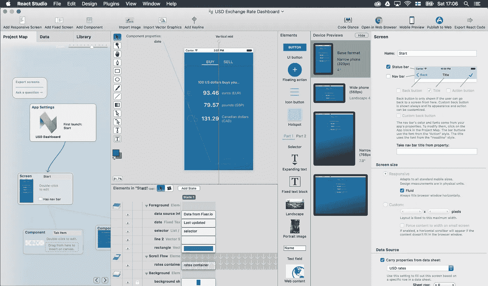
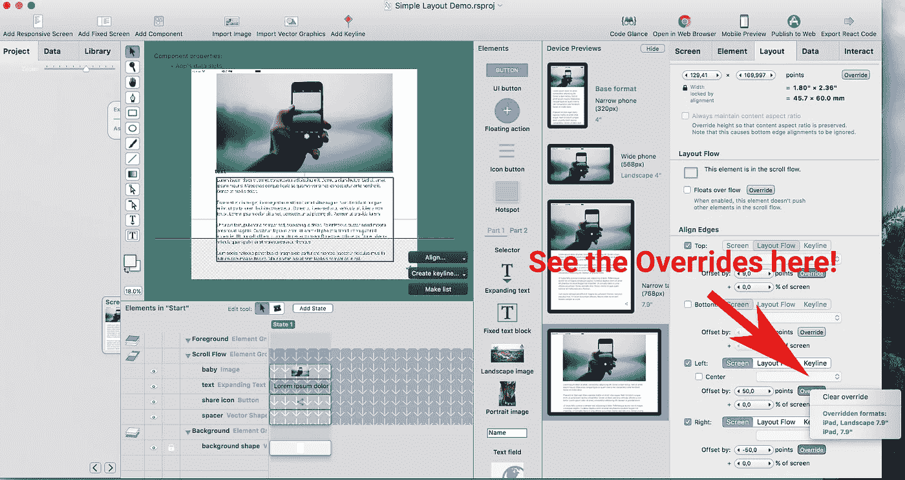
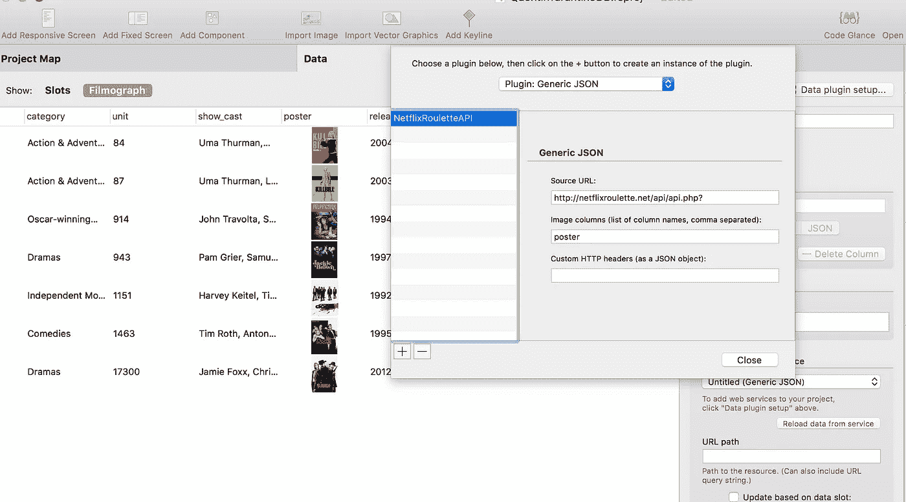
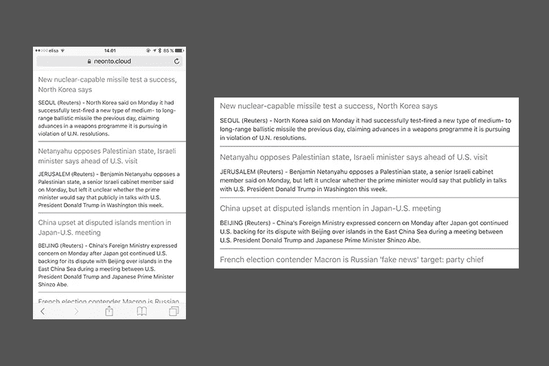
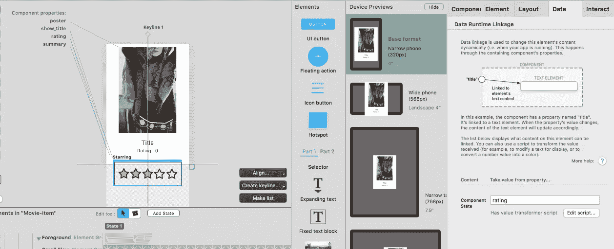
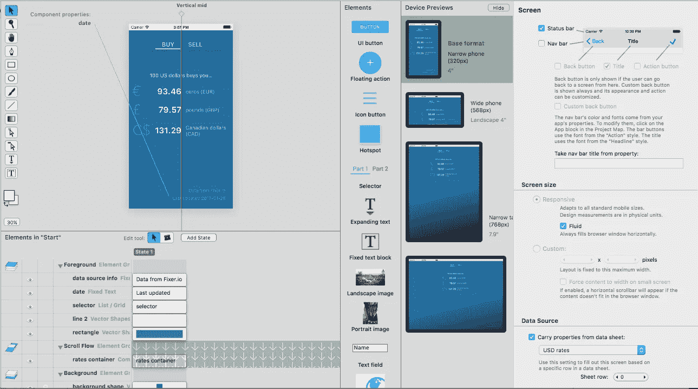

# React Studio 公共测试版 2

> 原文：<https://medium.com/hackernoon/react-studio-public-beta-2-1ec0eb8076f4>

距离我们推出 React Studio Beta 1 已经一个月了。从那时起，我们一直在努力工作，修复漏洞，完成新的开发。

今天，我们发布了 Beta 2，进行了一系列改进，特别是在设计和数据管理方面。在输出方面，已经做了很多工作来使 JavaScript 和 CSS 更简洁，资产更精简。还有三个新的示例项目来展示所有这些东西是如何工作的。我们希望你会喜欢它！

运行 React Studio 时，将自动安装更新。(然而，Beta 1 在一些系统上有一个错误:由于另一个隐藏的对话框弹出，安装更新对话框可能会失去鼠标焦点。如果发生这种情况，您可以使用 Tab 和 Enter 键来按下“安装”按钮。或者你可以简单的[再下载](https://reactstudio.com)。抱歉给您带来不便！自然它在 Beta 2 中被修复了，所以你不用再这样做了。)

好奇想知道上个月以来有什么新消息吗？让我们深入了解一下！

## 新的示例项目:“美元汇率仪表板”

这个示例应用程序是一个简单的货币转换器。使用来自欧洲央行公开 API 的汇率数据(通过 [Fixer.io](https://fixer.io) ，它显示了美元对其他三种货币的最新汇率。

这个设计强调快速获取相关信息——这个想法并不是要显示世界上的每一种货币，而是让你一眼就能看到几种主要货币的汇率。(如果你不喜欢这种货币选择，继续添加你自己的！这是一种学习 React Studio 的有趣方式。)

看看这里:https://neonto.cloud/u/currencydemo/

(顺便说一下，该链接是使用“发布到 Web”功能直接从 React Studio 发布的。)

这个示例展示了一些重要的技术:响应式设计、渐变和阴影、使用选择器元素制作的选项卡栏、触发式动画、从 API 加载的实时数据，以及使用 JSON 键路径来访问数据。

要亲自探索这个示例，请查看欢迎屏幕中的模板选项卡(或通过文件菜单>*从模板新建】*访问)。

## 在位组件编辑

一个简单的功能，但非常方便。当一个组件被放置在某个地方(在一个屏幕中，在另一个组件中，在一个列表或选择器中使用)时，双击以编辑它。该组件将打开进行编辑，并保留先前上下文中的背景。这样，无论组件放在哪里，您都会看到您的更改是什么样子。

如果您更愿意在一个中性的上下文中编辑一个组件，在项目图中双击它，以默认的棋盘背景模式打开。

(另一个有用的提示:如果您希望您的组件有一个特定的颜色背景以便于编辑，但是您不希望该背景被导出到代码中，只需双击背景元素的“眼睛”图标。它将显示一个红点，这意味着该元素不会包含在导出中。)

## 新示例项目:简单布局演示

这是学习响应式布局的起点。这只是一个有几个元素的单一屏幕:
[【https://neonto.cloud/u/simplelayoutdemo】](https://neonto.cloud/u/simplelayoutdemo)

它演示了一些基本的布局概念:滚动流、布局对齐、覆盖特定设备尺寸的对齐(文本在平板电脑和更高的屏幕尺寸上有不同的边距)，以及保持图像的纵横比。它还包括一个嵌入式字体(Roboto Light)，这将我们带到下一个项目…

Text element overrides

## 自动字体嵌入

当您在设计中使用自定义字体时，它们现在会被复制到导出的应用程序中，并包含在样式表中。这并不适用于所有字体类型 macOS 上的一些标准字体的格式不能以这种方式嵌入——但对于使用下载的自定义字体来说，这非常有用！几乎所有你能在网上找到的字体都有支持的 Opentype/Truetype 文件格式，并且可以嵌入。

(注意，商业字体可能有许可限制，不允许将字体文件嵌入到网页中。如果您不确定，请咨询您的字体供应商。将来，我们计划提供用来自商业服务(如 Typekit)的许可 web 字体替换设计时字体的能力。)

## 数据插件和“通用 JSON”插件

JSON data plugin setup for Data Sheet

默认安装现在包括一个通用的 JSON 数据插件，您可以用它来连接 REST 风格的 web 服务。

要配置数据插件，请转到数据选项卡，然后单击“数据插件设置”。窗口顶部是一个弹出按钮，显示所有已安装的插件。左侧是所选插件类型的*插件实例*列表。单击+按钮创建一个实例。

插件实例只是插件的一个配置。通用 JSON 插件有一些设置，包括 API URL(当然)以及“image columns”和“custom HTTP headers”，您可以使用它们来定制如何解释数据以及将什么发送到服务器。

一旦您创建了一个插件实例，您就可以将一个数据表连接到它，并从 web 服务加载真实数据。在数据表设置中，从弹出菜单中选择插件实例。您还可以指定特定纸张的*服务路径*。这将在访问 web 服务时添加到 URL 中。(例如，如果基础 API URL 是*api.example.com*，并且您想要从*api.example.com/feed/latest*访问数据，只需指定“feed/latest”作为服务路径。)

要更好地了解这是如何工作的，请查看 USD 汇率仪表板示例项目。它将 Fixer.io API 中的最新货币数据加载到一个数据表中，然后该数据表被用作主屏幕中的数据源。

## “RSS 提要”数据插件

默认安装中包含了另一个插件。它允许您访问 RSS 提要，这是一种非常常见的新闻提要数据源。为了展示它是如何工作的，有一个示例项目…

## 新示例项目:“世界新闻 RSS”

这只是路透社提供的最新世界新闻列表。然而，这里有一个不明显的有趣之处:为了让提要看起来更干净，新闻文本中删除了额外的数据。

路透社的 feed 包含一些 HTML 垃圾(因为没有更好的词):在每个新闻条目中，都有一个

元素，上面有一些相当难看的按钮，用于共享社交媒体等类似内容的链接。我们不想显示这些内容，所以使用了一个*值转换器脚本*来移除实际新闻文本后面的额外 HTML。

您可以在“新闻项目”组件中找到这个脚本。单击“description”元素，并在右侧的数据选项卡下查看。这里指定了数据链接:这个元素的文本内容来自名为“description”的属性(这是从 RSS 提要加载的列之一)。点击“编辑脚本”按钮，您将看到用于清理新闻条目的几行 JavaScript 代码。

## 主要草图导入器更新

我们的 Sketch 插件已经变得更加有用了，它有一些很酷的特性，可以让你聪明地将静态设计转换成 React 组件。

要使用这些功能，您应该更新 Sketch 中的“转移到 React Studio”插件。[从此链接](https://s3.amazonaws.com/sc.neonto.com/ReactStudioTransfer.sketchplugin.zip)下载插件，并将其拖到你的草图应用程序图标上。

好消息是，您现在可以将草图组映射到组件中。它通过图层名称工作。只要在你的组名上使用前缀“c:”就可以了(例如 *c:header* )，React Studio 传输插件就会知道它应该是一个组件。

您也可以用类似的方式从草图层创建实际的文本输入字段。在层名称上使用前缀“input:”后，React Studio 会将其替换为一个动态文本字段。(这应该可以节省大量的表单时间！)

## 动画触发器

触发器允许您控制应用于元素的动画。要找到这些设置，请查看“交互”选项卡。

对于每个触发器，您可以指定一个条件(例如“当此元素显示时”)和一个动作(例如“淡入”)。每种类型的动作可以有特殊的参数，但通常您至少可以控制动画的持续时间和开始延迟。

美元汇率仪表盘显示了这一点。汇率值以渐变顺序显示。这实际上不仅仅是赏心悦目:有一个小的延迟和淡入淡出有助于隐藏数据最初不在那里的事实，因为我们的应用程序从 API 加载货币数据…所以动画可以在隐藏延迟方面起到重要作用！

目前唯一可用的动画是淡入/淡出。我们将扩展更多的选项和自定义动画的插件系统。同样，触发条件的选择也同样受到限制。UI 已经为一个叫做*滚动触发器*的东西构建好了，你可以用它来使元素响应用户滚动(例如，当用户向下滚动时隐藏一个菜单栏)…但是这个特性在导出端还没有完全完成。快到了！

## 元素阴影

对于图像和矢量图形元素，现在可以指定阴影。这对于创造一种深度的幻觉是很棒的。将来，我们还会为其他元素类型添加这个设置，这样你就可以为同一个组件的实例使用单独的阴影(这对“卡片风格”的用户界面很有用)。

## 数据链接改进

Component State index setting

现在，您可以将组件状态链接到属性，并可以选择使用脚本来转换值。通常，您可能希望将属性值映射到组件状态索引中；例如，在一个天气应用程序中，您的属性可能包含类似于*“晴”、“雨”、“雪”*的值，这些值应该映射到状态 1、2 和 3。使用脚本很容易做到这一点。我们将很快发布一个示例项目，展示这方面的一个实际例子。

## 屏幕数据源

现在可以将数据表行的内容作为属性“携带”到屏幕中。嗯，这种简洁的描述可能听起来很令人困惑…！但是这个功能实际上是一个将真实数据链接到屏幕上的非常简单的方法。

Find Carry Properties from Data sheet setting from the bottom right corner

USD 汇率仪表板示例项目再次展示了这一特性。点击开始屏幕，在右边的检查器中寻找数据源。您将看到“Carry properties”已启用，“USD Rates”数据表被设置为源。通过这种设置，屏幕从数据表的第一行获取所有值作为属性，我们可以将它们链接到元素中。(它甚至不必是工作表的第一行，有一个数字字段可以用来更改源行。)

## 组件布局改进

现在，您可以更好地控制组件内的响应布局。默认情况下，组件处于“流体”模式，您可以使用对齐和关键线来指定如何在组件区域内放置东西。

为了更多的控制，有一个设置叫做“允许设备特定的覆盖”。启用后，您可以完全控制特定屏幕尺寸的元素放置。(要创建覆盖，请单击设备预览面板中的屏幕，然后拖动元素或使用布局选项卡。)例如，这种完全控制对于应该在移动设备上采用不同(更窄)布局的组件非常有用。

## 图像纵横比设置

对于图像元素，您现在可以指定内容纵横比始终保持不变。若要找到此设置，请选择图像并查看右侧检查器的“布局”标签。

您可以在简单布局演示示例项目中看到这个特性的运行。

## 出口改善

我们的 React+Webpack 项目导出正在不断地进行调整，以获得更好的性能和更紧凑的代码。

在此版本中，我们优化了资产导出，以节省具有相似内容的图像的空间。为组件创建的 JSX 布局代码和 CSS 现在更紧密了——目标是只包含指定特定布局设置所需的元素和样式，我们已经非常接近了！

围绕 CSS 导出的许多错误已经得到修复，因此如果您以前在导出中看到与 React Studio 中看到的不匹配的奇怪行为，它有可能已经消失了(如果没有，请告诉我们！).

## 接下来呢？

React Studio 还没有完成。我们需要您的错误报告和功能反馈！加入我们的休闲频道，说出你的想法。这对决定我们应该关注什么有很大的帮助。

从 www.neonto.com/reactstudio[下载 React Studio Beta 版](http://www.neonto.com/reactstudio)

> [黑客中午](http://bit.ly/Hackernoon)是黑客如何开始他们的下午。我们是 [@AMI](http://bit.ly/atAMIatAMI) 家庭的一员。我们现在[接受投稿](http://bit.ly/hackernoonsubmission)并乐意[讨论广告&赞助](mailto:partners@amipublications.com)机会。
> 
> 如果你喜欢这个故事，我们推荐你阅读我们的[最新科技故事](http://bit.ly/hackernoonlatestt)和[趋势科技故事](https://hackernoon.com/trending)。直到下一次，不要把世界的现实想当然！

