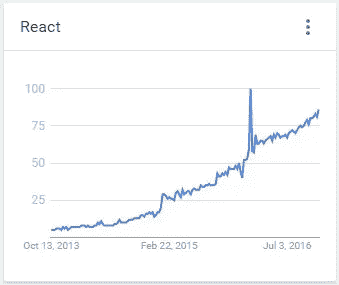
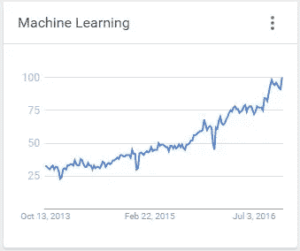
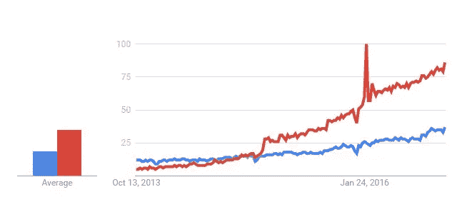
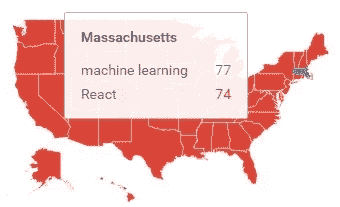
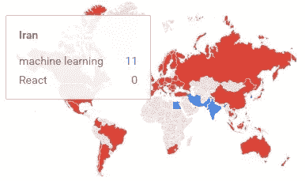

# React vs 机器学习——非科技公司的困境

> 原文：<https://medium.com/hackernoon/react-vs-machine-learning-the-plight-of-non-tech-companies-2c030fb1ae23>

Google’s Deep Dream AI image of Edvard Munch’s “The Scream”

尽管这些天围绕人工智能有各种各样的宣传和 T2 资金，但对于拥有成熟软件团队的非科技公司来说，有什么实际的选择呢？抛开令人信服的论点，即在不久的将来的某个时候[所有公司都将是科技公司](https://shift.newco.co/the-end-of-tech-companies-b093e82d1118#.4wj250fb7)，此时此地非科技公司仍然存在，必要的权衡也是如此——比如必须在脸书广受欢迎的用于构建用户界面的 [React](https://facebook.github.io/react/) 库和机器学习的复兴 AI 子领域之间做出选择。

Google Trends

这两种途径都需要大量的资源投入。

脸书的“[反应中的思维](https://facebook.github.io/react/docs/thinking-in-react.html)”教程强调了范式转变和所需的巨大初始努力。在 React 中学习思考的时候，经常听到程序员说“我脑子疼”。

对于任何在大学学过统计学的人来说，他们会理解机器学习的负担很重。有[机器学习算法](https://github.com/rushter/MLAlgorithms)、 [Python 数据科学](https://github.com/jakevdp/PythonDataScienceHandbook)、 [tensorflow](https://github.com/tensorflow/tensorflow) 以及一系列其他工具、技术和[培训程序](https://github.com/ZuzooVn/machine-learning-for-software-engineers)要学习。例证:亚马逊今天刚刚[推出了它的人工智能服务。](http://www.forbes.com/sites/janakirammsv/2016/11/30/artificial-intelligence-and-hybrid-cloud-are-high-on-amazons-agenda/#938831c1c819)

谷歌趋势对 React(红色)和机器学习(蓝色)的比较表明，更多的人选择学习 React 而不是机器学习:

React (red) vs Machine Learning (blue) Google Trends

这种趋势有根据吗？

别误会，React 不可思议。但是，非科技公司选择 it 而不是机器学习是正确的选择吗？选择 React 而不是机器学习的机会成本是多少？

看到世界上哪些地方正朝着相反的方向发展是很有趣的。

Massachusetts — no doubt the universities and incubators

Waterloo, Canada — same reason probably

India, Pakistan, Egypt and Iran

印度、巴基斯坦、埃及和伊朗选择机器学习而不是 React？真奇怪。

相反，俄罗斯实际上没有显示出机器学习的趋势。可能是翻译问题？这也很奇怪。尤其是考虑到俄罗斯对美国大选的黑客攻击。

令人惊讶的是，硅谷和整个加州也坚决支持做出反应。考虑到大学的质量和人工智能人才的集中，你可能会认为西海岸会像马萨诸塞州和滑铁卢一样有蓝色的口袋。

尚不清楚这些趋势表明了什么:可能大多数非科技公司都在犯同样的普遍错误；或者可能是机器学习更难学，所以爬这座山的人更少。

或者，如果以技术为中心的大学——或处于边缘的国家，那里[颠覆性创新](https://hbr.org/2015/12/what-is-disruptive-innovation)往往会出现——是未来价值的良好预测者，那么或许 React 的趋势并不值得。

我们所知道的是，各大软件公司正在迅速收购与人工智能相关的人员和产品。脸书、亚马逊、谷歌、IBM 和微软的杂牌军已经联合起来——尽管他们彼此之间竞争激烈——在人工智能上建立了合作关系。甚至非科技公司也在[囤积 AI 人才](https://www.wired.com/2016/11/giant-corporations-hoarding-worlds-ai-talent/)。

上个月在 Dreamforce 大会上——有多达 17 万名代表参加——sales force 推出了他们新的人工智能产品，被称为[爱因斯坦](https://www.salesforce.com/ca/products/einstein/overview/)。除了 Salesforce 最近收购的大量人工智能公司之外，仅冠名权的成本就表明了人工智能在其路线图上的重要性。

未来主义者凯文·凯利在 Dreamforce (23:03 分钟标记[此处](https://www.salesforce.com/video/282571/))讲述了第一次工业革命，以及它是如何通过采纳想法、添加人工*能源*和 10，000 家公司诞生的。凯利继续说道:我们现在正处于第二次工业革命的第一局，在这场革命中，创意加上人工智能*将导致新公司的更大爆发。*

*对于那些已经错过了互联网繁荣的人来说，人工智能革命是一个更大的机会——也是第二次机会。*

*从这个角度来看，React 似乎是渐进式的，而机器学习是谷歌的[10 倍思维](https://gsuite.google.com/learn-more/creating_a_culture_of_innovation.html)。前者改善；后者扰乱。*

*放弃机器学习可能是更大的长期风险。那么，非科技公司有勇气接受机器学习并逆潮流而动吗？或者有什么方法可以鱼与熊掌兼得呢？*