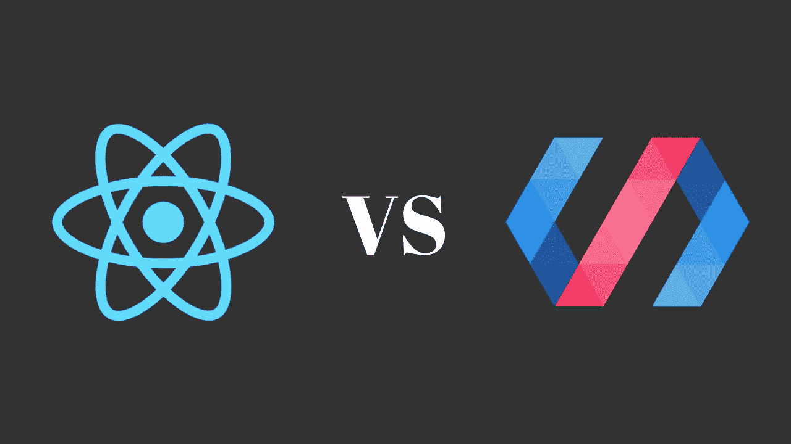

# 反应 Vs 聚合物

> 原文：<https://medium.com/hackernoon/react-vs-polymer-83b4375a5a42>

## 来自一位在生产中同时使用这两种应用的开发人员。

[我现在已经开发应用程序五年了](https://github.com/rajat1saxena)，但我只是在 2016 年才涉足单页面应用程序(SPAs)，当时我不得不为我的应用程序初创公司[花粉聊天](http://https;//pollenchat.com)建立一个仪表板。

最近我发布了一个新的应用程序 [Kiven Aa](https://kivenaa.com) ，为此我使用了 React。基于网络的服务是活的，许多人已经开始使用它。所以这使我在技术上有资格(*，尽管我不认为自己是这两种工具的高级用户，无论如何*)来写我的想法，关于在这两种框架中什么最好，什么不好。

**聚合物:+1 表示现成组件**

Polymer 附带了大量现成的基于 web 组件的组件，您可以在项目中轻松使用它们。你不必从头开始写所有的东西。在 React 中，我从头开始编写每个组件。我知道社区也为 React 设计了一些组件，但是我并不觉得有必要使用第三方组件。

**反应:+1 为简单起见**

React 很容易上手，而且从一开始就很有效率。你只需要学习两到三件事情，而且你已经在路上了。这也是一个原因，我不想为我的 react 应用程序使用任何第三方组件。我完全控制了我的应用程序。

另一方面，在使用 Polymer 时，我对大多数样板文件和[初学者工具包](https://github.com/PolymerElements/polymer-starter-kit)代码一无所知，也不知道我为什么要做一些事情。说实话，我在学高分子上花的时间比 React 还多。尽管如此，我还是要说我更了解 React。

**React: +1 表示单向数据绑定/聚合:-1 表示双向绑定**

由于我首先学习了 Polymer，这是我第一次接触数据绑定，正如在现代 web 应用程序中看到的那样，双向数据绑定是一个全新的维度，在很大程度上。通过改变一个 JavaScript 属性来改变组件的状态，我感觉棒极了。没有任何直接的 DOM 操作。*见鬼耶！*

但是！如果您不够小心，那么在调试时，您可以从父绑定和子绑定中变异绑定的想法实际上会给您带来噩梦。很多时候，我对数据流和突变状态感到困惑，我的组件在其中，因为我根据自己的逻辑改变了父节点和子节点的绑定。一片混乱。*好！不完全是，但那是我的感觉，很多次了。*

进入 React，连同它的意识形态*道具*和*状态*。数据仅单向流动，即从父节点流向子节点。孩子不会改变父母传递给他们的数据。*牛逼*。状态是组件的内部属性，并且只负责管理它。父子之间不再有令人困惑的数据流。*甜！*

**聚合物:+1 用于材料设计**

聚合物包含了*材料*意识形态，这很自然，因为它是由开创[材料设计](https://material.io/guidelines/)的同一家公司生产的。但是，从开发人员的角度来看，当 Polymer 提供的现成元素制作精美时，它会非常方便。由于聚合物元素严格遵循材料设计思想，用聚合物制作的项目看起来很好，也很容易接近。

另一方面，如果你知道如何正确使用，React 除了普通的 CSS 之外什么也不提供。

由于两个主要原因，我将在未来使用更多的 React。第一个是单向数据流架构，另一个是 React Native 的未来承诺(更新*2018 年 1 月 1 日:我推出了新的 React Native app，* [*花粉聊天*](https://pollenchat.com) ) *。*对于开发者来说，上下文切换是非常昂贵的。在网络和手机上使用 React 将会大大减少这种情况。

那么，今天就到此为止。基于我每天的学习，我会继续更新这篇文章，提供更多更新的内容。

如果你喜欢这篇文章，请把它推荐给你的社交网络，并关注我的更多文章。如果你喜欢开发数字化的东西，你也应该订阅我的 YouTube 频道。

## [脸书](https://www.facebook.com/raynstudios) | [推特](https://twitter.com/rajat1saxena) | [YouTube](https://www.youtube.com/channel/UCUmQhjjF9bsIaVDJUHSIIKw)

直到下一次…