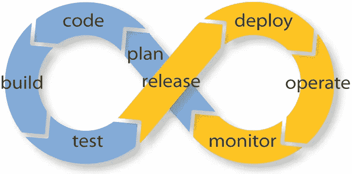
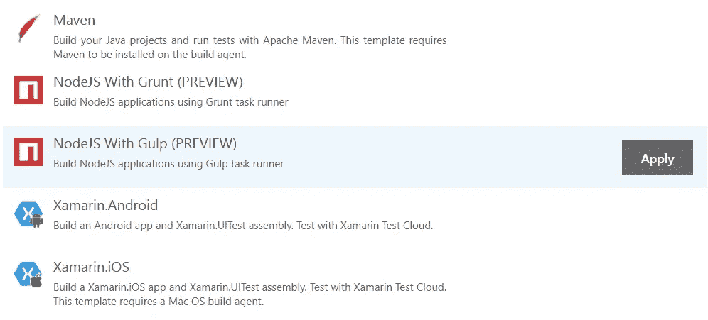
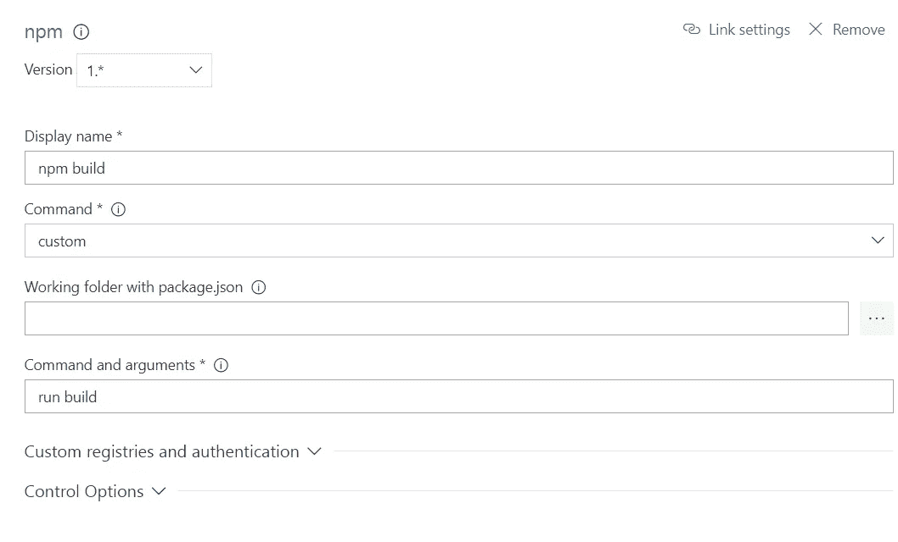
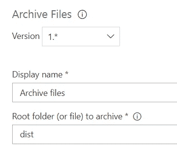
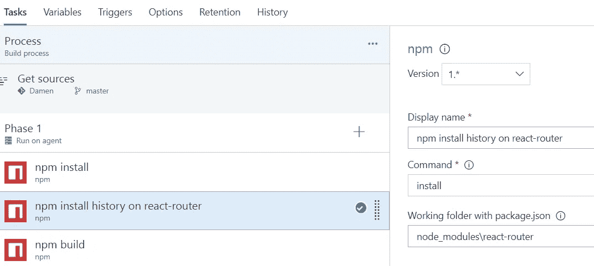

# VSTS 境内的 React + Webpack

> 原文：<https://medium.com/hackernoon/react-webpack-inside-vsts-d6b1853f1a82>

Continuous everything

今天，几乎所有你参与的 web 项目都在使用 node.js、npm 和 git，至少在构建过程中是这样。这是一个像带有 npm 脚本的 webpack 这样的工具比 gulp 或 grunt 更有优势的时刻。在 VSTS，你仍然找不到使用 webpack 构建网络应用的模板。因此，这是一个方向上的帮助，我们将看到在 VSTS 用 webpack 进行建设是非常简单的。

我们还将解决使用 react-router 时历史模块的一个常见问题:*无法解析模块' react-router/node _ modules/history/lib/createBrowserHistory '导入/no-unresolved 的路径。*

## 在 VSTS 上设置构件

我们将假设你已经有一个 React 应用程序，并且你正在通过 g it 将它推送到 VSTS。你用 webpack 构建它，它可以在你的计算机上成功运行。现在是时候在 VSTS 内部创建一个构建定义了，这也将帮助你在 Azure 应用服务上部署你的应用。

## 第一步

我们将使用 Gulp 模板，因为它已经配置了几个步骤，所以我们获得了一些点击。

## 第二步

之后，我们将删除吞咽步骤，并添加 npm 运行构建步骤。我们可以通过添加新任务>包选项卡>并选择 npm 简单任务来完成此操作。新步骤应该如下配置，只需运行自定义命令“运行构建”:

## 第三步

当我们运行“npm 运行构建”时，webpack 将创建一个名为“ *dist* 的文件夹，这就是我们的生产文件所在的位置。

最后一步是修改归档文件步骤，以便归档文件夹 *dist，*，如图所示。

# 修复反应路由器错误

现在我们已经准备好对我们的第一个构建进行排队了。这在大多数情况下应该是成功的。

但是在我的应用程序中，因为我使用了 react-router 包，所以我得到了下面的错误:*无法解析模块' react-router/node _ modules/history/lib/createBrowserHistory ' import/no-resolved 的路径。*

在调查错误后，我发现这个历史包确实有一些特殊的请求，react-router 依赖于历史版本 3.x 来工作，当你安装了新版本时，它会失败。错误本身并没有说明这一点，它实际上给出了一个指示，即应该作为 react-router 的一个模块安装的历史包丢失了。包 react-router 的文件夹中没有 node_modules。在我们的本地版本中，它创建时没有任何问题，但是在 VSTS 版本中，由于某些原因，它无法安装。

## 步骤 4(可选)

唯一修复构建的方法是在 npm 安装之后添加一个额外的步骤，为 react-router 包单独调用 *npm install* 。所以这看起来像下面这样

就这样，享受你的 VSTS CI 建设。