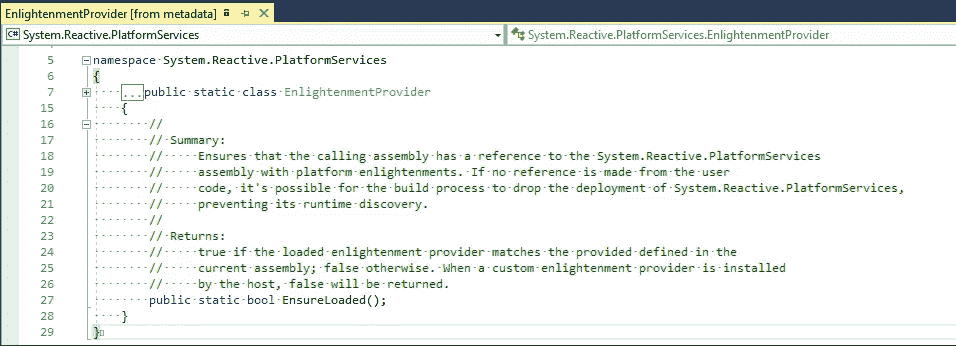

# 反应式延伸。iOS 共享扩展中的. NET

> 原文：<https://medium.com/hackernoon/reactive-extensions-for-net-in-an-ios-share-extension-5dcb1f87aca0>

我们正在构建的一个应用程序使用了反应式扩展。NET 在 iOS 共享扩展中。

我们在真实设备上运行时遇到了共享扩展关闭，而不是像通过 iOS 模拟器运行时那样工作。错误为:“错误:无法加载 AOT 模块/private/var/containers/Bundle/Application/{ id }/{ app }/System。“reactive . platform services . dll . so”处于仅 aot 模式。

第一步是诊断链接器是否正在移除引用，因此我尝试在共享扩展项目和容器应用程序项目中将链接器行为设置为“不链接”。清理和重建。出现了同样的错误。

经过一番折腾后，意外的发现，通过添加:系统。reactive . platform services . enlightenment provider . ensure loaded()；允许共享扩展在实际设备上加载和运行。总结描述得最好:

EnlightmentProvider [from metadata]

我想我会把笔记放在某个地方，以便下次搜索“系统”时使用。“reactive . platform services . dll . so”。“在过去的一周里，我运气不佳；)